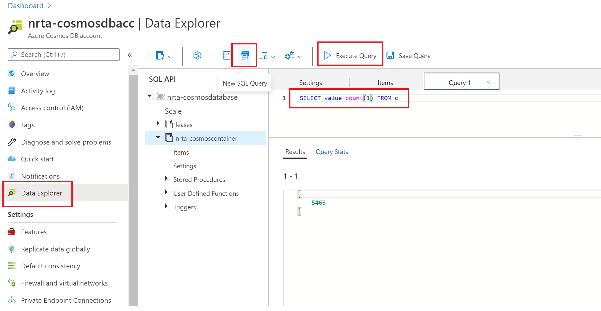

## Create Cosmos DB account, database and container
In this module, you will create and configure Cosmos DB to store simulated data. Make a note of the keys, connection strings to be used in the next modules. Follow below mentioned steps in sequence -  

1. On the Azure portal, navigate to 'Create a resource'.

2. Search for 'Azure Cosmos DB' on Azure marketplace and click 'Create'.

3. Enter details as shown below to create Cosmos DB account. 

### NOTE - 
New resource group **'nrta-lab-rg'** created in this step will be used while creating other resources. I will be using 'nrta' prefix throughout the lab which is just a short form for 'near real-time analysis' created by me for this lab:).  Navigating to resource creation screen and search for different resources for creation is going to be same for all resources, just different resource names so I wont be repeating these screenshots in next modules. 

4. Click 'Next' with all default settings for 'Networking', 'Encryption' and 'Tags' tabs.

5. Click 'Create' on this last screen which shows all selected configuration details.

6. Note down the Cosmos DB name, container name and click on Keys to get the URI and authentication key

7. Copy all 4 values highlighted in red in screenshots of Step 6 and 7 on a notepad to be used in next steps, values to be noted are - Cosmos DB name, container name, URI and key.

### Tips -
- While testing and making solution run end to end, you might need to delete data in Cosmos DB, you can turn on 'time to live' setting and configure it to  1 second to delete items and then turn it off. Go to Cosmos DB--> Data explorer --> Settings as shown below

- When you are done with all modules and ready to run lab end to end, number of records inserted in Cosmos DB shoud be same as what goes in ADX so you can quickly check counts in both DBs to match. Query to get number of records in Cosmos DB is shown below

