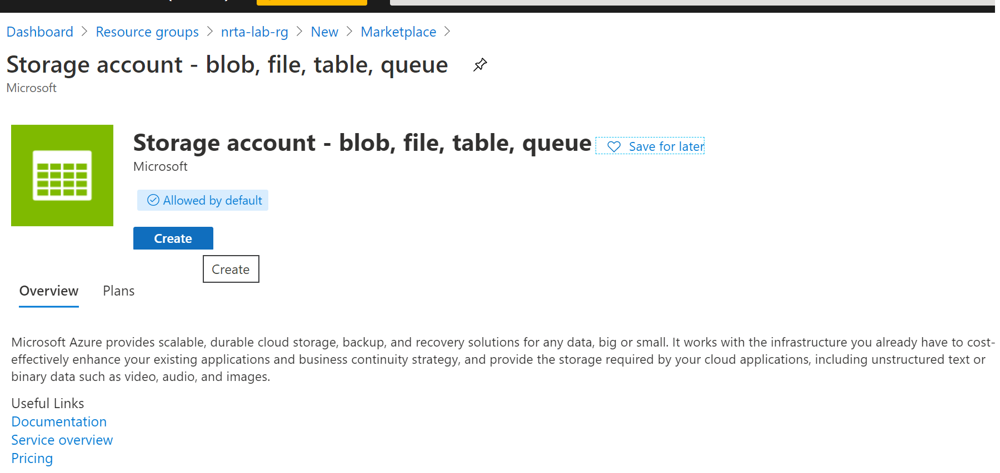
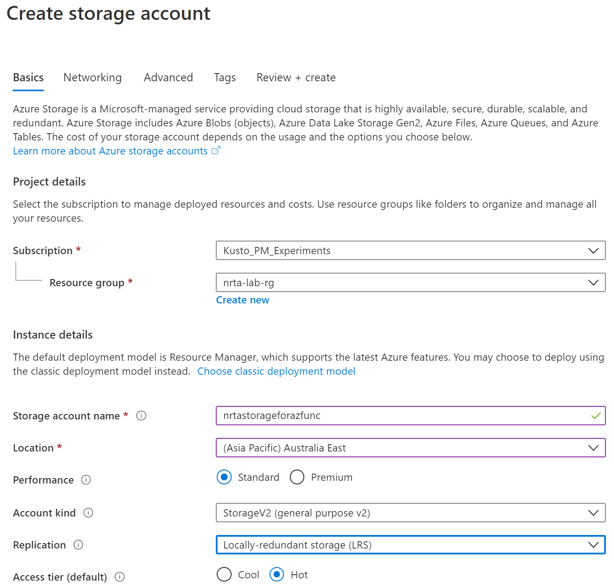
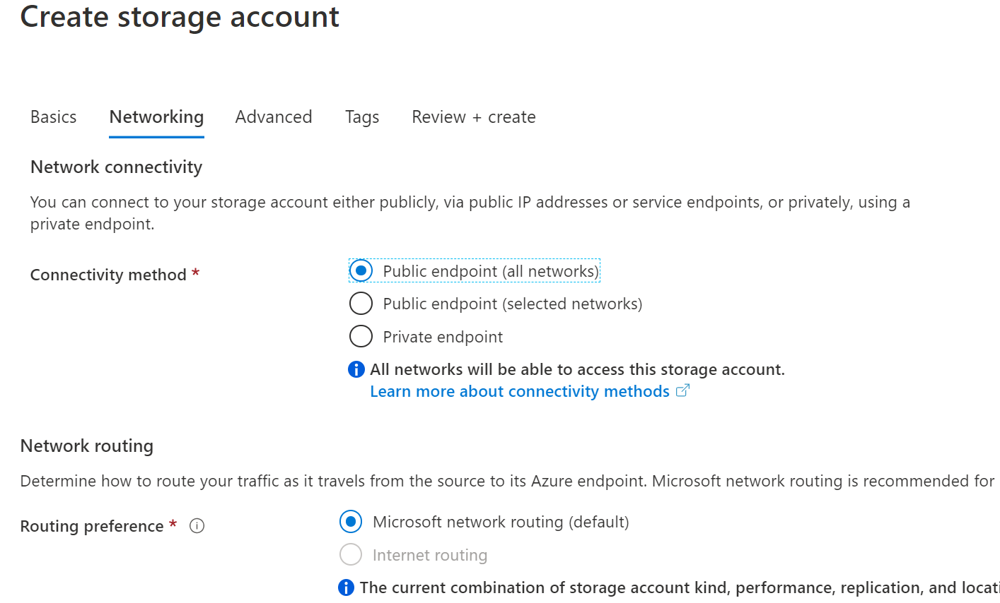
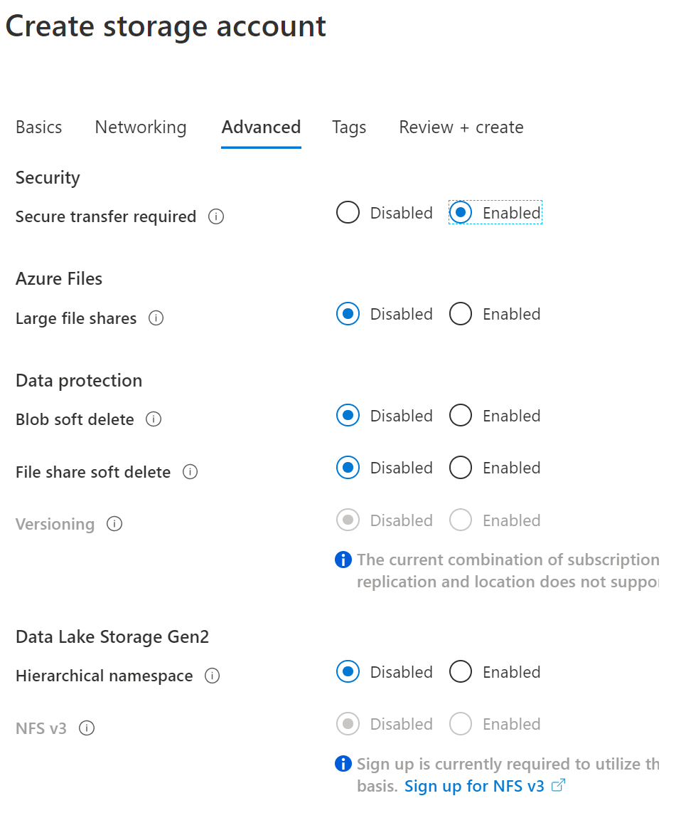

## Create storage account
In this module, you will create Azure storage account that will be used by Azure function to store data. Azure function gets triggered whenever there will be any change in Cosmos DB collection created as part of Module 1.

1. On azure portal, navigate to 'Create a resource' option as shown in Step1 of Module1.

2. Search for 'Storage account - blob, file, table, queue', select an option as shown below and click 'Create'

3. Enter details as shown below and make sure you select the resource group created in Module 1.

4. Select Next with all default settings for 'Networking', 'Advanced' and 'Tags' tabs.

5. Click 'Create' on last screen as shown below

#### NOTE - I have used Azure BLOB storage but you can use ADLS Gen 2 as well by enabling 'Hierarchical namespace'. 
