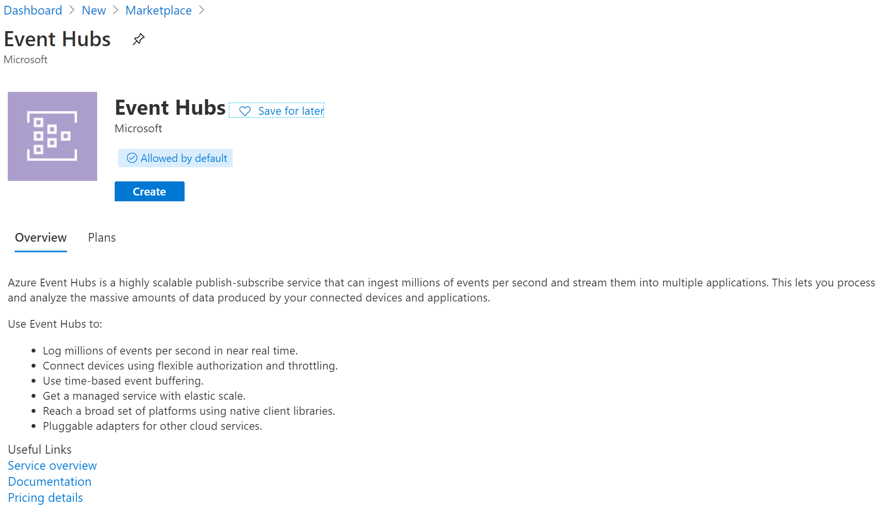
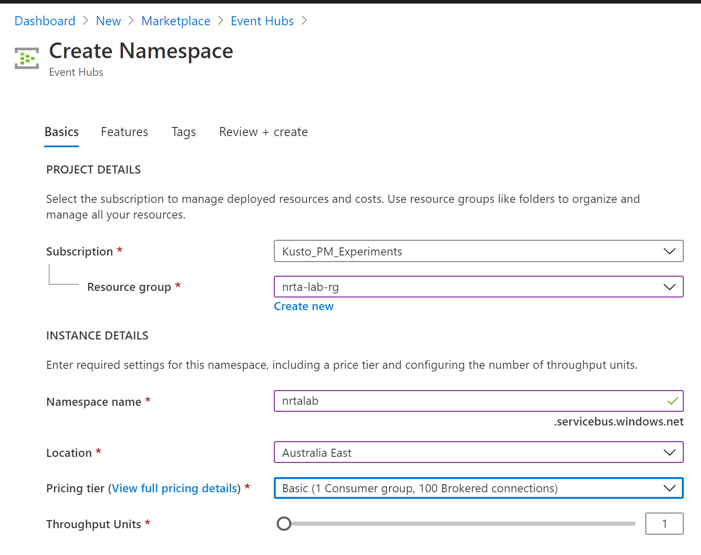
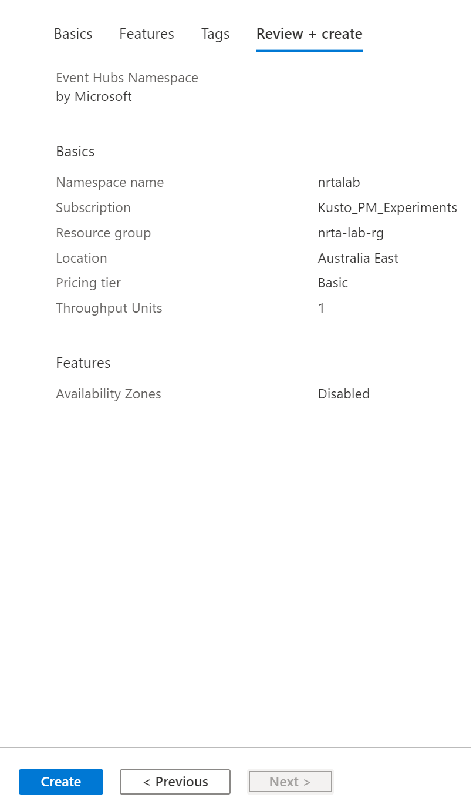
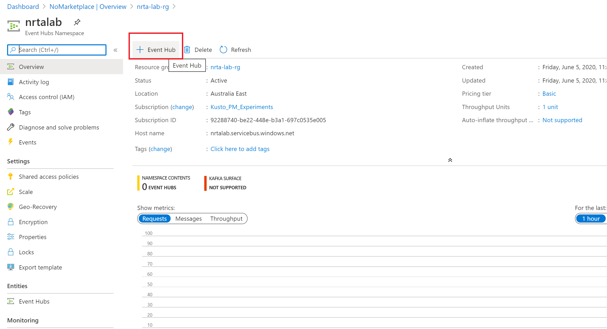
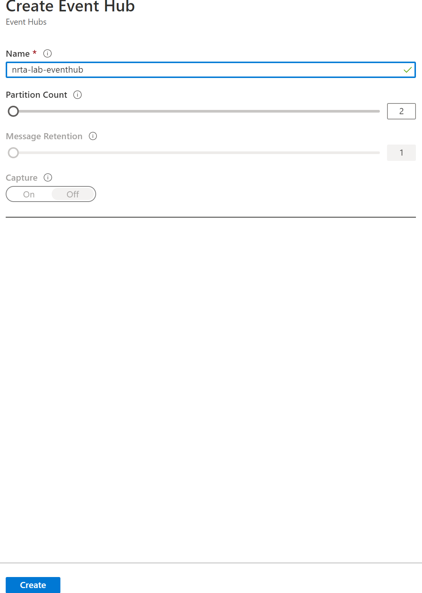
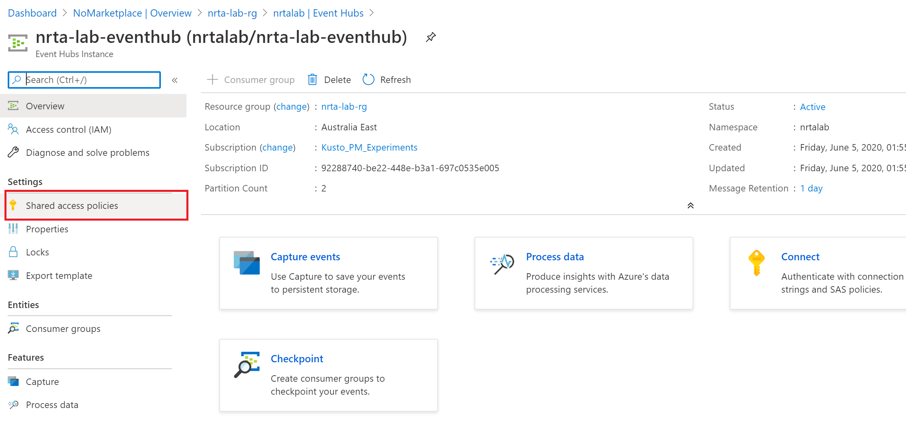
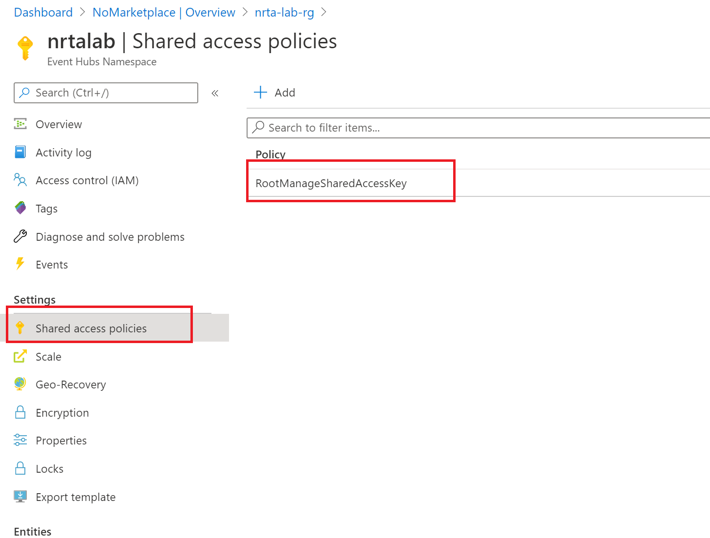
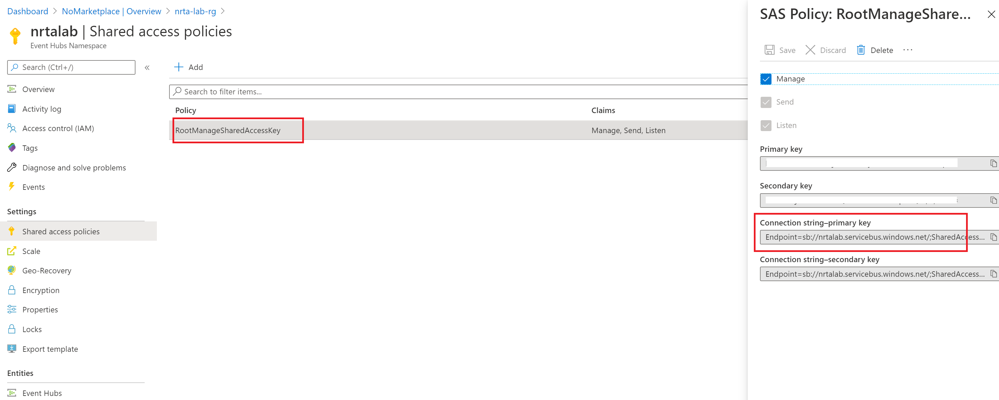

## Create Azure Event Hub
In this module we will create an event hub namespace and an event hub. Event hub namespace is a logical container that can have multiple event hubs. Event Hub is a highly scalable publish-subscribe service that can ingest millions of events per second and stream them into multiple applications. This lets you process and analyze the massive amounts of data produced by applications.  In this example, whenever user will perform any action on e-commerce website like viewing an item, adding item to the shopping cart etc, that event will be saved into Cosmos DB. Cosmos DB change feed which is analogous to database logs in relational world will trigger Azure function which will pass the document generated by that event to azure event hub. Event hub is used for ingesting events to ADX. 

1. On azure portal home page, navigate to 'Create a resource' option as shown in Step1 of Module1.

2. Search for 'Event Hubs', select an option as shown below and click 'Create'

3. Enter details as shown below to create an event hub namespace

4. Select Next for 'Features' and 'Tags' tab with default values then click 'Create' on the last screen for creation flow as shown below

5. Select 'Event Hub' to start creation of event hub

6. Fill details as shown below, I have kept default values. In reality, you can create more partitions if you have more concurrent readers. Number of partitions cannot be changed after creation of event hub. Fyi - dynamic partitions can be created even after creation of event hubs but are supported only on dedicated event hub cluster.

7. Select 'Shared access policies' from left menu

8. Select 'RootManageSharedAccessKey'

9. Note down the primary key which will be used by the Azure function to connect to the event hub

