## Create and Configure Azure Data Explorer Cluster
In this module, you will create and configure Azure Data Explorer(ADX) cluster.<br>
ADX is a fully-managed big data analytics and data exploration service on azure. It supports both batch and streaming scenarios to ingest structured, semi-structured(XML, JSON) and unstructured(free text) data.

1. On azure portal home page, select 'Create a resource' option from left menu.
2. Search for 'Azure Data Explorer', select an option as shown below and click 'Create'
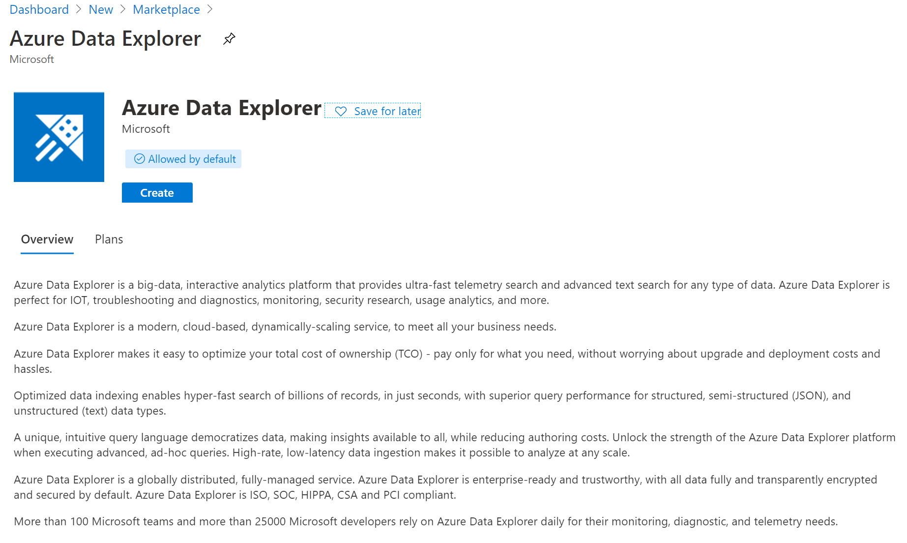
3. Fill in all the details as shown below
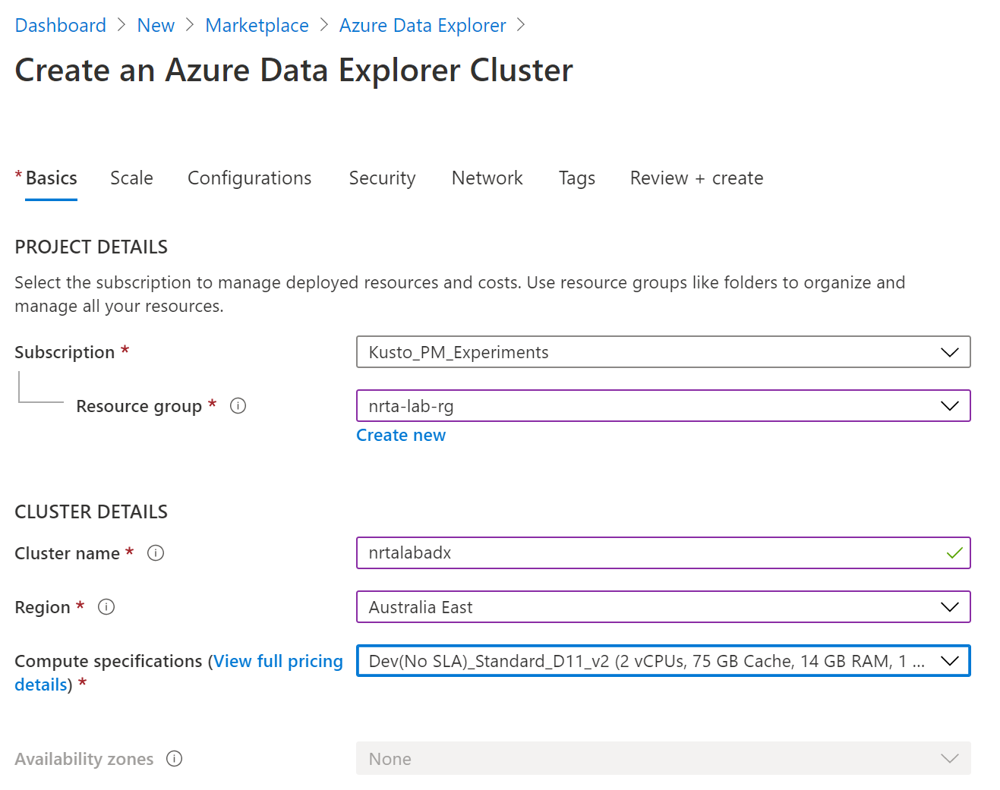
4. Select Next, I am keeping default settings. You can scale up or scale out cluster in case you plan to test it with large volumes of data. Or you can select an optimized autoscale option which will automatically scale up/down or in/out your cluster depending on workloads.
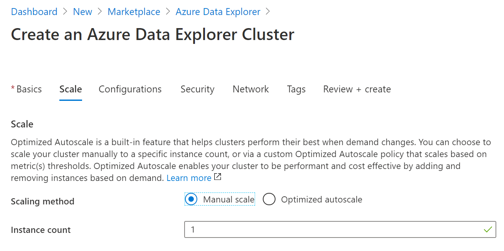
5. Enable streaming ingestion option as we will be streaming data from data generator component to simulate user actions.  
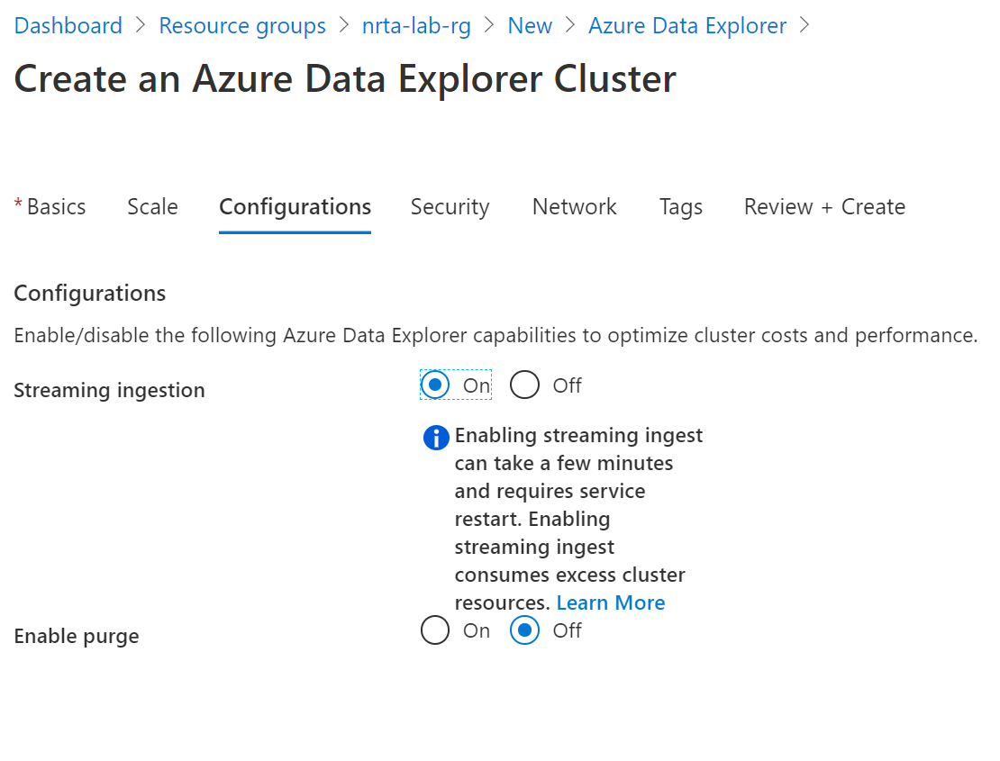
6. Select Next with default values for 'Security', 'Network' and 'Tags' tabs then click 'Create' on the last screen for creation flow as shown below
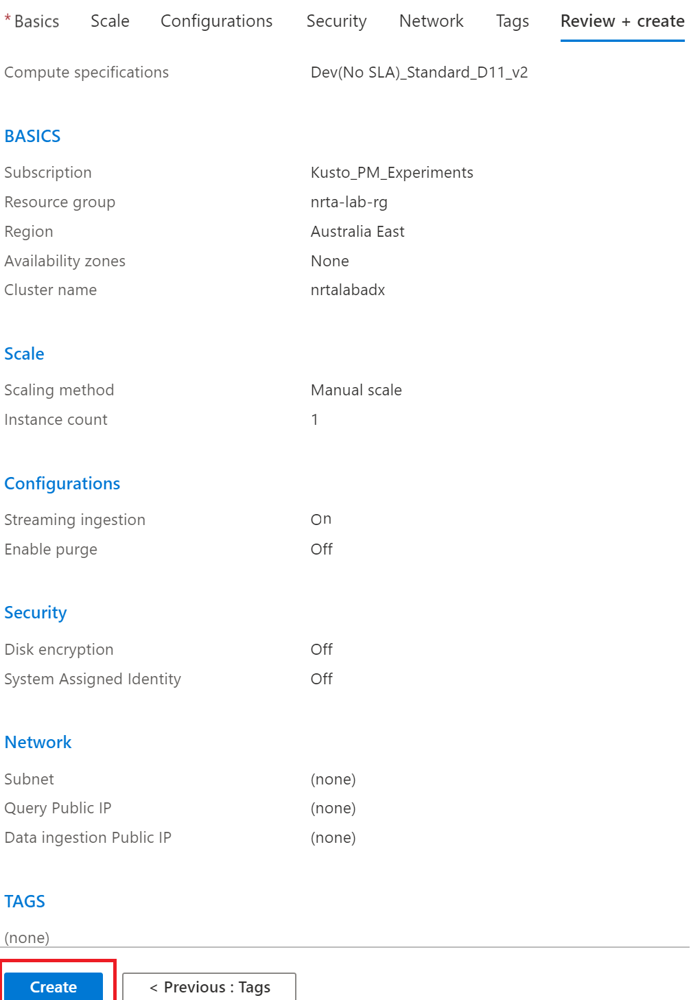

7. Add database in the ADX cluster
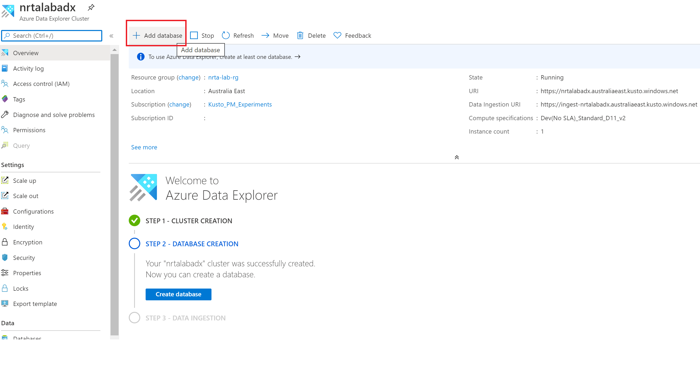

8. Fill in the details as shown below and click 'Create'
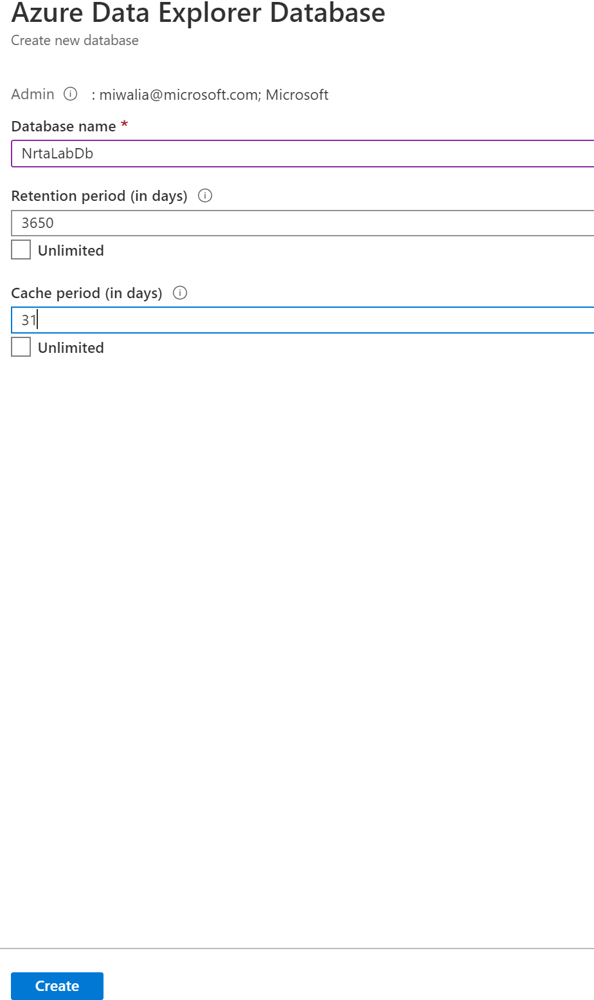

9. Now open [ADX Web UI](https://dataexplorer.azure.com/) to run following command to create table in ADX -
```
.create table NrtaLabTable (ShoppingCartID: int, Action: string, Item: dynamic, UniqueID: string, Timestamp: datetime) 
```
10. Create corresponding table mapping for the table columns mapping to the fields in JSON document using this command -
```
.create table NrtaLabTable ingestion json mapping 'NrtaLabTable_mapping' '[{"column":"ShoppingCartID","path":"$.ShoppingCartID","datatype":"int","transform":""},{"column":"Action","path":"$.Action","datatype":"string","transform":""},{"column":"Item","path":"$.Item","datatype":"dynamic","transform":""},{"column":"UniqueID","path":"$.id","datatype":"string","transform":""},{"column":"Timestamp","path":"$._ts","datatype":"datetime","transform":""}]'
```
### NOTE -
Alternatively, you can use [one-click ingestion](https://docs.microsoft.com/en-us/azure/data-explorer/ingest-data-one-click) feature to ingest one of the sample document which will automatically create above mentioned table and table mapping. Or you can also copy commands from one-click ingestion window as shown below -
  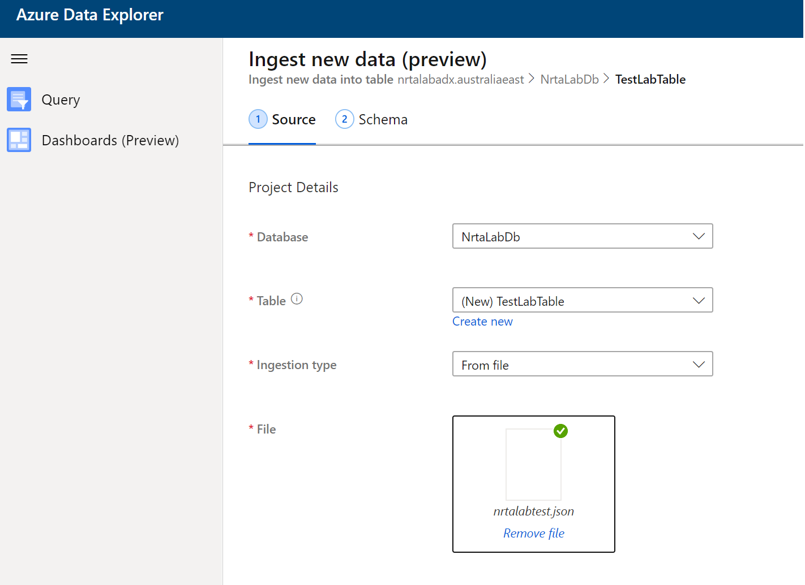
  <br/>
  <br/>

**Click on 'Edit Schema'**
  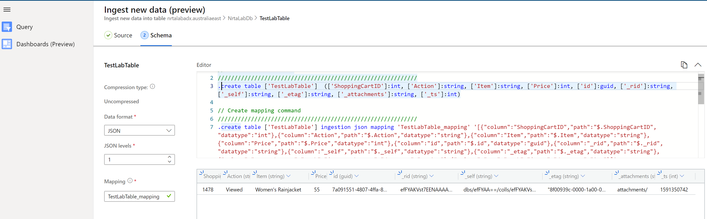
  <br/>

11. Use update policy feature in ADX to transform/parse ingested JSON input with array as shown below -
```
// Function to transform data
.create-or-alter function Transform_NrtaLabTable() {
       NrtaLabTable 
        | mv-expand Item
        | extend Brand=tostring(Item.Brand), Category=tostring(Item.Category), Price = todouble(Item.Price), Description=tostring(Item.Item)
        | project-away Item
} 

// Create the destination table (if it doesn't exist already)
.set-or-append TransformedNrtaLabTable <| Transform_NrtaLabTable() | limit 0

// Apply update policy on destination table
.alter table TransformedNrtaLabTable policy update
@'[{"IsEnabled": true, "Source": "NrtaLabTable", "Query": "Transform_NrtaLabTable()", "IsTransactional": true, "PropagateIngestionProperties": false}]'
```
12. Run following command to enable streaming ingestion policy on 'NrtaLabTable' table. You can also enable this policy at database level if you don't plan to have any tables with batch ingestion in your database.
```
.alter table NrtaLabTable policy streamingingestion enable
```

13. Now create data connection with the ingestion service, which is event hub in this case
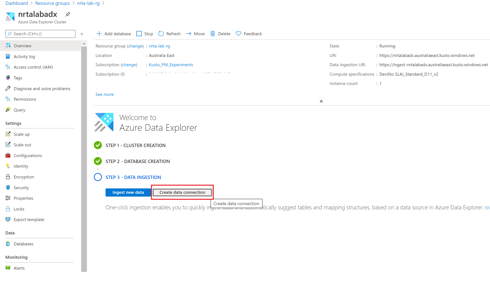
<br/>

14. Select Event Hub
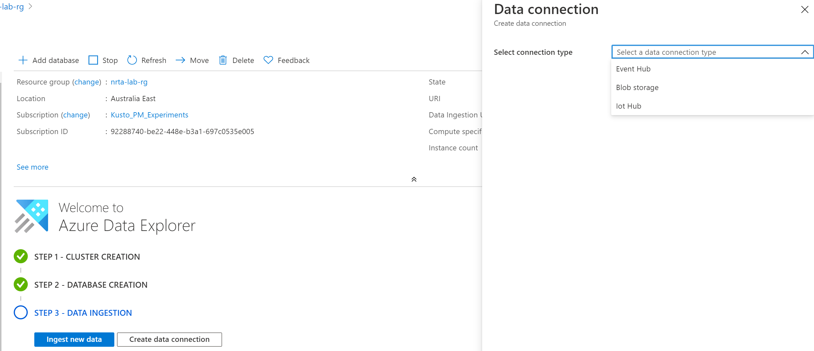
<br/>

15. Fill in the details as shown below and thats all about ADX cluster configurations.
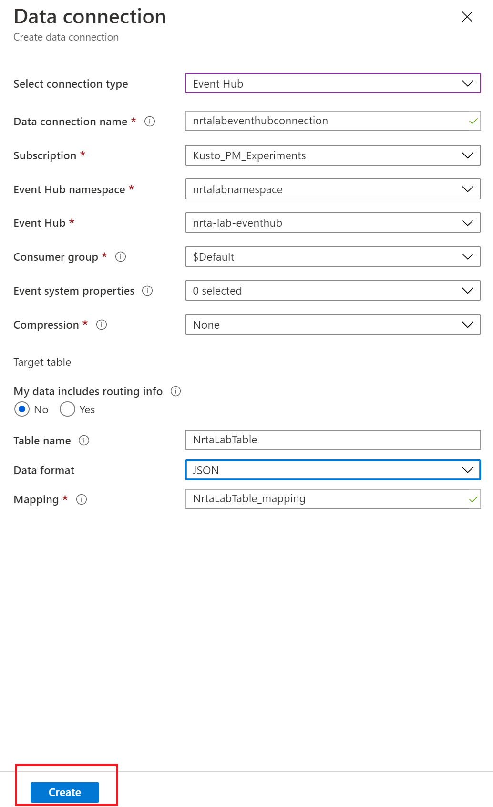
