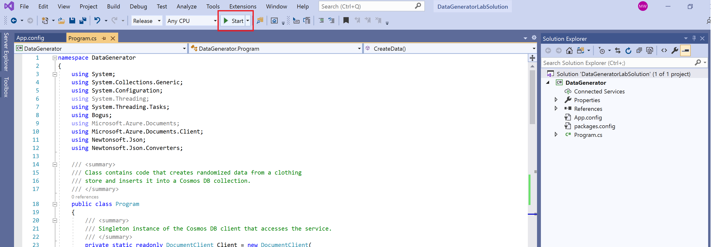
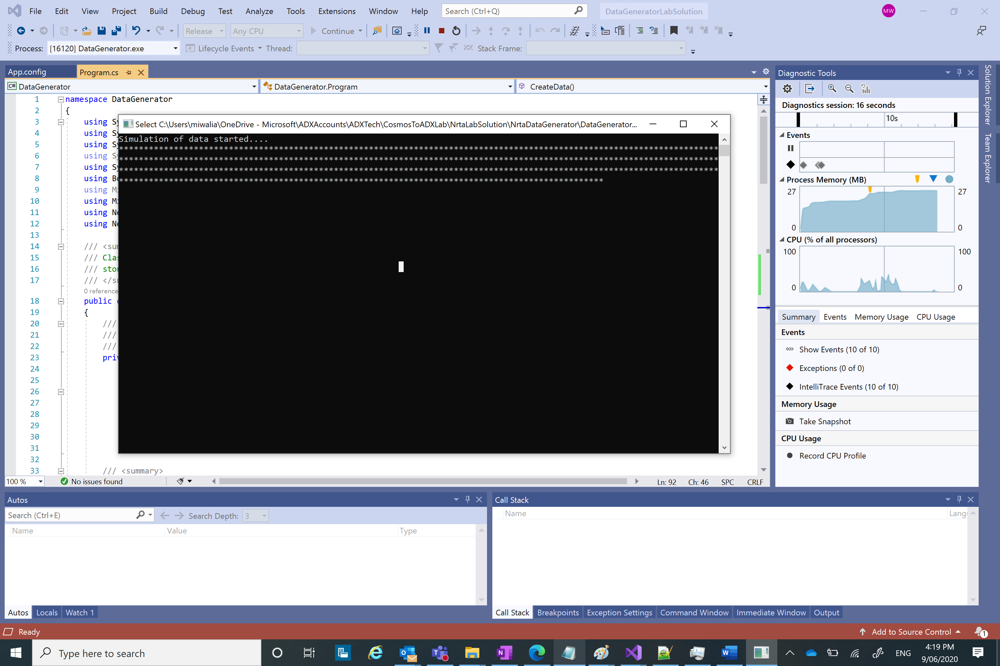

## Run data simulator to insert data into Cosmos DB
In this module, you will download the data simulator console app and run it to simulate e-commerce website data e.g. user viewing items, user adding items to their shopping cart etc. Here is an example of one record of sample data -
  ```
  {      
    "ShoppingCartID": 2956,
    "Action": "Purchased",
    "Item": "Unisex Puffy Jacket",
    "Price": 81.99
  }
  ```

1. Download the data simulator console app from [here](https://github.com/minwal/cosmos-adx-int/blob/minwal-patch-1/src/NrtaDataGenerator.zip)
2. Right click and open 'DataGeneratorLabSolution.sln' file using Visual Studio. I had used VS2019.
3. Replace Cosmos DB primary key in angular brackets in App.config file as shown below 
```
<appSettings>
    <add key="endpoint" value="https://nrta-cosmosdbacc.documents.azure.com:443/" />
    <add key="authKey" value="<Your Cosmos DB primary key>" />
    <add key="database" value="nrta-cosmosdatabase" />
    <add key="collection" value="nrta-cosmoscontainer" />
  </appSettings>
```

In case you used different names for Cosmos DB account, DB and container then replace those too.

4. Save the changes in App.Config file, build and run the project by clicking on 'Start' as shown below -


5. When its running and inserting data into Cosmos DB, you will see following screen -
Left mouse click will stop insertion of data, Right mouse click or 'Enter' will start insertion, press any other key to exit.

