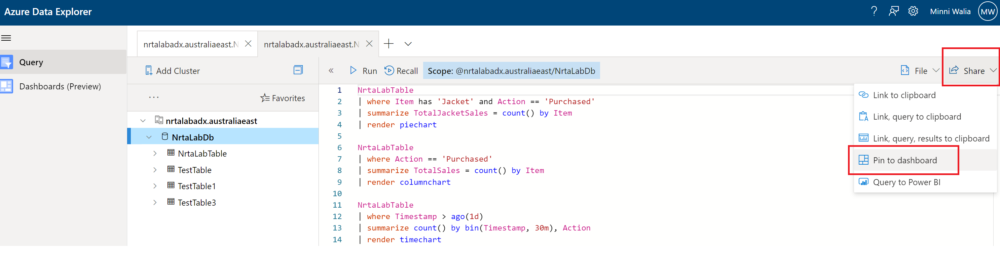
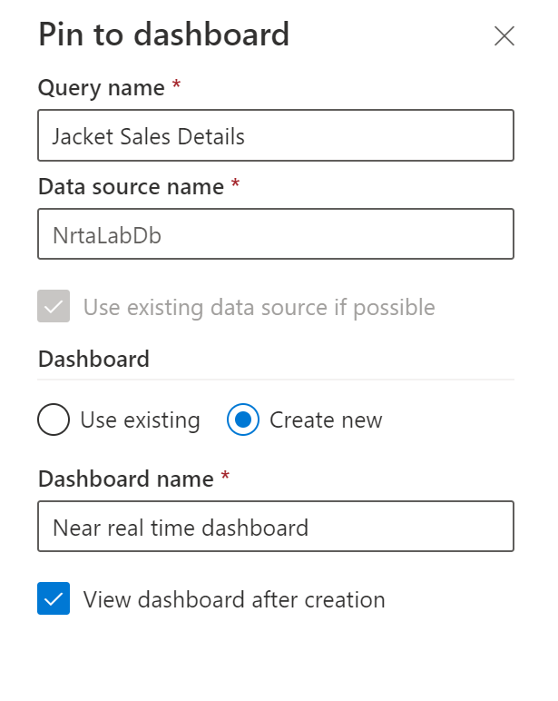
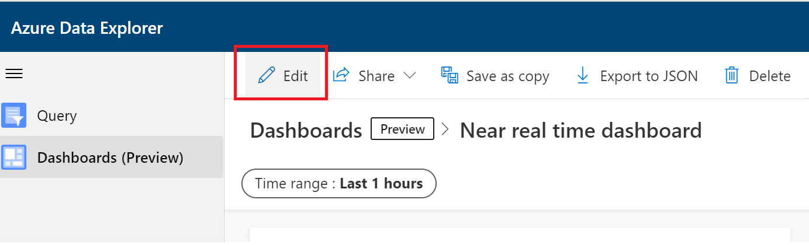
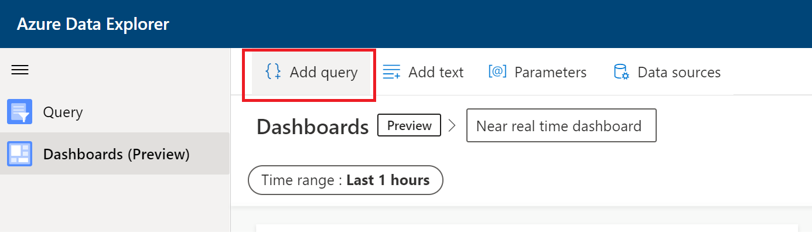
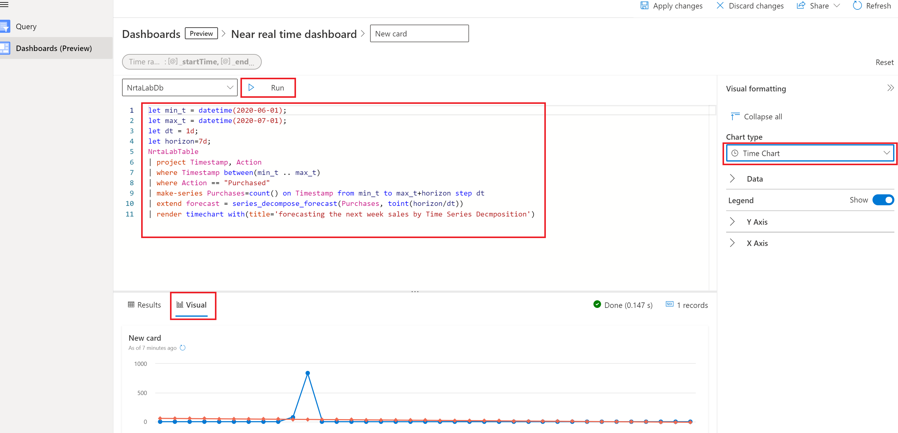
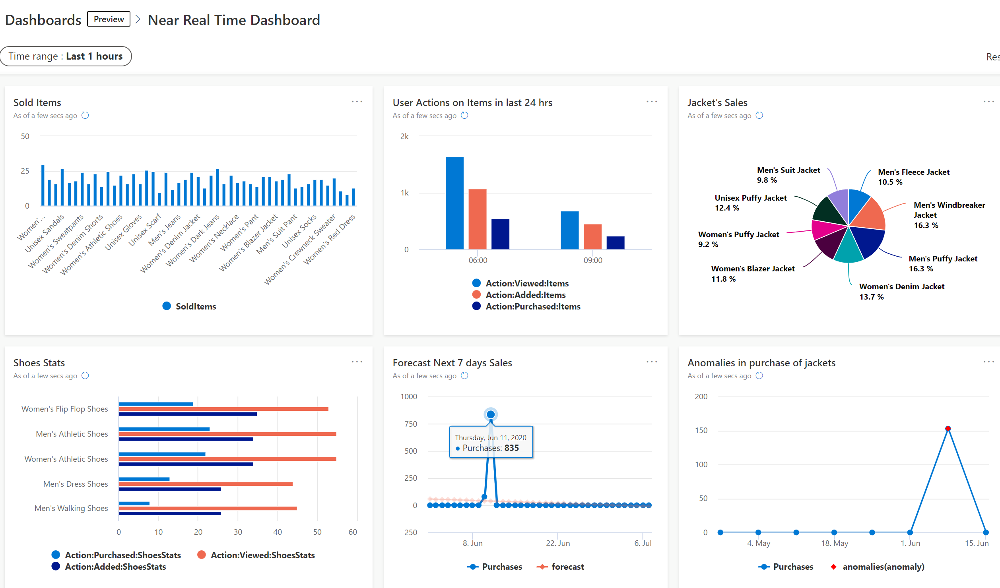

## Explore, Analyze and Visualize data in near real-time using ADX 
In this module you will learn about how easy it is to explore, analyze and visualize data using ADX. You will also learn how to build a near real-time dashboard with few sample queries using ADX Dashboards. ADX Dashboards is a feature of ADX which can be accessed from ADX Web UI. You can also use other visualization tools like Power BI or Grafana depending on your requirements. 
I am using ADX dashboards due to following reasons -
   - Easy to use with ADX as source
   - Leverage data exploration KQL(Kusto Query Language) queries as it is to build dashboards
   - Highly performant so you can build near real time dashboards with raw or aggregated data
   - Free to use so no additional cost

### Let us get started
1. Open [ADX Web UI](https://dataexplorer.azure.com/) to connect to the ADX cluster, details on using Web UI are given [here](https://docs.microsoft.com/en-us/azure/data-explorer/web-query-data)<br/>
You can also use Kusto explorer which is a desktop edition similar to the Web UI, details are given [here](https://docs.microsoft.com/en-us/azure/data-explorer/kusto/tools/kusto-explorer)
2. Add ADX cluster that we built in Module 5 on Web UI.
3. Sample KQL queries 
   - This query will select top 5 records in descending order by Timestamp 
     ```
     NrtaLabTable
     | take 5 
     | order by Timestamp desc  
     ```
     You can also write queries using T-SQL e.g. above query is same as following T-SQL query -
     ```
     select top(5) * from NrtaLabTable order by Timestamp desc
     ```
     
   - Aggregations on fly work at a lightning speed in ADX e.g. 
     ```
      NrtaLabTable 
      | where Item has 'Jacket' and Action == 'Purchased'
      | summarize TotalJacketSales = count() by Item
      | render piechart 
     ```
     
    - Above example with different view to find best selling product 
      ```
      NrtaLabTable 
      | where Action == 'Purchased'
      | summarize TotalSales = count() by Item
      | render columnchart  
      ```
### Glimpse of advanced native features like time series analysis, forecasting and anomaly detection
- This query forecasts the next week sales using time series decomposition on historical data
    ```
   let min_t = datetime(2020-06-01);
   let max_t = datetime(2020-07-01);
   let dt = 1d;
   let horizon=7d;
   NrtaLabTable
   | project Timestamp, Action 
   | where Action == "Purchased"
   | make-series Purchases=count() on Timestamp from min_t to max_t+horizon step dt  
   | extend forecast = series_decompose_forecast(Purchases, toint(horizon/dt))
   | render timechart with(title='forecasting the next week sales by Time Series Decmposition')
    ```
- This query finds anomalies in the purchase of jackets for a specific duration
    ```
   NrtaLabTable
   | make-series Purchases=avg(Price) on Timestamp from datetime(2020-05-01) to datetime(2020-06-15) step 1d by Action
   | where Action == "Purchased"
   | extend anomalies = series_decompose_anomalies(Purchases, 2)
   | render anomalychart with(anomalycolumns=anomalies, title='Anomalies in purchase of items')
    ```
  
  ### Build a dashboard using ADX Dashboards with above mentioned queries
  1. Click on 'Share' option on right menu of ADX Web UI, select 'Pin to Dashboard' option
  
  2. Fill in the details and create a new dashboard
  
  3. Click on 'Edit' button on top
  
  4. Then click on 'Add query'
  
  5. Paste any of the KQL queries that were created in Step 3 of 'Sample KQL Queries' above section. Run query and add visuals as needed.
  

  6. Repeat above Step 4 and 5 to add rest of the sample queries on dashboard. You can drag and drop, resize visuals as needed. Finally you will see a dashboard like the one shown below, thats it. So simple and easy!
  


