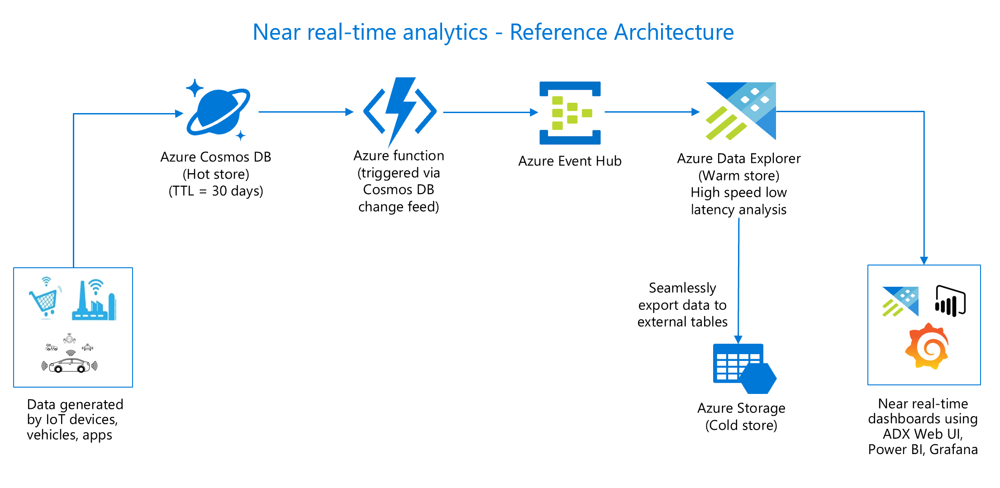

# Integrating Azure Cosmos DB and Azure Data Explorer via Cosmos DB Change feed

**In this hands on lab you will learn about the power of near real-time analytics solution and how easy it is to build one using Azure Cosmos DB and Azure Data Explorer(ADX).**

## NOTE
Near real-time analytics solutions can be built in mutiple ways using different azure services, this lab describes one of the possible scenarios. Similar outcomes can be achieved using other azure services which are not covered in this lab.

## Overview
The idea behind near real-time analytics solution is to provide the ability to analyze data without impacting the online transactional processing(OLTP) system. Few examples to understand its value proposition for business growth include - ability to provide promotions in ecommerce system as soon as user checks out, identify customer behaviour trends, fraudulent activities, monitoring data from IoT devices in manufacturing industry for predictive maintenance or to prevent negative consequences etc are all such scenarios which are possible with this solution. 
With ADX, you get the ability to query fast-flowing data without having to wait until the data is ingested into a data warehouse, but at the same time without affecting the OLTP system's performance.

In this lab you will build the solution architecture as shown below. You will simulate and insert the transactions from an ecommerce system to Cosmos DB. Push every change in near real-time using Azure functions triggered by the Cosmos DB change feed which will further ingest the data to ADX via event hub. The intent is to use Cosmos DB as an opeartional hot store, ADX as an analytical warm store and Azure storage as a cold store.

## Key advantages of this architecture
 - Transactional data is readily available for analysis so you can query data in near real-time as opposed to waiting for days to get the data.
 - You can query data without impacting the OLTP system's performance.
 - Drill down from analytic aggregates always point to fresh data.

## Brief on each of the components in this lab -
1. **Data Generation component** - This will simulate random data for the lab. Its a simple .NET program to generate sample data simulating ecommerce website's shopping events including viewing of items, adding items to a shopping cart, purchase items. 
 2. **Cosmos DB** - It is a globally distributed, multi-model NoSQL database. I am leveraging its power to serve as an operational and transactional database in this lab which will store simulated data in a Cosmos DB collection.
 3. **Change Feed** - The change feed will listen for changes to the Cosmos DB collection e.g. on an ecommerce website, whenever user views an item, adds an item to their cart or purchases an item, it will lead to a change in Cosmos DB collection which will trigger an Azure Function.
Change Feed is similar to database logs in relational world. It can be processed in push or pull model. I will be covering push model as its the recommended approach due to its ability to -
    - Poll the change feed for future changes
    - Store state for the last processed change
    - Load balance across multiple clients consuming changes. 
    - Retrying failed changes that weren't correctly processed after an unhandled exception in code or a transient network issue.
4. **Azure Function** - It is a serverless way to run event triggered code. In this case, it will process every change in Cosmos DB and  send it to an Azure Event Hub.
5. **Event Hub** - It is an event ingestion service which will receive events from Azure Function and send them to ADX.
6. **Azure Data Explorer(ADX)** - It is a big data analytical platform which will provide the ability to analyze streaming data at a lightning speed. Brief on ADX -
    - ADX supports ingestions for fast flowing high volumes of data with low latency in streaming or batch mode. 
    - ADX supports structured, semistructured(JSON and XML) and unstructured(free text) data. It has a rich set of capabilities for time series analysis, user analytics, geospatial and log analytics capabilities(trace logs, user activity logs, CDN logs or any kind of activities generated by the enterprise systems). 
    - ADX automatically indexes and compresses data on ingestion and stores it in an append only columnar database.
    - ADX provides interactive analytical capabilities in one of the most performant and cost efficient manner. It supports KQL(Kusto Query Language), T-SQL, inline R and Python for building ML models.
    - ADX provides the ability to build easy, quick, performant and no cost dashboards.

For more details on ADX, refer to this [documentation](https://azure.microsoft.com/en-au/services/data-explorer/#features).

## Prerequisites
 - Microsoft Azure Subscription with contributor or admin level access
 - Microsoft .NET Framework 4.7 or higher
 - VS Code or Visual Studio 2017 or higher
 - Use either Edge or Chrome when executing the labs. Internet Explorer may have issues when rendering the UI for specific Azure services
 - Basic knowledge on Azure portal

## Lets get started
[Module 1 - Create Cosmos DB account, database and container](LabModules/Module1.md)

[Module 2 - Create Storage account](LabModules/Module2.md)

[Module 3 - Create and configure Azure Event Hub](LabModules/Module3.md)

[Module 4 - Create and Host Azure function to be triggered by Cosmos DB Change feed](LabModules/Module4.md)

[Module 5 - Create and Configure Azure Data Explorer cluster](LabModules/Module5.md)

[Module 6 - Set up data simulator to feed data into Cosmos DB](LabModules/Module6.md)

[Module 7 - Explore, analyze and visualize data in near real time using Azure Data Explorer](LabModules/Module7.md)

