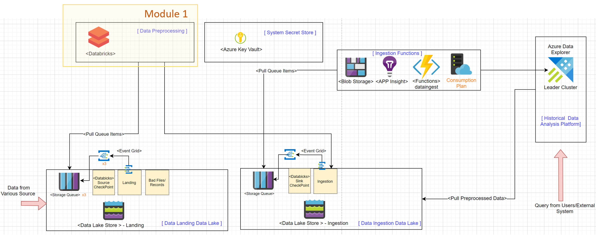
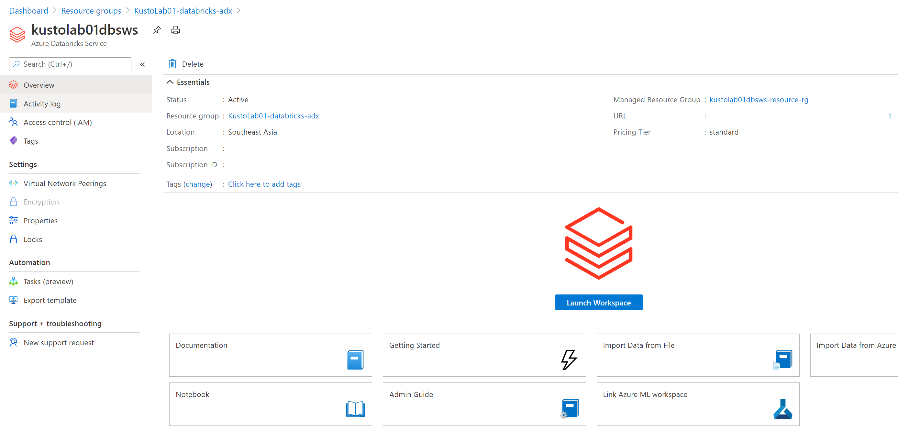
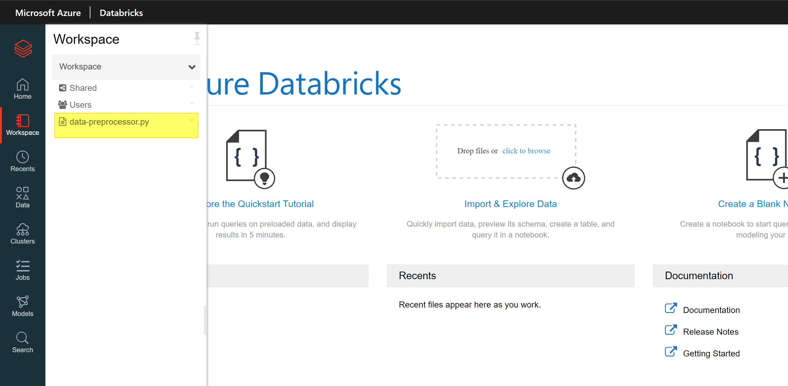
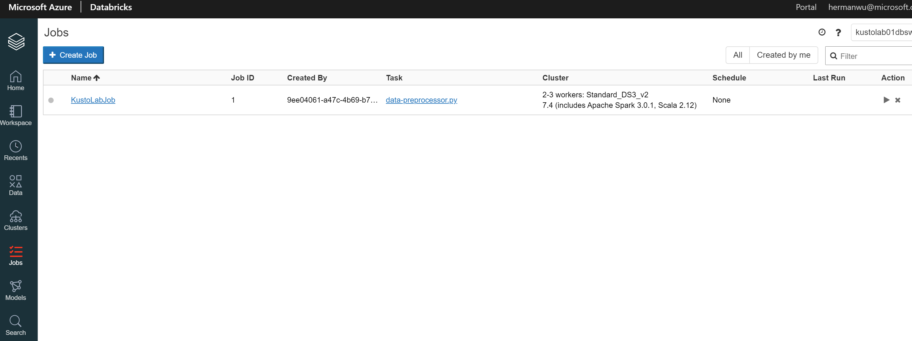
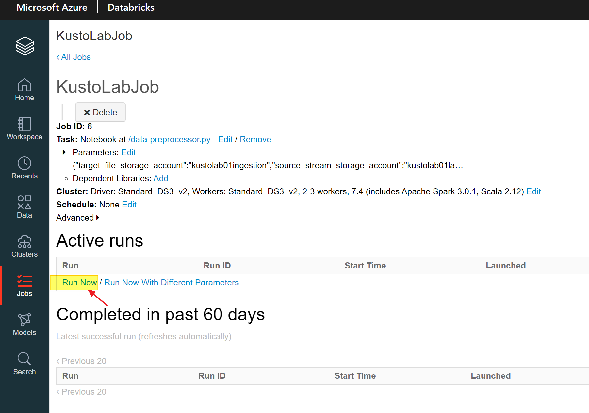
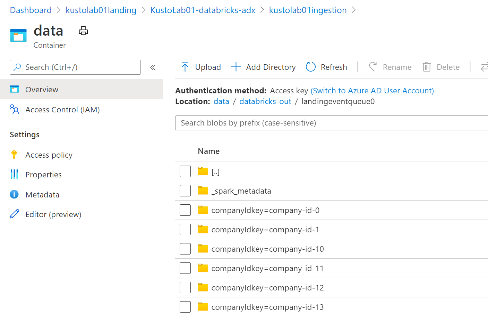
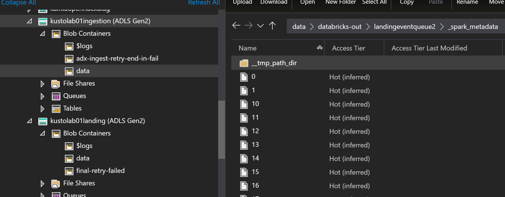
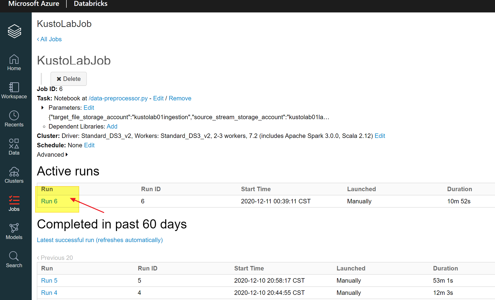
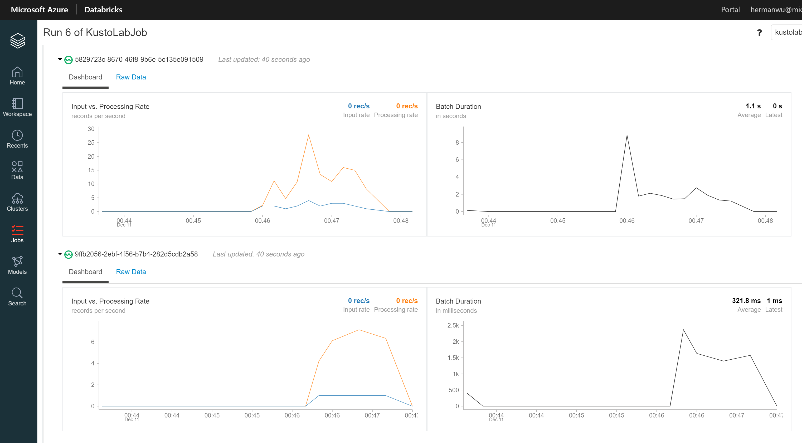

## Module 1 - Create Databricks services, Jobs, Notebooks


In this module, you will create __[Azure Databricks Workspace](https://docs.microsoft.com/en-us/azure/databricks/workspace/)__. Then you will need to deploy a [Databrick notebook](https://docs.microsoft.com/en-us/azure/databricks/notebooks/) and modify it's parameters. We will use __cloud files__ data source in [Spark structured streaming](https://spark.apache.org/docs/latest/structured-streaming-programming-guide.html#overview) to connect to __Azure Storage Queue__.  Then we will running the notebook through  [Databricks Jobs](https://docs.microsoft.com/en-us/azure/databricks/jobs). 

This module aims to provision the light yellow rectangle areas in the following system architecture diagram. 




__Module Goal__  
- Create Azure Databricks servicer
- Deploy data-processing notebook
- Config cloud files data source and connect to Azure Storage Queue 
- Setup Databrick Jobs to run the notebook

__Module Preparation__
- Azure Subscription 
- [Powershell Core (version 6.x up) environment](https://docs.microsoft.com/en-us/powershell/scripting/install/installing-powershell?view=powershell-7.1) (_PowerShell runs on [Windows](https://docs.microsoft.com/en-us/powershell/scripting/install/installing-powershell-core-on-windows?view=powershell-7.1), [macOS](https://docs.microsoft.com/en-us/powershell/scripting/install/installing-powershell-core-on-macos?view=powershell-7.1), and [Linux](https://docs.microsoft.com/en-us/powershell/scripting/install/installing-powershell-core-on-linux?view=powershell-7.1) platforms_) 
- [Azure CLI](https://docs.microsoft.com/en-us/cli/azure/install-azure-cli) (_Azure CLI is available to install in Windows, macOS and Linux environments_)
- Scripts provided in this module
    - _create-databricks.ps1_
    - _deploy-databricks-notebook.ps1_
    - _create-databricks-job.ps1_
    - _ingest-telemetry-data.ps1_


- [Azure Storage Explorer](https://azure.microsoft.com/en-us/features/storage-explorer/)
- Databricks Notebook (data-preprocessor.py)
- Databrick CLI , if you don't have, please follow the below command:
```cmd
pip install databricks-cli
```
- Azure CLI with Databricks extension installed, if you don't have, please follow the below command:
```cmd  
az extension add --name databricks
```


__References__
- [What is Azure Databricks?](https://docs.microsoft.com/en-us/azure/databricks/scenarios/what-is-azure-databricks)
- [What is Azure Databricks Workspace?](https://docs.microsoft.com/en-us/azure/databricks/scenarios/what-is-azure-databricks-ws)
- [Introduction to Apache Spark](https://docs.microsoft.com/en-us/azure/databricks/getting-started/spark/)
- [Structured Streaming tutorial](https://docs.microsoft.com/en-us/azure/databricks/getting-started/spark/streaming)
- [Load files from Azure Blob storage, Azure Data Lake Storage Gen1 (limited), or Azure Data Lake Storage Gen2 using Auto Loader](https://docs.microsoft.com/en-us/azure/databricks/spark/latest/structured-streaming/auto-loader)
- [Running Parallel Apache Spark Notebook Workloads On Azure Databricks](https://devblogs.microsoft.com/cse/2019/01/18/running-parallel-apache-spark-notebook-workloads-on-azure-databricks/)

---
Make sure you have all the preparation items ready and let's start. 
#### Step 1: Provision Databricks Workspace

We will use _create-databricks.ps1_ script to create Databricks workspace. 

_If you don't have Databrick CLI and Azure CLI with Databricks extension, you can follow the guidance [here](https://docs.microsoft.com/en-us/azure/databricks/dev-tools/cli/) and [here](https://docs.microsoft.com/en-us/azure/databricks/security/keys/customer-managed-keys-dbfs/cmk-dbfs-azure-cli#install-the-azure-databricks-cli-extension) to install them._

You need to setup the following additional parameters in the _provision-config.json_ file. You should modify the configuration values according to your needs. 

```json
{
    "Databricks": {
        "WorkspaceName": "dbsws",
        "WorkspaceSku": "standard",
        "DBSTemplatePath": "../Azure/databricks/Workspace.json",
        "DBSSecretScopeName": "secretScope"
    }, 
    "DatabricksJob": {
        "DatabricksJobParamPath": "../Azure/databricks/JobSpec.cfg",
        "DatabricksJobName": "KustLabJob",
        "DatabricksSparkVersion": "7.4",
        "DatabricksNodeSpec": "Standard_DS3_v2",
        "DatabricksMinWorkersCount": 2,
        "DatabricksMaxWorkersCount": 3,
        "AzureStorageCheckPointFolder": "checkpoint",
        "AzureStorageBadRecordFolder": "badrecords"
    } 
}
```

Then run _create-databricks.ps1_ script to create Databricks workspace, this step could take a few minutes.

***Note!** _Creating Databricks workspace will take a couple minutes._

After the creation is done, you can verify the creation result in Azure Portal. 

When the script is finished, you can verify the resource creation result in Azure Portal. 



#### Step 2: Deploy Databricks Notebooks

Run _deploy-databricks-notebook.ps1_ script to deploy the data process Spark structured streaming notebook. Then you can verify the creation result in the Databricks WorkSpace.  

When the script is finished, you can verify the resource creation result in Azure Portal. 


#### Step 3: Create Databricks Jobs

Run _create-databricks-job.ps1_ script to create the Databricks job that will run the data process Spark structured streaming notebook.  Then you can check the Databricks Jobs in the Databrick Work Space.  

You can verify the resource creation result in the created Databricks Workspace. 


#### Step 4: Test Data Preprocess Result 

To verify if the deployment is successful, we will use sample data to test the running of the data preprocessing. 

1. Start the Databricks Job. 


***Note!** _It will take couple minutes to start a Databricks job because it will provision a new cluster._


2. Run _ingest-telemetry-data.ps1_ to generate and upload testing files to data-landing Data Lake. 


3. Check if processed files are generated in data-ingestion Data Lake. You can check generated files in Azure Portal.


 You can also using [Azure Storage Explore]((https://azure.microsoft.com/en-us/features/storage-explorer/)) to check if Databricks processed data successfully. 
 

4. Check the status of Databricks Job in Databricks Workspace. 

 


 


5. Stop the Databrick Job.


