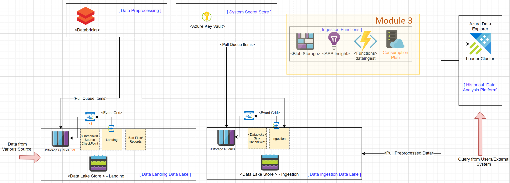
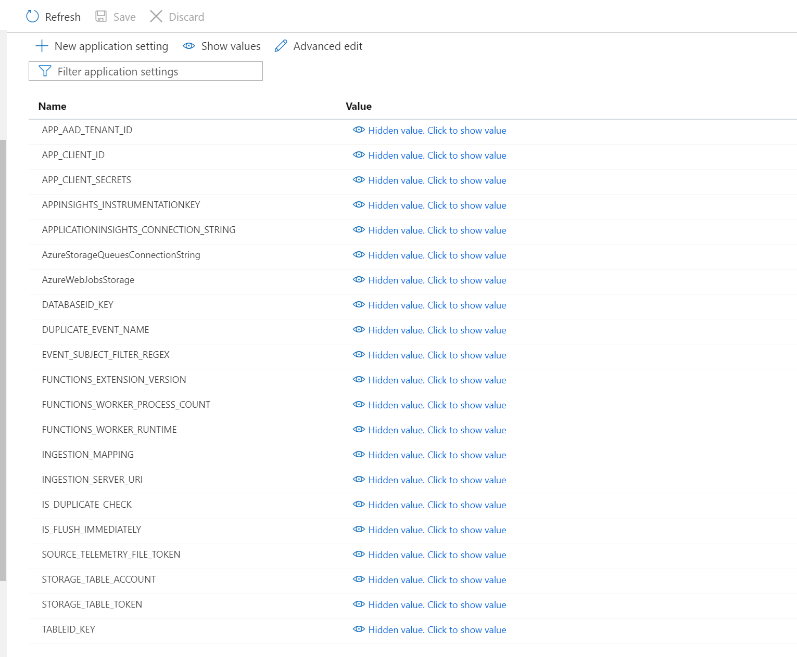
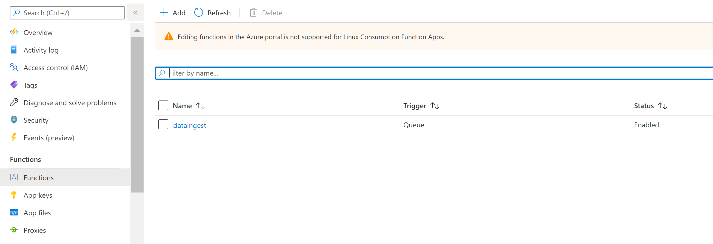
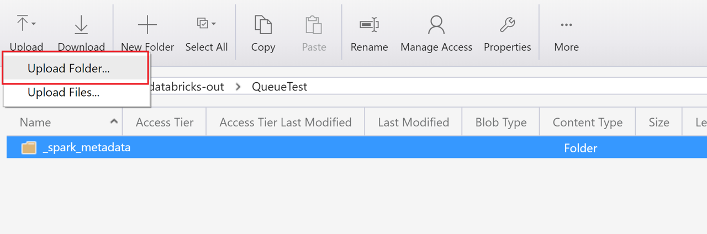
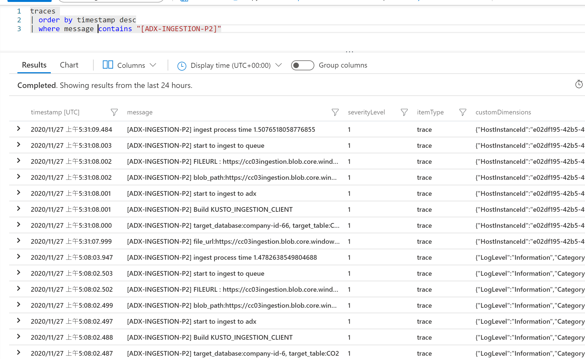
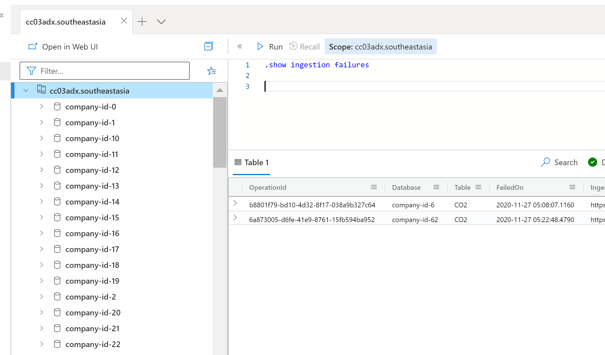

## Module 3 - Create Ingestion Azure Functions

In this module, you will create an __Azure Functions__ which uses Kusto python SDK to ask Azure Data Explorer service to ingest the specified data files. You will also need to update the configuration setting and leverage Azure Key Vault to make sure the connection secret is securely stored. 

We aim to provision the light yellow rectangle areas in the following system architecture diagram. 




__Module Goal__  
- Create Azure Functions
- Update application setting in Azure Functions 
- Update Azure Key Vault
- Evaluate Azure Fucntion Result

__Module Preparation__
- Azure Subscription 
- [Powershell Core (version 6.x up) environment](https://docs.microsoft.com/en-us/powershell/scripting/install/installing-powershell?view=powershell-7.1) (_PowerShell runs on [Windows](https://docs.microsoft.com/en-us/powershell/scripting/install/installing-powershell-core-on-windows?view=powershell-7.1), [macOS](https://docs.microsoft.com/en-us/powershell/scripting/install/installing-powershell-core-on-macos?view=powershell-7.1), and [Linux](https://docs.microsoft.com/en-us/powershell/scripting/install/installing-powershell-core-on-linux?view=powershell-7.1) platforms_) 
- [Azure CLI](https://docs.microsoft.com/en-us/cli/azure/install-azure-cli) (_Azure CLI is available to install in Windows, macOS and Linux environments_)
- Python > 3.6
- pip for python
- [Azure Function Core Tools (3.x Version)](https://docs.microsoft.com/en-us/azure/azure-functions/functions-run-local?tabs=windows%2Ccsharp%2Cbash#install-the-azure-functions-core-tools)
- Microsoft Azure Storage Explorer Application
- Scripts provided in this module
    - _create-ingestion-function.ps1_
    - _deploy-ingestion-function.ps1_


__References__
- [Azure Data Explorer data ingestion overview](https://docs.microsoft.com/en-us/azure/data-explorer/ingest-data-overview)
- [Azure Data Explorer Python SDK](https://docs.microsoft.com/en-us/azure/data-explorer/kusto/api/python/kusto-python-client-library)
- [Azure Queue storage trigger and bindings for Azure Functions overview](https://docs.microsoft.com/en-us/azure/azure-functions/functions-bindings-storage-queue)

---
Make sure you have all the preparation  items ready and let's start. 

#### Step 1: Create Azure Function 
We will use _create-ingestion-function.ps1_ script to create Azure Function and setup config for Azure Function.

We need to setup the following additional parameters in the _provision-config.json_ file. You should modify the configuration values according to your needs. 

```json
{
    "Functions": {
        "IngestionFunction": {
            "FunctionName": "ingestionfunc",
            "IngestionConnectingStringName": "ingestionconnectingstring",
            "IsFlushImmediately": "True",
            "Path": "adxingestp2",
            "TriggerQueueName": "adxingest-queue",
            "FunctionFolder": "dataingest",
            "Runtime": "Python",
            "IngestionfuncTemplatePath": "../Azure/function/IngestionFunction.json",
            "DatabaseIDKey":"companyIdkey=",
            "TableIDKey":"typekey=",
            "IsDuplicateCheck":"False"
        },
        ...
}
```

Then run _create-ingestion-function.ps1_ script to create and setup Azure Function.

After the creation is done, you can verify the creation result in Azure Portal.




#### Step 2: Deploy Azure Function 
Then run _deploy-ingestion-function.ps1_ script to create and setup Azure Function.

After the creation is done, you can verify the creation result in Azure Portal.



#### Step 3: Upload testing data
Change to _LabModules\assets\modules3\sampledata_ directory and upload the "databricks-out" folder to the "data" container in the Ingestion Data Lake.  You can use Azure Storage Explore or Azcopy to do it.  




#### Step 4: Check Application Insight logs for Azure Function
Go to Application Insights of the deployed Azure Functions. Search for messages that contains "ADX-INGESTION" and you should find log messages that state the execution steps. 




#### Step 5: Evaluate Result in ADX
Go to Azure Date Explore Query UI, execute ".show ingestion failure" kusto query and check if there is any ingestion failure.



Then choose one of the database in Azure Data Explore.


Count the total records in the database. 

