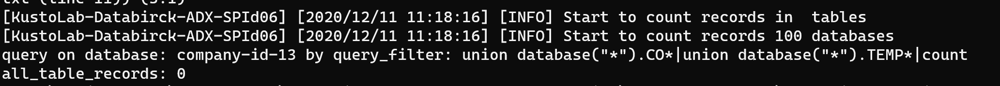
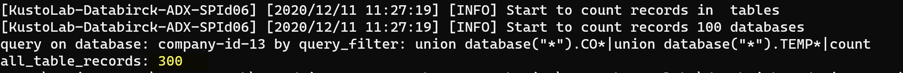

## Module 4 - Data Ingestion End to End Testing

In this module, you will validate and test the end-to-end ingestion pipeline.  

__Module Goal__  
- Put data in Landing data lake.
- Validate the data ingestion result. 

__Module Preparation__
- Azure Subcription
- [Powershell Core (version 6.x up) environment](https://docs.microsoft.com/en-us/powershell/scripting/install/installing-powershell?view=powershell-7.1) (_PowerShell runs on [Windows](https://docs.microsoft.com/en-us/powershell/scripting/install/installing-powershell-core-on-windows?view=powershell-7.1), [macOS](https://docs.microsoft.com/en-us/powershell/scripting/install/installing-powershell-core-on-macos?view=powershell-7.1), and [Linux](https://docs.microsoft.com/en-us/powershell/scripting/install/installing-powershell-core-on-linux?view=powershell-7.1) platforms_) 
- [Azure CLI](https://docs.microsoft.com/en-us/cli/azure/install-azure-cli) (_Azure CLI is available to install in Windows, macOS and Linux environments_)
- Python > 3.6
- pip for python
- Scrips provided in this module
    - _create-ingestion-function.ps1_

---
Make sure you have all the preparation  items ready and let's start. 

#### Step 1: Clean Up ADX Database

Run the ADX database clean up script **_cleanup-adx-db.ps1_**.

[**Attention!!** _The script will delete all data in ADX!! Be mindful when you do it._]

Then run the ADX database records count script **_count-adx-db-records.ps1_**

The total records count in ADX tables should be zero now. 

#### Step 2: Ingest Telemetry Data into ADX 

Run telemetry data ingest script **_ingest-telemetry-data.ps1_** to upload telemetry data into data landing data lake. 
It will trigger the ingestion process and insert data into tables in Azure Data Explorer.  

#### Step 3: Check ADX Database records again

Run ADX database records count script **_count-adx-db-records.ps1_** to verify if all data are successfully ingested again. By default you will find there are 300 records in ADX tables. 

You should be able to see the number of records that are been successfully ingested into ADX.

**By now you have successfully setup a high performance data ingestion pipeline using Azure Databricks. Also the data is in Azure Data Explorer and ready for analysis.**