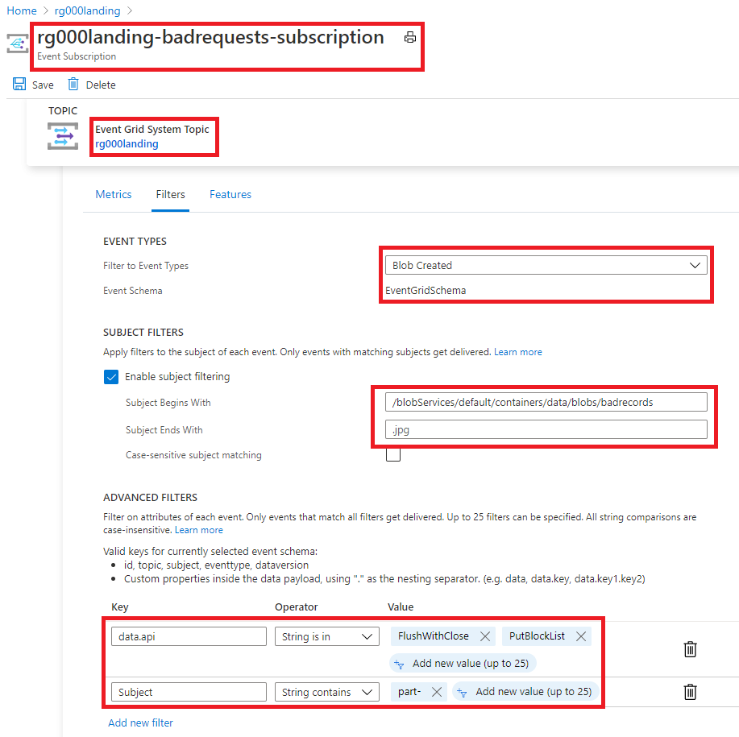
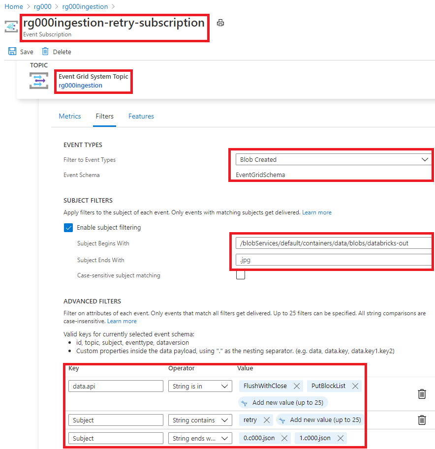
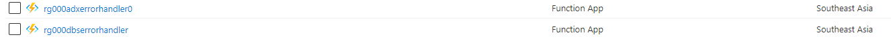
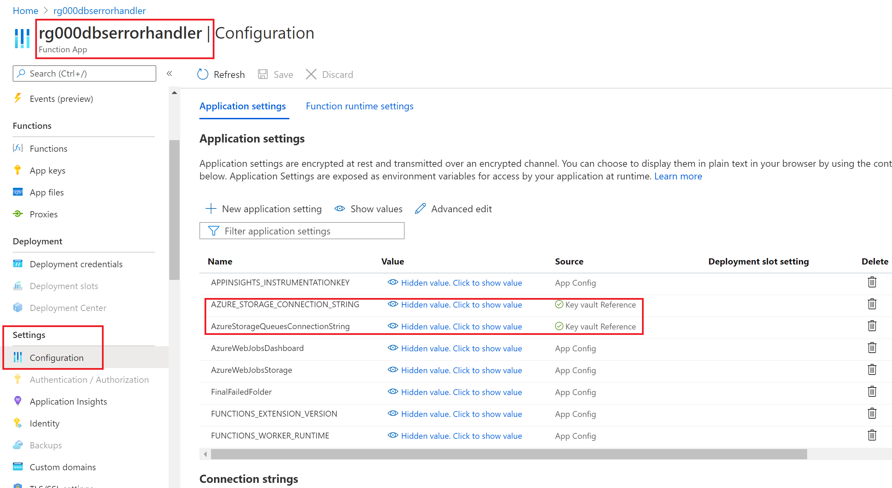
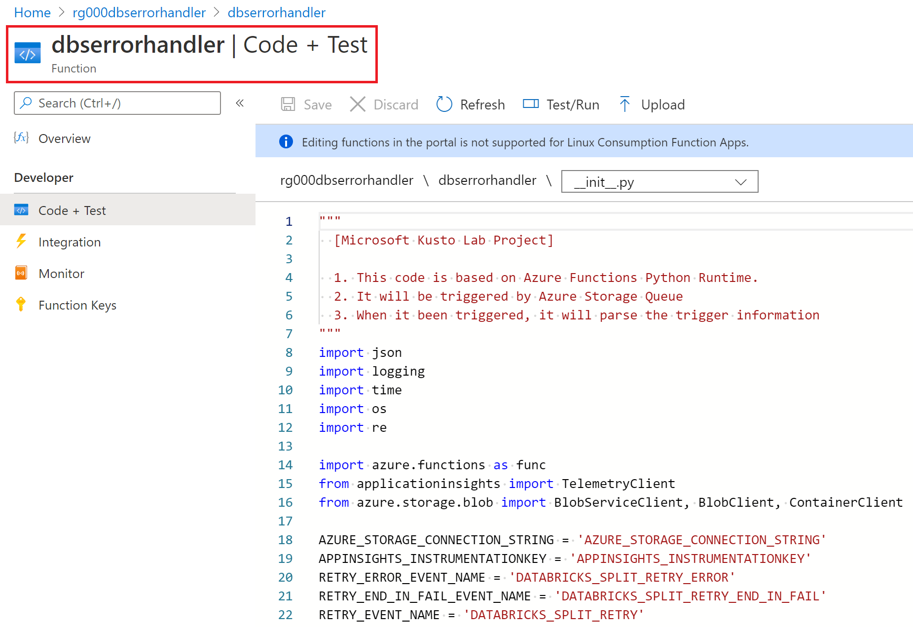
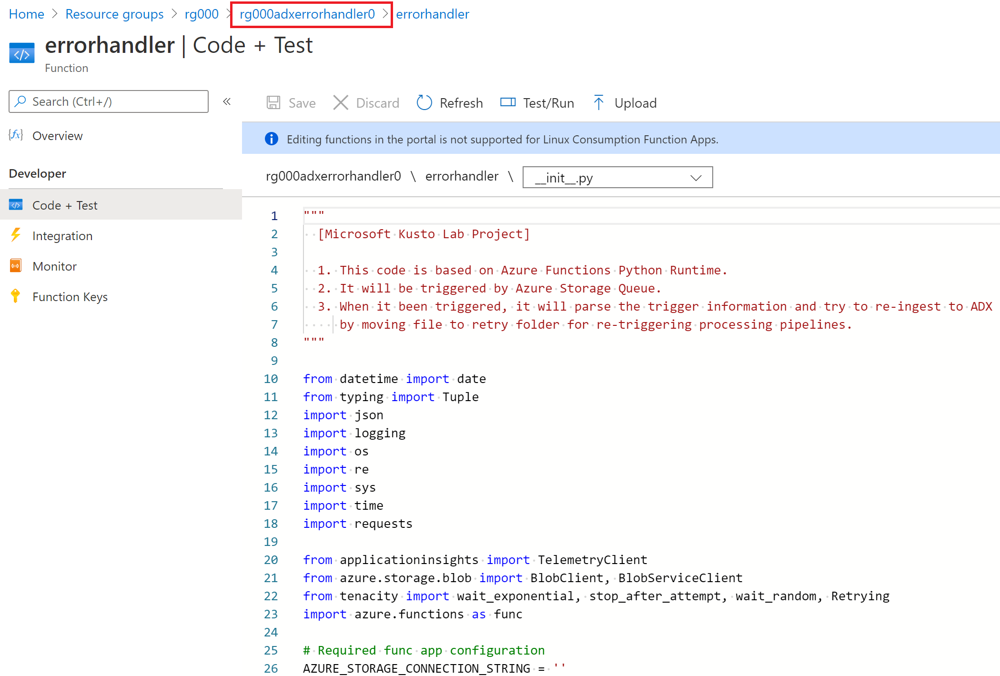

## Module 5 - Add additional Error-Retry logic 

Through previous modules you have successfully implemented a scalable and robust end-to-end data ingestion pipeline. In this module, to increase the system's reliability and resilience,  you will add custom exception retry logics using Azure Functions. You will deploy  __Event Grid__ and two Azure Functions for  __Data Bricks error handling__ and __Data Ingestion Function error handling__.

We aim to provision the light yellow rectangle areas in the following system architecture diagram. 


__Module Goal__  
- Create Exception Handling Azure Functions for [Databricks bad files and bad records.]((https://docs.microsoft.com/en-us/azure/databricks/spark/latest/spark-sql/handling-bad-records)) 
- Create Exception Handling Azure Functions for  Ingestions Function [poison queue](https://docs.microsoft.com/en-us/azure/azure-functions/functions-bindings-storage-queue-trigger?tabs=csharp#poison-messages) .

__Prerequisite__  
- [Provision basic environment in Module 0](Module0.md)
- [Create Databricks services, Jobs, Notebooks in Module 1](Module1.md)
- [Create ADX services, Databases, Tablesin Module 2](Module2.md)
- [Create Ingestion Azure Functions in Module 3](Module3.md)


__Module Preparation__
- Azure Subscription 
- [Powershell Core (version 6.x up) environment](https://docs.microsoft.com/en-us/powershell/scripting/install/installing-powershell?view=powershell-7.1) (_PowerShell runs on [Windows](https://docs.microsoft.com/en-us/powershell/scripting/install/installing-powershell-core-on-windows?view=powershell-7.1), [macOS](https://docs.microsoft.com/en-us/powershell/scripting/install/installing-powershell-core-on-macos?view=powershell-7.1), and [Linux](https://docs.microsoft.com/en-us/powershell/scripting/install/installing-powershell-core-on-linux?view=powershell-7.1) platforms_) 
- [Azure CLI](https://docs.microsoft.com/en-us/cli/azure/install-azure-cli) (_Azure CLI is available to install in Windows, macOS and Linux environments_)
- Scripts provided in this module
  - create-error-try-eventgrid.ps1
  - create-error-handling-functions.ps1
  - deploy-dbserrorhandler-function.ps1
  - deploy-adxingesterrorhandler-function.ps1


__References__
- [Handling bad records and files](https://docs.microsoft.com/en-us/azure/databricks/spark/latest/spark-sql/handling-bad-records)
- [Azure Functions - Poison Queue](https://docs.microsoft.com/en-us/azure/azure-functions/functions-bindings-storage-queue-trigger?tabs=csharp#poison-messages)

---

Make sure you have all the preparation  items ready and let's start.  

#### Step 1: Add Event Grid for Error-Retry
In this step we will use Event Grid to monitor Databricks badrecord/badfile log files and the retry-files for ingestion Azure Function. Following are the configurations in the **_provision-config.json_** file needed for Error-Retry Event Grid. Modify them according to your environment. 

```json
    "EventGrid": {
        "DataBricksErrorHandlingQueueName": "databricks-error-handling-queue",
        "BadRequestsQueueCount": "1",
        "BadRequestsFilters": [{"key": "Subject", "operatorType": "StringContains", "values": ["part-"]}],
        "BadRequestsAdvancedFilters": [{ "key": "data.api", "operatorType": "StringIn", "values": [ "FlushWithClose", "PutBlockList" ]}],
        "IngestionRetryEventFilters": [{ "key": "Subject", "operatorType": "StringEndsWith", "values": [".c000.json"]}],
        "IngestionRetryEventAdvancedFilters": [{ "key": "data.api", "operatorType": "StringIn", "values": [ "FlushWithClose", "PutBlockList" ] }, {"key": "Subject", "operatorType": "StringContains", "values": ["retry"]}]
    }
```

Then  run *create-custom-error-try-eventgrid.ps1* powershell script to setup these Azure resources. After the script finished, you can check the creation result in Azure portal.  

Below image is the topic configuration for  Databricks bad-record log files event.  
  
Below  image is the topic configuration for  ingestion Azure Function retry files event.  
  
Configurations in the red squares are the values we define in the **_provision-config.json_** file. 


#### Step 2: Create Error-Retry Azure Functions services 
In this step we will create 2 additional Azure Functions to add customized error-retry logic in the system. First one is for Databricks bad-files/bad-records handling, second one is for ingestion Azure Function poison-queue. 

Modify the following configuration of the two functions in the **_provision-config.json_** file.


```json
    "dbsErroeHandlerFunction": {
        "FunctionName": "dbserrorhandler",
        "Path": "databrickserrorhandler",
        "TriggerQueueName": "databricks-error-handling-queue",
        "DbserrorhandlefuncTemplatePath": "../Azure/function/FunctionApp.json",
        "DbserrorhandleFuncAppsettingTemplatePath": "../Azure/function/appsettings/DatabricksErrorHandlingFunction.json"
    },
    "adxErroeHandlerFunction": {
        "FunctionName": "adxerrorhandler",
        "IngestionEventQueueCount": 1,
        "FinalFailedContainer": "adx-ingest-retry-end-in-fail",
        "IngestionFunctionName": "ingestionfunc",
        "Path": "adxingesterrorhandler",
        "FunctionFolder": "errorhandler",
        "TriggerQueueName": "adxingest-queue0-poison",
        "AdxerrorhandlefuncTemplatePath": "../Azure/function/ADXIngestErrorHandlingFunction.json"
    },
```

 Run *create-custom-error-handling-functions.ps1* Powershell script to create the two Azure Functions. After running the script,  You can check the 2 Functions in Azure Portal. 

  

Connection string is protected using Azure Key Vault created in Module 0.  
  


#### Step 3: Deploy Code to Error-Retry Azure Functions

Run *deploy-dbserrorhandler-function.ps1* to deploy Databricks bad files/bad records handling code. 

Then run *deploy-adxingesterrorhandler-function.ps1* script to deploy ingestion Azure Function poison-queue handling code. 

After the Powershell scripts finish,  you can check the deployed Function code in the Azure Functions. 
  

  

