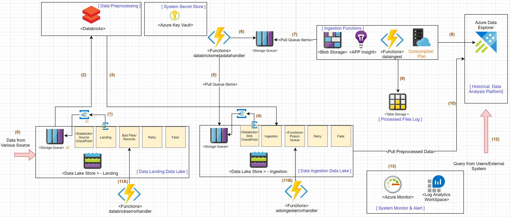
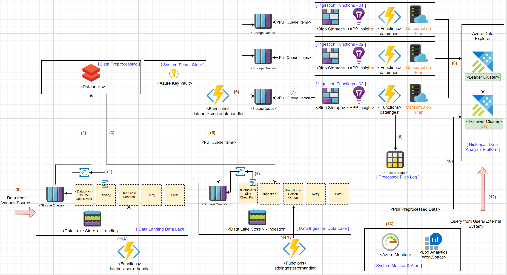

# Big data analytics using Azure Data Explorer and Azure Databricks 

### _A production-proven architecture for analyzing hundreds of terabytes of logs every day_ 


_This Lab will work through an architecture designed to analyze hundreds of terabytes of security logs in production every day. It is a combination of Azure Databricks and Azure Data Explorer; both products well-known for efficiently processing and analyzing massive amounts of data; to implement the solution. You will learn about how to implement the architecture using provided scripts and sample codes. The solution also includes these production features: Status monitor, Exactly-once ingestion checks, Custom error-retry, and  Performance metrics alerts. After finishing the Lab, users will be able to build systems that can handle up to hundreds of terabytes of data with a slight configuration change. This Lab is based on a real-world example of live production systems customers are using today._ 


## Lab Scenario 

You are the Data Platform Architect of an international intelligent data analysis service company. As the company's global business is booming, you want to implement a new system that can collect telemetry data from hundreds of thousands of devices for the growing customers. These devices generate telemetry data 24X7 across multiple continents. Members of your team, including Data analysts and Machine Learning Specialists, are tasked with analyzing data coming in as soon as possible. These telemetry data are collected using combined shared services (e.g., Kafka, Event Hub) to reduce operational cost. After you receive the data, you will need to separate it based on the company and product type and save it in separate data repositories in the data analysis platform. Note: For customer privacy, each data repository has independent access control. 

Also, some data are collected from several third-party companies who use various cloud platforms. They provide you the collected data in small batches every second and it's stored in your Azure data lake.   

## Solution Overview

In this Lab, you will build the solution with the architecture shown below. To reduce the cost of practicing this solution, the architecture is slightly modified to reduce the required computing resources.  We retain most of the key components and critical logic of the original solution, so you can still easily scale-out/up the system to handle hundreds of terabytes. The full solution that processes terabytes of data in production will be covered later.



The architecture is based on the [Claim-Check](https://docs.microsoft.com/en-us/azure/architecture/patterns/claim-check) data processing pattern which allows large volumes of messages to be processed while protecting the message bus and the client from being overwhelmed or slowed down. With the design, data can be cost-effectively processed in high efficiency while providing good resilience to unexpected turbulence.      


### Brief on the core components in this lab -
-  **Data Pre-processor** - The data Pre-processor component processes data in micro-batches and validates the data schema. Then it separates the data based on predefined rules and stores it in the appropriate databases/tables in Azure Data Explorer.

-  **Ingestion Function** - Coordinates the Azure Data Explorer "ingestion from storage" behavior, checks if the data file was previously processed, and decides which database and table the data belongs to.

-  **Databricks** - Create an Apache Spark™ environment in minutes, autoscale, and collaborate on shared projects in an interactive workspace. Azure Databricks supports Python, Scala, R, Java, SQL, and several data science frameworks.

-  **Databricks Metadata Handler** - Parse aggregated checkpoint files (.compact) and reduce the file size to improve processing performance. By default, the files will keep growing; it is essential to clear the historical log so it doesn't become too large to process and impact performance.

-  **Azure Data Explorer(ADX)** - Azure Data Explorer is a fast, fully managed data analytics service for real-time analysis on large volumes of data streaming from applications, websites, IoT devices, etc. It enables users to scale systems quickly to process terabytes of data in minutes, allowing rapid iterations of data exploration to discover relevant insights. 

-  **Azure Function** - Serverless service that can be automatically and flexibly scaled based on workload volume.  


### Key advantages of this architecture
 -  __Protect against heavy loads__ - Queue storage acts as a buffer between a task and a service. It smooths intermittent heavy loads and protects the core system from overloading and being unable to respond.
 -  __Maximize scalability__ - Dynamic addition of queues and services to meet demand. Also, all core components (Azure Functions, Databricks, Azure Data Explorer) support auto-scaling, where the system can dynamically increase or decrease the number of instances as needed. 
 -  __Maximize availability__ - Clients can continue to add data into the data lake even when the service is not available or is not currently processing messages.
- __Control costs__ - The number of service instances deployed only needs to be adequate to meet the average load rather than peak load.

### _What's the difference between the lab and the terabytes workload production system_ 

After finishing the lab, you should be able to get familiar with key components of the architecture. All key services used here support auto-scale, so you can add some auto-scale rules that meet your production workload requirements and are good to go to for most production cases. 

When using the architecture to handle dozens of terabytes of data in production, we modified a few parts to handle the elastic and performance requirements better. They are removed from the lab to reduce the complexity and cost for users. However, it is easy to add them into the architecture. 

The diagram below shows the architecture we used in the project. Two design changes were made compared to the lab architecture. 

-  __Add [leader-follower architecture](https://docs.microsoft.com/en-us/azure/data-explorer/high-concurrency#set-leader-follower-architecture-pattern) in 
Azure Data Explorer__  -    The  ADX follower database feature allows you to attach a database located in a different cluster to your existing cluster. It is useful to segregate computing resources to protect the leader cluster with an additional standalone secondary cluster. 
- __Use multiple Azure Functions consumption plans__ - We added additional Azure Functions consumption plans in order to [scale out faster](https://docs.microsoft.com/en-us/azure/azure-functions/event-driven-scaling#understanding-scaling-behaviors) against bursts of incoming traffic and increase [the available instances](https://docs.microsoft.com/zh-tw/azure/azure-functions/functions-scale#scale). 





## Lab Prerequisites
 
- Azure Subscription 
- [Powershell Core (version 6.x up) environment](https://docs.microsoft.com/en-us/powershell/scripting/install/installing-powershell?view=powershell-7.1) (_PowerShell runs on [Windows](https://docs.microsoft.com/en-us/powershell/scripting/install/installing-powershell-core-on-windows?view=powershell-7.1), [macOS](https://docs.microsoft.com/en-us/powershell/scripting/install/installing-powershell-core-on-macos?view=powershell-7.1), and [Linux](https://docs.microsoft.com/en-us/powershell/scripting/install/installing-powershell-core-on-linux?view=powershell-7.1) platforms_) 
- [Azure CLI](https://docs.microsoft.com/en-us/cli/azure/install-azure-cli) (_Azure CLI is available to install in Windows, macOS and Linux environments_)
 - Basic knowledge on Azure portal

- [Azure Storage Explorer](https://azure.microsoft.com/en-us/features/storage-explorer/)
- Databricks Notebook (data-preprocessor.py)
- Databrick CLI , if you don't have, please follow the below command:
```cmd
pip install databricks-cli
```
- Azure CLI with Databricks extension installed, if you don't have, please follow the below command:
```cmd  
az extension add --name databricks
```
- [Azure Function Core Tools (3.x Version)](https://docs.microsoft.com/en-us/azure/azure-functions/functions-run-local?tabs=windows%2Ccsharp%2Cbash#install-the-azure-functions-core-tools)

- Python > 3.6

----
## Lets get started

[Module 0 - Provision basic environment](LabModules/Module0.md)


[Module 1 - Create Databricks services, Jobs, Notebooks](LabModules/Module1.md) 

[Module 2 - Create ADX services, Databases, Tables](LabModules/Module2.md) 

[Module 3 - Create Ingestion Azure Functions](LabModules/Module3.md) 

[Module 4 - Data Ingestion End to End Testing](LabModules/Module4.md) 

[Module 5 - Add Error Retry Logic](LabModules/Module5.md) 

[Module 6 - Exactly Once Improvement](LabModules/Module6.md) 

[Module 7 - System Observability: Monitor, Alert](LabModules/Module7.md) 


