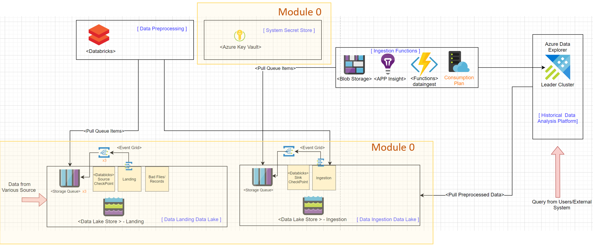
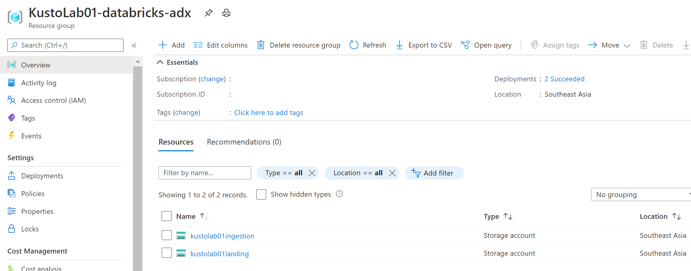
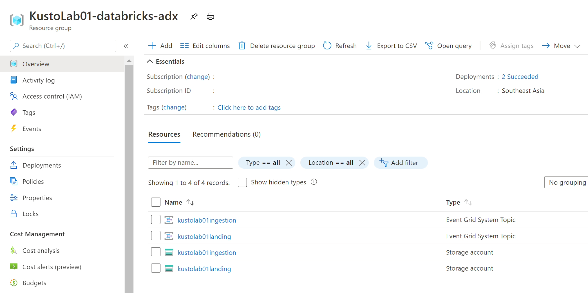
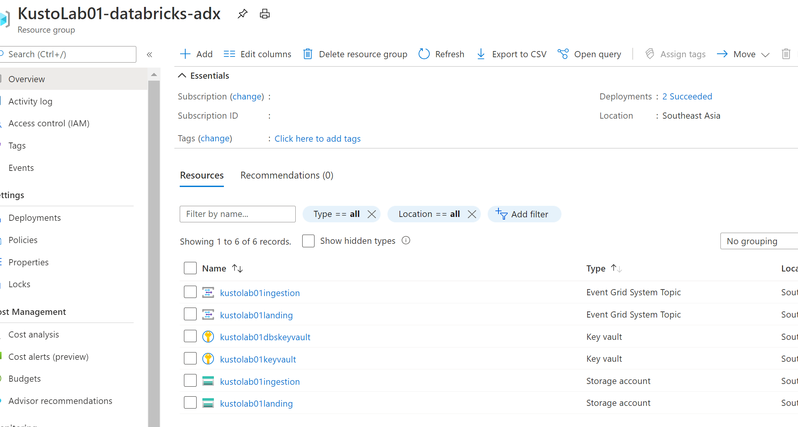
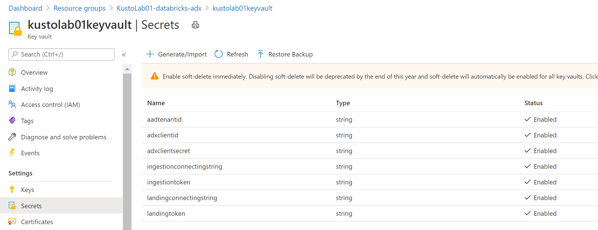

## Module 0 - Provision basic environment

In this module, you will create __Azure Data Lake__, __Event Grid__,  __Azure Storage Queue__ and __Key Vault__ to implement the basic environment of [Claim-Check](https://docs.microsoft.com/en-us/azure/architecture/patterns/claim-check) data processing Pattern. The design pattern allows large messages to be processed while protecting the message bus and the client from being overwhelmed or slowed down. 
This Lab implements the pattern to ensure the system can achieve high throughput and high reliability.   

This module aims to provision the light yellow rectangle areas in the following system architecture diagram. 




__Module Goal__  
- Create Data Landing and Ingestion Data Lake. 
- Create Event Grid, Storage Queue and Key Vault 
- Understand how to use ARM template to deploy resources. 
- When files are landed in Azure Data Lake, the file landed event is stored in Azure Storage Queue

__Module Preparation__

- Azure Subscription 
- [Powershell Core (version 6.x up) environment](https://docs.microsoft.com/en-us/powershell/scripting/install/installing-powershell?view=powershell-7.1) (_PowerShell runs on [Windows](https://docs.microsoft.com/en-us/powershell/scripting/install/installing-powershell-core-on-windows?view=powershell-7.1), [macOS](https://docs.microsoft.com/en-us/powershell/scripting/install/installing-powershell-core-on-macos?view=powershell-7.1), and [Linux](https://docs.microsoft.com/en-us/powershell/scripting/install/installing-powershell-core-on-linux?view=powershell-7.1) platforms_) 
- [Azure CLI](https://docs.microsoft.com/en-us/cli/azure/install-azure-cli) (_Azure CLI is available to install in Windows, macOS and Linux environments_)
- Scripts provided in this module:
    - _create-service-principle.ps1_
    - _get-azure-subscription-info.ps1_
    - _create-basic-infra-datalake.ps1_
    - _create-basic-infra-keyvault.ps1_
    - _create-basic-infra-eventgrid-queue.ps1_
    - _update-key-vault.ps1_

__References__
- [Installing various versions of PowerShell](https://docs.microsoft.com/en-us/powershell/scripting/install/installing-powershell?view=powershell-7.1)
- [Install the Azure CLI](https://docs.microsoft.com/en-us/cli/azure/install-azure-cli)
- [Naming rules and restrictions for Azure resources](https://docs.microsoft.com/en-us/azure/azure-resource-manager/management/resource-name-rules)

Make sure you have all the preparation items ready and let's start .
#### Step 1: Create Data-Landing and Data-Ingestion Data Lake

We will use __PowerShell (Core)__ and __Azure CLI__ to provision required Azure resources. Both of them support Windows, Mac and Linux OS.  <u>All the parameters used in  this Lab's PowerShell script are defined  **_provision-config.json_** file</u>. 

To create Data-Landing and Data-Ingestion Data Lake, you need to provide values for the following parameters in the **_script/config/provision-config.json_** file. Please modify the configuration values according to your needs. 


```json
{
    "DeployClientId":"Your Service Principal ID",
    "DeploySecret":"Your Service Principal Secret",    
    "DeployObjectId":"Your Service Principal Object ID",
    "AzureSubscriptionId":"Your Azure Subscription ID",
    "AzureTenantId":"Your Azure Tenant ID",
    "ResourceGroupName": "Your Azure Resource Group Name",
    "Location": "Your Azure Resource Region",
    "Storage": {
        "LandingDatalakeName":"landing",
        "AccessTier":"Hot",
        "StorageSku":"Standard_LRS",
        "IngestionDatalakeName":"ingestion",
        "FileSystemName": "data",
        "LandingErrorHandleFileSystemName":"final-retry-failed",
        "IngestionRetryEndInFailContainerName":"adx-ingest-retry-end-in-fail",
        "FileSystemNameRootFolder": "telemetry",
        "AzureStorageTargetFolder":"databricks-out",
        "TelemetryLogfileRetentionDays":"7",
        "DatalakeTemplatePath":"../Azure/datalake/EventStorage.json"
    }
}
```
***Note!** _Sample parameter values starting with **Your** must be replaced with values in your environments. Modification of remaining parameters are optional._

***Note!** _You can run **_create-service-principle.ps1_** to create the service principle. Then you can run **_get-azure-subscription-info.ps1_** to get basic information about your Azure subscription._

***Note!** _To prevent automatic generated resource name exceeds the max name length limitation (eg. Azure Storage Account name can has maximum 24 characters), the script will use the first 8 characters of alphanumerics (alphabets and digitals) of Resource Group name as prefix for resources creation_

After updating **_provision-config.json_** file,  run **_create-basic-infra-datalake.ps1_** script to create the two Azure Data Lake storages required in this Lab.

When the script is finished, you can verify the resource creation result in Azure Portal. 



#### Step 2: Create Event Grid & Storage Queue 

In this step, we will create Event Grid & Storage Queue. 


Modify **_provision-config.json_** file. You should modify the configuration values according to your needs. 

```json
    "EventGrid": {
        "LandingEventQueueName": "landingeventqueue",
        "LandingEventQueueCount": "3",
        "IngestionEventQueueName":"adxingest-queue",
        "IngestionEventQueueCount":"1",
        "IngestionRetryEventFilters": [{ "key": "Subject", "operatorType": "StringEndsWith", "values": ["0.c000.json","1.c000.json","2.c000.json","3.c000.json","4.c000.json","5.c000.json"]}],
        "IngestionRetryEventAdvancedFilters": [{ "key": "data.api", "operatorType": "StringIn", "values": [ "FlushWithClose", "PutBlockList" ] }, {"key": "Subject", "operatorType": "StringContains", "values": ["retry"]}],
        "EventTypeCreate": "Microsoft.Storage.BlobCreated",
        "EventTypeRenamed": "Microsoft.Storage.BlobRenamed",
        "LandingEventFilters":[{"key": "Subject", "operatorType": "StringEndsWith", "values": ["0.json.gz"]},{"key": "Subject", "operatorType": "StringEndsWith", "values": ["1.json.gz"]},{"key": "Subject", "operatorType": "StringEndsWith", "values": ["2.json.gz"]}],
        "IngestionEventFilters": [{"key": "Subject", "operatorType": "StringEndsWith", "values": [".json"]}],
        "EventGridTemplatePath":"../Azure/event-trigger/StorageEventTrigger.json"
    }
```
***Note!** _We set "LandingEventQueueCount" to 3 to  create 3 Azure Storage Queues and Event Grid Subscriptions, so in next Module we can run multiple Spark scheduler pools in Databricks and provide better resource utilization efficiency ._ 


After updating _provision-config.json_ file,  run **_create-basic-infra-eventgrid-queue.ps1_** script. 

When the script is finished, you can verify the resource creation result in Azure Portal. 


#### Step 3: Create Key Vault


Modify **_provision-config.json_** file. You should modify the configuration values according to your needs. 
```json
    "KeyVault": {
        "KeyVaultName": "keyvault",
        "DatabricksKeyVaultName": "dbskeyvault",
        "SoftDelete": false
    }
```
After updating file, run **_create-basic-infra-keyvault.ps1_** script.

When the script is finished, you can verify the resource creation result in Azure Portal. 


#### Step 4: Update Key Vault Values

Run **_update-key-vault.ps1_** script to store the system's key access secret in Azure Key Vault so the application can access them in a secure way.  

When the script is finished, you can verify the resource creation result in Azure Portal. 

*** Note: You need to [add access policy for your account](https://docs.microsoft.com/en-us/azure/key-vault/general/assign-access-policy-portal) before your can view the secret content. 


The key vault values include: 


name|definition
---|---
adxclientid| Azure Data Explorer Service Principle ID    
adxclientsecret|Azure Data Explorer Service Principle Secret    
aadtenantid| Azure AD ID
ingestiontoken| Ingest Data Lake Token 
landingtoken| Landing Data Lake Token
landingconnectingstring| Landing Data Lake connection string 
ingestionconnectingstring| Ingestion Data Lake connection string 
  
