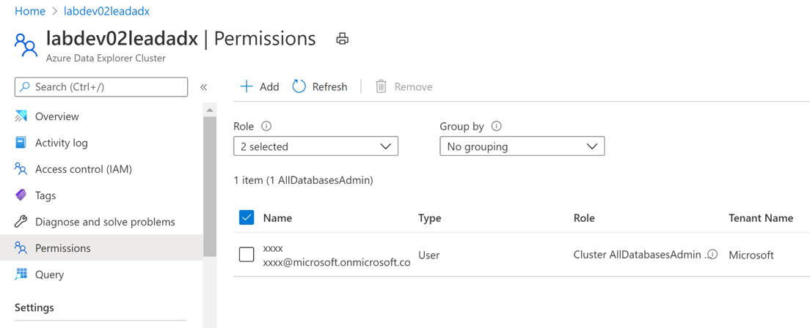

## Module 2 - Create ADX services, Databases, Tables


In this module, you will create __Azure Data Explorer__ services, then provision databases and tables inside it.  

We aim to provision the light yellow rectangle areas in the following system architecture diagram. 


   
__Module Goal__  
- Create Azure Data Explorer.
- Create database and tables in Azure Data
Explorer.  

__Module Preparation__
- Azure Subscription 
- [Powershell Core (version 6.x up) environment](https://docs.microsoft.com/en-us/powershell/scripting/install/installing-powershell?view=powershell-7.1) (_PowerShell runs on [Windows](https://docs.microsoft.com/en-us/powershell/scripting/install/installing-powershell-core-on-windows?view=powershell-7.1), [macOS](https://docs.microsoft.com/en-us/powershell/scripting/install/installing-powershell-core-on-macos?view=powershell-7.1), and [Linux](https://docs.microsoft.com/en-us/powershell/scripting/install/installing-powershell-core-on-linux?view=powershell-7.1) platforms_) 
- [Azure CLI](https://docs.microsoft.com/en-us/cli/azure/install-azure-cli) (_Azure CLI is available to install in Windows, macOS and Linux environments_)
- Scripts provided in this module
    - _create-adx-and-db-tables.ps1_
- Python > 3.6
- pip for python


__References__
- [Azure Data Explorer data ingestion overview](https://docs.microsoft.com/en-us/azure/data-explorer/ingest-data-overview)
- [Kusto query language](https://docs.microsoft.com/en-us/azure/data-explorer/kusto/query/)
- [Getting started with Kusto](https://docs.microsoft.com/en-us/azure/data-explorer/kusto/concepts/)
- [Azure Data Explorer Python SDK](https://docs.microsoft.com/en-us/azure/data-explorer/kusto/api/python/kusto-python-client-library)

---

Make sure you have all the preparation items ready and let's start. 

#### Step 1: Provision Azure DataExplorer
We will use _create-adx-and-db-tables.ps1_ script to create Azure DataExplorer and database/table in Azure DataExplorer.


We need to setup the following additional parameters in the _provision-config.json_ file. You should modify the configuration values according to your needs. 

```json
{
    "ADX": {
        "ClusterName": "testadx",
        "ClusterSkuName": "Standard_D11_v2",
        "ClusterSkuTier": "Standard",
        "ClusterSkuCapacity": 2,
        "AvaliabilityZones":["1"],
        "ADXTemplatePath": "../Azure/ADX/ADX.json",
        "TableRetentionDays": "100",
        "DatabaseNum":100
    },
}
```

Then run _create-adx-and-db-tables.ps1_ script to create Azure Data Explorer and database/tables.

***Note!** _Creating Azure Data Explorer will take a couple minutes._

After the creation is done, you can verify the creation result in Azure Portal.

#### Step 2: Check Azure Data Explorer Creation Result
Login  [Azure portal](https://portal.azure.com/) and click "resource group" and check if the resource group has been created. 


Then check if Azure Data Explorer is created successfully in the resource group.

In Azure Data Explorer, check if databases have also been created as configured.


In the next step, you will grant yourself the access to  ADX databases.
#### Step 3: Add yourself to all database admin.
1. Click permissions in ADX menu.


2. Choose roles with right access permission.


3. Click "Select principals" and find desired user or service principal. 


4. Save the settings and it will take effect immediately. 


5. Check the new permissions setting.


In the next step, we will practice how to query data in ADX.
#### Step 4: Query ADX Data.
1. Select a database and click query.
   


2. Click the cluster name and use the following Kusto query to count total databases.
   
```kql
.show databases | count
```


3. Click one of the tables to check its table schema.


4. Click CO2 table and run the following query to count records in the table.
   

    ```kql
    CO2 | count
    ```


