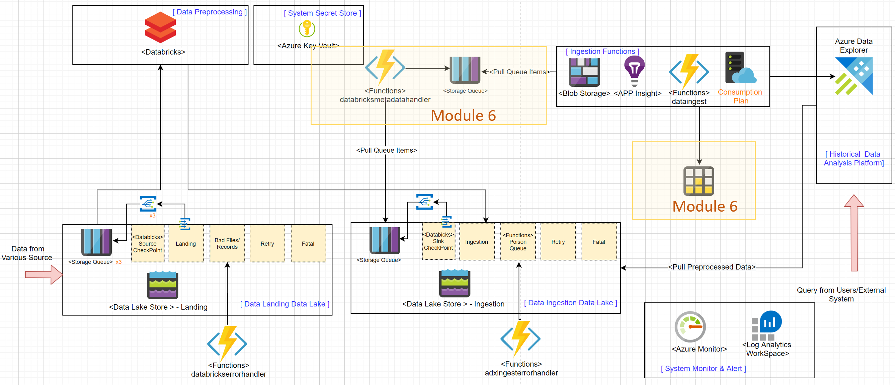
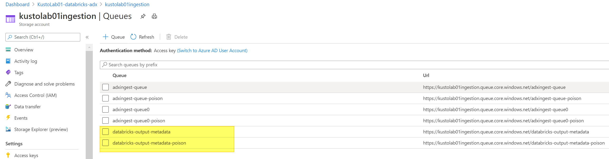
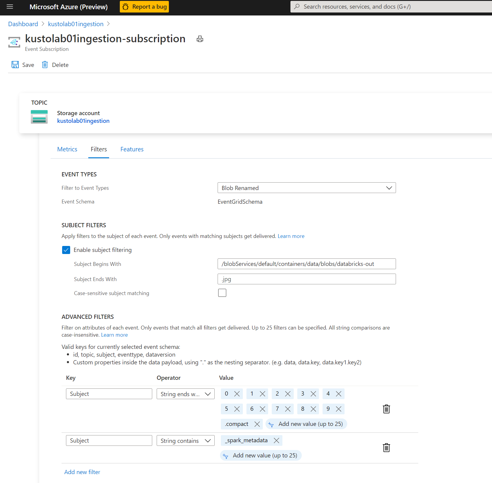
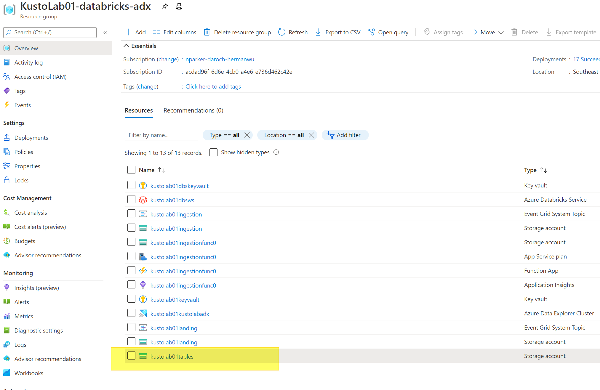
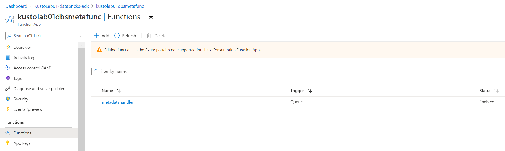
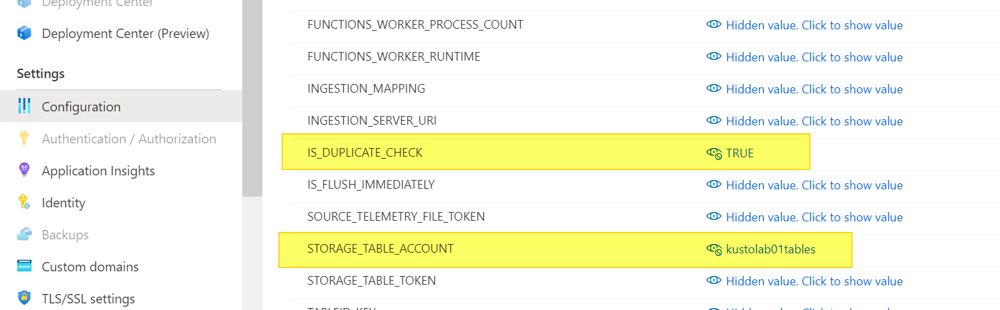
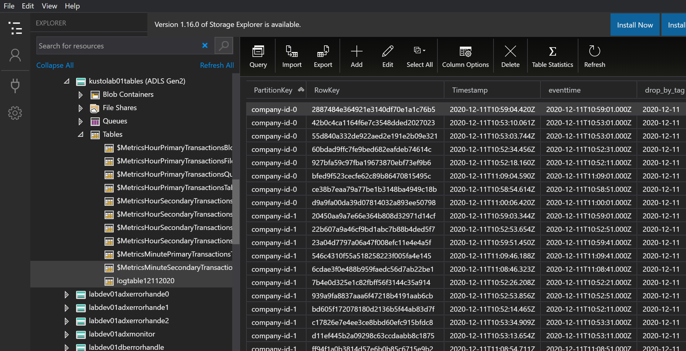

## Module 6 Exactly Once Improvement

In this module, to prevent the rare cases that duplicated data are ingested, you will add a new Azure function to parse Databricks metadata files and enhance ADX ingestion functions to avoid duplicated data ingestion.   

We aim to provision the light yellow rectangle areas in the following system architecture diagram. 




__Module Goal__  
- Deploy Databricks parser metadata functions. 
- Enhance ADX Ingestion functions to check duplicated files. 

__Module Preparation__
- Azure Subscription 
- [Powershell Core (version 6.x up) environment](https://docs.microsoft.com/en-us/powershell/scripting/install/installing-powershell?view=powershell-7.1) (_PowerShell runs on [Windows](https://docs.microsoft.com/en-us/powershell/scripting/install/installing-powershell-core-on-windows?view=powershell-7.1), [macOS](https://docs.microsoft.com/en-us/powershell/scripting/install/installing-powershell-core-on-macos?view=powershell-7.1), and [Linux](https://docs.microsoft.com/en-us/powershell/scripting/install/installing-powershell-core-on-linux?view=powershell-7.1) platforms_) 
- [Azure CLI](https://docs.microsoft.com/en-us/cli/azure/install-azure-cli) (_Azure CLI is available to install in Windows, macOS and Linux environments_)
- Scripts provided in this module:
    - _update-ingestion-event-grid-for-dbsmetadata.ps1_
    - _create-table-storage-and-update-keyvault.ps1_
    - _create-dbsmetadatahandler-function.ps1_
    - _deploy-dbsmetadatahandler-function.ps1_
    - _ingestion-function-enable-duplicate-check.ps1_
- [Azure Functions Core tools](https://github.com/Azure/azure-functions-core-tools)

---
Make sure you have all the preparation  items ready and let's start. 

__References__
- [Exactly Once Mechanism in Apache Spark](https://medium.com/@Iqbalkhattra85/exactly-once-mechanism-in-spark-structured-streaming-7a27d8423560)
- [Streaming with File Sink: Problems with recovery if you change checkpoint or output directories](https://kb.databricks.com/streaming/file-sink-streaming.html)
g

#### Step 1: Update Event Grid and Storage Queue

We need to change the Event Grid setting and create a new storage queue for the new Databricks MetaData handler Function. Modify following additional parameters in the **_provision-config.json_** file. You should modify the configuration values according to your needs. 


```json
{
    "EventGrid": {
        "DBSMetadataQueueName": "databricks-output-metadata",
        "DBSMetadataQueueCount": "1",
        "DBSMetadataEventFilters": [{"key": "Subject", "operatorType": "StringEndsWith", "values": ["0","1","2","3","4","5","6","7","8","9",".compact"]}, {"key": "Subject", "operatorType": "StringContains", "values": ["_spark_metadata"]}],
        "EventGridTemplatePath":"../Azure/event-trigger/StorageEventTrigger.json"
    }
}
```
Then run **_update-ingestion-event-grid-for-dbsmetadata.ps1_** to update Event-Grid and create a Storage Queue. 


When the script is finished, you can verify the resource creation result in Azure Portal. 

You will find two new storage queues.


There is a new filter that will monitor Databricks metadata files in Event Grid .  



#### Step 2: Deploy File Name Check Table storage 

We will create a table storage to track each ingested file and use the record to prevent ingesting the same file twice. Please update **_provision-config.json_** file and modify the Table Storage configuration values according to your needs. 

```json 
{
        "TableStorageAccountName":"tables",
        "TableStorageSku":"Standard_RAGRS",
        "TableTemplatePath":"../Azure/datalake/StorageTable.son"
}
```
 Then run **_create-table-storage-and-update-keyvault.ps1_** with parameters. 

 When the script is finished, you can verify the resource creation result in Azure Portal. 

#### Step 3: Deploy Databricks MetaData handler  

In this step we will deploy the new Databricks metadata handler Azure functions.  Setup the following additional parameters in the **_provision-config.json_** file. You should modify the configuration values according to your needs. 

```json
{
 "Functions": {
        "dbsMetadataHandlerFunction": {
            "FunctionName": "dbsmetafunc",
            "Path": "databricksmetadatahandler",
            "FunctionFolder": "metadatahandler",
            "MetadataHandlerfuncTemplatePath": "../Azure/function/FunctionApp.json",
            "MetadataHandlerfuncSettingsTemplatePath": "../Azure/function/appsettings/dbsmetafunc.json",
            "IngestionSasTokenName": "ingestiontoken"
        }
    }
}
```

Run **_create-dbsmetadatahandler-function.ps1_** to create  Azure Functions resource for Databricks meta-data handling functions.  

Then run **_deploy-dbsmetadatahandler-function.ps1_** to deploy the Azure function code to the created Azure Function resources. 

 When the script is finished, you can verify the resource creation result in Azure Portal. 



#### Step 4: Update Ingestion Azure Functions

By now we have deployed a new Databricks metadata handler function which will make sure we only pass the files from a **completed** Databricks data process batch to the downstream ingestion pipeline. 

The next step is to enable the duplicated file check in Ingestion Azure Functions. The Ingestion Azure Function we deployed in module 3 already has the feature to log processed file name and prevent the file with the same name been ingested again. To enable the feature, we need to set the "**IS_DUPLICATE_CHECK**" setting in the function's configuration to TRUE and set "**STORAGE_TABLE_ACCOUNT**" to the name of the table storage created in Step 2 .  You can modify it through Azure Portal or using **_ingestion-function-enable-duplicate-check.ps1_** script. 




#### Step 5: Test Data Ingestion

Follow the steps listed in Module 4, you can test if the updated data ingestion pipeline works correctly.

You can also use Azure Storage Explorer to check if the file name check table in table storage has logged all the ingested files. 




