## Module 7 -  System Observability: Monitor, Alert

In this module, you will use [Azure Monitor](https://docs.microsoft.com/en-us/azure/azure-monitor/overview) to monitor the operation and status of Databricks. Also you will setup altering rule in Azure Monitor to monitor key ingestion metrics of the  data ingestion pipeline. When the alerting criterion are reached, system administrator will receive notification mail.

We aim to provision the light yellow rectangle areas in the following system architecture diagram. 

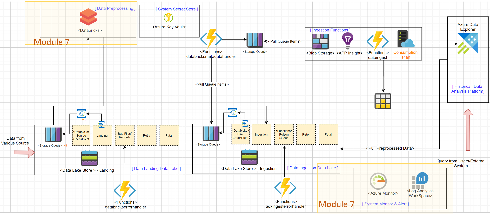


__Module Goal__  
- Config and send Databricks operation metric to Azure Monitor. 
- Deploy dashboard to visualize the metrics of Databricks data processing status.
- Setup altering criteria for key components in Azure Monitor, and send E-mail notification when the criteria is met 

__Module Preparation__
- Azure Subscription 
- Finish all steps in Module 6
- [Powershell Core (version 6.x up) environment](https://docs.microsoft.com/en-us/powershell/scripting/install/installing-powershell?view=powershell-7.1) (_PowerShell runs on [Windows](https://docs.microsoft.com/en-us/powershell/scripting/install/installing-powershell-core-on-windows?view=powershell-7.1), [macOS](https://docs.microsoft.com/en-us/powershell/scripting/install/installing-powershell-core-on-macos?view=powershell-7.1), and [Linux](https://docs.microsoft.com/en-us/powershell/scripting/install/installing-powershell-core-on-linux?view=powershell-7.1) platforms_) 
- [Azure CLI](https://docs.microsoft.com/en-us/cli/azure/install-azure-cli) (_Azure CLI is available to install in Windows, macOS and Linux environments_)
- Scripts provided in this module:
    - _create-log-analytics.ps1_
    - _configure-log-analytics-for-databricks-job.ps1_
    - _create-databricks-job.ps1_
    - _create-azure-dashboard.ps1_
    - _create-azure-alert.ps1_
- Databrick CLI , if you don't have, please follow the below command:
```cmd
pip install databricks-cli
```
- Azure CLI with Databricks extension installed, if you don't have, please follow the below command:
```cmd  
az extension add --name databricks
```

__References__
- [Azure Monitor Logs overview](https://docs.microsoft.com/en-us/azure/azure-monitor/platform/data-platform-logs)
- [Monitoring Azure Databricks in an Azure Log Analytics Workspace](https://github.com/mspnp/spark-monitoring/blob/master/README.md)
- [Databricks secret scope with Azure Key Vault back-end](https://docs.microsoft.com/en-us/azure/databricks/security/secrets/secret-scopes#azure-key-vault-backed-scopes)
- [Overview of Log Analytics in Azure Monitor](https://docs.microsoft.com/en-us/azure/azure-monitor/log-query/log-analytics-overview)
- [Quickstart: Create a dashboard in the Azure portal by using an ARM template](https://docs.microsoft.com/en-us/azure/azure-portal/quick-create-template)
- [Create, view, and manage log alerts using Azure Monitor](https://docs.microsoft.com/zh-tw/azure//azure-monitor/platform/alerts-log)
---

Make sure you have all the preparation  items ready and let's start. 


#### Step 1: Provision Azure Log Analytics WorkSpace

We will need to provision Azure Log Analytics Service so Databricks can send its logs. Modify the parameters in the **_provision-config.json_** file. You should update the configuration values according to your needs.    


```json
{
    "LogAnalytics": {
        "WorkspaceName": "-dbs-log-analytics",
        "ServiceTier":"PerGB2018",
        "SecretScope": "logsecretscope",
        "SecretScopeKeyWorkspaceId": "databrickslogworkspaceid",
        "SecretScopeKeyWorkspaceKey": "databrickslogworkspacekey",
        "ARMTemplatePath": "../Azure/loganalytics/LogAnalytics.json"
    }
}
```
**_*Note:_** _You have to provide a value for <u>SecretScope</u>_  

Then run **_create-log-analytics.ps1_** to provision Azure LogAnalytics Services. 

After the creation is done, you can verify the creation result in Azure Portal.

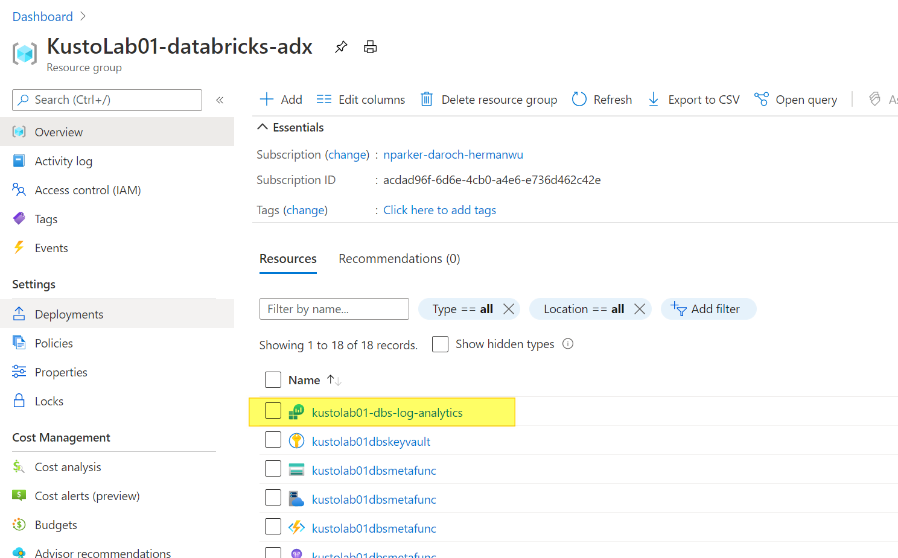

#### Step 2: Configure Databricks secret scope with Azure Key Vault back-end

In this step, we will create  [Databricks secret scope with Azure Key Vault back-end](https://docs.microsoft.com/en-us/azure/databricks/security/secrets/secret-scopes#azure-key-vault-backed-scopes) and then add the Log Analytics workspace information into Azure Key Vault so Databricks can access this information in a secure way. 

Run **_create-db-secret-kv-backend.ps1_** to create Databricks secret-scope with Azure Key Vault back-end. 

**_*Note:_** _You have to login using an Azure account that can create service principle, so we can't use the Service Principle created in Module 0_  

Then run **_update-db-log-analytics-key-vault.ps1_** to add Log Analytics connection information in Key Vault so that DataBricks-LogAnalytics connector can access them in a secure way. 

After the update is done, you can verify the creation result in Azure Portal. First you need to add access policy for your Azure account. 


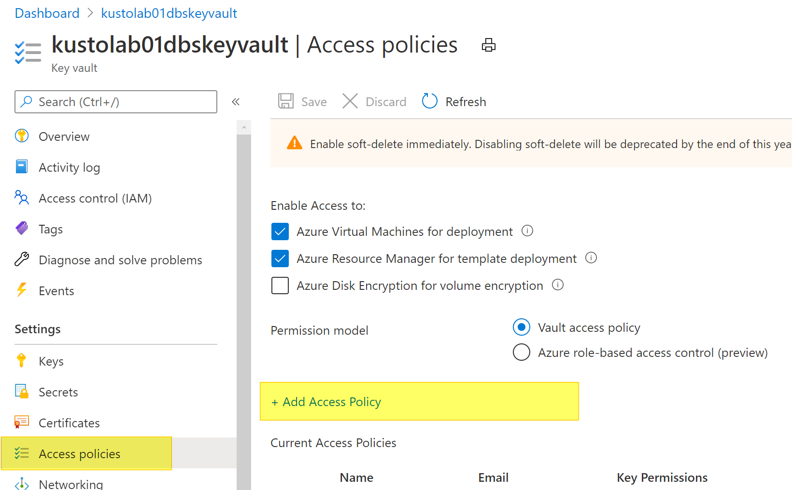

After that your can check the created key vault items. 

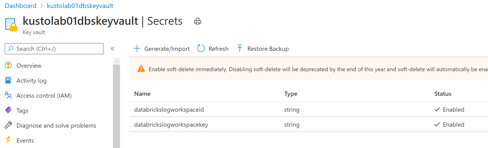


#### Step 3: Deploy Databricks Monitor Library

In this step, we will send application logs and metrics from Azure Databricks to a Log Analytics workspace. It uses the Azure [Databricks Monitoring Library](https://github.com/mspnp/spark-monitoring), which is available on GitHub.

Modify the following parameters in the **_provision-config.json_** file. You should update the configuration values according to your needs.    

```json
{
    "LogAnalytics": {
        "SparkMonitoringScript": "../Azure/databricks-monitoring/spark-monitoring.sh"
    }
}
```

Then run **_configure-log-analytics-for-databricks-job.ps1_** to deploy the script that can send Databricks log data to Azure Log Analytics. 


Finally run **_create-databricks-job.ps1_** to create a new Databricks job. The new job will use the script we just deployed and send it's execution status log to Azure Log Analytics. . 


After the script is done, you can verify the creation of the new Databricks Job in Databricks Workspace.  

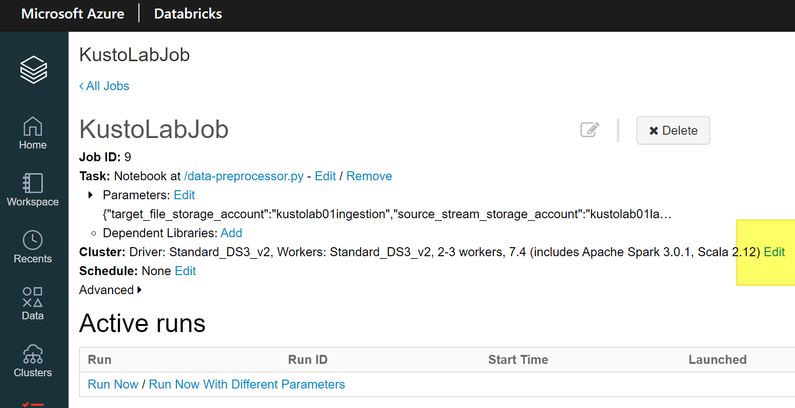

Click the "Edit" link in Cluster setting and check the Environment Variables, you should find the Log Analytics Workspace setting there. 

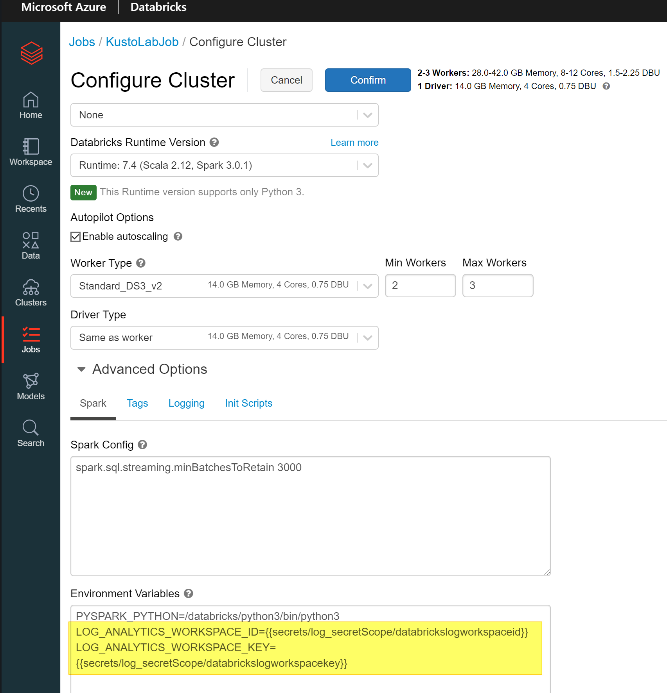

Now you have finished the configuration for [Databricks Monitoring Library](https://github.com/mspnp/spark-monitoring). You can start the new Databrick Jobs and run  **_ingest-telemetry-data.ps1_** again to ingest data. We can monitor the ingestion status using Azure Dashboard in the next step. 


#### Step 4: Create Azure Dashboard 

In this step we will deploy a predefined metric dashboard to monitor Databricks and key system services. Modify the following parameters in the **_provision-config.json_** file. You should update the configuration values according to your needs.  


```json
   "AzureMonitor":{
        "Dashboard":{
            "MainDashboardName":"-ingestion-dashboard",
            "MainDashboardTemplatePath": "../Azure/dashboard/main_dashboard.json",
            "DBSDashboardName":"-dbs-dashboard",
            "DBSDashboardTemplatePath": "../Azure/dashboard/dbs_dashboard.json"
        }
    }
```

Then run **_create-azure-dashboard.ps1_** to provision Azure Dashboard. 

When the script is finished, open Azure Portal and select dashboard. 
. 
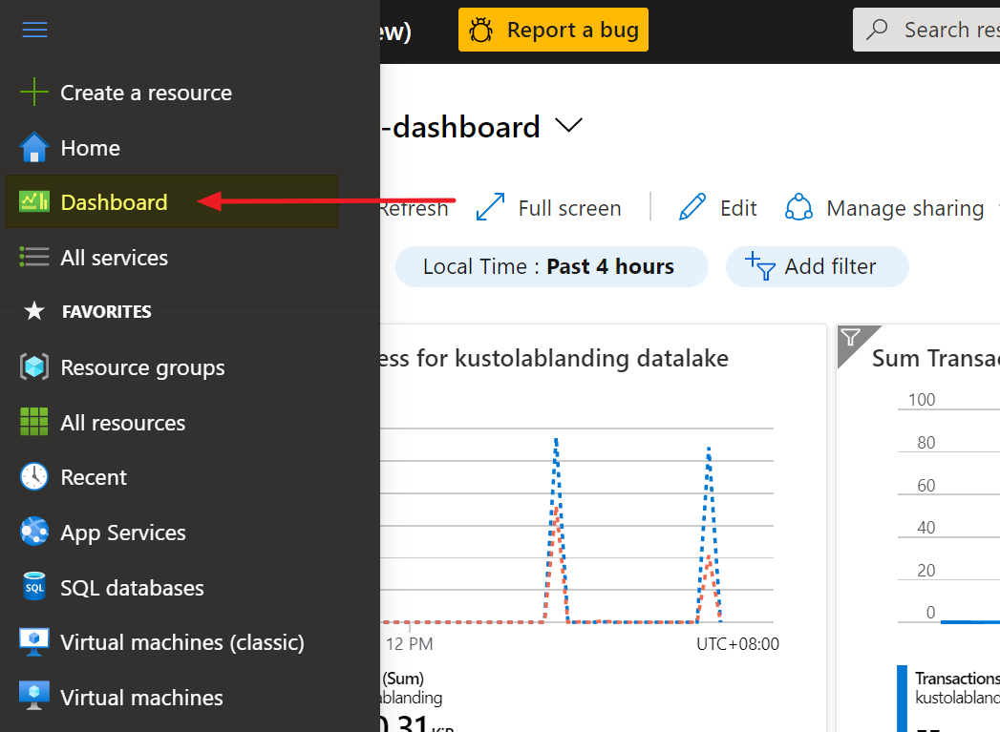

Then choose "Browse all dashboards"
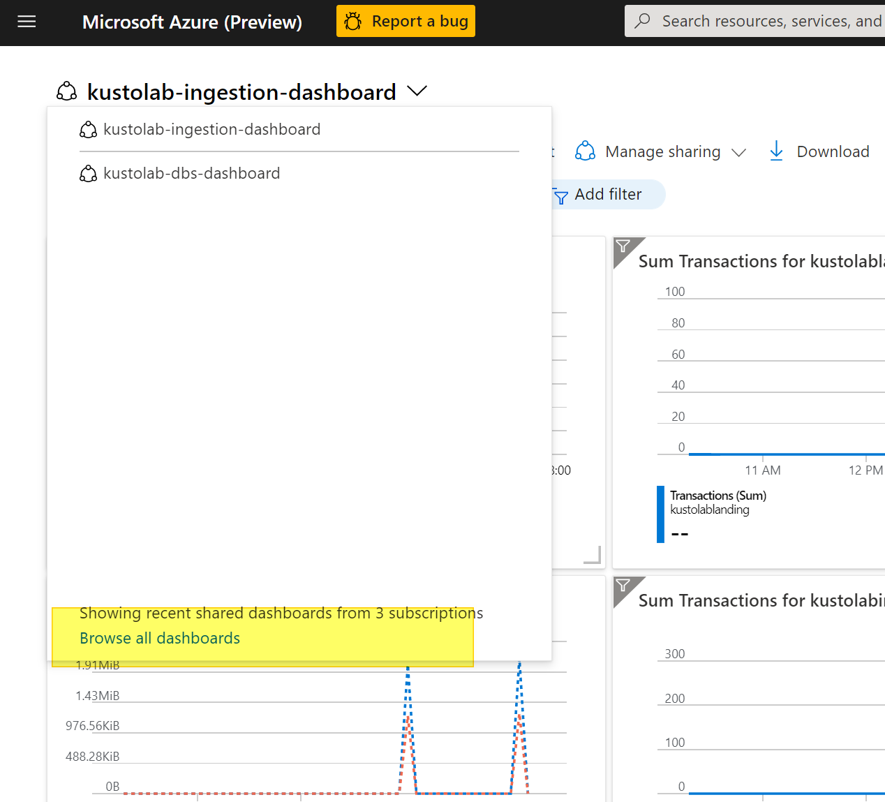

Select "Shared dashboards" and you will find there are two dashboards which have names that end with "dbs-dashboard" and "ingestion-dashboard" 
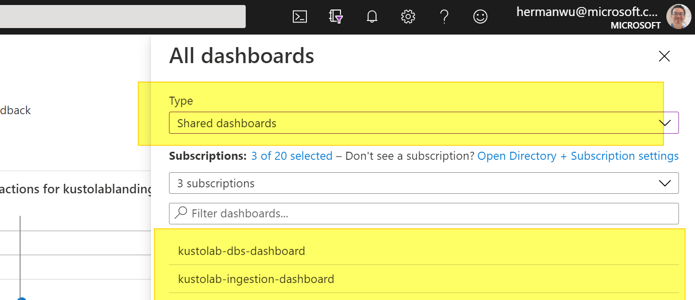

The Dashboard with name end with "dbs-dashboard" will show performance metric for Databricks.
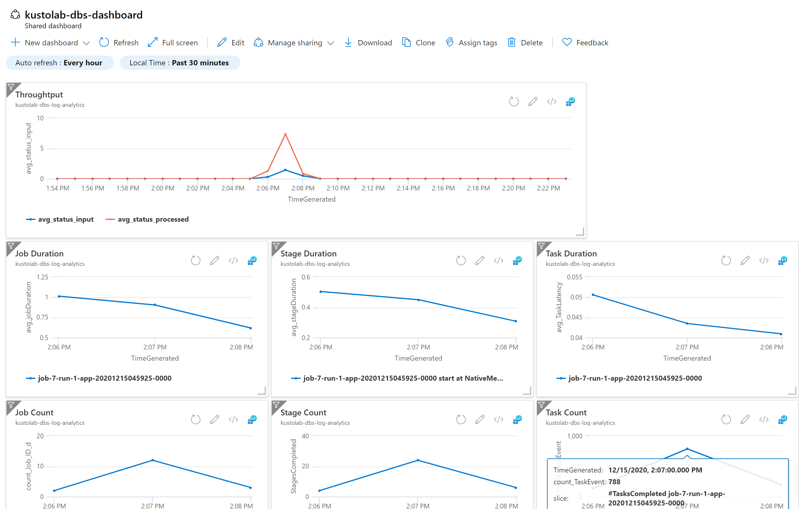

The Dashboard with name end with "ingestion-dashboard" will show performance metric for other Azure Services such as Azure Data Explore, Azure Functions, Azure Data Lake.
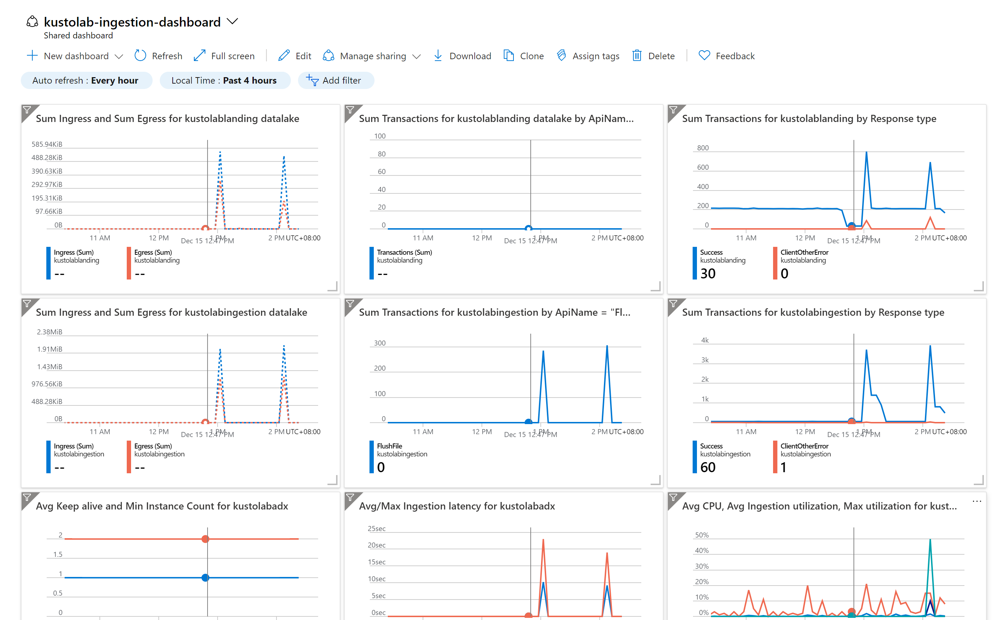

#### Step 5: Create Azure Alert

In this steps, we will create some metric alters to help us get notified when there is something wrong. So we can quickly react to the incidents.  
 Modify the following parameters in the **_provision-config.json_** file. You should updated the configuration values according to your needs.  

```json
{
    "AzureMonitor":{
        "ActionGroup":{
            "Name":"-kusto-lab-action-group",
            "ShortName":"kusto-lab",
            "EmailGroupName":"email_alert_team",
            "EmailRecipients":"abc@microsoft.com",
            "AzureOpsGenieAPIUrl":"https://api.opsgenie.com/v1/json/azure",
            "AzureOpsGenieAPIKey":"None",
            "ActionGroupTemplatePath": "../Azure/alert/ActionGroups.json"
        },
        "FunctionAlert":{
            "ErrorHandlingAlertTriggerThreshold":1, 
            "ErrorHandlingFuncAlertTemplatePath": "../Azure/alert/ErrorHandlingFuncAlert.json",
            "IngestionFuncNotTriggerThreshold": 1,     
            "IngestionFuncAlertTemplatePath": "../Azure/alert/IngestionFuncAlert.json"            
        },
        "ADXAlert":{
            "ADXClusterHighCPUThreshold":70,       
            "ADXClusterHighIngestionLatencyThreshold":180,             
            "ADXClusterHighIngestionUtilThreshold":70,
            "ADXAlertTemplatePath": "../Azure/alert/ADXAlert.json"
        },
        "DatalakeAlert":{
            "DatalakeLowIngressThreshold":1048576,
            "DatalakeAlertTemplatePath": "../Azure/alert/DatalakeAlert.json"
        },
        "EventGridAlert":{       
            "EventGridLowPublishedThreshold":0,
            "EventGridHighDroppedThreshold":1,
            "EventGridAlertTemplatePath": "../Azure/alert/EventGridAlert.json"
        }
}
```

Then run **_create-azure-alert.ps1_** to create altering rule based on metrics in _Azure Data Explorer, Azure Data Lake, Azure Event Grid, Ingestion Function, Databricks-ErrorHandler Functions and ADX-Ingestion-ErrorHandler Functions_. These altering rules will monitor the performance metrics of these key services. 

When the script is finished, open [Azure Monitor](https://ms.portal.azure.com/#blade/Microsoft_Azure_Monitoring/AzureMonitoringBrowseBlade/overview), select Alerts and you will see current altering status.  
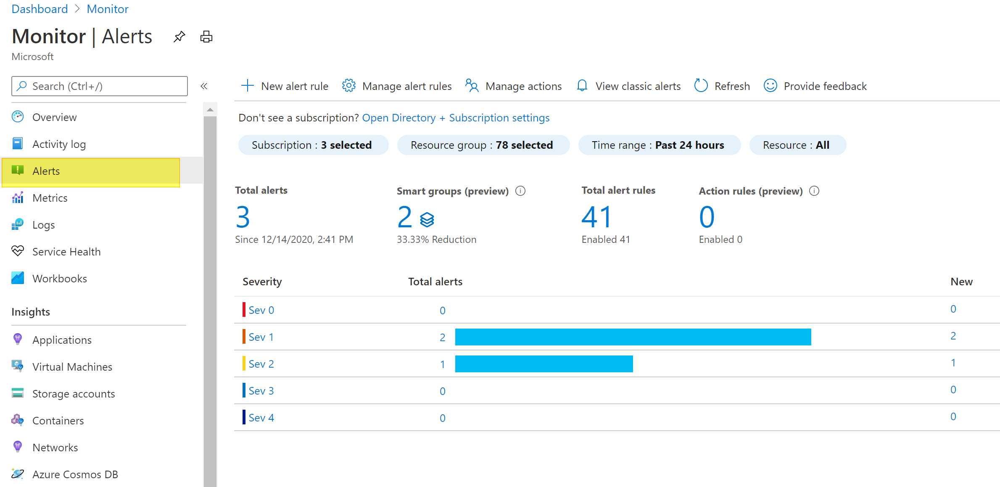

Select Manage alter rules, and you will see all the altering rules in the system. You can modify them based on your environment. 
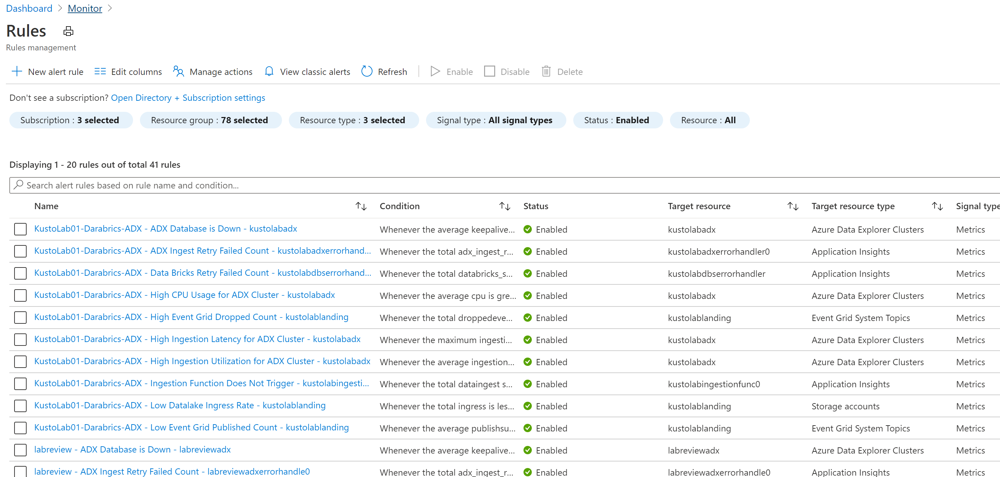


