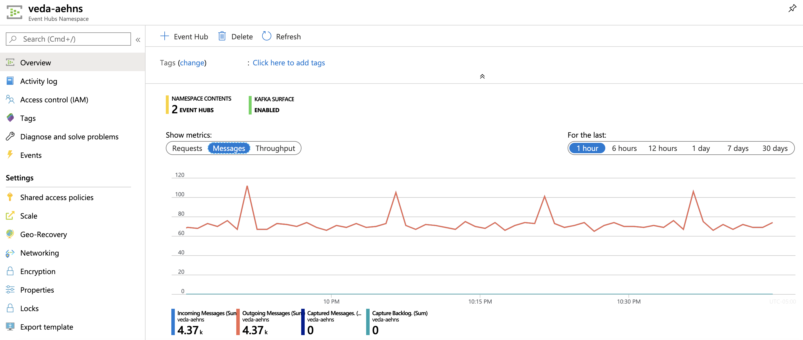
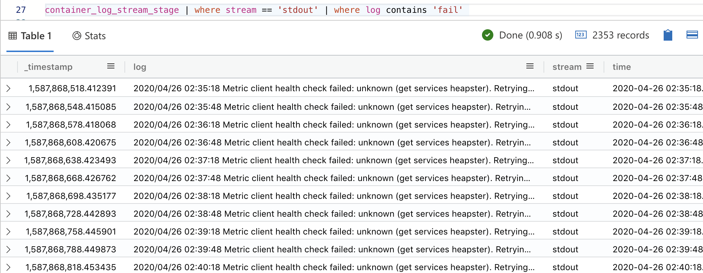

# 1.0. About
This is a scripted lab (all instructions provided) that details how to integrate Kubernetes container logs into Azure Data Explorer as a straight-through process for log analytics.  This lab is meant to be merely instructional; Our Azure strategic, turnkey offering for container log analytics is [Azure Monitor with container insights](https://docs.microsoft.com/en-us/azure/azure-monitor/insights/container-insights-overview).  

# 2.0. Setup
Its important that you have your environment created exactly as detailed in the [landing page](../README.md) for this lab.

# 3.0. Architecture and details

### 3.0.1. Kubernetes container logs location
All logs are available on the nodes at /var/log/containers/\*.log

### 3.0.2. Ingestion pipeline
We will leverage Fluent Bit to tail logs (tail input plugin) in /var/log/containers/\*.log and forward the logs to Azure Event Hub (Kafka head) with the Kafka output plugin of Fluent-Bit.


### 3.0.3. Fluent-Bit log collection and forwarding - demystified

Fluent-Bit log collection and forwarding as described pictorially above, is achieved by creating a namespace, and deploying Fluent-Bit as an application on the cluster.  It creates a pod per node.  In the input plugin section of the Fluent-Bit config map, we need to supply the directory to tail (/var/log/containers/\*), parser plugin to use (optional, the author has used docker parser provided by Fluent Bit) and an output plugin - we will use Kafka here (leverages librdkafka).  Deploying the Fluent-Bit daemonset config launches fluent-bit in the pods and starts collection and forwarding.

<br>
The following is a sample kubernetes container log ingested from event hub-

```
{
	"@timestamp": 1587865531.621533,
	"log": "I0426 01:45:31.621412       1 healthcheck.go:235] Not saving endpoints for unknown healthcheck \"kube-system/kube-dns\"\n",
	"stream": "stderr",
	"time": "2020-04-26T01:45:31.621533009Z",
	"kubernetes": {
		"pod_name": "kube-proxy-47r94",
		"namespace_name": "kube-system",
		"pod_id": "bbe9915a-0f32-XXX-87ce-cb6695c9c780",
		"labels": {
			"component": "kube-proxy",
			"controller-revision-hash": "8699d8fdd",
			"pod-template-generation": "1",
			"tier": "node"
		},
		"annotations": {
			"aks.microsoft.com/release-time": "seconds:1587750333 nanos:367301620 "
		},
		"host": "aks-agentpool-11258432-vmss000002",
		"container_name": "kube-proxy",
		"docker_id": "783444abfb0c04095e41b628dXXXX22863c66ed20eedaa9c8ff2b",
		"container_hash": "mcr.microsoft.com/oss/kubernetes/hyperkube@sha256:4903a86f5a64bXXXX976f9320cc2995334c9a294e9df7ab5d16a1"
	}
}

```

### 3.0.4. Fluent-Bit docs

General:
https://docs.fluentbit.io/manual/installation/kubernetes

For Kafka:
https://github.com/fluent/fluent-bit-kubernetes-logging

# 4.0. Lab

## 4.0.1. Create an Azure Data Explorer table and json mapping

### 4.0.1.1. Launch the ADX Web UI
Navigate to your ADX cluster on the portal and launch the Azure Data Explorer web UI as follows:


### 4.0.1.2. Create a table for the container logs

Click on the database on the left navigation and then to the query editor and paste the script below and run it.

```
// Create table
.create table ['container_log_stream_stage']  (['_timestamp']:real, ['log']:string, ['stream']:string, ['time']:datetime, ['kubernetes_pod_name']:string, ['kubernetes_namespace_name']:string, ['kubernetes_pod_id']:guid, ['kubernetes_labels_component']:string, ['kubernetes_labels_controller-revision-hash']:string, ['kubernetes_labels_pod-template-generation']:int, ['kubernetes_labels_tier']:string, ['kubernetes_annotations_aks_microsoft_com_release-time']:string, ['kubernetes_host']:string, ['kubernetes_container_name']:string, ['kubernetes_docker_id']:string, ['kubernetes_container_hash']:string)

```


### 4.0.1.3. Create a mapping reference
Next create the mapping reference - this helps parse the incoming logs into the ADX table.

```
// Create mapping
.create table ['container_log_stream_stage'] ingestion json mapping 'container_log_stream_stage_mapping' '[{"column":"_timestamp","path":"$.@timestamp","datatype":"real"},{"column":"log","path":"$.log","datatype":"string"},{"column":"stream","path":"$.stream","datatype":"string"},{"column":"time","path":"$.time","datatype":"datetime"},{"column":"kubernetes_pod_name","path":"$.kubernetes.pod_name","datatype":"string"},{"column":"kubernetes_namespace_name","path":"$.kubernetes.namespace_name","datatype":"string"},{"column":"kubernetes_pod_id","path":"$.kubernetes.pod_id","datatype":"guid"},{"column":"kubernetes_labels_component","path":"$.kubernetes.labels.component","datatype":"string"},{"column":"kubernetes_labels_controller-revision-hash","path":"$.kubernetes.labels.controller-revision-hash","datatype":"string"},{"column":"kubernetes_labels_pod-template-generation","path":"$.kubernetes.labels.pod-template-generation","datatype":"int"},{"column":"kubernetes_labels_tier","path":"$.kubernetes.labels.tier","datatype":"string"},{"column":"kubernetes_annotations_aks_microsoft_com_release-time","path":"$.kubernetes.annotations.aks.microsoft.com/release-time","datatype":"string"},{"column":"kubernetes_host","path":"$.kubernetes.host","datatype":"string"},{"column":"kubernetes_container_name","path":"$.kubernetes.container_name","datatype":"string"},{"column":"kubernetes_docker_id","path":"$.kubernetes.docker_id","datatype":"string"},{"column":"kubernetes_container_hash","path":"$.kubernetes.container_hash","datatype":"string"}]'
```

### 4.0.2. Create an Azure Data Explorer - Data Ingestion Connection

Navigate to your ADX cluster on the portal and click on your database.  In the author's example - logs_db.<br>
This opens up a UI that lists "Data Ingestion" on the left navigation bar.<br>
Select the same and set up a connection from the Azure Event hub topic - container-log-topic to the table from 


### 4.0.2. Download fluent-bit logging configuration templates and update

#### 4.0.2.1. Download config map
Download the config map that you will edit next<br>
[fluent-bit-configmap.yaml](conf/fluent-bit-configmap.yaml)

### 4.0.2.2. Edit the config map, OUTPUT section, to reflect your event hub details
Replace with your event hub details and save.  There are rdkafka.* conf that you can tune for performance later, once you get a minimum viable pipeline working.

```
  output-kafka.conf: |
    [OUTPUT]
        Name        kafka
        Match       *
        Brokers     YOUR_AZURE_EVENT_HUB_NAMESPACE.servicebus.windows.net:9093
        Topics      YOUR_AZURE_EVENT_HUB
        Retry_Limit    2
        rdkafka.security.protocol SASL_SSL
        rdkafka.sasl.mechanism PLAIN
        rdkafka.sasl.username $ConnectionString
        rdkafka.sasl.password YOUR_AZURE_EVENT_HUB_NAMESPACE_PRIMARY_CONNECTION_STRING
```

### 4.0.2.3. A look at ther entire config map

This is just FYI. There are rdkafka.* conf that you can tune for performance later, once you get a minimum viable pipeline working.

```
apiVersion: v1
kind: ConfigMap
metadata:
  name: fluent-bit-config
  namespace: logging
  labels:
    k8s-app: fluent-bit
data:
  # Configuration files: server, input, filters and output
  # ======================================================
  fluent-bit.conf: |
    [SERVICE]
        Flush         1
        Log_Level     info
        Daemon        off
        Parsers_File  parsers.conf
        HTTP_Server   On
        HTTP_Listen   0.0.0.0
        HTTP_Port     2020


    @INCLUDE input-kubernetes.conf
    @INCLUDE filter-kubernetes.conf
    @INCLUDE output-kafka.conf


  input-kubernetes.conf: |
    [INPUT]
        Name              tail
        Tag               kube.*
        Path              /var/log/containers/*.log
        Parser            docker
        DB                /var/log/flb_kube.db
        Mem_Buf_Limit     5MB
        Skip_Long_Lines   On
        Refresh_Interval  10


   filter-kubernetes.conf: |
    [FILTER]
        Name                kubernetes
        Match               kube.*
        Kube_URL            https://kubernetes.default.svc:443
        Kube_CA_File        /var/run/secrets/kubernetes.io/serviceaccount/ca.crt
        Kube_Token_File     /var/run/secrets/kubernetes.io/serviceaccount/token
        Kube_Tag_Prefix     kube.var.log.containers.
        Merge_Log           On
        Merge_Log_Key       log_processed
        K8S-Logging.Parser  On
        K8S-Logging.Exclude Off


  output-kafka.conf: |
    [OUTPUT]
        Name        kafka
        Match       *
        Brokers     YOUR_AZURE_EVENT_HUB_NAMESPACE.servicebus.windows.net:9093
        Topics      YOUR_AZURE_EVENT_HUB
        Retry_Limit    2
        rdkafka.security.protocol SASL_SSL
        rdkafka.sasl.mechanism PLAIN
        rdkafka.sasl.username $ConnectionString
        rdkafka.sasl.password YOUR_AZURE_EVENT_HUB_NAMESPACE_PRIMARY_CONNECTION_STRING
        rdkafka.ssl.sa.location /usr/lib/ssl/certs/
.......

    [PARSER]
        Name        docker
        Format      json
        Time_Key    time
        Time_Format %Y-%m-%dT%H:%M:%S.%L
        Time_Keep   On


```

The entire file has not been displayed for brevity.

### 4.0.3. Configure fluent-bit logging

Switch to you CLI, ensure you are logged in as detailed [here](https://github.com/Azure/azure-kusto-labs/tree/master/k8s-container-log-analytics/fluent-bit#42-cli-tools-install), with AKS CLI utils installed.

#### 4.0.3.1. Create a namespace for the logging

```
kubectl create namespace logging
```
Validate...

```
kubectl get namespaces

# This is the author's output:
NAME              STATUS   AGE
default           Active   2d2h
kube-node-lease   Active   2d2h
kube-public       Active   2d2h
kube-system       Active   2d2h
logging           Active   23h
```
If you see the logging namespace, we are good to with this step

#### 4.0.3.2. Create the service account 

```
kubectl create -f https://raw.githubusercontent.com/fluent/fluent-bit-kubernetes-logging/master/fluent-bit-service-account.yaml
```

#### 4.0.3.3. Create the role 
```
kubectl create -f https://raw.githubusercontent.com/fluent/fluent-bit-kubernetes-logging/master/fluent-bit-role.yaml
```

#### 4.0.3.4. Create the role binding 
```
kubectl create -f https://raw.githubusercontent.com/fluent/fluent-bit-kubernetes-logging/master/fluent-bit-role-binding.yaml
```

#### 4.0.3.5. Create the configmap 
```
kubectl create -f fluent-bit-configmap.yaml
```

#### 4.0.3.6. Create the daemonset 
```
kubectl create -f fluent-bit-ds.yaml
```

#### 4.0.3.7. Validate if daemonset is created
```
kubectl get ds --all-namespaces
```
We should see fluent-bit - this is what we created in 4.0.3.6 - open the file and study it.<br>
The following is the author's output-
```
kubectl get ds --all-namespaces
NAMESPACE     NAME                       DESIRED   CURRENT   READY   UP-TO-DATE   AVAILABLE   NODE SELECTOR                 AGE
kube-system   azure-cni-networkmonitor   3         3         3       3            3           beta.kubernetes.io/os=linux   2d2h
kube-system   azure-ip-masq-agent        3         3         3       3            3           beta.kubernetes.io/os=linux   2d2h
kube-system   kube-proxy                 3         3         3       3            3           beta.kubernetes.io/os=linux   2d2h
kube-system   omsagent                   3         3         3       3            3           beta.kubernetes.io/os=linux   2d2h
logging       fluent-bit                 3         3         3       3            3           <none>                        23h
```

#### 4.0.3.8. Validate if Fluent-Bit logging pods  are created
```
kubectl get pods -n logging
```
The following is the author's output-
```
kubectl get pods -n logging
NAME               READY   STATUS    RESTARTS   AGE
fluent-bit-2sbzv   1/1     Running   0          23h
fluent-bit-hj2q8   1/1     Running   0          23h
fluent-bit-zjwbm   1/1     Running   0          23h
```

#### 4.0.3.9. Check the logging pods' resource footprint
```
kubectl top pods -n logging
```
The following is the author's output-
```
kubectl top pods -n logging
NAME               CPU(cores)   MEMORY(bytes)   
fluent-bit-2sbzv   1m           30Mi            
fluent-bit-hj2q8   1m           30Mi            
fluent-bit-zjwbm   2m           30Mi  
```

#### 4.0.3.10. Lets look at a pod's logs
Grab the name of a pod from the command below-
```
kubectl get pods -n logging
```

Now lets get the pod's logs-
```
kubectl logs REPLACE_WITH_YOUR_POD_NAME -n logging
```

The following is the author's output-
```
kubectl logs fluent-bit-2sbzv -n logging
Fluent Bit v1.3.11
Copyright (C) Treasure Data

[2020/04/25 21:23:32] [ info] [storage] version=1.0.3, initializing...
[2020/04/25 21:23:32] [ info] [storage] in-memory
[2020/04/25 21:23:32] [ info] [storage] normal synchronization mode, checksum disabled, max_chunks_up=128
[2020/04/25 21:23:32] [ info] [engine] started (pid=1)
[2020/04/25 21:23:32] [error] [out_kafka] cannot configure 'ssl.sa.location' property
[2020/04/25 21:23:32] [ info] [out_kafka] brokers='veda-aehns.servicebus.windows.net:9093' topics='container-log-topic'
[2020/04/25 21:23:32] [ info] [filter_kube] https=1 host=kubernetes.default.svc port=443
[2020/04/25 21:23:32] [ info] [filter_kube] local POD info OK
[2020/04/25 21:23:32] [ info] [filter_kube] testing connectivity with API server...
[2020/04/25 21:23:37] [ info] [filter_kube] API server connectivity OK
[2020/04/25 21:23:37] [ info] [http_server] listen iface=0.0.0.0 tcp_port=2020
[2020/04/25 21:23:37] [ info] [sp] stream processor started

```

Now lets switch to Azure Event Hub for activity, and see if the logs make it to Azure Data Explorer.

## 5.0. Log Integration
We built the end to end pipeline in section 4.  Now lets look at the results.

### 5.0.1. Lets review traffic in Azure Event Hub, in the portal
Switch to Azure Event Hub, in the portal, and look at the traffic in the namespace and in the event hub.<br>
The following is the traffic in the author's instance.




### 5.0.2. Lets review ingestion into Azure Data Explorer
Switch to Azure Data Explorer Web UI and run the query below to check traffic.<br>
```
container_log_stream_stage
| count
```
This is the author's output.  Please allow about 5 minutes from when the setup was complete to start seeing activity.  There will be sparse activity because nothing else is running on AKS.


Check for any ingestion failures-
```
.show ingestion failures | where Table == 'container_log_stream_stage'
```

## 6.0. Log Analytics

There is a lot that can be done in terms of log analytics.  The KQL samples below are basic and merely a primer.

### 6.0.1. Schema of the logs
Run the command below-
```
container_log_stream_stage | getschema 
```

Notice the columns..


### 6.0.2. Sample the logs
Run the command below-
```
container_log_stream_stage | sample 5
```


### 6.0.3. Column "stream" appears interesting, lets check for distinct values
Run the command below-
```
container_log_stream_stage | distinct stream
```


### 6.0.4. Lets check for distinct pod names
Run the command below-
```
container_log_stream_stage
| distinct kubernetes_pod_name
```


### 6.0.5. Lets check for distinct namespaces
Run the command below-
```
container_log_stream_stage
| distinct kubernetes_namespace_name
```


### 6.0.6. Lets check for distinct combos by host
Run the command below-
```
container_log_stream_stage
| distinct kubernetes_host, kubernetes_pod_id, kubernetes_pod_name, kubernetes_docker_id
| order by kubernetes_host asc
```


### 6.0.7. Lets check for error counts by host
Run the command below-
```
container_log_stream_stage | where stream == 'stderr' | summarize count() by stream, kubernetes_host | project-away stream
```


### 6.0.8. Lets check for error counts by host and render as piechart
Run the command below-
```
container_log_stream_stage | where stream == 'stderr' | summarize count() by stream, kubernetes_host | project-away stream
| render piechart 
```


### 6.0.9. Lets do a text search
Run the command below-
```
container_log_stream_stage | where stream == 'stdout' | where log contains 'fail'
```



### 6.0.10. Lets chart errors by host in bins of 1 hour
Run the command below-
```
container_log_stream_stage | where stream == 'stderr' | summarize count() by kubernetes_host,bin(['time'],1h)
| render timechart
```


## 7.0. Log Analytics Dashboard
This is a **challenge**<br>
Navigate in your browser to preview.dataexplorer.azure.com and create a dashboard leveraging the queries above.<br>

## 8.0. Next
This concludes the lab.  <br>
If you wish to try out the next lab, proceed to the same.<br>
Otherwise, dont forget to delete the resources you created.


