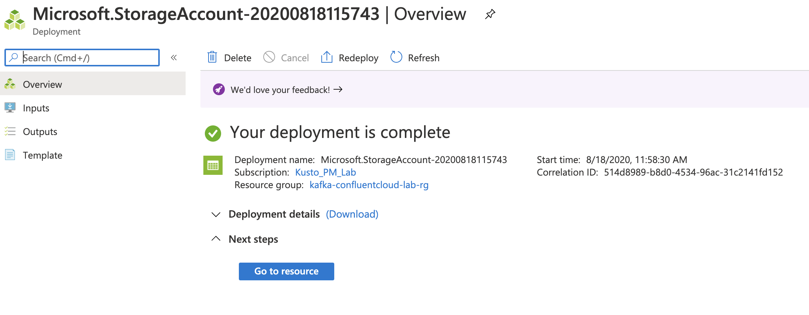
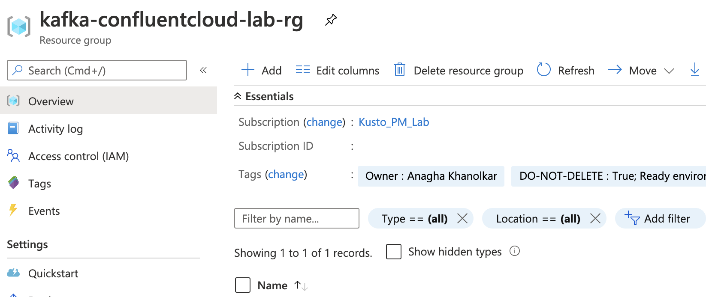
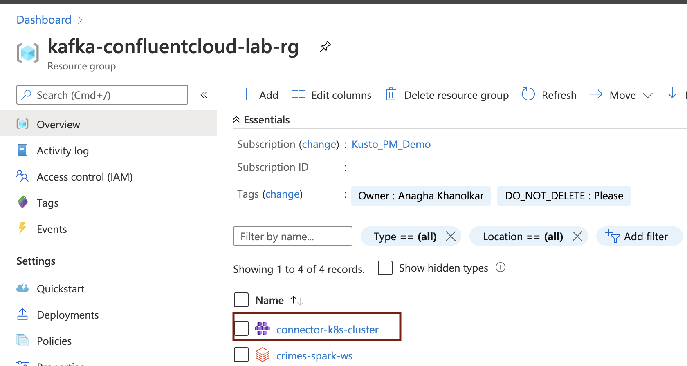
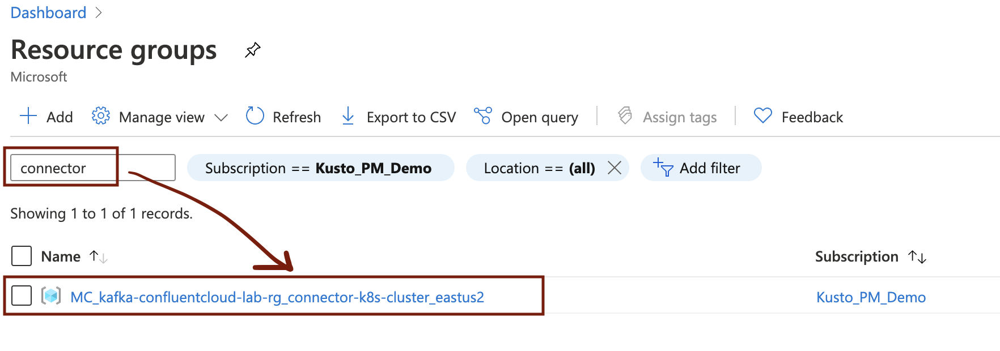
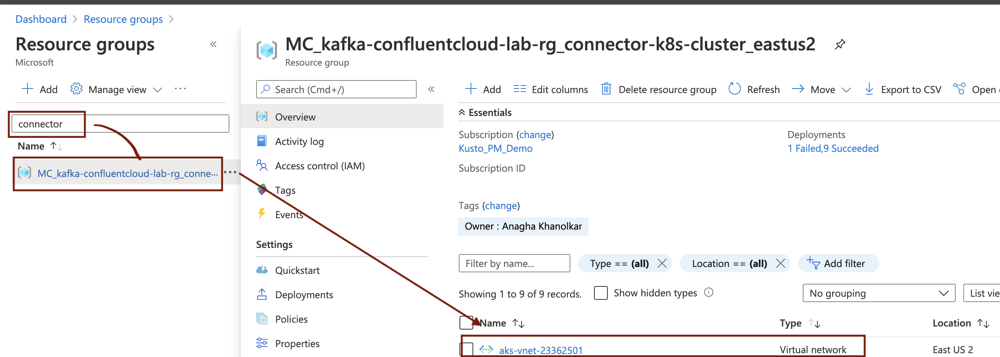
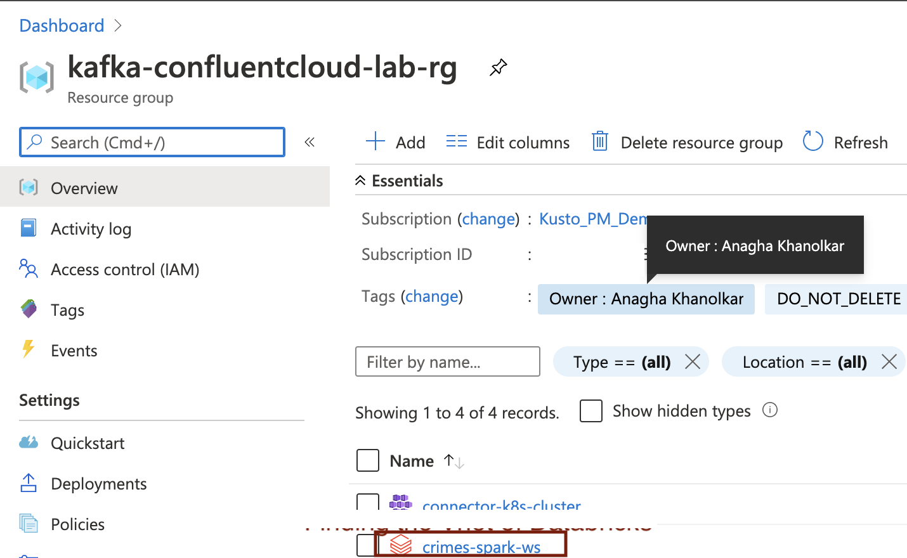
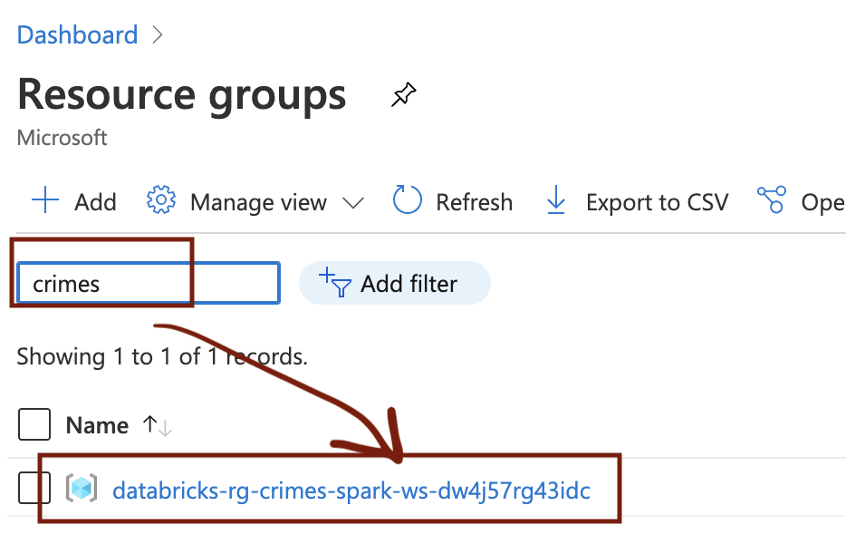
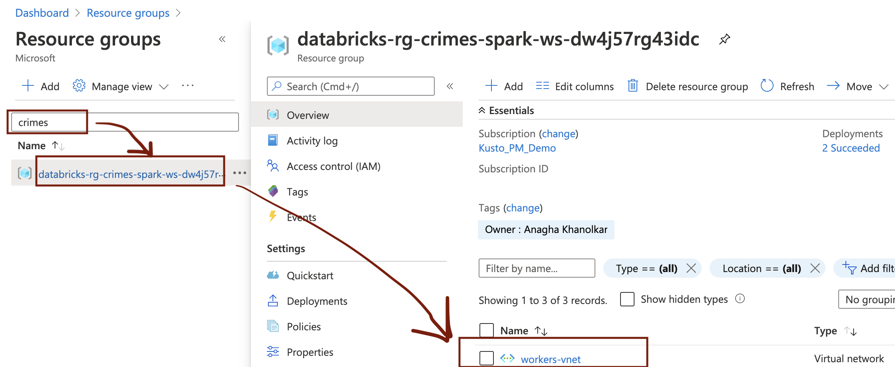

# About

This module features provisioning of the following resources: 
[1. An Azure Resource Group](1-foundational-resources.md#1-provision-an-azure-resource-group)  
[2. An Azure Storage Account](1-foundational-resources.md#2-provision-an-azure-storage-account)  
[3. An Azure Databricks Workspace and Cluster](1-foundational-resources.md#3-provision-an-databricks-workspace-and-cluster)  
[4. An Azure Kubernetes Service Cluster](1-foundational-resources.md#4-provision-an-azure-kubernetes-service-cluster)  
[5. Virtual Network peering configuration(1-foundational-resources.md#5-configure-virtual-network-peering)  
[6. An Azure Active Directory Service Principal]() 

## 1. Provision an Azure Resource Group

An Azure resource group is a logical container for your Azure resources for the lab.  Follow the steps below to provision an Azure resource group 

 
 

 

 
 

 

 
 

 

 
 

 

 
 

 

## 2. Provision an Azure Storage Account

We will need an Azure storage account to download a public dataset, and transform it for use in the lab.  We will need three storage containers, one for downloading, one for raw data and one for curated data.  Follow the screenshots below to provision the storage account and containers.

### Provision the account

 
 

 

 
 

 

 
 

 

 
 

 

 
 

 

 
 

 

 
 

 

 
 

 

### Provision storage containers

 
 

 

 
 

 

 
 

 

 
 

 

### Capture storage account key for use in the lab

 
 

 

 
 

 

## 3. Provision an Databricks Workspace and Cluster
We will use Spark on Azure Databricks to produce to Kafka some data.  Follow the steps below to provision an Azure Databricks workspace and cluster.

### Provision an Azure Databricks workspace

 
 

 

 
 

 

 
 

 

 
 

 

 
 

 

 
 

 

 
 

 

 
 

 

 
 

 

 
 

 

### Create a Spark cluster

 
 

 

 
 

 

 
 

 

 
 

 

## 4. Provision an Azure Kubernetes Service Cluster

We will run the Kafka connectors on an Azure Kubernetes Service (AKS) instance.  This section covers creartion of an AKS cluster.

 
 

 

 
 

 

 
 

 

 
 

 

 
 

 

 
 

 

 
 

 

 
 

 

 
 

 

 
 

 

 
 

 

 
 

 

 
 

 

 
 

 

 
 

 

 
 

 

## 5. Configure Virtual Network peering 
For the purpose of simplicity, we provisioned Azure Databricks and Azure Kubernetes Service standalone without creating a single virtual network with subnets for each service.  This ended up with each service creating its own virtual network. We need to locate these autocreated virtual networks and peer them to enable private communication between them.

### 5.1. Find the virtual network for your Kubernetes (Kafka connector) cluster 

 
 

 

 
 

 

 
 

 

### 5.2. Find the virtual network for your Databricks (Spark) cluster 

 
 

 

 
 

 

 
 

 

### 5.3. Peer #5.1 vnet with #5.2 vnet

## 6. Provision an Azure Active Directory Service Principal

