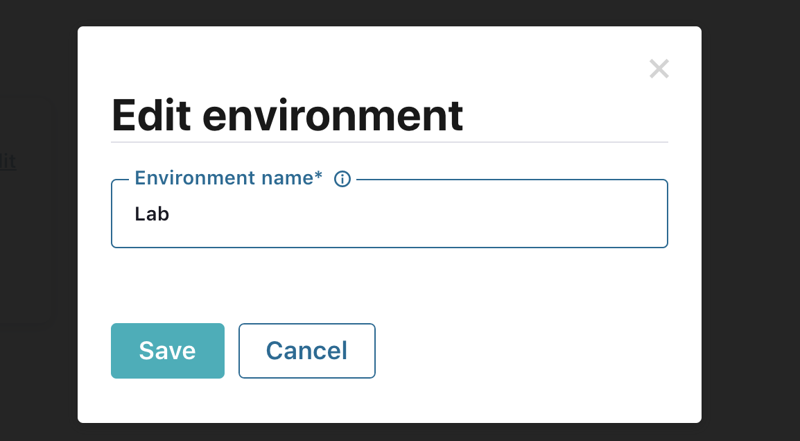

# About

In this module, we will (1) provision Confluent Cloud, (2) create a Kafka cluster there, (3) download and configure Confluent Cloud CLI and (4) create a Kafka topic, and (5) finally capture details we will need to interop with the cluster from Spark to produce to and KafkaConnect cluster to consume from.

1. Provision Confluent Cloud the first time, rename your environment
2. Create a Kafka cluster on Confluent Cloud
3. Download Confluent CLI & switch/set CLI context to environment, and cluster of choice
4. From Confluent CLI, generate an API key for use externally
5. From Confluent CLI, create a topic


## 1. Provision Confluent Cloud the first time

Follow the steps below to create an instance of the Confluent cloud with billing tied to your Azure payment method.
<br>Note that Confluent Cloud is not tied to an Azure resource group, so it will not be visible in your resource group.
<br><br>Step by step guide is available here.
Follow the below through step 6.
https://www.confluent.io/blog/confluent-cloud-managed-kafka-service-azure-marketplace/

## 2. Create a Kafka cluster on Confluent Cloud

### 2.1. Create your Kafka cluster


<br>
<br>
<hr>
<br>


<br>
<br>
<hr>
<br>


<br>
<br>
<hr>
<br>


<br>
<br>
<hr>
<br>


<br>
<br>
<hr>
<br>

### 2.2. Rename your default environment


<br>
<br>
<hr>
<br>


<br>
<br>
<hr>
<br>

### 2.3. Locate and note down your bootstrap server load balancer FQDN and port


<br>
<br>
<hr>
<br>


<br>
<br>
<hr>
<br>

Author's bootstrap server load balancer FQDN and port-
```
pkc-lgwgm.eastus2.azure.confluent.cloud:9092
```
Note this down for use in the CLI to create a topic, from Spark to produce to Kafka and from the connector cluster to consume from Kafka.


## 3.  Download Confluent CLI & switch to environment, and cluster of choice

### 3.1. Download the CLI
```
curl -L --http1.1 https://cnfl.io/ccloud-cli | sh -s -- -b /usr/local/bin
```
### 3.2. Login from CLI

```
ccloud login
```

This is what you will see...
```
indra:kafka akhanolk$ ccloud login
Enter your Confluent credentials:
Email: ankhanol@microsoft.com
Password: ***************
Logged in as "ankhanol@microsoft.com".
Using environment "env-0jmy2" ("default").
```

### 3.4. Switch the CLI context to the environment you want to use

1.  List
```
ccloud environment list
```

Here is the author's output-
```
indra:kafka akhanolk$ ccloud environment list
      Id      | Name  
+-------------+------+
  * env-0jmy2 | Lab   
```

2.  Switch to the  environment - useful when you have multiple.

```
ccloud environment use env-0jmy2
```

Here is the author's output-
```
indra:kafka akhanolk$ ccloud environment use env-0jmy2
Now using "env-0jmy2" as the default (active) environment.
```


### 3.5. Switch the CLI context to the cluster you want to use

1.  List the clusters<br>

```
ccloud kafka cluster list
```

Author's output...
```
indra:kafka akhanolk$ ccloud kafka cluster list
      Id      |         Name         | Type  | Provider | Region  | Availability | Status  
+-------------+----------------------+-------+----------+---------+--------------+--------+
    lkc-g9zrn | crimes-kafka-cluster | BASIC | azure    | eastus2 | LOW          | UP      
```

2.  Switch to cluster of choice<br>
You might have more than one cluster; To set your CLI to work with a cluster of choice, run this command with the ID of the cluster-
```
ccloud kafka cluster use lkc-g9zrn
```

Author's output-
```
indra:kafka akhanolk$ ccloud kafka cluster use lkc-g9zrn
Set Kafka cluster "lkc-g9zrn" as the active cluster for environment "env-0jmy2".
```

## 4.  From Confluent CLI, generate an API key for use externally (spark, connectors etc)


### 4.1. Generate the key
Run this command, replace last parameter with your cluster ID-
```
ccloud kafka cluster use lkc-g9zrn
```

Author's output -

```
indra:kafka akhanolk$ ccloud api-key create --resource lkc-g9zrn
It may take a couple of minutes for the API key to be ready.
Save the API key and secret. The secret is not retrievable later.
+---------+------------------------------------------------------------------+
| API Key | BSKF4xxxxx                                                |
| Secret  | 4GvBgxxxxxxBtsK |
+---------+------------------------------------------------------------------+
```

### 4.2. Persist key to the API key store
Optional: Add the API secret with ccloud api-key store <key> <secret>. When you create an API key with the CLI, it is automatically stored locally. However, when you create an API key using the UI, API, or with the CLI on another machine, the secret is not available for CLI use until you store it. This is required because secrets cannot be retrieved after creation.

The command-
```
ccloud api-key store <api-key> <api-secret> --resource <resource-id>
```
  
Author's output -
```
indra:kafka akhanolk$ ccloud api-key store BSKF4xxxxx   4GvBgxxxxxxNWed8oBtsK --resource lkc-1npp5
Stored API secret for API key "BSKF4xxxxx".
  ```
  
### 4.3. Set the API key to use
The command-
```
ccloud api-key use <key> --resource <resource-id>
```

Author's output -
```
indra:kafka akhanolk$ ccloud api-key use BSKF4xxxxx  --resource lkc-1npp5
Set API Key "BSKF4xxxxx" as the active API key for "lkc-1npp5".
```


## 5.  Create a Kafka topic
The command-
```
indra:kafka akhanolk$ ccloud kafka topic create crimes --cluster lkc-g9zrn  --partitions 6 --dry-run 
Created topic "crimes".
```

Author's output -
```
indra:kafka akhanolk$ ccloud kafka topic create crimes --cluster lkc-g9zrn  --partitions 6 --dry-run 
Created topic "crimes".
```

