# About

This module covers the below steps-
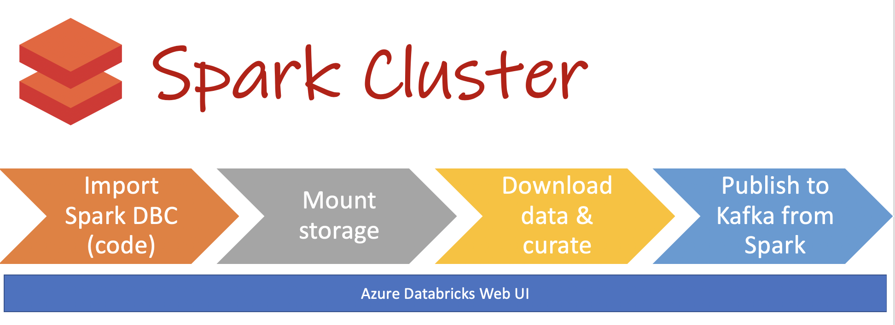
<br>
<br>
<hr>


[1.  Import Spark code from Github into your Databricks workspace]()<br>
[2.  Paste your storage and kafka configs into the notebook 0-configs]()<br>
[3.  Mount your Azure Storage Account containers to your Databricks workspace]()<br>
[4.  Download a public dataset and curate it for use in the lab]()<br>
[5.  Publish curated data as messages to Kafka from Spark on Databricks]()<br>

## 1.  Import Spark code from Github into your Databricks workspace

The Spark code is available here-<br>
https://github.com/Azure/azure-kusto-labs/blob/confluent-clound-hol/kafka-integration/confluent-cloud/dbc/confluent-cloud-adx-hol.dbc
<br>You will need this link for importing.<br>


Log on to your Databricks workspace from module 1.  <br>
Launch workspace.  <br>
Follow the steps below to run through the process of importing the code.<br><br>


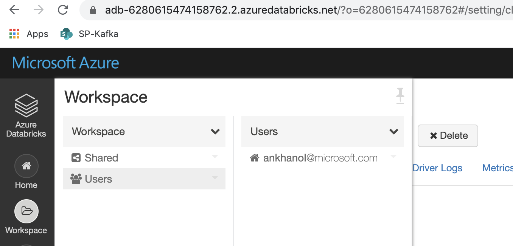
<br>
<br>
<hr>
<br>

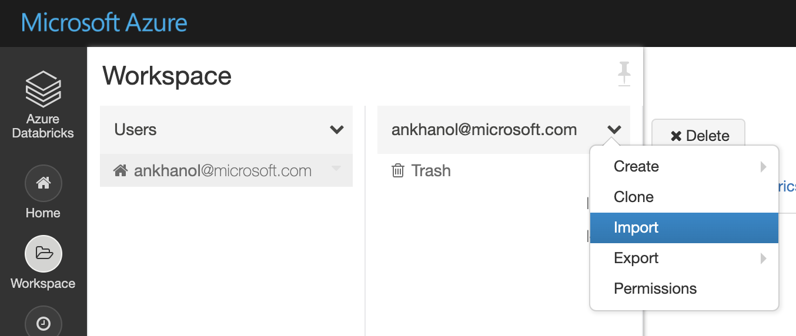
<br>
<br>
<hr>
<br>

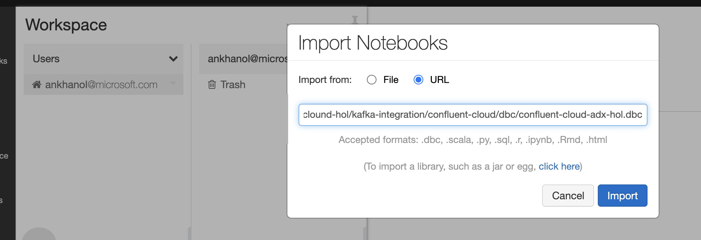
<br>
<br>
<hr>
<br>

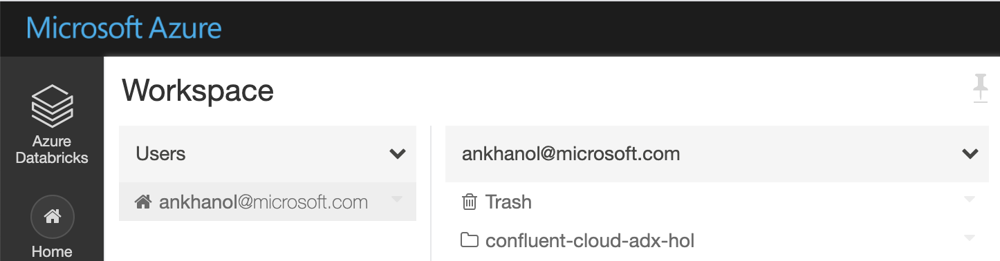
<br>
<br>
<hr>
<br>

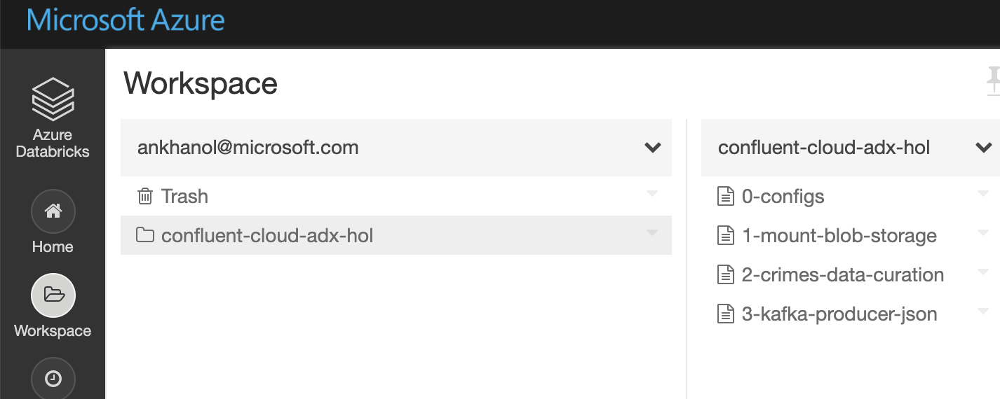
<br>
<br>
<hr>
<br>

## 2.  Paste your storage and kafka configs into the notebook 0-configs
Review the code first, in the notebook, "0-configs", paste your configs, and then run the notebook using the "Run all" button at the top of the notebook to ensure there are no issues.  This notebook will be called in the subsequent notebooks that need to reference the storage and kafka configs.

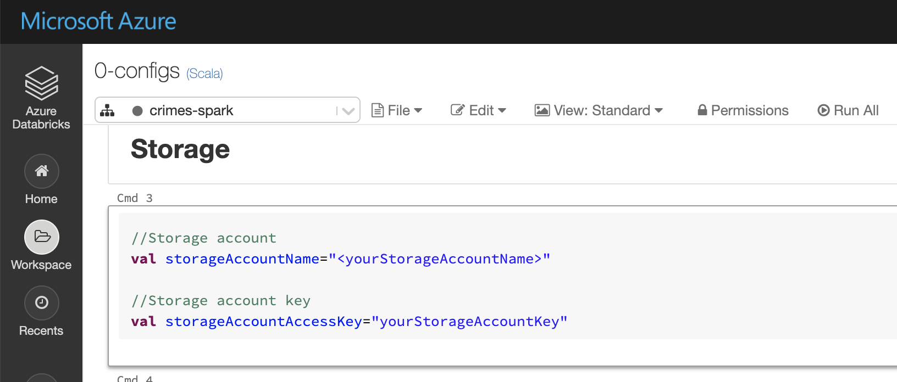
<br>
<br>
<hr>
<br>

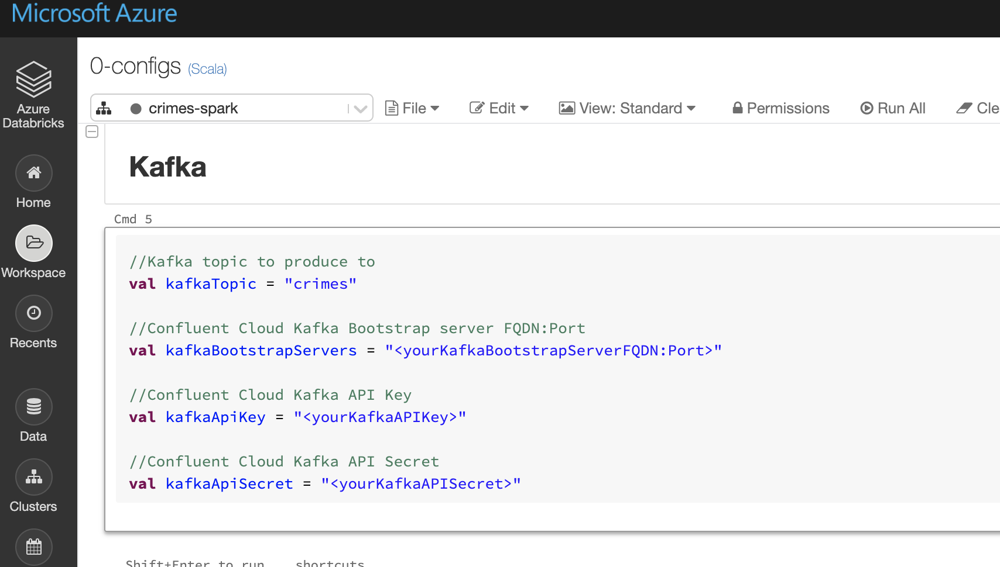
<br>
<br>
<hr>
<br>


## 3.  Mount your Azure Storage Account containers to your Databricks workspace
Review the code first, in the notebook, "1-mount-blob-storage" and then run the notebook using the "Run all" button at the top of the notebook.  In this notebook, we mount the storage containers we created; Mounting blob storage containers allows you to read/write from storage containers like they are local file systems.<br>

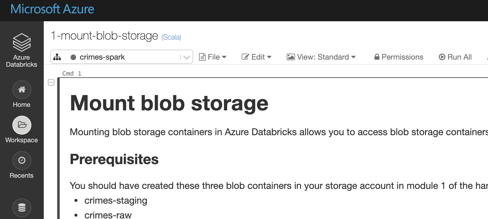
<br>
<br>
<hr>
<br>

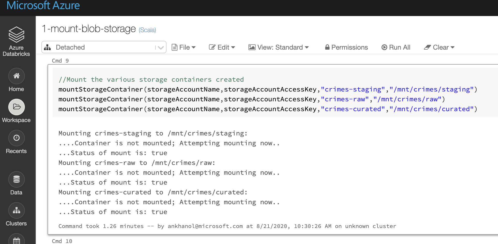
<br>
<br>
<hr>
<br>

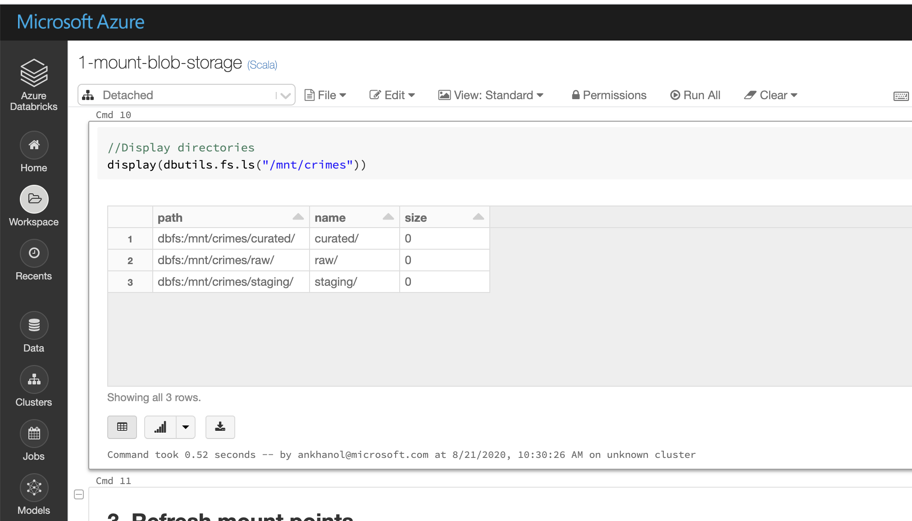
<br>
<br>
<hr>
<br>

## 4.  Download a public dataset and curate it for use in the lab
Review the code first, in the notebook, "2-crimes-data-curation" and then run the notebook using the "Run all" button at the top of the notebook.  In this notebook, we download Chicago crimes public dataset and curate it. 

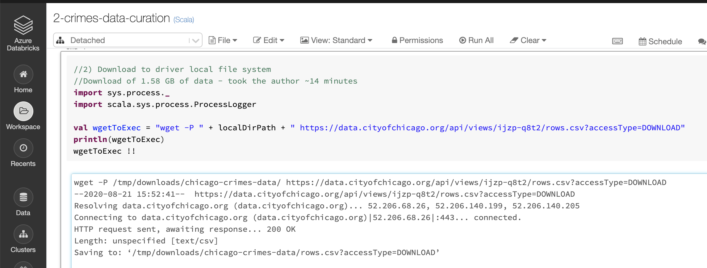
<br>
<br>
<hr>
<br>

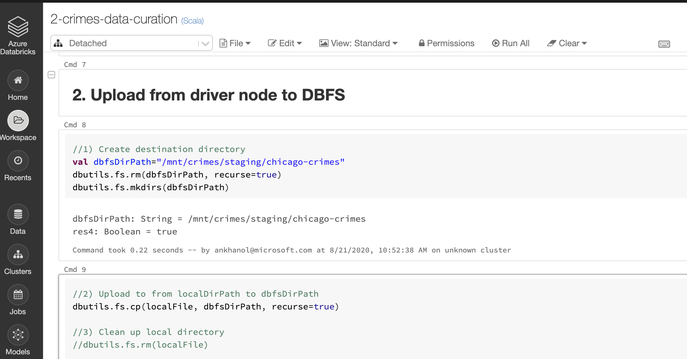
<br>
<br>
<hr>
<br>

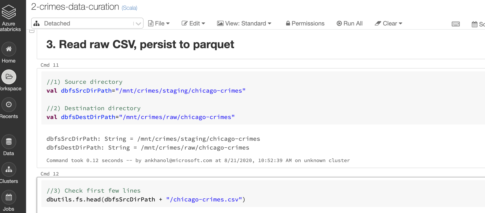
<br>
<br>
<hr>
<br>

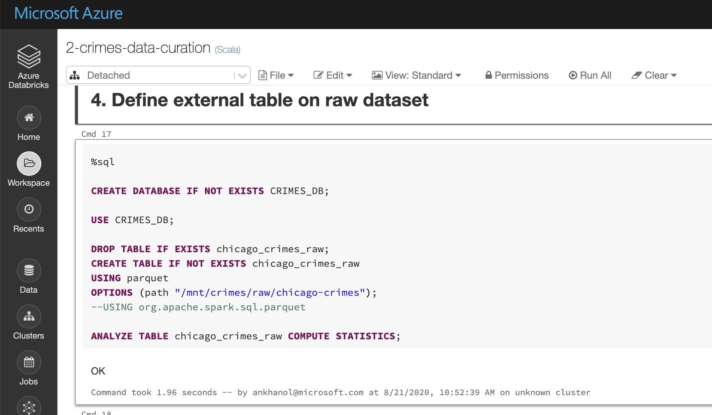
<br>
<br>
<hr>
<br>

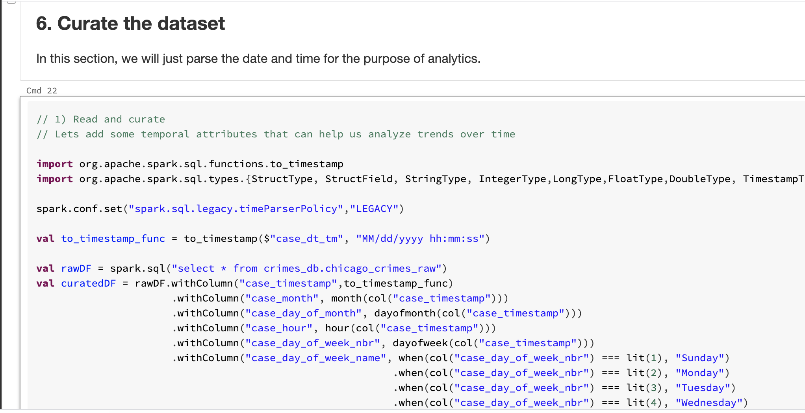
<br>
<br>
<hr>
<br>

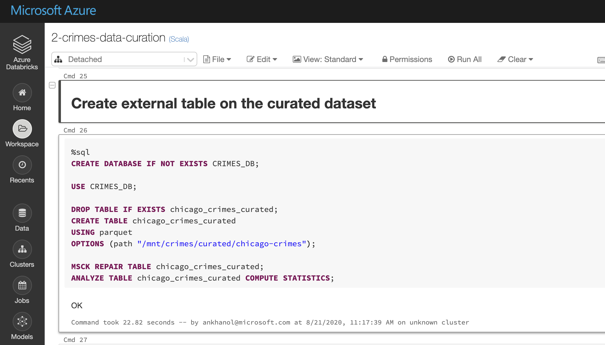
<br>
<br>
<hr>
<br>


## 5.  Read the Chicago crimes data in Spark and publish to Kafka as Json messages
Review the code first, in the notebook, "3-kafka-producer-json" and then run the notebook using the "Run all" button at the top of the notebook.<br>

This first image shows the call to the notebook 0-configs.
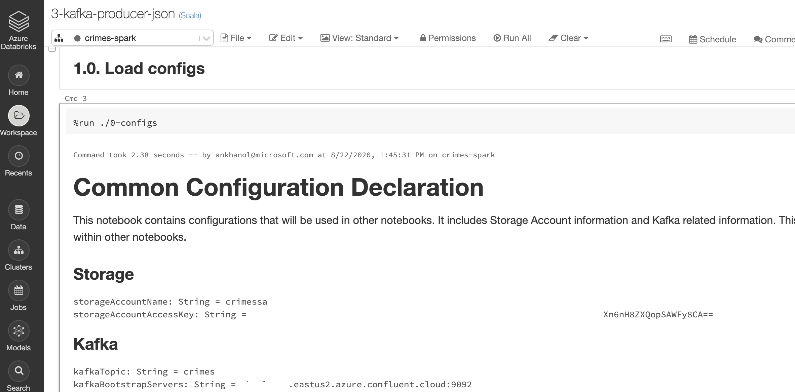
<br>
<br>
<hr>
<br>

Here we read a Spark table for curated crimes data into a dataframe
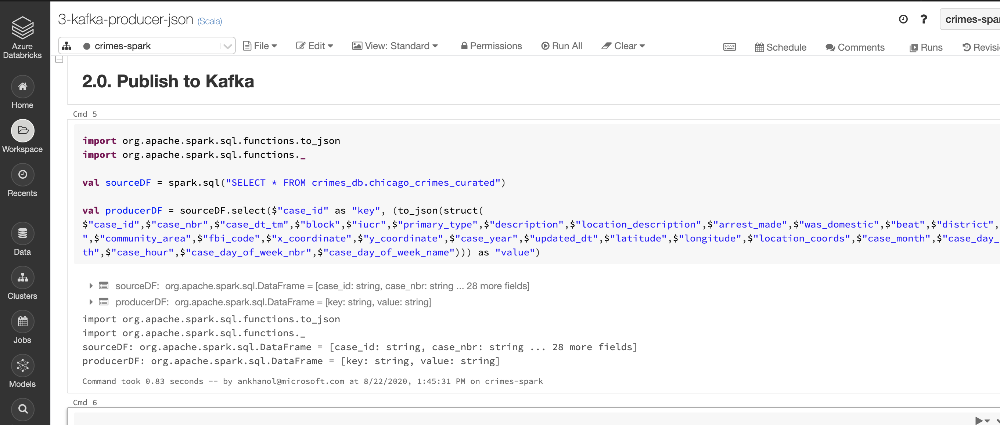
<br>
<br>
<hr>
<br>

And here, we publish to Kafka
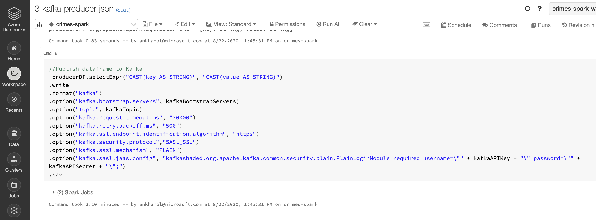
<br>
<br>
<hr>
<br>


The following snippet shows how to publish to Kafka from Spark-
```
 producerDF.selectExpr("CAST(key AS STRING)", "CAST(value AS STRING)")
.write
.format("kafka")
.option("kafka.bootstrap.servers", kafkaBootstrapServers)
.option("topic", kafkaTopic)
.option("kafka.request.timeout.ms", "20000")
.option("kafka.retry.backoff.ms", "500")
.option("kafka.ssl.endpoint.identification.algorithm", "https")
.option("kafka.security.protocol","SASL_SSL") 
.option("kafka.sasl.mechanism", "PLAIN") 
.option("kafka.sasl.jaas.config", "kafkashaded.org.apache.kafka.common.security.plain.PlainLoginModule required username=\"" + kafkaAPIKey + "\" password=\"" + kafkaAPISecret + "\";")
.save
```

<hr>
This concludes this module.  Click here for the [next module](5-configure-connector-cluster.md) that covers provisioning KafkaConnect workers on AKS and launching sink/copy tasks.
