#### Main menu
[Home page](README.md)<br>
[1. Provision foundational resources](1-foundational-resources.md)<br>
[2. Provision Confluent Cloud and configure Kafka](2-confluent-cloud.md)<br>
[3. Provision Azure Data Explorer, and associated database objects and permissions](3-adx.md)<br>
[4. Import the Spark Kafka producer code, and configure Spark to produce to your Confluent Cloud Kafka topic](4-configure-spark.md)<br>
[5. Configure the KafkaConnect cluster, launch connector tasks](5-configure-connector-cluster.md)<br>
[6. Run the end to end pipeline](6-run-e2e.md)<br>
<hr>


# About this module

This module covers the following steps that essentially sets the stage for integration.  It is an involved module, a step missed may mean, things dont work for you.  Grab a acup of coffee/tea and get started.  It should take an hour or two.

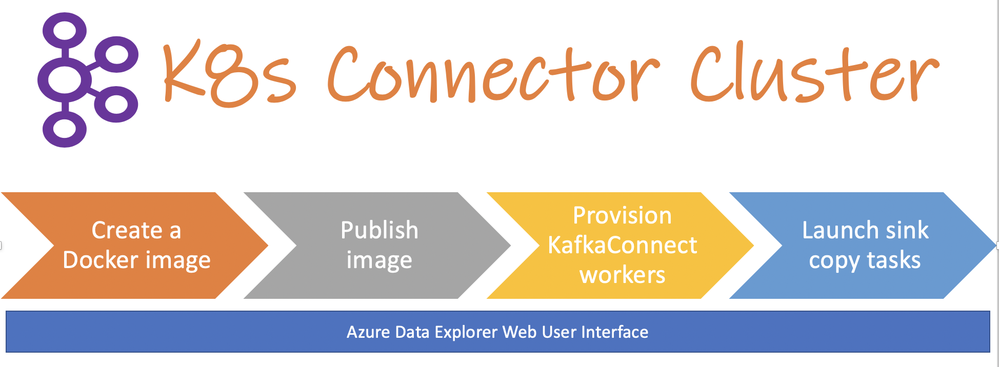
<br>
<br>
<hr>
<br>

[1. Create a Docker Hub account](5-configure-connector-cluster.md#1--create-a-docker-hub-account)<br>
[2. Install Docker desktop on your machine and launch it](5-configure-connector-cluster.md#2--install-docker-desktop-on-your-machine-and-launch-it)<br>
[3. Build a Docker image](5-configure-connector-cluster.md#3-build-a-docker-image)<br>
[4. Push the image to Docker Hub](5-configure-connector-cluster.md#4-push-the-image-to-docker-hub)<br>
[5. Clone KafkaConnect helm charts from Confluent git repo & make necessary edits](5-configure-connector-cluster.md#5-clone-kafkaconnect-helm-charts-from-confluent-git-repo--make-necessary-edits)<br>
[6. Provision KafkaConnect workers on our Azure Kubernetes Service cluster](5-configure-connector-cluster.md#6-provision-kafkaconnect-workers-on-our-azure-kubernetes-service-cluster)<br>
[7. Start port forwarding to be able to make REST calls from your machine to KafkaConnect service running on AKS pods](5-configure-connector-cluster.md#7-start-port-forwarding-to-be-able-to-make-rest-calls-from-your-machine-to-kafkaconnect-service-running-on-aks-pods)<br>
[8. Download & install Postman](5-configure-connector-cluster.md#8-download--install-postman)<br>
[9. Import the Postman JSON collection with KafkaConnect REST API call samples & try them out](5-configure-connector-cluster.md#9-import-the-postman-json-collection-with-kafkaconnect-rest-api-call-samples)<br>


The following section strives to explain further, pictorially, what we are doing in the lab, for clarity.<br>

## Part A

1.  Create a Docker Hub account if it does not exist
2.  Install Docker desktop on your machine
3.  Build a docker image for the KafkaConnect worker that include any connect worker level configurations, and the ADX connector jar
4.  Push the image to the Docker hub
<br>

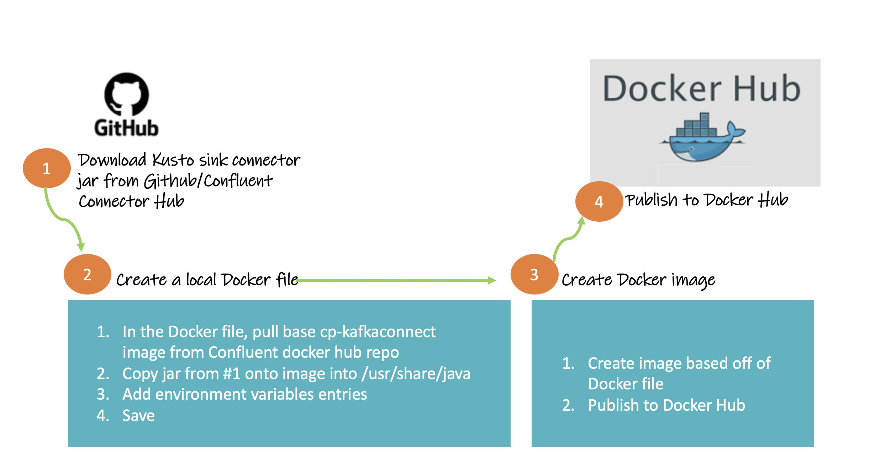
<br>
<br>
<hr>
<br>

## Part B

5.  Provision KafkaConnect workers on our Azure Kubernetes Service cluster

When we start off, all we have is an empty Kubernetes cluster-

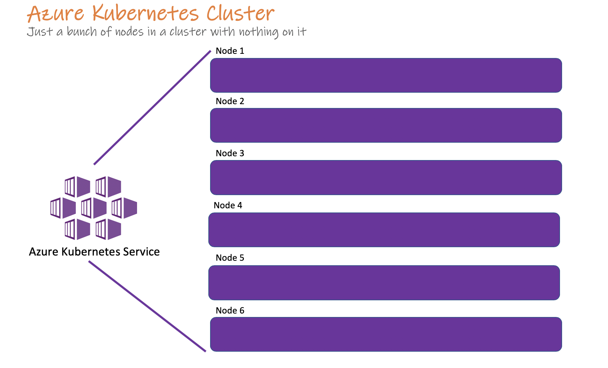
<br>
<br>
<hr>
<br>

When we are done, we have a live KafkaConnect cluster that is integrated with Confluent Cloud-

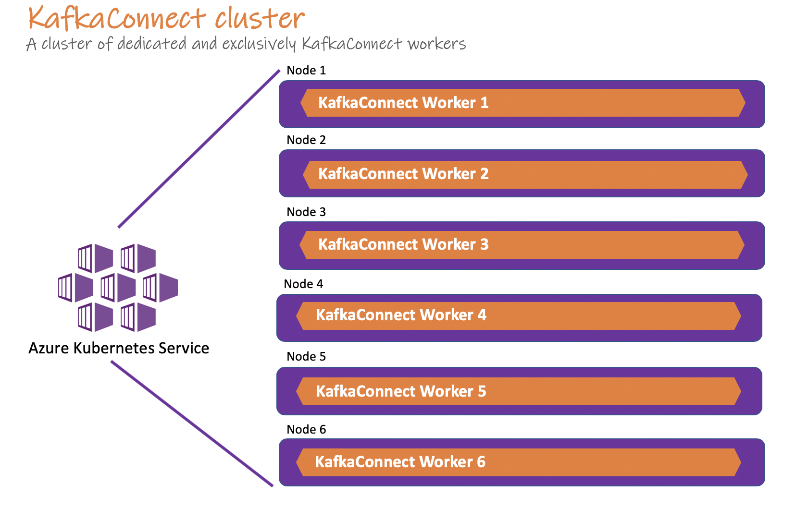
<br>
<br>
<hr>
<br>

Note: This still does not have copy tasks (connector tasks) running yet


## Part C

6.  Install Postman on our local machine
7.  Import KafkaConnect REST call JSON collection from Github into Postman

## Part D

8.  Launch the Kafka-ADX copy tasks, otherwise called connector tasks

This is what we have at the end of this module, a Kusto sink connector cluster with copy tasks running.

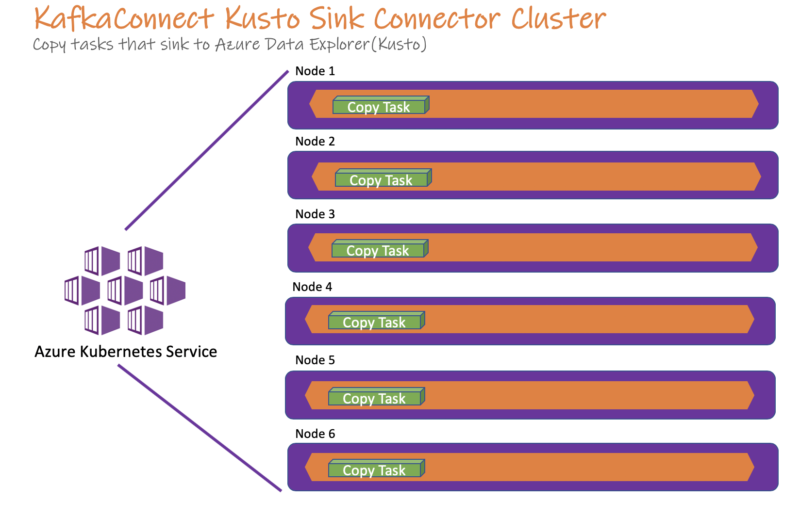
<br>
<br>
<hr>
<br>

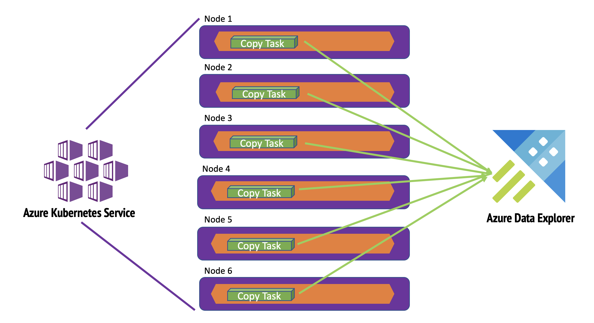
<br>
<br>
<hr>
<br>

## 1.  Create a Docker Hub account

Follow the instructions [here](https://hub.docker.com/signup) and create an account.  Note down your user ID and password.

## 2.  Install Docker desktop on your machine and launch it

Follow the instructions [here](https://www.docker.com/products/docker-desktop) and complete the installation and start the service.

## 3. Build a Docker image

### 3.1. Create a local directory

In linux/Mac-
```
cd ~
mkdir kafka-confluentcloud-hol
cd kafka-confluentcloud-hol
```

### 3.2. Download the ADX connector jar

Run the following commands-
<br>
1.  Switch directories if needed
```
cd ~/kafka-confluentcloud-hol
```
2.  Download the jar
```
wget https://github.com/Azure/kafka-sink-azure-kusto/releases/download/v1.0.1/kafka-sink-azure-kusto-1.0.1-jar-with-dependencies.jar 
```

### 3.3. Create a Docker file

Start a file-
```
vi connect-worker-image-builder.dockerfile
```

Paste this into the file and save - be sure to edit it for bootstrap server list, Kafka API key and Kafka API secrte to reflect yours..
```
FROM confluentinc/cp-kafka-connect:5.5.0
COPY kafka-sink-azure-kusto-1.0.1-jar-with-dependencies.jar /usr/share/java

ENV CONNECT_CONNECTOR_CLIENT_CONFIG_OVERRIDE_POLICY=All
ENV CONNECT_SASL_MECHANISM=PLAIN
ENV CONNECT_SECURITY_PROTOCOL=SASL_SSL
ENV CONNECT_SSL_ENDPOINT_IDENTIFICATION_ALGORITHM=https
ENV CONNECT_SASL_JAAS_CONFIG="org.apache.kafka.common.security.plain.PlainLoginModule required username=\"YOUR-KAFKA-API-KEY\" password=\YOUR-KAFKA-API-SECRET"\";"
```

What we are doing above is taking the base Docker image from the ConfluentInc repo, copying the ADX jar to /usr/share/java and setting an environment variable to allow overrides at the consumer level.

### 3.4. Create a Docker image off of 3.3

Replace akhanolkar with your docker UID and run the below-
```
sudo docker build -t akhanolkar/kafka-connect-kusto-sink:1.0.1v1 -f connect-worker-image-builder.dockerfile .
```

List the images created-
```
docker image list
```

Author's output:
```
indra:kafka-confluentcloud-hol akhanolk$ docker image list
REPOSITORY                                    TAG                 IMAGE ID            CREATED             SIZE
akhanolkar/kafka-connect-kusto-sink           1.0.1v1             1870ace80b29        23 seconds ago      1.24GB
```

## 4. Push the image to Docker Hub

Run the command below, replacing akhanolkar with your Docker username-
```
docker push akhanolkar/kafka-connect-kusto-sink:1.0.1v1
```

Author's output-
```
indra:kafka-confluentcloud-hol akhanolk$ docker push akhanolkar/kafka-connect-kusto-sink:1.0.1v1
The push refers to repository [docker.io/akhanolkar/kafka-connect-kusto-sink]
958960eb74db: Pushed 
c20428756bff: Layer already exists 
75cd0f16c778: Layer already exists 
b1aa21789e59: Layer already exists 
0d9a93e8c391: Layer already exists 
05c69d782ee2: Layer already exists 
fb73194a06ee: Layer already exists 
bc537b2bbfd6: Layer already exists 
0818dd46b53a: Layer already exists 
19e377f490b1: Layer already exists 
a8ff4211732a: Layer already exists 
1.0.1v1: digest: sha256:ae32c964bf277298b1541f52d956c6e6a5dc1263262178f8a9950e3244eacd71 size: 2639
```

You should be able to see the image in Docker Hub.

## 5. Clone KafkaConnect helm charts from Confluent git repo & make necessary edits

### 5.1. Clone the repo and copy what is required
```
cd ~
git clone https://github.com/confluentinc/cp-helm-charts.git

cd ~/kafka-confluentcloud-hol
cp -R ~/cp-helm-charts/charts/cp-kafka-connect .
```

### 5.2. A quick browse

```
indra:kafka-confluentcloud-hol akhanolk$ tree cp-kafka-connect/
cp-kafka-connect/
├── Chart.yaml
├── README.md
├── templates
│   ├── NOTES.txt
│   ├── _helpers.tpl
│   ├── deployment.yaml
│   ├── jmx-configmap.yaml
│   ├── secrets.yaml
│   └── service.yaml
└── values.yaml
```

Note the values.yaml - we will need to update this.

### 5.3. Update values.yaml as follows

We need to update the values.yaml with the following-<br>
1. Replica count
```
replicaCount: 6
```

2. Image<br>
Your docker ID, inplace of akhanolkar
```
image: akhanolkar/kafka-connect-kusto-sink
imageTag: 1.0.1v1
```
3. Kafka bootstrap servers<br>
Replace "yourBootStrapServerList" with your Confluent Cloud bootstrap server loadbalancer FQDN:Port
```
kafka:
  bootstrapServers: "PLAINTEXT://yourBootStrapServerList"
 ```
E.g. the author's bootstrap server entry is-
```
kafka:
  bootstrapServers: "PLAINTEXT://nnn-nnnn.eastus2.azure.confluent.cloud:9092"
```

4. Set prometheous jmx monitoring to false as shown below-
```
prometheus:
  ## JMX Exporter Configuration
  ## ref: https://github.com/prometheus/jmx_exporter
  jmx:
    enabled: false
```

5.  Save

## 6. Provision KafkaConnect workers on our Azure Kubernetes Service cluster

### 6.1. Login to Azure CLI & set the subscription to use
[Install the CLI if it does not exist.](https://docs.microsoft.com/en-us/cli/azure/install-azure-cli)<br>

1. Login
```
az login
```
This will launch the Azure portal, sign-in dialog.  Sign-in.<br>


2. Switch to the right Azure subscription in case you have multiple
```
az account set --subscription YOUR_SUBSCRIPTION_GUID
```

3.  Get the AKS cluster admin acccess with this command<br>
If you have named your cluster differently, be sure to replace accordingly-
```
az aks get-credentials --resource-group kafka-confluentcloud-lab-rg --name connector-k8s-cluster --admin
```

Author's output-
```
indra:kafka-confluentcloud-hol akhanolk$ az aks get-credentials --resource-group kafka-confluentcloud-lab-rg --name connector-k8s-cluster --admin
Merged "connector-k8s-cluster-admin" as current context in /Users/akhanolk/.kube/config
```

### 6.2. Provision KafkaConnect on AKS

Run the below-
```
helm install ./cp-kafka-connect --generate-name
```

Author's output-
```
indra:kafka-confluentcloud-hol akhanolk$ helm install ./cp-kafka-connect --generate-name
NAME: cp-kafka-connect-1598073371
LAST DEPLOYED: Sat Aug 22 00:16:13 2020
NAMESPACE: default
STATUS: deployed
REVISION: 1
TEST SUITE: None
NOTES:
This chart installs a Confluent Kafka Connect

https://docs.confluent.io/current/connect/index.html
```

### 6.3. Check pods
Run the below-
```
kubectl get pods
```

Author's output-
```
indra:kafka-confluentcloud-hol akhanolk$ kubectl get pods
NAME                                           READY   STATUS    RESTARTS   AGE
cp-kafka-connect-1598109267-76465bff44-7s9vs   1/1     Running   0          5m27s
cp-kafka-connect-1598109267-76465bff44-9btwt   1/1     Running   0          5m27s
cp-kafka-connect-1598109267-76465bff44-j4pbq   1/1     Running   0          5m27s
cp-kafka-connect-1598109267-76465bff44-rp5kt   1/1     Running   0          5m27s
cp-kafka-connect-1598109267-76465bff44-wv5w2   1/1     Running   0          5m27s
cp-kafka-connect-1598109267-76465bff44-x7rlm   1/1     Running   0          5m27s
```

### 6.4. Check service 

Run the below-
```
kubectl get svc
```

Author's output -
```
indra:kafka-confluentcloud-hol akhanolk$ kubectl get svc
NAME                          TYPE        CLUSTER-IP     EXTERNAL-IP   PORT(S)    AGE
cp-kafka-connect-1598109267   ClusterIP   10.0.146.166   <none>        8083/TCP   5m52s
kubernetes                    ClusterIP   10.0.0.1       <none>        443/TCP    2d23h
```

This is the service name- cp-kafka-connect-1598109267 

### 6.5. SSH into a pod

Pick one pod from your list of 6 in #6.3<br>
Here is the author's command and output-
```
kubectl exec -it cp-kafka-connect-1598073371-6676d5b5bd-7sbzn -- bash
```

#### 6.5.1.  Check processes running

```
ps -ef
```

Author's output-
```
root@cp-kafka-connect-1598109267-76465bff44-7s9vs:/# ps -ef
UID         PID   PPID  C STIME TTY          TIME CMD
root          1      0  5 15:14 ?        00:01:19 java -Xms512M -Xmx512M -server -XX:+UseG1GC -XX:MaxGCPauseMillis=20 -XX:InitiatingHeapOccupancyPercent=35 -XX:+Expl
root        186      0  0 15:15 pts/0    00:00:00 bash
root        220    186  0 15:40 pts/0    00:00:00 ps -ef
```

#### 6.5.2.  Check /usr/share/jave to see if the ADX/Kusto jar is there

Command-
```
ls -l /usr/share/java
```
Author's output-
```
root@cp-kafka-connect-1598109267-76465bff44-7s9vs:/# ls -l /usr/share/java
total 10636
drwxr-xr-x 2 root root     4096 Apr 18 17:23 acl
drwxr-xr-x 2 root root     4096 Apr 18 17:22 confluent-common
drwxr-xr-x 2 root root    12288 Apr 18 17:23 confluent-control-center
drwxr-xr-x 2 root root     4096 Apr 18 17:23 confluent-hub-client
drwxr-xr-x 2 root root    12288 Apr 18 17:23 confluent-rebalancer
-rw-r--r-- 1 root root      957 May  6  2014 java_defaults.mk
drwxr-xr-x 1 root root     4096 Apr 18 17:23 kafka
drwxr-xr-x 2 root root     4096 Apr 18 17:24 kafka-connect-activemq
drwxr-xr-x 2 root root     4096 Apr 18 17:24 kafka-connect-elasticsearch
drwxr-xr-x 2 root root     4096 Apr 18 17:24 kafka-connect-ibmmq
drwxr-xr-x 2 root root     4096 Apr 18 17:24 kafka-connect-jdbc
drwxr-xr-x 2 root root     4096 Apr 18 17:24 kafka-connect-jms
drwxr-xr-x 2 root root     4096 Apr 18 17:24 kafka-connect-s3
drwxr-xr-x 2 root root     4096 Apr 18 17:24 kafka-connect-storage-common
drwxr-xr-x 2 root root     4096 Apr 18 17:22 kafka-serde-tools
-rw-r--r-- 1 root root 10797367 Aug  4 13:24 kafka-sink-azure-kusto-1.0.1-jar-with-dependencies.jar
drwxr-xr-x 2 root root     4096 Apr 18 17:23 monitoring-interceptors
drwxr-xr-x 2 root root     4096 Apr 18 17:22 rest-utils
drwxr-xr-x 2 root root     4096 Apr 18 17:22 schema-registry
```

### 6.5.3.  Check if the environment conigs we applied in the docker file are available..
Run the command-
```
printenv | sort
```


Author's output-
```
root@cp-kafka-connect-1598109267-76465bff44-7s9vs:/# printenv | sort
ALLOW_UNSIGNED=false
COMPONENT=kafka-connect
CONFLUENT_DEB_VERSION=1
CONFLUENT_PLATFORM_LABEL=
CONFLUENT_VERSION=5.5.0
CONNECT_BOOTSTRAP_SERVERS=PLAINTEXT://nnn-nnnnn.eastus2.azure.confluent.cloud:9092
CONNECT_CONFIG_STORAGE_REPLICATION_FACTOR=3
CONNECT_CONFIG_STORAGE_TOPIC=cp-kafka-connect-1598109267-config
CONNECT_CONNECTOR_CLIENT_CONFIG_OVERRIDE_POLICY=All
CONNECT_GROUP_ID=cp-kafka-connect-1598109267
CONNECT_INTERNAL_KEY_CONVERTER=org.apache.kafka.connect.json.JsonConverter
CONNECT_INTERNAL_VALUE_CONVERTER=org.apache.kafka.connect.json.JsonConverter
CONNECT_KEY_CONVERTER=io.confluent.connect.avro.AvroConverter
CONNECT_KEY_CONVERTER_SCHEMAS_ENABLE=false
CONNECT_KEY_CONVERTER_SCHEMA_REGISTRY_URL=http://cp-kafka-connect-1598109267-cp-schema-registry:8081
CONNECT_OFFSET_STORAGE_REPLICATION_FACTOR=3
CONNECT_OFFSET_STORAGE_TOPIC=cp-kafka-connect-1598109267-offset
CONNECT_PLUGIN_PATH=/usr/share/java,/usr/share/confluent-hub-components
CONNECT_REST_ADVERTISED_HOST_NAME=10.244.1.10
CONNECT_SASL_JAAS_CONFIG=org.apache.kafka.common.security.plain.PlainLoginModule required username="xxxx" password="xxxx";
CONNECT_SASL_MECHANISM=PLAIN
CONNECT_SECURITY_PROTOCOL=SASL_SSL
CONNECT_SSL_ENDPOINT_IDENTIFICATION_ALGORITHM=https
CONNECT_STATUS_STORAGE_REPLICATION_FACTOR=3
CONNECT_STATUS_STORAGE_TOPIC=cp-kafka-connect-1598109267-status
CONNECT_VALUE_CONVERTER=io.confluent.connect.avro.AvroConverter
CONNECT_VALUE_CONVERTER_SCHEMAS_ENABLE=false
CONNECT_VALUE_CONVERTER_SCHEMA_REGISTRY_URL=http://cp-kafka-connect-1598109267-cp-schema-registry:8081
CP_KAFKA_CONNECT_1598109267_PORT=tcp://10.0.146.166:8083
CP_KAFKA_CONNECT_1598109267_PORT_8083_TCP=tcp://10.0.146.166:8083
CP_KAFKA_CONNECT_1598109267_PORT_8083_TCP_ADDR=10.0.146.166
CP_KAFKA_CONNECT_1598109267_PORT_8083_TCP_PORT=8083
CP_KAFKA_CONNECT_1598109267_PORT_8083_TCP_PROTO=tcp
CP_KAFKA_CONNECT_1598109267_SERVICE_HOST=10.0.146.166
CP_KAFKA_CONNECT_1598109267_SERVICE_PORT=8083
CP_KAFKA_CONNECT_1598109267_SERVICE_PORT_KAFKA_CONNECT=8083
CUB_CLASSPATH=/etc/confluent/docker/docker-utils.jar
HOME=/root
HOSTNAME=cp-kafka-connect-1598109267-76465bff44-7s9vs
KAFKA_ADVERTISED_LISTENERS=
KAFKA_HEAP_OPTS=-Xms512M -Xmx512M
KAFKA_JMX_PORT=5555
KAFKA_VERSION=
KAFKA_ZOOKEEPER_CONNECT=
KUBERNETES_PORT=tcp://10.0.0.1:443
KUBERNETES_PORT_443_TCP=tcp://10.0.0.1:443
KUBERNETES_PORT_443_TCP_ADDR=10.0.0.1
KUBERNETES_PORT_443_TCP_PORT=443
KUBERNETES_PORT_443_TCP_PROTO=tcp
KUBERNETES_SERVICE_HOST=10.0.0.1
KUBERNETES_SERVICE_PORT=443
KUBERNETES_SERVICE_PORT_HTTPS=443
LANG=C.UTF-8
PATH=/usr/local/sbin:/usr/local/bin:/usr/sbin:/usr/bin:/sbin:/bin
PWD=/
PYTHON_PIP_VERSION=8.1.2
PYTHON_VERSION=2.7.9-1
SCALA_VERSION=2.12
SHLVL=1
TERM=xterm
ZULU_OPENJDK_VERSION=8=8.38.0.13
_=/usr/bin/printenv
```
The following should be there-
```
CONNECT_CONNECTOR_CLIENT_CONFIG_OVERRIDE_POLICY=All
CONNECT_SASL_JAAS_CONFIG=org.apache.kafka.common.security.plain.PlainLoginModule required username="xxxx" password="xxxx";
CONNECT_SASL_MECHANISM=PLAIN
CONNECT_SECURITY_PROTOCOL=SASL_SSL
CONNECT_SSL_ENDPOINT_IDENTIFICATION_ALGORITHM=https
```

Now - exit root..
```
exit
```
### 6.5.4.  Lets check logs to see if there are any errors
Lets review the logs of one of the pods from 6.3

```
kubectl logs <podName>
```

If you see something like this, we are good to go...
```
[2020-08-22 15:15:20,337] INFO [Worker clientId=connect-1, groupId=cp-kafka-connect-1598109267] (Re-)joining group (org.apache.kafka.clients.consumer.internals.AbstractCoordinator)
[2020-08-22 15:15:20,376] INFO [Worker clientId=connect-1, groupId=cp-kafka-connect-1598109267] Join group failed with org.apache.kafka.common.errors.MemberIdRequiredException: The group member needs to have a valid member id before actually entering a consumer group (org.apache.kafka.clients.consumer.internals.AbstractCoordinator)
[2020-08-22 15:15:20,376] INFO [Worker clientId=connect-1, groupId=cp-kafka-connect-1598109267] (Re-)joining group (org.apache.kafka.clients.consumer.internals.AbstractCoordinator)
[2020-08-22 15:15:21,350] INFO [Worker clientId=connect-1, groupId=cp-kafka-connect-1598109267] Successfully joined group with generation 3 (org.apache.kafka.clients.consumer.internals.AbstractCoordinator)
[2020-08-22 15:15:21,352] INFO [Worker clientId=connect-1, groupId=cp-kafka-connect-1598109267] Joined group at generation 3 with protocol version 2 and got assignment: Assignment{error=0, leader='connect-1-1de302ef-1397-40b3-b108-925feef75d1a', leaderUrl='http://10.244.3.7:8083/', offset=1, connectorIds=[], taskIds=[], revokedConnectorIds=[], revokedTaskIds=[], delay=0} with rebalance delay: 0 (org.apache.kafka.connect.runtime.distributed.DistributedHerder)
[2020-08-22 15:15:21,352] WARN [Worker clientId=connect-1, groupId=cp-kafka-connect-1598109267] Catching up to assignment's config offset. (org.apache.kafka.connect.runtime.distributed.DistributedHerder)
[2020-08-22 15:15:21,352] INFO [Worker clientId=connect-1, groupId=cp-kafka-connect-1598109267] Current config state offset -1 is behind group assignment 1, reading to end of config log (org.apache.kafka.connect.runtime.distributed.DistributedHerder)
[2020-08-22 15:15:21,442] INFO [Worker clientId=connect-1, groupId=cp-kafka-connect-1598109267] Finished reading to end of log and updated config snapshot, new config log offset: 1 (org.apache.kafka.connect.runtime.distributed.DistributedHerder)
[2020-08-22 15:15:21,442] INFO [Worker clientId=connect-1, groupId=cp-kafka-connect-1598109267] Starting connectors and tasks using config offset 1 (org.apache.kafka.connect.runtime.distributed.DistributedHerder)
[2020-08-22 15:15:21,442] INFO [Worker clientId=connect-1, groupId=cp-kafka-connect-1598109267] Finished starting connectors and tasks (org.apache.kafka.connect.runtime.distributed.DistributedHerder)
```

### 6.6. Describe a pod to view details

Run the command below with a pod name from 6.3
```
kubectl describe pod YOUR_POD_NAME
```

Author's output-
```
indra:kafka-confluentcloud-hol akhanolk$ kubectl describe pod cp-kafka-connect-1598109267-76465bff44-7s9vs
Name:         cp-kafka-connect-1598109267-76465bff44-7s9vs
Namespace:    default
Priority:     0
Node:         aks-agentpool-23362501-vmss000005/10.240.0.9
Start Time:   Sat, 22 Aug 2020 10:14:30 -0500
Labels:       app=cp-kafka-connect
              pod-template-hash=76465bff44
              release=cp-kafka-connect-1598109267
Annotations:  <none>
Status:       Running
IP:           10.244.1.10
IPs:
  IP:           10.244.1.10
Controlled By:  ReplicaSet/cp-kafka-connect-1598109267-76465bff44
Containers:
  cp-kafka-connect-server:
    Container ID:   docker://f574c04da945ef986296a7ff341c277be9799e61d1c8702096d7ed792e8beb30
    Image:          akhanolkar/kafka-connect-kusto-sink:1.0.1v3
    Image ID:       docker-pullable://akhanolkar/kafka-connect-kusto-sink@sha256:65b7c05d5e795c7491d52a5e12636faa1f8f9b4a460a24ec081e6bf4047d405d
    Port:           8083/TCP
    Host Port:      0/TCP
    State:          Running
      Started:      Sat, 22 Aug 2020 10:14:32 -0500
    Ready:          True
    Restart Count:  0
    Environment:
      CONNECT_REST_ADVERTISED_HOST_NAME:             (v1:status.podIP)
      CONNECT_BOOTSTRAP_SERVERS:                    PLAINTEXT://nnn-nnnnn.eastus2.azure.confluent.cloud:9092
      CONNECT_GROUP_ID:                             cp-kafka-connect-1598109267
      CONNECT_CONFIG_STORAGE_TOPIC:                 cp-kafka-connect-1598109267-config
      CONNECT_OFFSET_STORAGE_TOPIC:                 cp-kafka-connect-1598109267-offset
      CONNECT_STATUS_STORAGE_TOPIC:                 cp-kafka-connect-1598109267-status
      CONNECT_KEY_CONVERTER_SCHEMA_REGISTRY_URL:    http://cp-kafka-connect-1598109267-cp-schema-registry:8081
      CONNECT_VALUE_CONVERTER_SCHEMA_REGISTRY_URL:  http://cp-kafka-connect-1598109267-cp-schema-registry:8081
      KAFKA_HEAP_OPTS:                              -Xms512M -Xmx512M
      CONNECT_CONFIG_STORAGE_REPLICATION_FACTOR:    3
      CONNECT_INTERNAL_KEY_CONVERTER:               org.apache.kafka.connect.json.JsonConverter
      CONNECT_INTERNAL_VALUE_CONVERTER:             org.apache.kafka.connect.json.JsonConverter
      CONNECT_KEY_CONVERTER:                        io.confluent.connect.avro.AvroConverter
      CONNECT_KEY_CONVERTER_SCHEMAS_ENABLE:         false
      CONNECT_OFFSET_STORAGE_REPLICATION_FACTOR:    3
      CONNECT_PLUGIN_PATH:                          /usr/share/java,/usr/share/confluent-hub-components
      CONNECT_STATUS_STORAGE_REPLICATION_FACTOR:    3
      CONNECT_VALUE_CONVERTER:                      io.confluent.connect.avro.AvroConverter
      CONNECT_VALUE_CONVERTER_SCHEMAS_ENABLE:       false
      KAFKA_JMX_PORT:                               5555
    Mounts:
      /var/run/secrets/kubernetes.io/serviceaccount from default-token-p67xc (ro)
Conditions:
  Type              Status
  Initialized       True 
  Ready             True 
  ContainersReady   True 
  PodScheduled      True 
Volumes:
  default-token-p67xc:
    Type:        Secret (a volume populated by a Secret)
    SecretName:  default-token-p67xc
    Optional:    false
QoS Class:       BestEffort
Node-Selectors:  <none>
Tolerations:     node.kubernetes.io/not-ready:NoExecute for 300s
                 node.kubernetes.io/unreachable:NoExecute for 300s
Events:
  Type    Reason     Age   From                                        Message
  ----    ------     ----  ----                                        -------
  Normal  Scheduled  43m   default-scheduler                           Successfully assigned default/cp-kafka-connect-1598109267-76465bff44-7s9vs to aks-agentpool-23362501-vmss000005
  Normal  Pulling    43m   kubelet, aks-agentpool-23362501-vmss000005  Pulling image "akhanolkar/kafka-connect-kusto-sink:1.0.1v3"
  Normal  Pulled     43m   kubelet, aks-agentpool-23362501-vmss000005  Successfully pulled image "akhanolkar/kafka-connect-kusto-sink:1.0.1v3"
  Normal  Created    43m   kubelet, aks-agentpool-23362501-vmss000005  Created container cp-kafka-connect-server
  Normal  Started    43m   kubelet, aks-agentpool-23362501-vmss000005  Started container cp-kafka-connect-server
```

Points to note here are-
1.  The output of command "kubectl get svc" - the service ID is the group ID 
```
      CONNECT_GROUP_ID:                             cp-kafka-connect-1598109267
```
2.  Three special topics are created by KafkaConnect to maintain offsets of the connect tasks-
```
      CONNECT_CONFIG_STORAGE_TOPIC:                 cp-kafka-connect-1598109267-config
      CONNECT_OFFSET_STORAGE_TOPIC:                 cp-kafka-connect-1598109267-offset
      CONNECT_STATUS_STORAGE_TOPIC:                 cp-kafka-connect-1598109267-status
```
These are specific to the service ID from "kubectl get svc".  If you uninstall and reinstall KafkaConnect, you will see another set of 3 topics, identifiable by the service ID.

## 7. Start port forwarding to be able to make REST calls from your machine to KafkaConnect service running on AKS pods
You will need the service ID from the command "kubectl get svc".  Substitute it in the below command.

```
sudo kubectl port-forward svc/YOUR_SERVICE_ID 803:8083
```

Author's output-
```
indra:kafka-confluentcloud-hol akhanolk$ sudo kubectl port-forward svc/cp-kafka-connect-1598109267 803:8083
Forwarding from 127.0.0.1:803 -> 8083
Forwarding from [::1]:803 -> 8083
.....
```
Keep this session alive when you need to manipulate the ADX connectors.

## 8. Download & install Postman

[Install Postman](https://www.postman.com/downloads/) if you dont already have it.

## 9. Import the Postman JSON collection with KafkaConnect REST API call samples

### 9.1. Download the Postman collection for the lab 

Download [this](https://github.com/Azure/azure-kusto-labs/blob/confluent-clound-hol/kafka-integration/confluent-cloud/rest-calls/Confluent-Cloud-ADX-HoL-1-STUB.postman_collection.json) to you local machine.<br>
We will import this into Postman.  Its a stub with all the REST calls pre-created.


### 9.2. Launch Postman and click on the import button

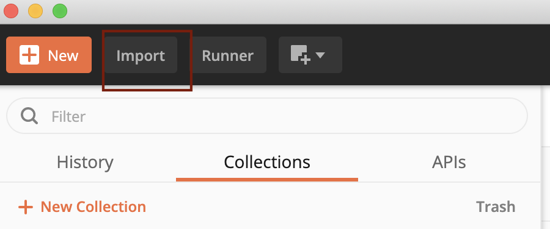
<br>
<br>
<hr>
<br>

Click on the import button and import from the file dowloaded in 9.1.

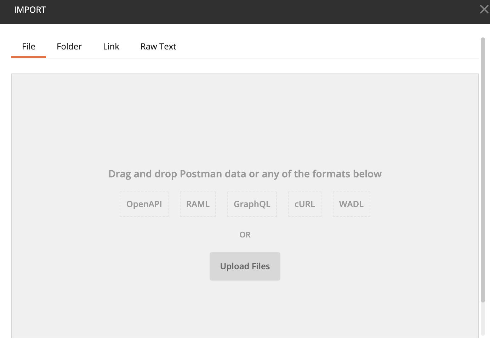
<br>
<br>
<hr>
<br>


### 9.3. View available connector plugins

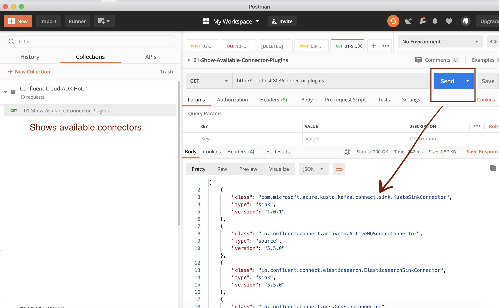
<br>
<br>
<hr>
<br>

### 9.4. Check if the ADX/Kusto connector is already provisioned

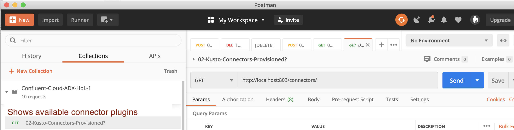
<br>
<br>
<hr>
<br>

### 9.5. Provision the connector after editing the body of the REST call to match your configuration

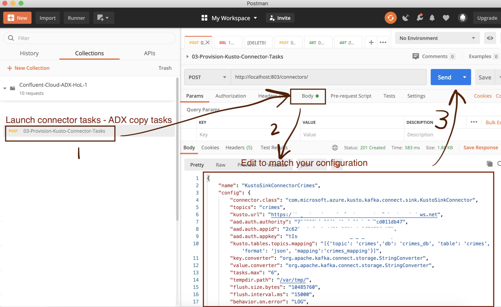
<br>
<br>
<hr>
<br>

You will need the following details-
```
{
    "name": "KustoSinkConnectorCrimes",
    "config": {
        "connector.class": "com.microsoft.azure.kusto.kafka.connect.sink.KustoSinkConnector",
        "topics": "crimes",
        "kusto.ingestion.url":"YOUR-ADX-INGEST-URL",
        "kusto.query.url":"YOUR-ADX-QUERY-URL",
        "aad.auth.authority": "YOUR-AAD-TENANT-ID",
        "aad.auth.appid":"YOUR-ADD-SPN-APP-ID",
        "aad.auth.appkey":"YOUR-AAD-SPN-SECRET",
        "kusto.tables.topics.mapping": "[{'topic': 'crimes','db': 'crimes_db', 'table': 'crimes','format': 'json', 'mapping':'crimes_mapping'}]", 
        "key.converter": "org.apache.kafka.connect.storage.StringConverter",
        "value.converter": "org.apache.kafka.connect.storage.StringConverter",
        "tasks.max": "6",
        "tempdir.path":"/var/tmp/",
        "flush.size.bytes":"10485760",
        "flush.interval.ms": "15000",
        "behavior.on.error": "LOG",
        "consumer.override.bootstrap.servers": "PLAINTEXT://YOUR-CONFLUENT-CLOUD-BOOTSTRAP-SERVER-ENDPOINT",
        "consumer.override.ssl.endpoint.identification.algorithm": "https",
        "consumer.override.security.protocol": "SASL_SSL",
        "consumer.override.sasl.mechanism": "PLAIN",
        "consumer.override.sasl.jaas.config": "org.apache.kafka.common.security.plain.PlainLoginModule required username=\"YOUR-KAFKA-API-KEY\" password=\"YOUR-KAFKA-API-SECRET\";",
        "consumer.override.request.timeout.ms": "20000",
        "consumer.override.retry.backoff.ms": "500"
    }
}
```

Making this REST API call will actually launch copy tasks on your KafkaConnect workers.  We have a 1:1 ratio (1 AKS node = 1 KafkaConnect pod = 1 connector task)
but depending on resources, you can oversubcribe and add more tasks.

IDEALLY, you want as many tasks as Kafka topic partitions.

### 9.6. View configuration of connector tasks provisioned already, if any

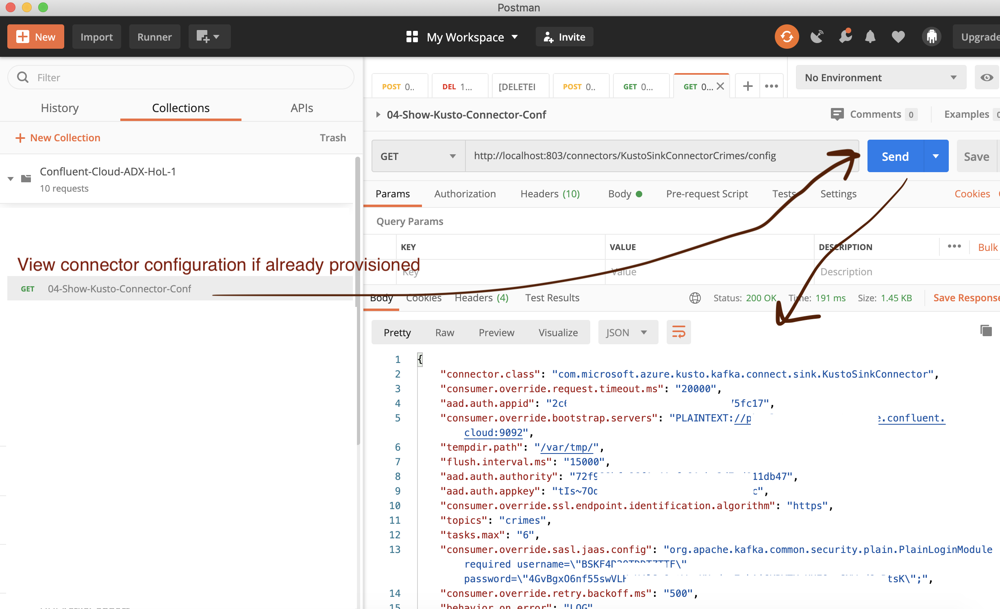
<br>
<br>
<hr>
<br>

### 9.7. View status of connector tasks provisioned 

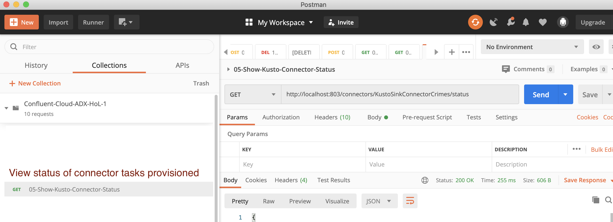
<br>
<br>
<hr>
<br>

### 9.8. Pause connectors should you need to

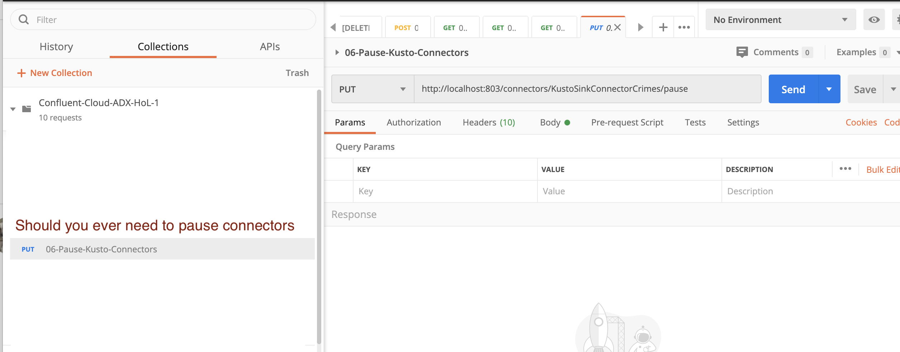
<br>
<br>
<hr>
<br>

### 9.9. Resume connectors paused previously

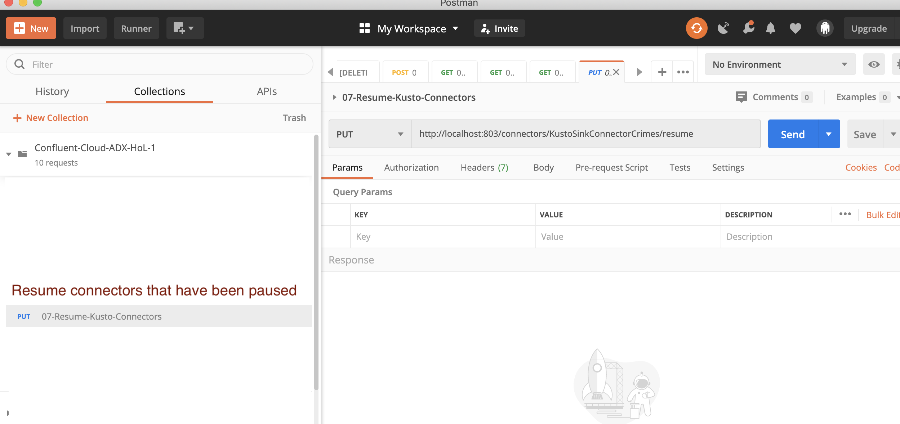
<br>
<br>
<hr>
<br>

### 9.10. List all individual connector tasks with status

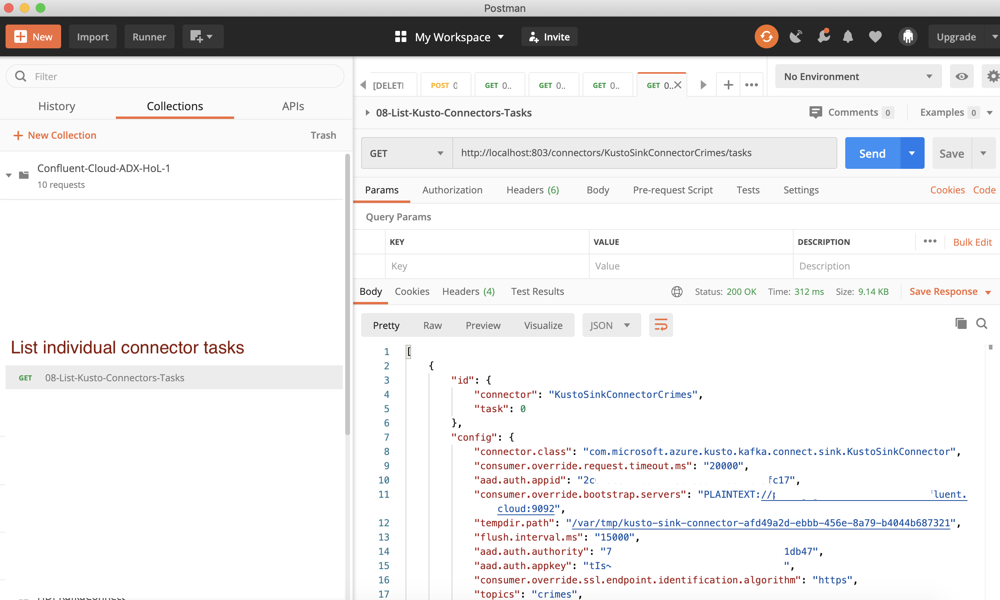
<br>
<br>
<hr>
<br>

### 9.11. Restart connectors when needed

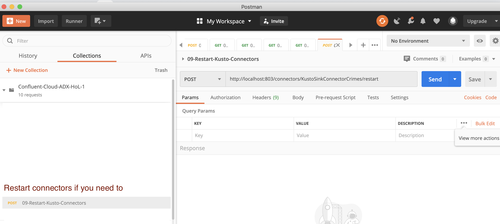
<br>
<br>
<hr>
<br>

### 9.12. Delete connectors altogether

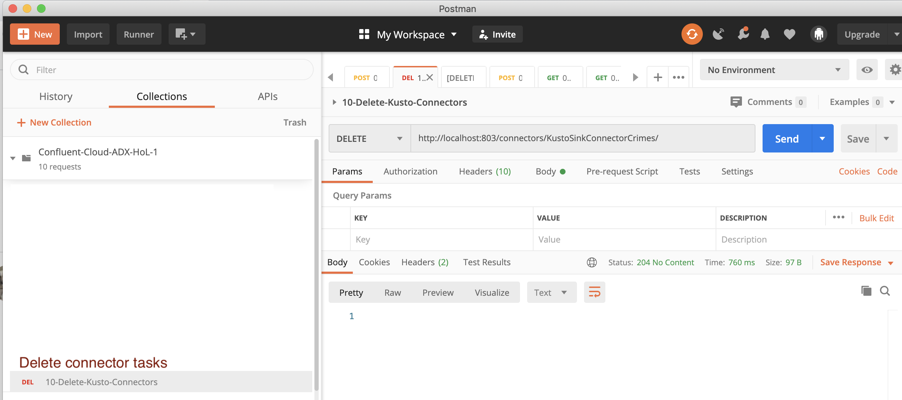
<br>
<br>
<hr>
<br>

<br><br><hr>


## 10. Uninstall Kafka Connect from your AKS cluster
This is strictly informational.
```
# 1. Get the service name
kubectl get svc
```

E.g.
```
gaia:~ akhanolk$ kubectl get svc
NAME                          TYPE        CLUSTER-IP     EXTERNAL-IP   PORT(S)    AGE
cp-kafka-connect-1598109267   ClusterIP   10.0.146.166   <none>        8083/TCP   15d
kubernetes                    ClusterIP   10.0.0.1       <none>        443/TCP    18d
```

Now uninstal referencing the service name-
```
# 2. Uninstall
helm uninstall <serviceName>
```

E.g.
```
gaia:~ akhanolk$ helm uninstall cp-kafka-connect-1598109267
release "cp-kafka-connect-1598109267" uninstalled

gaia:~ akhanolk$ kubectl get pods
No resources found in default namespace.
```

This concludes this module.  You can now proceed to the [next and last module](6-run-e2e.md), where we will run an end to end test.

#### Main menu
[Home page](README.md)<br>
[1. Provision foundational resources](1-foundational-resources.md)<br>
[2. Provision Confluent Cloud and configure Kafka](2-confluent-cloud.md)<br>
[3. Provision Azure Data Explorer, and associated database objects and permissions](3-adx.md)<br>
[4. Import the Spark Kafka producer code, and configure Spark to produce to your Confluent Cloud Kafka topic](4-configure-spark.md)<br>
[5. Configure the KafkaConnect cluster, launch connector tasks](5-configure-connector-cluster.md)<br>
[6. Run the end to end pipeline](6-run-e2e.md)<br>
<hr>

