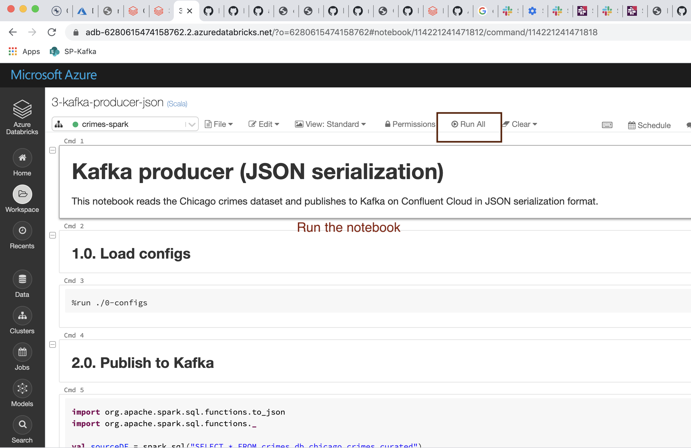
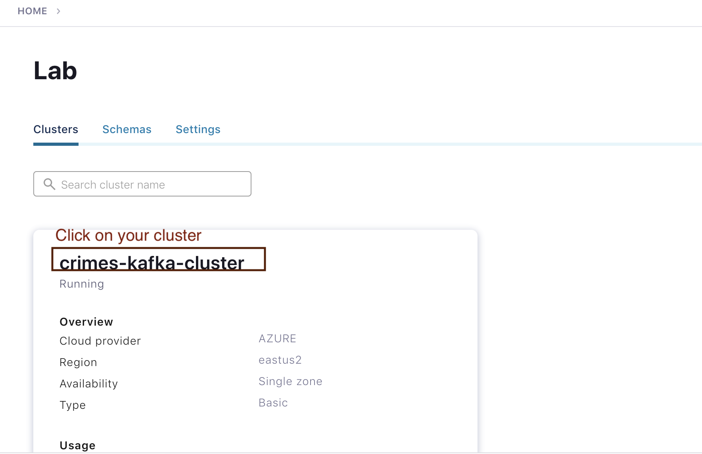
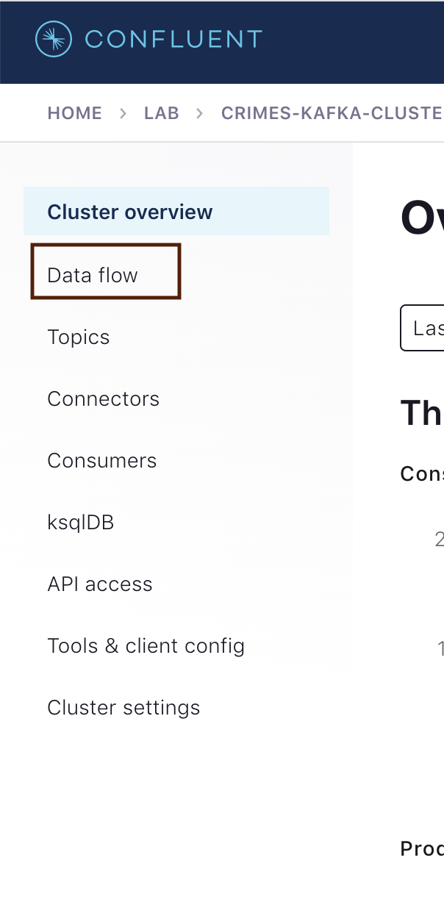
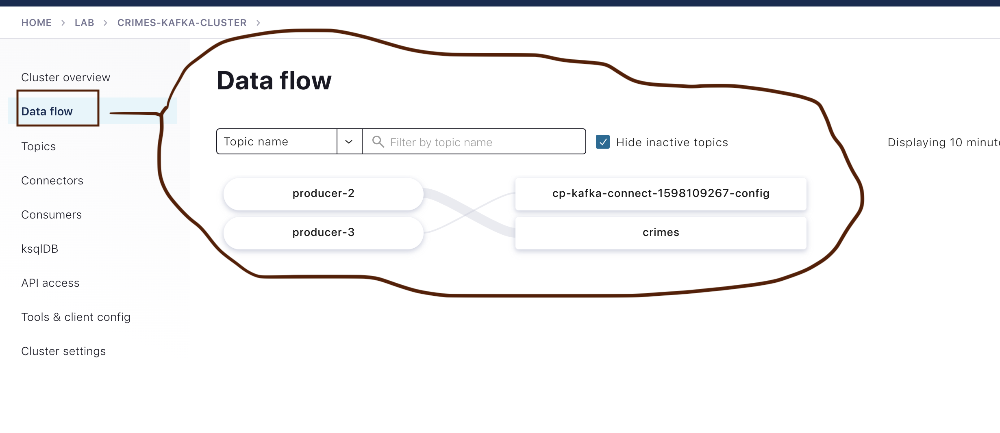
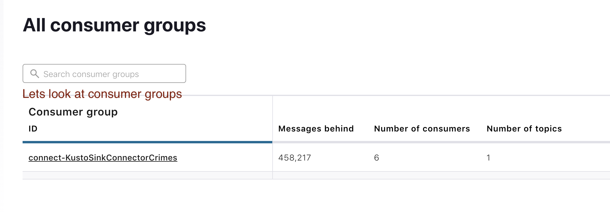
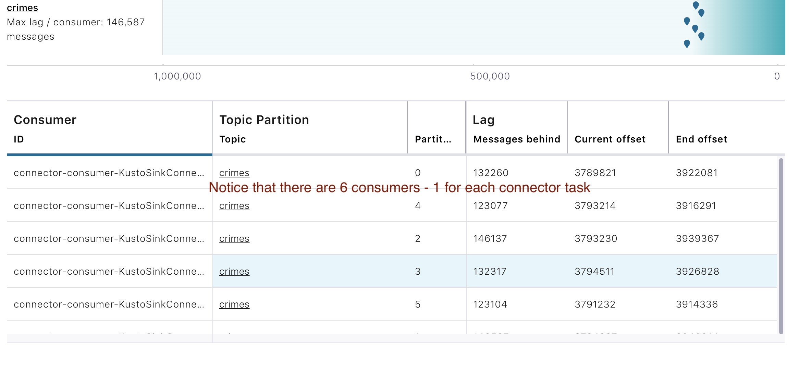
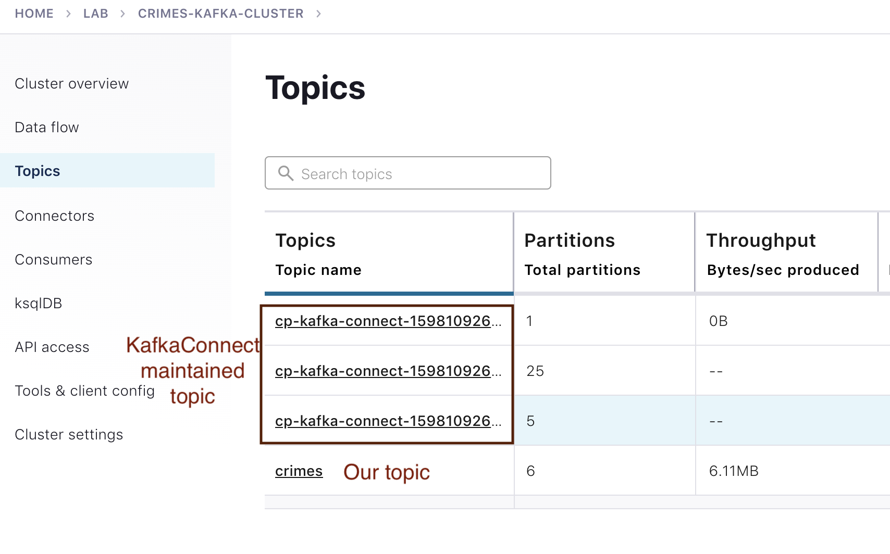
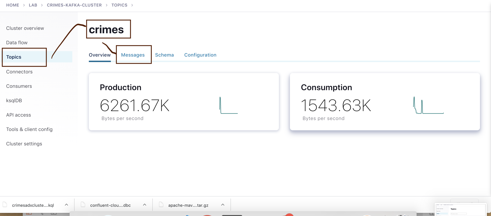
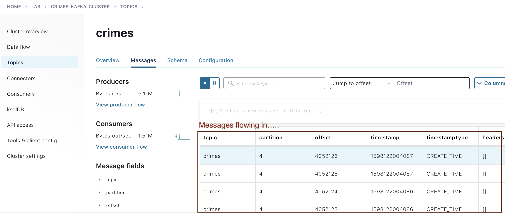

# About

In this module, we will publish data from Spark to Kafka and watch it flow through to ADX through the KafkaConnect integration pipeline.

## 1.  Run the Kafka producer in Spark on Azure Databricks

Log on to the Databricks cluster, ensure the cluster is running, if not start it.  Navigate to the Kafka producer notebook and run it.

 
 

 

## 2.  Watch the Kafka part of the pipeline in the Confluent Cloud 

Log on to the Confluent cloud cluster.

### 2.1. Click on your cluster

 
 

 

### 2.2. Click on Data Flow

 
 

 

### 2.3. Review the Data Flow

 
 

 

### 2.4. Click on consumer groups, then on the connect-* consumer group

 
 

 

### 2.6. Review the consumers in the consumer group and their mapping to partitions
Each consumer is a connector task.

 
 

 

### 2.7. Review the topics
Notice the three topics created by KafkaConnect and also our topic - "crimes".  Lets click on "crimes".

 
 

 

### 2.8. The crimes topic - a pictorial view

Click on messages while here.

 
 

 

### 2.9. Watch the live messages streaming in and displayed

 
 

 
