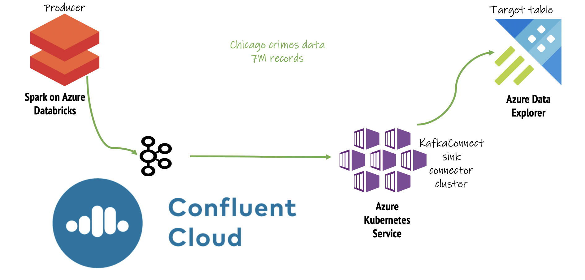

# 1. Hands-on-Lab: Azure Data Explorer integration with Kafka on Confluent Cloud managed PaaS

This lab details usage of self-managed Azure Data Explorer KafkaConnect sink connector with Confluent Cloud on Azure. 

[KafkaConnect](https://kafka.apache.org/documentation.html#connect) is an open source Apache Kafka framework for reliably and scalably integration Kafka with other systems with zero code and just configuration.  Azure Data Explorer has an open source KafkaConnect sink connector and is the focal point of this lab.

## 1. Pictorial overview of the lab

 
 

 

## 2.  Lab summary

The lab showcases very basic Kafka ingestion into ADX. It does not feature a real time usecase, and does not include some of the streaming capabilities of Confluent Cloud, and Kafka in general, to keep the lab simple and **Azure Data Explorer integration** focused. 

Essentially the following are the aspects covered in the lab; Each aspect covered includes provisioning (screenshots included), code, step-by-step instructions, commands and the outcome- 

### 2.1.  The data
We will use the Chicago crimes public dataset.  It is about 7 million records. 

### 2.2. Kafka on Azure
We will leverage Confluent Cloud on Azure

### 2.3. Kafka producer
We will use Spark on Databricks to publish to Kafka, as its a PaaS, easy to provision and use, for the simplicity of use of notebooks, and the distributed nature and the robust integration of Spark with Kafka.  

### 2.4. KafkaConnect cluster for integration
We will use Azure Kubernetes Service (AKS), collectively AKS and Kubernetes in general make a great platform for distributed KafkaConnect.

### 2.5. Azure Data Explorer cluster as the sink
For the purpose of simplicity, we will use a cluster that is not in a virtual network.

## 3. Other details

### 3.1. Audience for the lab

Any data practitioner - architect or developer.

### 3.2. Duration

Depends on your knowledge of Azure, and technologies included.  It should take about 8-12 hours if you are entirely unfamiliar.

### 3.3. Azure credit needed

Approximately $300-$600 - depends on familiarity worth services and Azure, and whether you work contiunously.

## 4. THE LAB - lets get started
Follow sequentially, every module through completion.

[1. Provision foundational resources](1-foundational-resources.md) 
[2. Provision Confluent Cloud and configure Kafka](2-confluent-cloud.md) 
[3. Provision Azure Data Explorer, and associated database objects and permissions](3-adx.md) 
[4. Import the Spark Kafka producer code, and configure Spark to produce to your Confluent Cloud Kafka topic](4-configure-spark.md) 
[5. Configure the KafkaConnect cluster, launch connector tasks](5-configure-connector-cluster.md) 
[6. Run the end to end pipeline](6-run-e2e.md) 

## 5. Resources

[About the KafkaConnect framework](https://kafka.apache.org/documentation.html#connect) 
[Confluent cloud on Azure](https://www.confluent.io/blog/confluent-cloud-managed-kafka-service-azure-marketplace/) 
[Azure Data Explorer docs](https://docs.microsoft.com/en-us/azure/data-explorer/) 
[Azure Data Explorer Kafka ingestion docs](https://docs.microsoft.com/en-us/azure/data-explorer/ingest-data-kafka) 
[Git repo for the KafkaConnect Kusto sink connector](https://github.com/Azure/kafka-sink-azure-kusto) 
[Confluent Connector Hub](https://www.confluent.io/hub/) 
[From Zero to Hero with KafkaConnect - webinar by Robin Moffat](https://www.youtube.com/watch?v=Jkcp28ki82k) 

