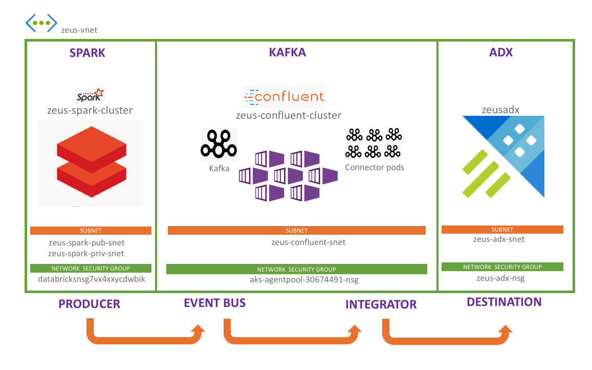

# About

This set of labs details using the Kafka connector thorough example, in a distributed mode (on k8s containers), with two flavors of Kafka -  
HDInsight 4.0 (Kafka 2.1 at the time of authoring) and 
Confluent Platform 5.5.0 with operator for k8s (Kafka 2.5 at the time of authoring)

# Lab resources

The resources used in the lab are-
### 1) Azure Data Explorer cluster
- Vnet injected ADX

### 2) Azure Databricks cluster
- Vnet injected Spark cluster for Spark connector testing, and to generate load for Kafka

### 3) HDInsight Kafka
- Vnet injected HDInsight Kafka (VMs)
- Kusto Kafka connectors on AKS for HDInsight Kafka

### 4) Confluent Kafka
- Vnet injected Confluent Kafka (AKS)
- Kusto Kafka connectors on the same Confluent Kafka cluster on dedicated nodes

# Provision foundational resources for the labs

Details are here

# Start the labs

1.  Distributed KafkaConnect with Confluent Platform 5.5.0 on Azure Kubernetes Service
2.  Distributed KafkaConnect with HDInsight Kafka 4.0, and connectors on Azure Kubernetes Service
