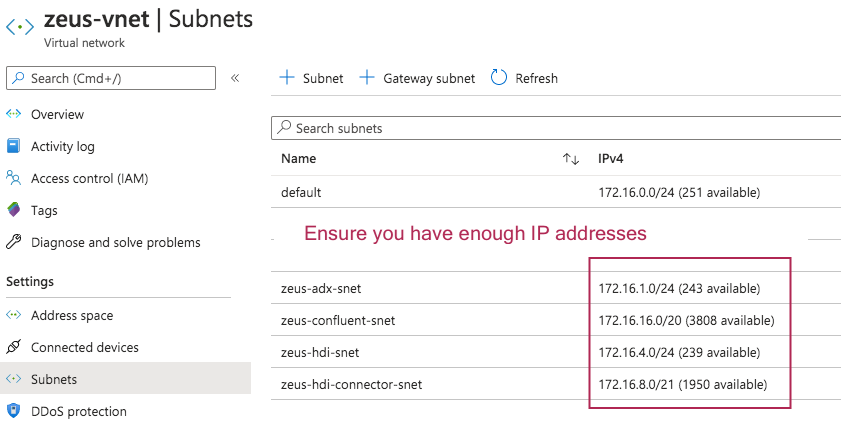

# KAFKA INTEGRATION LABS
 

# 1.0. About

This module covers creation of common resources across the two labs for distributed mode of KafkaConnect for ingestion into ADX.

# 2.0. Create resource group
Create a resource group in a region of your choice.  Be sure to provision all resources for the labs into this one. 
https://docs.microsoft.com/en-us/azure/azure-resource-manager/management/manage-resource-groups-portal#create-resource-groups

# 3.0. Create virtual network
Create a virtual network in the resource group, ensure you pick the same region as in #2.0. 
https://docs.microsoft.com/en-us/azure/virtual-network/quick-create-portal

# 4.0. Create subnets
Create subnets for the rest of the lab. 

 

# 5.0. Create an Azure Active Directory Service Prinicpal and Secret
Details are [here](create-spn.md)

# 6.0. Create an Azure Data Explorer (ADX) cluster
Details are [here](create-adx.md)

# 7.0. Create an Azure Storage Account v2
We will use this to download a public dataset and curate it.  This public dataset - Chicago crimes data will be used in the hands on lab.

Details are [here](create-storage.md)

# 8.0. Create an Azure Databricks Spark cluster

This concludes the common setup for the two labs - you can now proceed to work on the the distributed ingestion with either HDInsight Kafka or Confluent platform. 

[Distributed Kusto KafkaConnect with HDI Kafka]() | [Distributed Kusto KafkaConnect with Confluent Kafka]() 

