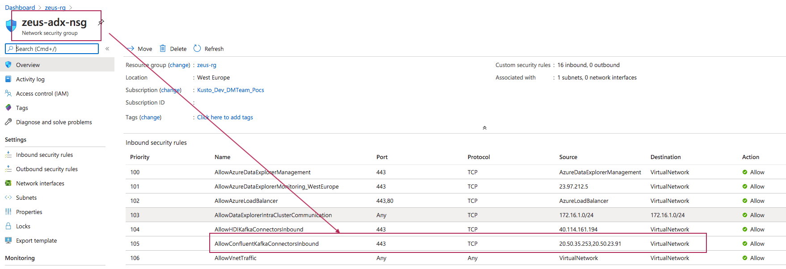

# 1.0. About

This module covers creation of common resources across the two labs.

# 2.0. Create resource group
Create a resource group in a region of your choice.  Be sure to provision all resources for the labs into this one. 
https://docs.microsoft.com/en-us/azure/azure-resource-manager/management/manage-resource-groups-portal#create-resource-groups

# 3.0. Create virtual network
Create a virtual network in the resource group, ensure you pick the same region as in #2.0. 
https://docs.microsoft.com/en-us/azure/virtual-network/quick-create-portal

# 4.0. Create subnets
Create subnets for the rest of the lab. 

 

# 5.0. Create an Azure Data Explorer (ADX) cluster

### 5.0.1. Create an NSG for ADX

Refer to the doc link below to determine what is the monitoring IP address for the Azure region you have chosen. 
We will need it to create an NSG inbound rule. 
https://docs.microsoft.com/en-us/azure/data-explorer/vnet-deployment#relevant-ip-addresses 

Create a network security group called adx-sng with these rules 
https://docs.microsoft.com/en-us/azure/virtual-network/manage-network-security-group#create-a-network-security-group 

 

# 5.0. Create an Azure Databricks Spark cluster

# 6.0. Import Spark code into the cluster

