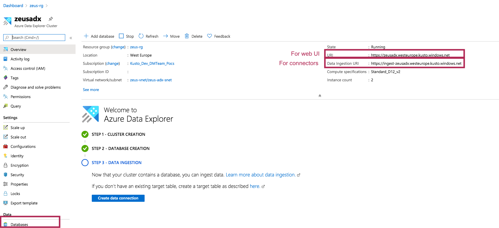
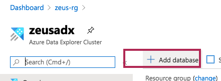
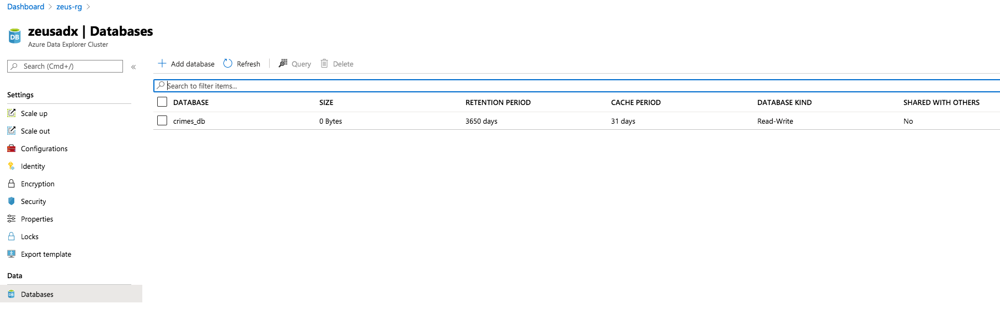
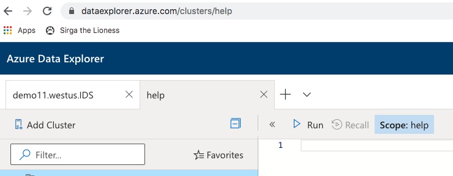
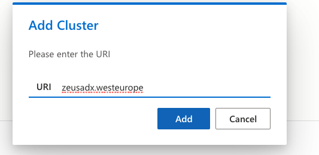
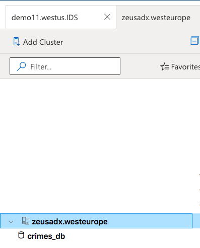

# KAFKA INTEGRATION LAB

[Common resources menu for distributed KafkaConnect mode for ingestion into ADX](README.md)

# 1. FOCUS: AZURE DATA EXPLORER CLUSTER
This module details creation of a Vnet injected ADX cluster.

# 2. Create an NSG for ADX
Navigate to the resource group you created on the portal.

Refer to the doc link below to determine what is the monitoring IP address for the Azure region you have chosen. 
We will need it to create an NSG inbound rule. 
https://docs.microsoft.com/en-us/azure/data-explorer/vnet-deployment#relevant-ip-addresses 

Create a network security group called adx-sng, in the right Azure region, with these rules 
https://docs.microsoft.com/en-us/azure/virtual-network/manage-network-security-group#create-a-network-security-group 

 

# 3. Associate the NSG with the ADX subnet

 

# 4. Provision a Public IP for the engine and Public IP for the data management service

Follow steps here... 
https://docs.microsoft.com/en-us/azure/data-explorer/vnet-create-cluster-portal#create-public-ip-addresses

 

 

# 5. Provision a Vnet injected ADX cluster
Follow the instructions here.
https://docs.microsoft.com/en-us/azure/data-explorer/vnet-deployment

# 6. ADX cluster - URLs and database

 

The two URLS are important-

Ingest URL:
https://ingest-zeusadx.westeurope.kusto.windows.net

Web UI:
https://zeusadx.westeurope.kusto.windows.net

# 7. Create an ADX database in the cluster you created above

 

 

# 8. Launch the web UI and connect to the cluster

 

 

# 9. Create tables and permissions in the Web UI 

We will actually cover this separately under the individual lab modules for HDInsight and Confluent separately.

 

This concludes this provisioning and setup module.

[Common resources menu for distributed KafkaConnect](README.md)
