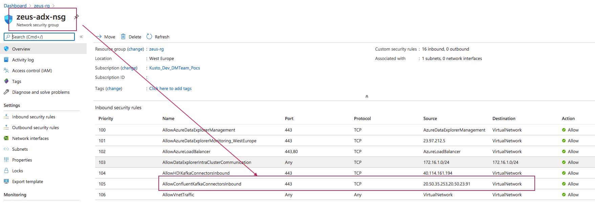
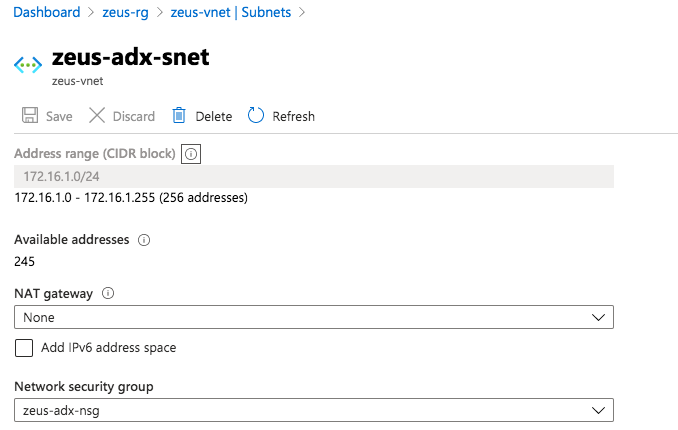
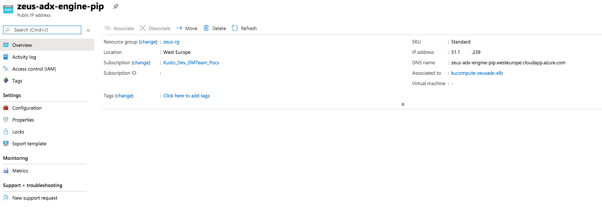
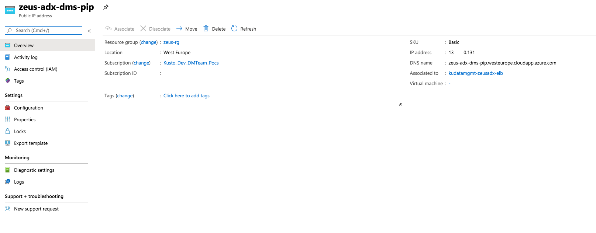

# About
This module details creation of a Vnet injected cluster.

# 1. Create an NSG for ADX
Navigate to the resource group you created on the portal.

Refer to the doc link below to determine what is the monitoring IP address for the Azure region you have chosen. 
We will need it to create an NSG inbound rule. 
https://docs.microsoft.com/en-us/azure/data-explorer/vnet-deployment#relevant-ip-addresses 

Create a network security group called adx-sng, in the right Azure region, with these rules 
https://docs.microsoft.com/en-us/azure/virtual-network/manage-network-security-group#create-a-network-security-group 

 

# 2. Create two public IP addresses for ADX's load balancers for the Data Management Service and Engine

https://docs.microsoft.com/en-us/azure/data-explorer/vnet-create-cluster-portal#create-public-ip-addresses

# 3. Associate the NSG with the ADX subnet

 

# 4. Provision Engine Public IP and DMS Public IP

Follow steps here...
https://docs.microsoft.com/en-us/azure/data-explorer/vnet-create-cluster-portal#create-public-ip-addresses

 

 

# 5. Provision Vnet injected cluster
Follow the instructions here.
https://docs.microsoft.com/en-us/azure/data-explorer/vnet-deployment

# 6. ADX cluster - URLs and database

The two URLS are important-

Ingest URL:
https://ingest-zeusadx.westeurope.kusto.windows.net

Web UI:
https://zeusadx.westeurope.kusto.windows.net

# 7. Create an ADX database in the cluster you created above

# 8. Launch the web UI and connect to the cluster

# 9. Create tables and permissions in the Web UI as shown below
