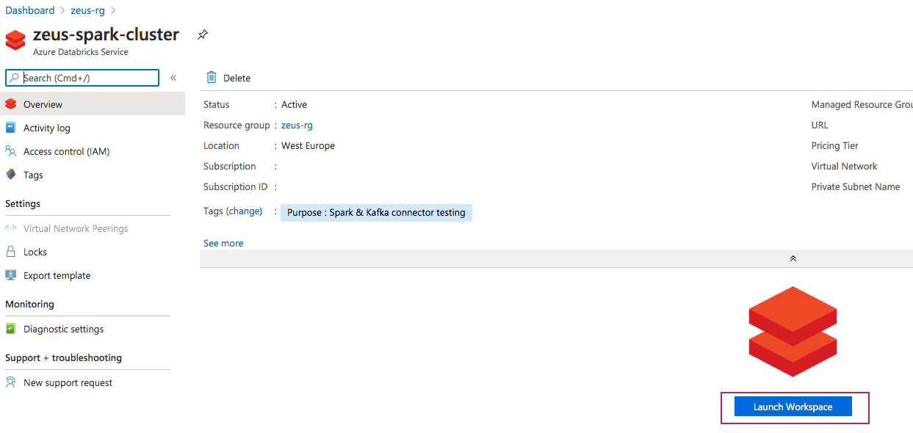
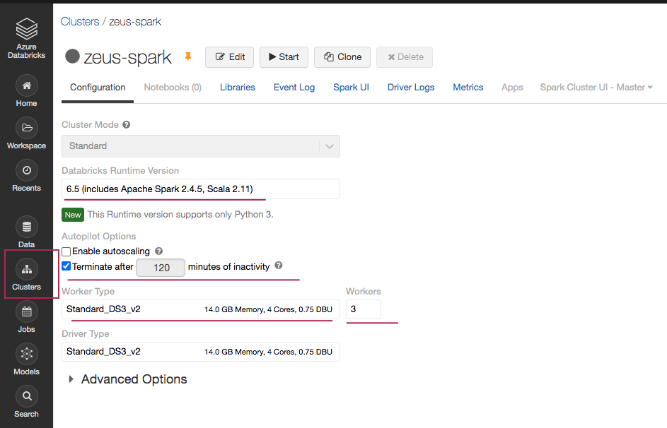
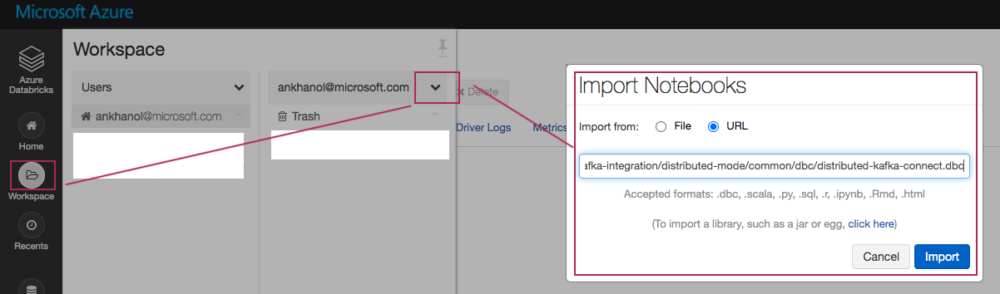
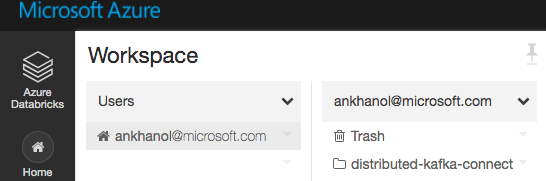
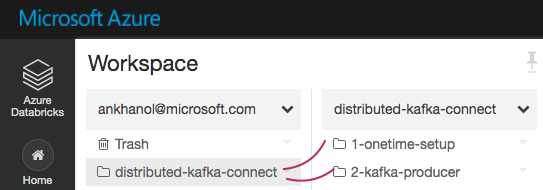
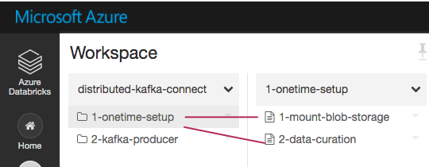
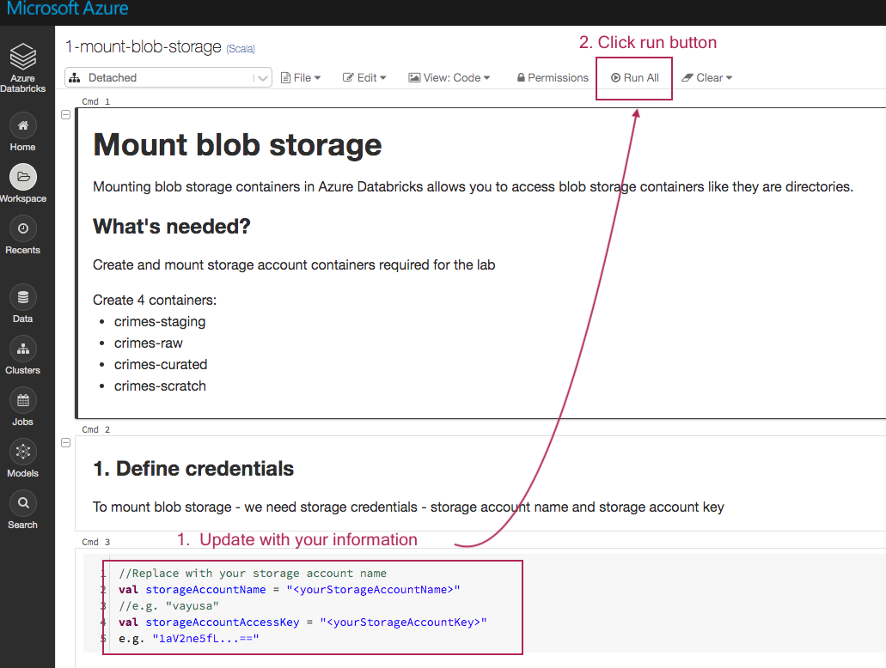
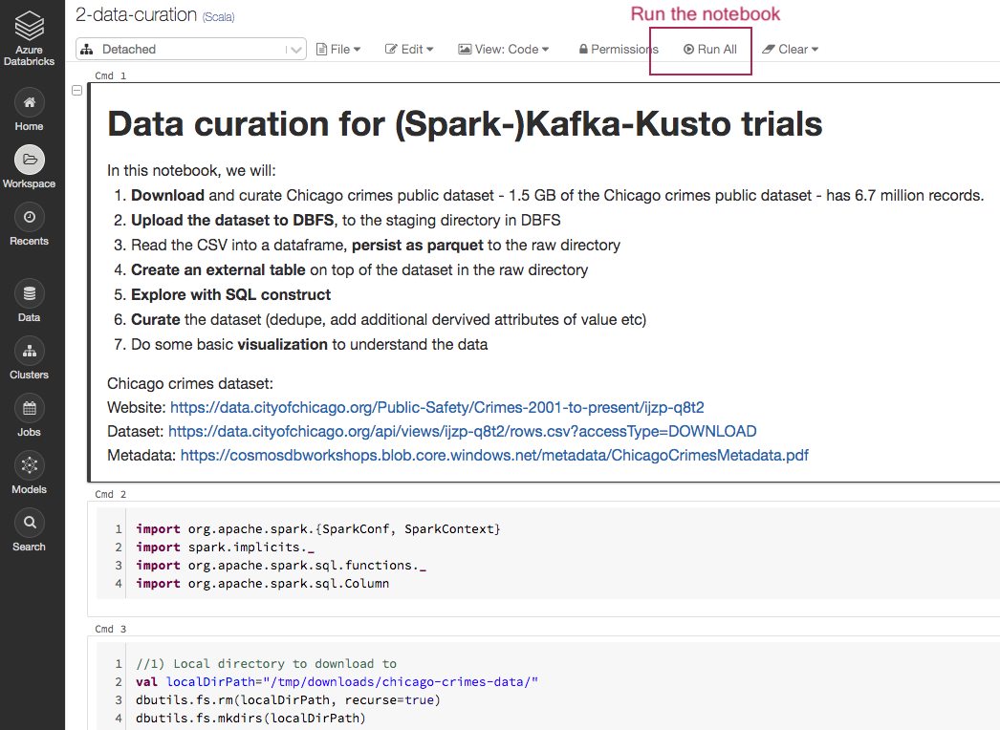
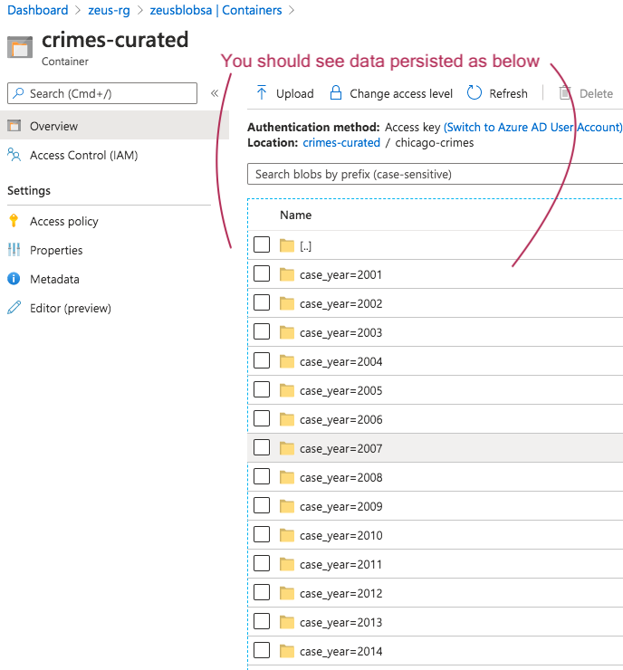

# KAFKA INTEGRATION LAB

[Common resources menu for distributed KafkaConnect mode for ingestion into ADX](README.md)

# 1. About
This module covers-
1.  Provisioning Azure Databricks
2.  Importing the lab code into the Datarbicks workspace
3.  Completing one time activities - like mounting storage and downloading, curating a public dataset for use in the lab.

# 2. Provisioning
- Details for provisioning a Vnet injected Databricks Spark cluster is available in Azure Databricks docs [here](https://docs.microsoft.com/en-us/azure/databricks/administration-guide/cloud-configurations/azure/vnet-inject).
- The author injected the cluster into zeus-vnet and specified two subnets - spark-priv-snet and spark-pub-snet that Databricks created.
- Databricks automatically created a network security group for the service, and associated it with the subnet.

# 3. Create a Spark cluster within your Databricks workspace
Go to you resource group and click on the databricks (red tile) icon. 
Create a cluster as shown below. 
Go with defaults, create 3 worker nodes with the default SKU, the default runitme.

 

 

# 3. Code

A DBC that covers basic Kafka producer code, is [here](dbc).  Capture the URL on to you clickboard.  You will need it in the next step.

# 4. Import the DBC into your user home

Follow the steps below to import it into your user home directory, in the Databricks workspace.

 

 

 

 

 

 

 

This concludes this provisioning and set up module.

[Common resources menu for distributed KafkaConnect](README.md)

