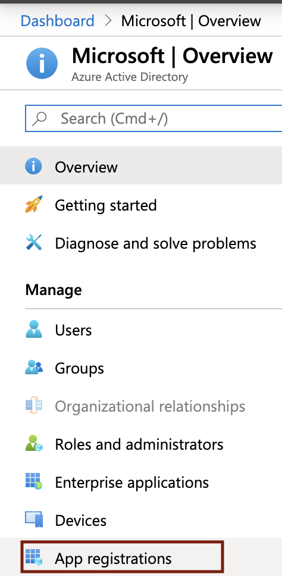
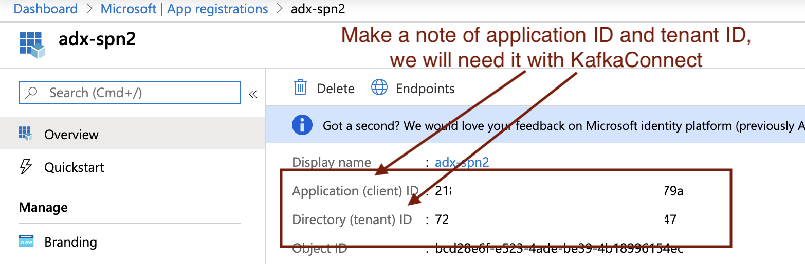
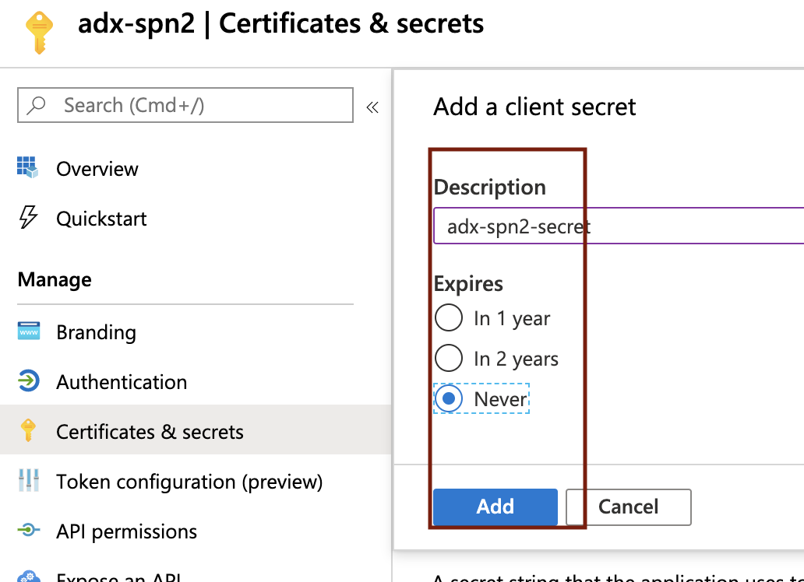
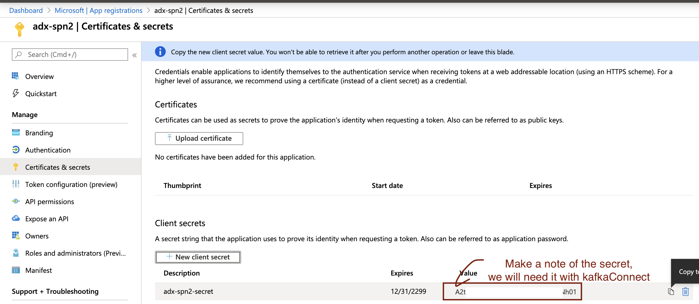

# KAFKA INTEGRATION LAB

[Common resources menu for distributed KafkaConnect mode for ingestion into ADX](README.md)

# 1. About
This module covers provisioning an Azure Active Directory (AAD) Service Principal (SPN).  We will leverage this SPN to sink to ADX from Kafka.   

Navigate to portal.azure.com on your browser and follow the steps below: 

### 1. Click on Azure Active Directory

 

 

### 2. Click on App Registrations

 

 

### 3. Click on New Registration

 

 

### 4. Enter details as described

 

 

### 5. A service principal name/SPN gets created.  Make a note of the application/client ID and tenant ID; We will need this in the KafkaConnect module

 

 

### 6. Click on certificates and secrets; We will create a secret for the SPN

 

 

### 7. Click on new secret

 

 

### 8. Enter details and "add"

 

 

### 9. Make a note of the secret, it wont be available after.  We will need this in the KafkaConnect module

 

 

### 10.  You will need these three AAD related details in subsequent modules.  Make a note.

1.  AAD tenant ID
2.  AAD Service Principal application ID
3.  AAD Service Principal secret

This concludes the module. 

[Common resources menu for distributed KafkaConnect](README.md)
