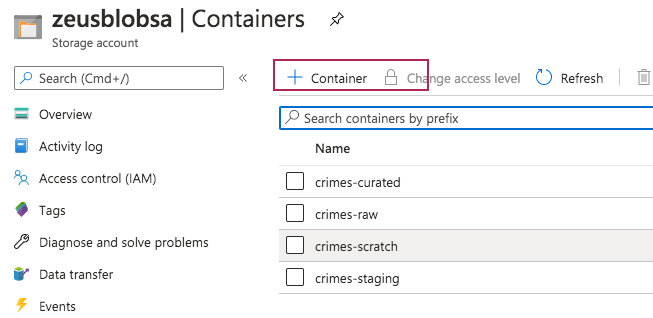
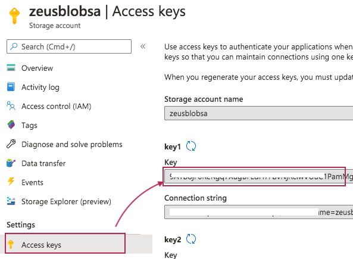

 # KAFKA INTEGRATION LAB

[Common resources menu for distributed KafkaConnect mode for ingestion into ADX](README.md)

# 1. FOCUS: AZURE STORAGE ACCOUNT V2
This module covers provisioning an Azure Storage Account v2, hot, blob, LRS account.  We will leverage this account to download a public dataset, curate it for use for the lab in Databricks.   

### 1. Create storage account

Navigate to portal.azure.com on your browser, into your resource group.  Create the storage account as detailed here, be sure to pick the right Azure region.
https://docs.microsoft.com/en-us/azure/storage/common/storage-account-create?tabs=azure-portal#create-a-storage-account

### 2. Create storage containers

 

 

### 3. Capture storage account name and key for subsequent use in Spark

 

 

This concludes this provisioning module.

[Common resources menu for distributed KafkaConnect](README.md)
