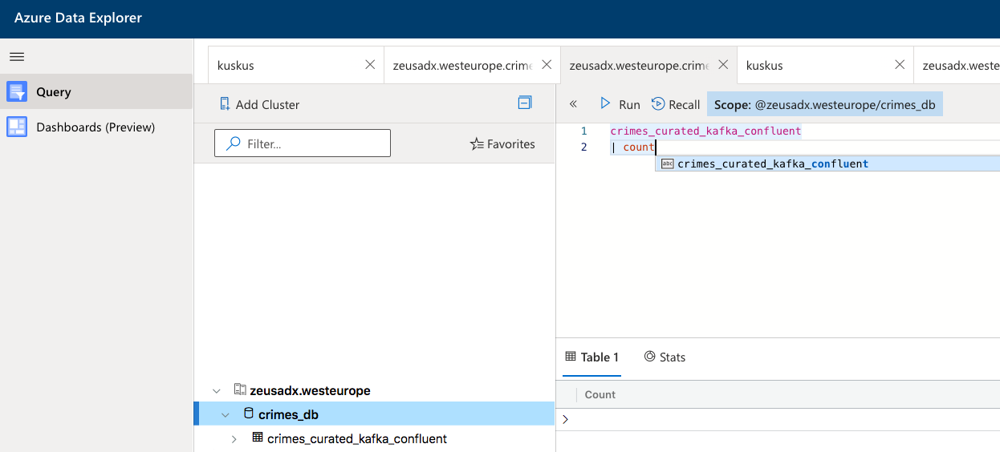

#### KAFKA INTEGRATION LAB SERIES

[Menu for distributed Kafka ingestion](../README.md)
<hr>

# 1. About

This is the home page of the ADX Kafka ingestion lab in distributed mode with Confluent Platform for Kafka.
It covers:
1.  Provisioning Confluent Platform on AKS
2.  Publishing events to Kafka from Spark on Azure Databricks
3.  Consuming from Kafka and sinking to ADX with KafkaConnect ADX connector plugin


This is a lengthy lab, dedicate 8-16 hours for this hands on lab if you are ne to Azure and all the distributed systems featured in this lab.

# 2. Pre-requisites

This lab required the foundational resources provisioned, as detailed [here.](../common/README.md)

# 3. Provision an Azure Kubernetes Service cluster
The Azure Kubernetes Cluster (AKS) will serve as the underlying infrastructure for Kafka.  Details for provisioning are [here.](create-aks.md)

# 4. Download Confluent operator and edit configuration files 
We will download Confluent operator locally on your developer machine and edit confirguation files as needed for the lab.  <br>
Details are [here.](download-operator.md)

# 5. Create a Docker image of Confluent operator with the ADX KafkaConnect jar and publish to Docker hub
1. We will create a Docker image that includes the Confluent operator for Connect, and the ADX KafkaConnect connector jar, and publish to Docker hub.
2.  We will edit our Azure specific YAML from #4 to leverage this new Docker image

Details are [here.](bake-connector-image.md)


# 6. Install Confluent platform on AKS
The following are the steps-
1.  Install [Confluent operator](install-operator.md)
2.  Install [Zookeeper service](install-zookeeper.md)
3.  Install [Broker service](install-broker.md)
4.  Install [Confluent Control Center](install-control-center.md)
5.  Install [KafkaConnect connectors](install-connect.md)
6.  Create a [Kafka topic](create-kafka-topic.md)

# 7.  Create table in ADX
Details are [here](create-adx-table.md)

# 8. Update ADX NSG for the AKS Public IP
Details are [here](update-adx-nsg.md)

# 9. Produce to the Kafka topic from Spark
Details are [here](produce-to-kafka.md)


# 10. Verify connectors are running

On CLI, execute the below...

```
kubectl get pods -n operator | grep connectors*
```

You should see this...
```
connectors-0                   1/1     Running   0          15d
connectors-1                   1/1     Running   0          15d
connectors-2                   1/1     Running   0          15d
connectors-3                   1/1     Running   0          15d
connectors-4                   1/1     Running   0          15d
connectors-5                   1/1     Running   0          15d
```

Lets look at logs on connectors-3...
```
kubectl logs connectors-3 -n operator
```

Sample output indicating Kusto connector is running...
```
[INFO] 2020-06-03 13:46:44,729 [pool-20-thread-1] com.microsoft.aad.adal4j.AuthenticationAuthority doInstanceDiscovery - [Correlation ID: 316880bf-8f01-4002-8697-ed4a2e01e9dc] Instance discovery was successful
[INFO] 2020-06-03 13:46:54,731 [Timer-0] com.microsoft.azure.kusto.ingest.ResourceManager refreshIngestionResources - Refreshing Ingestion Resources
[INFO] 2020-06-03 14:46:44,728 [Timer-0] com.microsoft.azure.kusto.ingest.ResourceManager refreshIngestionAuthToken - Refreshing Ingestion Auth Token
[INFO] 2020-06-03 14:46:54,731 [Timer-0] com.microsoft.azure.kusto.ingest.ResourceManager refreshIngestionResources - Refreshing Ingestion Resources
[INFO] 2020-06-03 15:46:44,728 [Timer-0] com.microsoft.azure.kusto.ingest.ResourceManager refreshIngestionAuthToken - Refreshing Ingestion Auth Token
[INFO] 2020-06-03 15:46:54,731 [Timer-0] com.microsoft.azure.kusto.ingest.ResourceManager refreshIngestionResources - Refreshing Ingestion Resources
[INFO] 2020-06-03 16:46:44,728 [Timer-0] com.microsoft.azure.kusto.ingest.ResourceManager refreshIngestionAuthToken - Refreshing Ingestion Auth Token
[INFO] 2020-06-03 16:46:54,731 [Timer-0] com.microsoft.azure.kusto.ingest.ResourceManager refreshIngestionResources - Refreshing Ingestion Resources
[INFO] 2020-06-03 17:46:44,728 [Timer-0] com.microsoft.azure.kusto.ingest.ResourceManager refreshIngestionAuthToken - Refreshing Ingestion Auth Token
[INFO] 2020-06-03 17:46:54,731 [Timer-0] com.microsoft.azure.kusto.ingest.ResourceManager refreshIngestionResources - Refreshing Ingestion Resources
```

# 11. Verify data delivery to ADX

Go to the Data Explorer web UI and run a query and you should see the record count steadily increasing.


<br>
<hr>
<hr>
This concludes the lab.

[Menu for distributed Kafka ingestion](../README.md)


