# 1. About

# 2. Provision AKS

Create an AKS cluster in a Vnet with 9 nodes 
Standard D4s v3 (4 vcpus, 16 GiB memory) 
We will run 3 brokes, 1 or a node; 3 zookeepers, one on each node; 6 connectors, 2 on each node of the remaining 3 nodes 

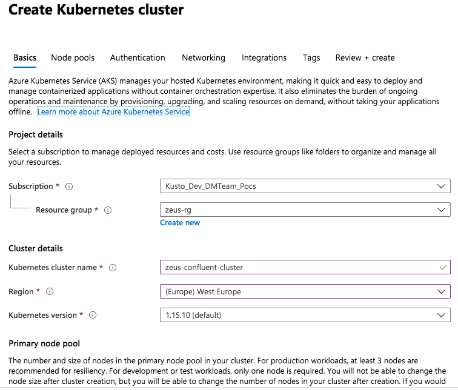
 

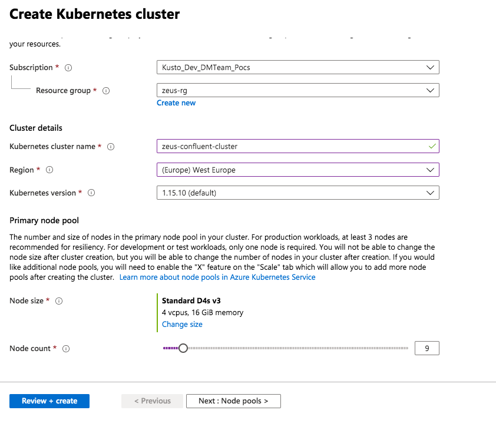
 

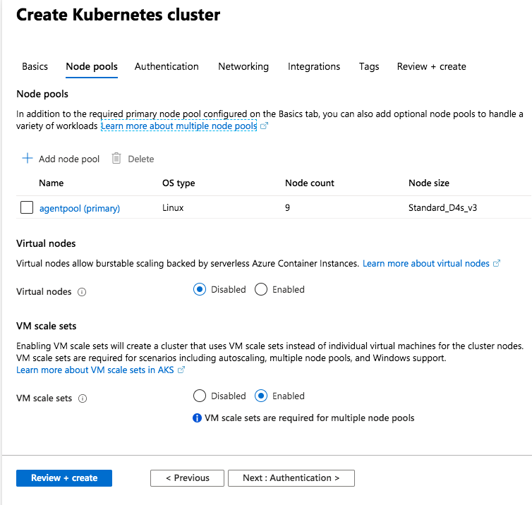
 

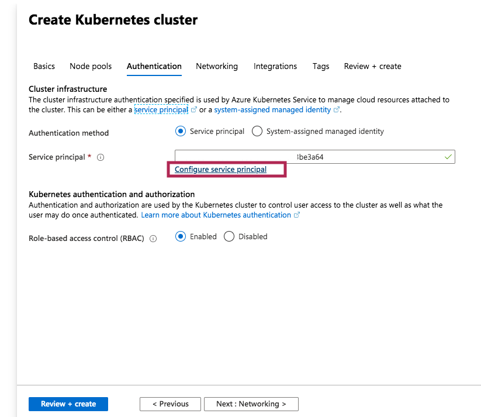
 

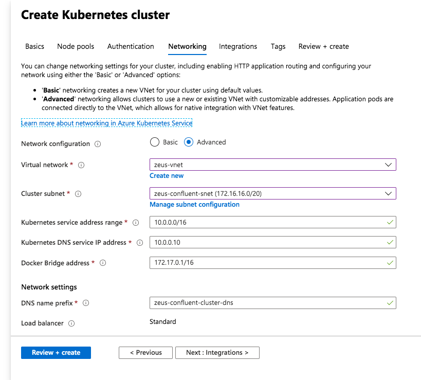
 

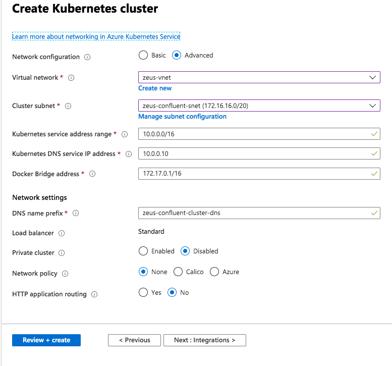
 

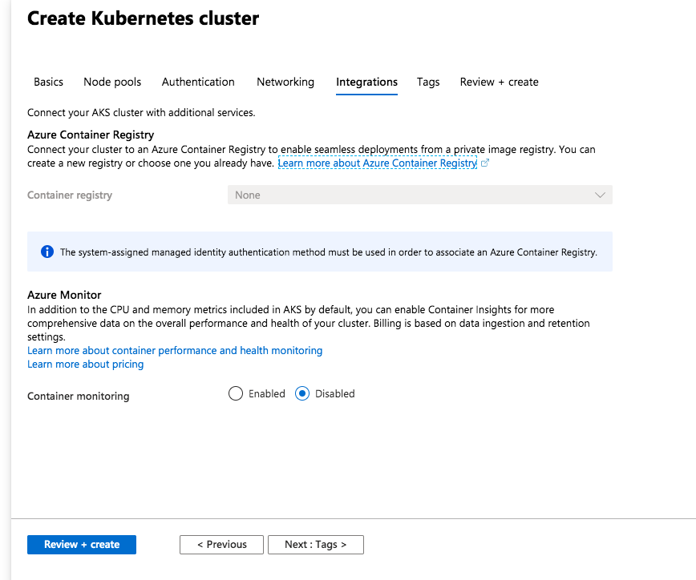
 

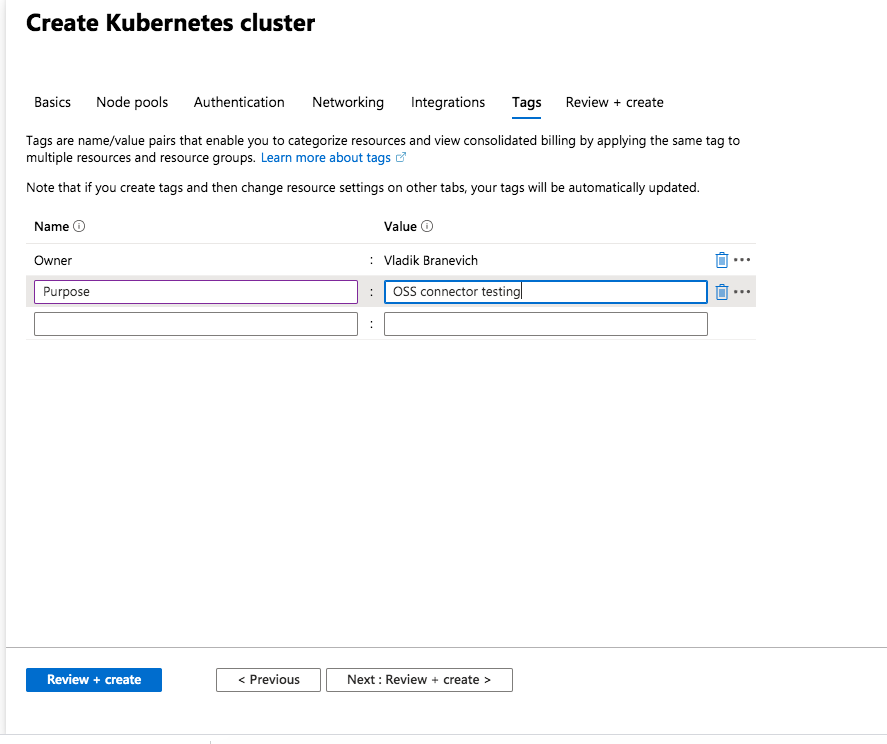
 

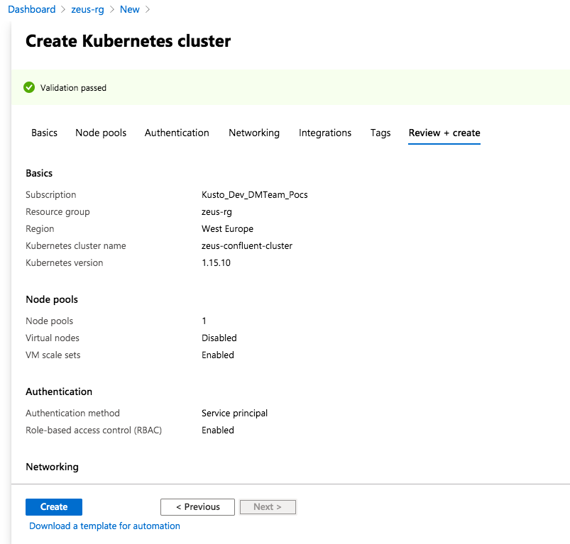
 

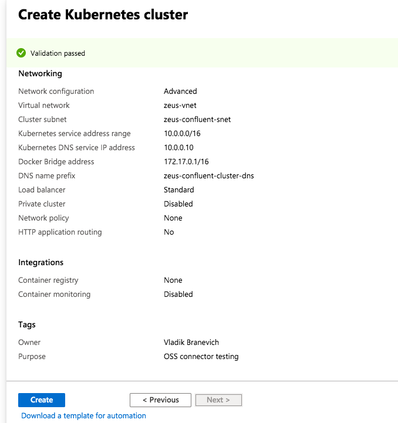
 

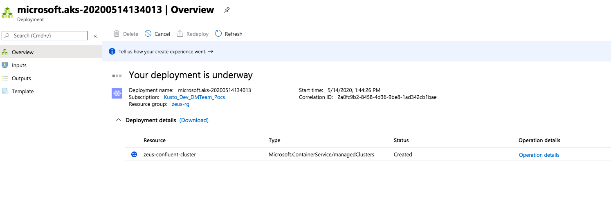
 

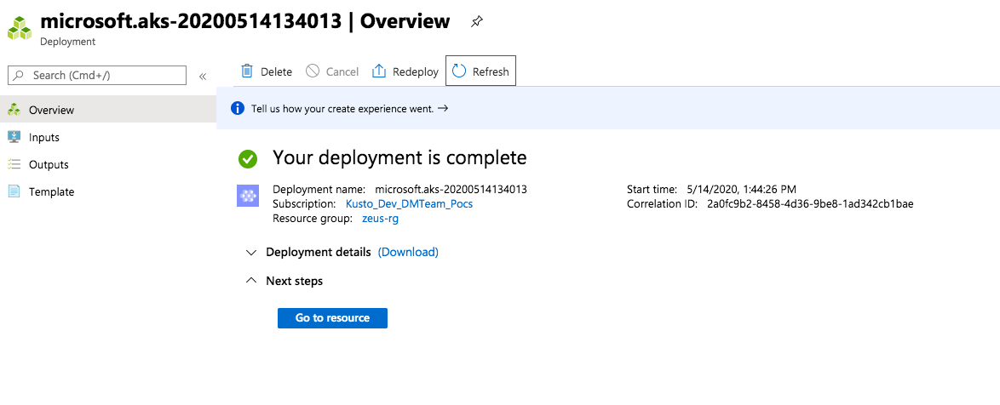
 

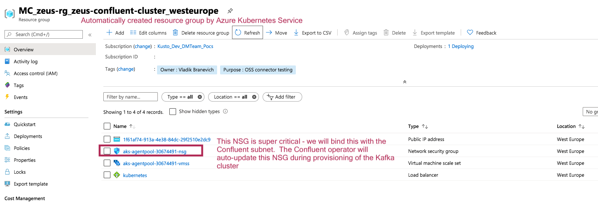
 

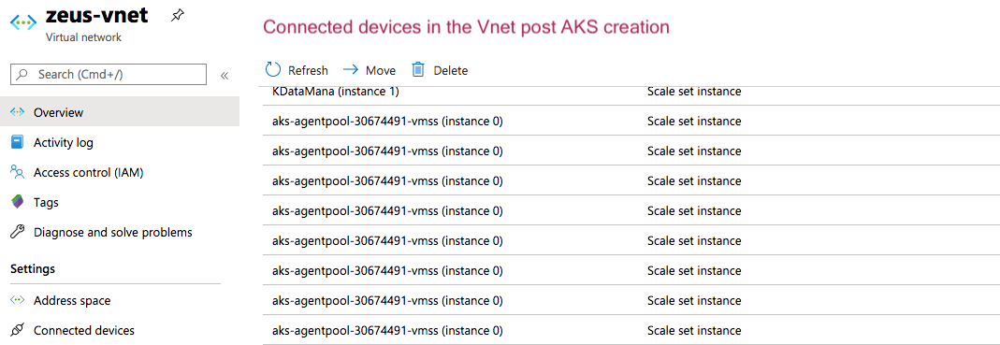
 

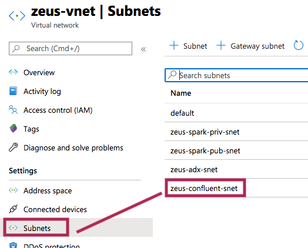
 

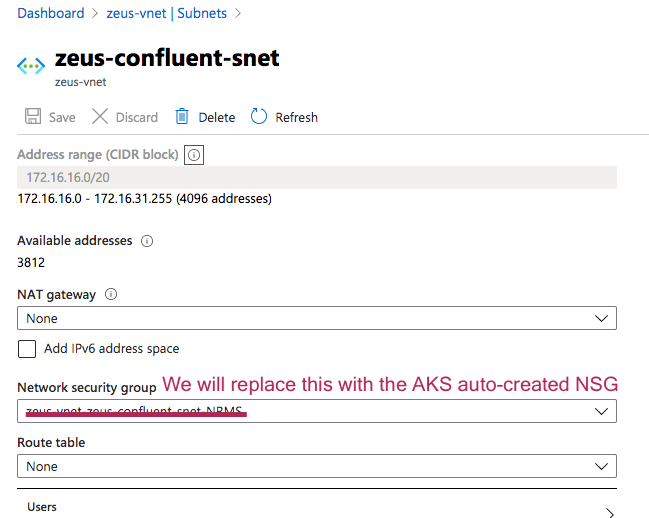
 

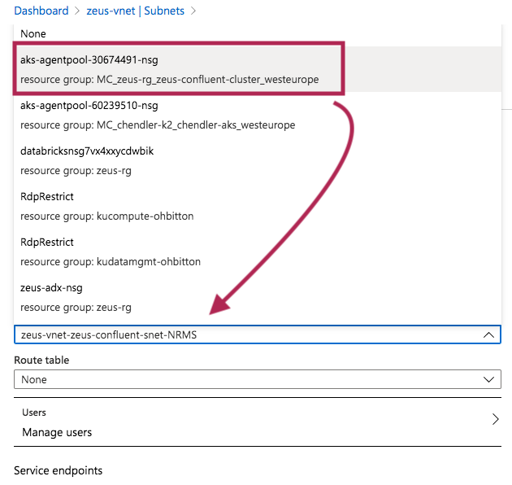
 

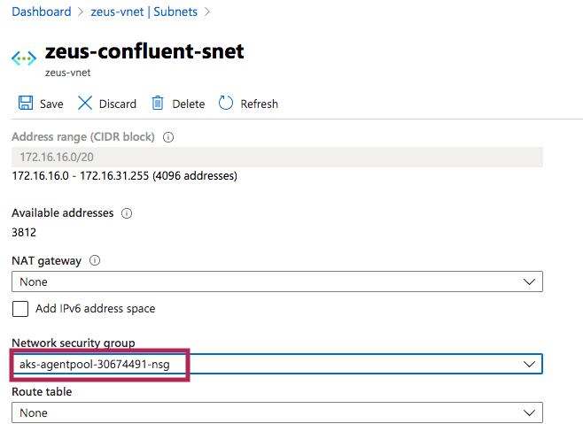
 

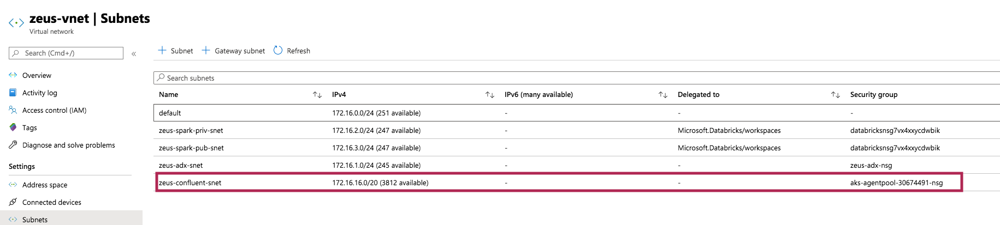
 

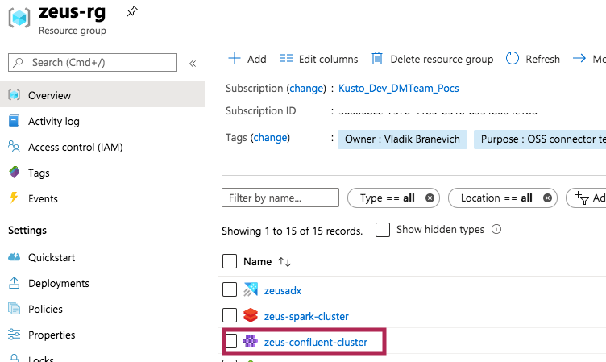
 

### 2.3. Persistent storage
AKS can auto provision disks, no need to do so upfront
