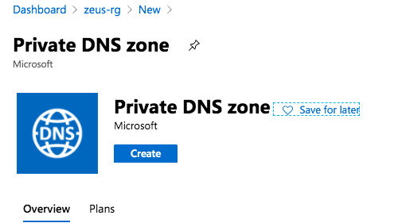
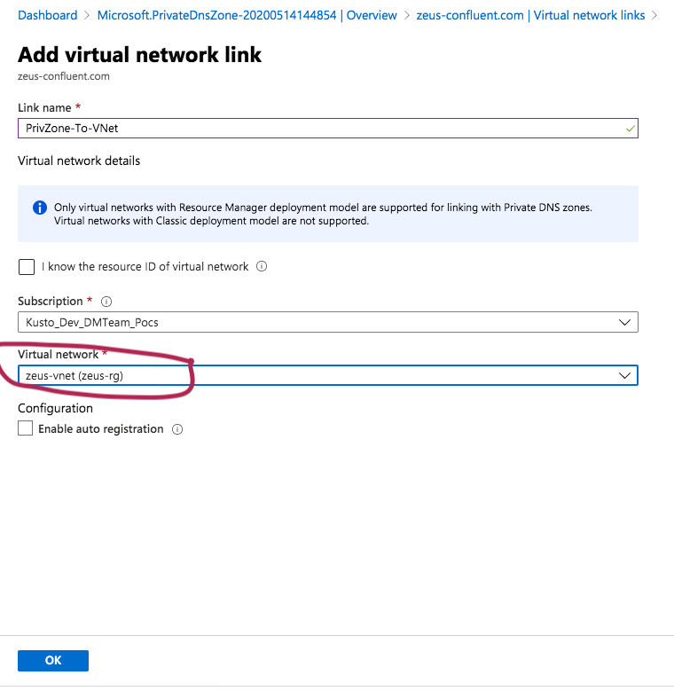

##### KAFKA INTEGRATION LABS

[Distributed Kafka ingestion with Confluent Platform](README.md)
<hr>

# 1. FOCUS: INSTALL BROKER
This document details broker setup.<br>

[Kafka brokers installation](install-broker.md#2-kafka-brokers-installation)<br>
[Azure DNS private zone creation](install-broker.md#3-azure-dns-private-zone-creation)<br>
[Smoke test](install-broker.md#4-smoke-test)<br>

# 2. Kafka brokers installation

### 2.1. Ensure all pods are running..

```
kubectl get pods -n operator
```
Output...
```
NAME                           READY   STATUS    RESTARTS   AGE
cc-operator-67b8f68f6f-zm4bq   1/1     Running   0          17m
zookeeper-0                    1/1     Running   0          12m
zookeeper-1                    1/1     Running   0          12m
zookeeper-2                    1/1     Running   0          12m
```

### 2.2. Install

The command...
```
helm install kafka ./confluent-operator --values $VALUES_FILE --namespace operator --set kafka.enabled=true
```

The output...
```
NAME: kafka
LAST DEPLOYED: Thu May 14 14:32:15 2020
NAMESPACE: operator
STATUS: deployed
REVISION: 1
TEST SUITE: None
NOTES:
Kafka Cluster Deployment

Kafka Cluster is deployed to kubernetes through CR Object


  1. Validate if Kafka Custom Resource (CR) is created

     kubectl get kafka -n operator | grep kafka

  2. Check the status/events of CR: kafka

     kubectl describe kafka kafka -n operator

  3. Check if Kafka cluster is Ready

     kubectl get kafka kafka -ojson -n operator

     kubectl get kafka kafka -ojsonpath='{.status.phase}' -n operator

  4.  Broker Listener (Protocol/Port)

      External Listener: kubectl  -n operator  get kafka kafka -ojsonpath='{.status.brokerExternalListener}'
      Internal Listener: kubectl  -n operator  get kafka kafka -ojsonpath='{.status.brokerInternalListener}'

      Note: If Protocol is SSL, configure truststore (https://docs.confluent.io/current/kafka/encryption.html#clients) and keystore 
        (https://docs.confluent.io/current/kafka/authentication_ssl.html#clients) if client Authentication is enabled (
        kubectl  -n operator  get kafka kafka -ojsonpath='{.status.clientAuthentication}' )

  5. Update/Upgrade Kafka Cluster

     The upgrade can be done either through the helm upgrade or by editing the CR directly as below;

     kubectl edit kafka kafka  -n operator

     Note: Switching Kafka security requires manual restart of all the dependent components as the JAAS configuration changes is required.

  6. All Kafka Information like zookeeper connect, replications factor, isr, Client Jaas Configuration
     and much more can be found on the Status section of CR.

     kubectl get kafka kafka -n operator -oyaml

  7. Client Access:

     Run below command to validate if Kafka cluster is working.

     1. Get the Client Jaas Information 
        External : kubectl  -n operator  get kafka kafka -ojsonpath='{.status.externalClient}' > kafka.properties
        Internal : kubectl  -n operator  get kafka kafka -ojsonpath='{.status.internalClient}' > kafka.properties
     2. To get the Bootstrap endpoint

        kubectl -n operator get kafka kafka -ojsonpath='{.status.bootstrapEndpoint}'

     3. To get the Replication Factor

        kubectl -n operator get kafka kafka -ojsonpath='{.status.replicationFactor}'

     4. To get the Zookeeper Connect endpoint

        kubectl -n operator get kafka kafka -ojsonpath='{.status.zookeeperConnect}'

    
      External: 

          - Bootstrap LB: kafka.zeus-confluent.com

          - Pod name: kafka-0  
            DNS endpoints: b0.zeus-confluent.com
            AZURE LB Endpoint: kubectl -n operator describe svc kafka-0-lb

          - Pod name: kafka-1  
            DNS endpoints: b1.zeus-confluent.com
            AZURE LB Endpoint: kubectl -n operator describe svc kafka-1-lb

          - Pod name: kafka-2  
            DNS endpoints: b2.zeus-confluent.com
            AZURE LB Endpoint: kubectl -n operator describe svc kafka-2-lb

        ***You can get all above information on the status field by running the below command**

        kubectl -n operator get kafka kafka  -oyaml

            Create the DOMAIN: zeus-confluent.com and update LB endpoint for each DNS endpoint for each broker as necessary.

        Install Confluent Cloud CLI: https://docs.confluent.io/current/quickstart/cloud-quickstart.html#step-2-install-ccloud-cli
        For CLI initialization: (https://docs.confluent.io/current/quickstart/cloud-quickstart.html#step-3-configure-ccloud-cli
      

      Internal:

        - Go to one of the Kafka Pods

          kubectl -n operator exec -it kafka-0 bash

        - Inside the pod, run below command

cat <<EOF > kafka.properties
## Copy information from kafka.properties available in step 7 (Client Access) step 1.
EOF
            + Check brokers API versions

              Get <bootstrapEndpoint> from step 2

              kafka-broker-api-versions --command-config kafka.properties --bootstrap-server <bootstrapEndpoint>

            + Run command to create topic

              Get <replicationFactor> from step 3
              Get <zookeeperConnect> from step 4

              kafka-topics --create --zookeeper <zookeeperConnect> --replication-factor <replicationFactor> --partitions 1 --topic example

              Note: Above command only works inside the kubernetes network

            + Run command to Publish events on topic example

              Get <bootstrapEndpoint> from step 2

              seq 10000 | kafka-console-producer --topic example --broker-list <bootstrapEndpoint> --producer.config kafka.properties

            + Run command to Consume events on topic example (run in different terminal)

              Get <bootstrapEndpoint> from step 2

              kafka-console-consumer --from-beginning --topic example --bootstrap-server  <bootstrapEndpoint> --consumer.config kafka.properties
```

### 2.3.  Validate pod creation

Check pods created, take a few minutes for all three kafka pods to show up as running
```
kubectl get pods -n operator
```

You will see that it provisions sequentially...
```
NAME                           READY   STATUS            RESTARTS   AGE
cc-operator-67b8f68f6f-s7s4v   1/1     Running           0          8m1s
kafka-0                        0/1     PodInitializing   0          98s
zookeeper-0                    1/1     Running           0          6m
zookeeper-1                    1/1     Running           0          6m
zookeeper-2                    1/1     Running           0          6m
```

After sometime...
```
NAME                           READY   STATUS     RESTARTS   AGE
cc-operator-67b8f68f6f-s7s4v   1/1     Running    0          12m
kafka-0                        1/1     Running    0          5m37s
kafka-1                        1/1     Running    0          2m48s
kafka-2                        0/1     Init:0/1   0          7s
zookeeper-0                    1/1     Running    0          9m59s
zookeeper-1                    1/1     Running    0          9m59s
zookeeper-2                    1/1     Running    0          9m59s
```

Eventually, you should see 3 brokers stood up...
```
NAME                           READY   STATUS    RESTARTS   AGE
cc-operator-67b8f68f6f-s7s4v   1/1     Running   0          14m
kafka-0                        1/1     Running   0          8m22s
kafka-1                        1/1     Running   0          5m33s
kafka-2                        1/1     Running   0          2m52s
zookeeper-0                    1/1     Running   0          12m
zookeeper-1                    1/1     Running   0          12m
zookeeper-2                    1/1     Running   0          12m
```

### 2.4. Validate service creation

Check services

```
kubectl get svc -n operator
```

Output..
```
NAME                   TYPE           CLUSTER-IP     EXTERNAL-IP     PORT(S)                                        AGE
NAME                   TYPE           CLUSTER-IP     EXTERNAL-IP    PORT(S)                                        AGE
kafka                  ClusterIP      None           <none>         9071/TCP,9072/TCP,9092/TCP,7203/TCP,7777/TCP   8m43s
kafka-0-internal       ClusterIP      10.0.152.22    <none>         9071/TCP,9072/TCP,9092/TCP,7203/TCP,7777/TCP   8m44s
kafka-0-lb             LoadBalancer   10.0.155.115   172.16.17.27   9092:31785/TCP                                 8m41s
kafka-1-internal       ClusterIP      10.0.124.73    <none>         9071/TCP,9072/TCP,9092/TCP,7203/TCP,7777/TCP   8m44s
kafka-1-lb             LoadBalancer   10.0.197.200   172.16.17.28   9092:32275/TCP                                 8m40s
kafka-2-internal       ClusterIP      10.0.212.190   <none>         9071/TCP,9072/TCP,9092/TCP,7203/TCP,7777/TCP   8m44s
kafka-2-lb             LoadBalancer   10.0.154.139   172.16.17.29   9092:31509/TCP                                 8m39s
kafka-bootstrap-lb     LoadBalancer   10.0.244.41    172.16.17.30   9092:32644/TCP                                 8m39s
zookeeper              ClusterIP      None           <none>         3888/TCP,2888/TCP,2181/TCP,7203/TCP,7777/TCP   13m
zookeeper-0-internal   ClusterIP      10.0.119.198   <none>         3888/TCP,2888/TCP,2181/TCP,7203/TCP,7777/TCP   13m
zookeeper-1-internal   ClusterIP      10.0.207.55    <none>         3888/TCP,2888/TCP,2181/TCP,7203/TCP,7777/TCP   13m
zookeeper-2-internal   ClusterIP      10.0.88.250    <none>         3888/TCP,2888/TCP,2181/TCP,7203/TCP,7777/TCP   13m
```

### 2.5. Validate broker placement across nodes
```
kubectl get pod/kafka-0 -n operator -o json | grep nodeName
```

```
        "nodeName": "aks-agentpool-30674491-vmss000005",
```

```
kubectl get pod/kafka-1 -n operator -o json | grep nodeName
```

```
        "nodeName": "aks-agentpool-30674491-vmss000008",
```


```
kubectl get pod/kafka-2 -n operator -o json | grep nodeName
```

```
        "nodeName": "aks-agentpool-30674491-vmss000003",
```


### 2.6. Validate if Kafka Custom Resource (CR) is created
```
kubectl get kafka -n operator | grep kafka
```
Output...
```
kafka   9m59s
```

### 2.7. Check the status of kafka brokers
```
kubectl describe kafka kafka -n operator
```

Output..
```
Name:         kafka
Namespace:    operator
Labels:       component=kafka
Annotations:  <none>
API Version:  cluster.confluent.com/v1alpha1
Kind:         KafkaCluster
Metadata:
  Creation Timestamp:  2020-05-14T19:32:17Z
  Finalizers:
    kafka.cluster.confluent.io
  Generation:        2
  Resource Version:  8701
  Self Link:         /apis/cluster.confluent.com/v1alpha1/namespaces/operator/kafkaclusters/kafka
  UID:               e8cec342-e59c-4ca4-9d5d-04ba954c5f6b
Spec:
  Image:  docker.io/confluentinc/cp-server-operator:5.5.0.0
  Init Containers:
    Args:
      until [ -f /mnt/config/pod/kafka/template.jsonnet ]; do echo "file not found"; sleep 10s; done; /opt/startup.sh
    Command:
      /bin/sh
      -xc
    Image:  docker.io/confluentinc/cp-init-container-operator:5.5.0.0
    Name:   init-container
  Jvm Config:
    Heap Size:  4G
  Metric Reporter:
    Bootstrap Endpoint:  kafka:9071
    Publish Ms:          30000
    Replication Factor:  3
    Tls:
      Enabled:  false
  Network:
    Domain:  zeus-confluent.com
    Type:    internal
  Options:
    Enterprise:  true
  Pod Security Context:
    Fs Group:         1001
    Run As Non Root:  true
    Run As User:      1001
  Replicas:           3
  Resources:
    Requests:
      Cpu:     1000m
      Memory:  4Gi
    Storage:
      Capacity:                        1024Gi
      Name:                            data0
      Storage Class Name:              managed-premium
  Termination Grace Period In Second:  2147483647
Status:
  Authentication Type:  PLAIN
  Bootstrap Endpoint:   kafka.zeus-confluent.com:9092
  Broker Endpoints:
    kafka-0:                 b0.zeus-confluent.com
    kafka-1:                 b1.zeus-confluent.com
    kafka-2:                 b2.zeus-confluent.com
  Broker External Listener:  SASL_PLAINTEXT:9092
  Broker Internal Listener:  SASL_PLAINTEXT:9071
  Cluster Name:              kafka
  Current Replicas:          3
  External Client:           bootstrap.servers=kafka.zeus-confluent.com:9092
sasl.jaas.config=org.apache.kafka.common.security.plain.PlainLoginModule required username="test" password="test123";
sasl.mechanism=PLAIN
security.protocol=SASL_PLAINTEXT
  Internal Client:  bootstrap.servers=kafka:9071
sasl.jaas.config=org.apache.kafka.common.security.plain.PlainLoginModule required username="test" password="test123";
sasl.mechanism=PLAIN
security.protocol=SASL_PLAINTEXT
  Jmx Port:            7203
  Jolokia Port:        7777
  Min Isr:             2
  Phase:               RUNNING
  Prometheus Port:     7778
  Psc Version:         1.0.0
  Ready Replicas:      3
  Replicas:            3
  Replication Factor:  3
  Zookeeper Connect:   zookeeper.operator.svc.cluster.local:2181/kafka-operator
Events:
  Type    Reason   Age   From          Message
  ----    ------   ----  ----          -------
  Normal  Created  10m   kafkacluster  PSC kafka
```

### 2.8. Check if the brokers are running
```
kubectl get kafka kafka -ojson -n operator
```

```
kubectl get kafka kafka -ojsonpath='{.status.phase}' -n operator
```

Output..
```
RUNNING
```

### 2.9. Check external ports

```
kubectl  -n operator  get kafka kafka -ojsonpath='{.status.brokerExternalListener}'
```

Output:
```
SASL_PLAINTEXT:9092
```


### 2.10. Check internal ports
```
kubectl  -n operator  get kafka kafka -ojsonpath='{.status.brokerInternalListener}'
```

Output:
```
SASL_PLAINTEXT:9071
```

### 2.11. Get Kafka conf
```
kubectl get kafka kafka -n operator -oyaml
```

Output:
```
apiVersion: cluster.confluent.com/v1alpha1
kind: KafkaCluster
metadata:
  creationTimestamp: "2020-05-14T19:32:17Z"
  finalizers:
  - kafka.cluster.confluent.io
  generation: 2
  labels:
    component: kafka
  name: kafka
  namespace: operator
  resourceVersion: "8701"
  selfLink: /apis/cluster.confluent.com/v1alpha1/namespaces/operator/kafkaclusters/kafka
  uid: e8cec342-e59c-4ca4-9d5d-04ba954c5f6b
spec:
  image: docker.io/confluentinc/cp-server-operator:5.5.0.0
  initContainers:
  - args:
    - until [ -f /mnt/config/pod/kafka/template.jsonnet ]; do echo "file not found";
      sleep 10s; done; /opt/startup.sh
    command:
    - /bin/sh
    - -xc
    image: docker.io/confluentinc/cp-init-container-operator:5.5.0.0
    name: init-container
  jvmConfig:
    heapSize: 4G
  metricReporter:
    bootstrapEndpoint: kafka:9071
    publishMs: 30000
    replicationFactor: 3
    tls:
      enabled: false
  network:
    domain: zeus-confluent.com
    type: internal
  options:
    enterprise: true
  podSecurityContext:
    fsGroup: 1001
    runAsNonRoot: true
    runAsUser: 1001
  replicas: 3
  resources:
    requests:
      cpu: 1000m
      memory: 4Gi
    storage:
    - capacity: 1024Gi
      name: data0
      storageClassName: managed-premium
  terminationGracePeriodInSecond: 2147483647
status:
  authenticationType: PLAIN
  bootstrapEndpoint: kafka.zeus-confluent.com:9092
  brokerEndpoints:
    kafka-0: b0.zeus-confluent.com
    kafka-1: b1.zeus-confluent.com
    kafka-2: b2.zeus-confluent.com
  brokerExternalListener: SASL_PLAINTEXT:9092
  brokerInternalListener: SASL_PLAINTEXT:9071
  clusterName: kafka
  currentReplicas: 3
  externalClient: |-
    bootstrap.servers=kafka.zeus-confluent.com:9092
    sasl.jaas.config=org.apache.kafka.common.security.plain.PlainLoginModule required username="test" password="test123";
    sasl.mechanism=PLAIN
    security.protocol=SASL_PLAINTEXT
  internalClient: |-
    bootstrap.servers=kafka:9071
    sasl.jaas.config=org.apache.kafka.common.security.plain.PlainLoginModule required username="test" password="test123";
    sasl.mechanism=PLAIN
    security.protocol=SASL_PLAINTEXT
  jmxPort: 7203
  jolokiaPort: 7777
  minIsr: 2
  phase: RUNNING
  prometheusPort: 7778
  pscVersion: 1.0.0
  readyReplicas: 3
  replicas: 3
  replicationFactor: 3
  zookeeperConnect: zookeeper.operator.svc.cluster.local:2181/kafka-operator
```
  
### 2.12. Client access to Kafka 

```
kubectl  -n operator  get kafka kafka -ojsonpath='{.status.internalClient}' > ~/opt/kafka/kafka.properties
```

```
cat ~/opt/kafka/kafka.properties
```

```
bootstrap.servers=kafka:9071
sasl.jaas.config=org.apache.kafka.common.security.plain.PlainLoginModule required username="test" password="test123";
sasl.mechanism=PLAIN
```

### 2.13. Bootstrap endpoint
```
kubectl -n operator get kafka kafka -ojsonpath='{.status.bootstrapEndpoint}'
```

Output:
```
kafka.zeus-confluent.com:9092
```

### 2.14. Replication factor
```
kubectl -n operator get kafka kafka -ojsonpath='{.status.replicationFactor}'
```

Output:
```
3
```
### 2.15. Zookeeper Connect endpoint

```
kubectl -n operator get kafka kafka -ojsonpath='{.status.zookeeperConnect}'
```

Output:
```
zookeeper.operator.svc.cluster.local:2181/kafka-operator
```

### 2.16. SSH into a broker, kafka-0

```
kubectl -n operator exec -it kafka-0 bash
```

### 2.17. Check processes in your SSH terminal on kafka-0

```
ps -ef 
```

Output...
```
UID         PID   PPID  C STIME TTY          TIME CMD
1001          1      0  1 May08 ?        00:33:39 java -Dcom.sun.management.jmxremote -Dcom.sun.management.jmxremote.authenticate=false -Dcom.sun.management.jmxremote.ssl=false -Dkafka.logs.di
1001      86163      0  0 19:19 pts/0    00:00:00 bash
1001      86169  86163  0 19:19 pts/0    00:00:00 ps -ef
```

### 2.18. Check disks attached in your SSH terminal on kafka-0

```
lsblk
```

Output...
```
NAME    MAJ:MIN RM  SIZE RO TYPE MOUNTPOINT
sdb       8:16   0   32G  0 disk 
└─sdb1    8:17   0   32G  0 part 
sr0      11:0    1  690K  0 rom  
sdc       8:32   0    1T  0 disk /mnt/data/data0
sda       8:0    0  100G  0 disk 
├─sda14   8:14   0    4M  0 part 
├─sda15   8:15   0  106M  0 part 
└─sda1    8:1    0 99.9G  0 part /var/lib/kafka/data
```

### 2.19. Create the kafka.properties file in your SSH terminal on kafka-0

Run this...
```
cat << EOF > kafka.properties
bootstrap.servers=kafka:9071
sasl.jaas.config=org.apache.kafka.common.security.plain.PlainLoginModule required username="test" password="test123";
sasl.mechanism=PLAIN
security.protocol=SASL_PLAINTEXT
EOF
```

Validate
```
ls
```

Output should be ...
```
caas  confluent  kafka.properties
```

### 2.20. Query the bootstrap servers in your SSH terminal on kafka-0

```
kafka-broker-api-versions --command-config kafka.properties --bootstrap-server kafka:9071
```

Output should be like this, and should reflect the number of brokers...
```
	Produce(0): 0 to 8 [usable: 8],
	Fetch(1): 0 to 11 [usable: 11],
	ListOffsets(2): 0 to 5 [usable: 5],
	Metadata(3): 0 to 9 [usable: 9],
	LeaderAndIsr(4): 0 to 4 [usable: 4],
	StopReplica(5): 0 to 2 [usable: 2],
	UpdateMetadata(6): 0 to 6 [usable: 6],
	ControlledShutdown(7): 0 to 3 [usable: 3],
	OffsetCommit(8): 0 to 8 [usable: 8],
	OffsetFetch(9): 0 to 7 [usable: 7],
	FindCoordinator(10): 0 to 3 [usable: 3],
	JoinGroup(11): 0 to 7 [usable: 7],
	Heartbeat(12): 0 to 4 [usable: 4],
	LeaveGroup(13): 0 to 4 [usable: 4],
	SyncGroup(14): 0 to 5 [usable: 5],
	DescribeGroups(15): 0 to 5 [usable: 5],
	ListGroups(16): 0 to 3 [usable: 3],
	SaslHandshake(17): 0 to 1 [usable: 1],
	ApiVersions(18): 0 to 3 [usable: 3],
	CreateTopics(19): 0 to 5 [usable: 5],
	DeleteTopics(20): 0 to 4 [usable: 4],
	DeleteRecords(21): 0 to 1 [usable: 1],
	InitProducerId(22): 0 to 3 [usable: 3],
	OffsetForLeaderEpoch(23): 0 to 3 [usable: 3],
	AddPartitionsToTxn(24): 0 to 1 [usable: 1],
	AddOffsetsToTxn(25): 0 to 1 [usable: 1],
	EndTxn(26): 0 to 1 [usable: 1],
	WriteTxnMarkers(27): 0 [usable: 0],
	TxnOffsetCommit(28): 0 to 3 [usable: 3],
	DescribeAcls(29): 0 to 2 [usable: 2],
	CreateAcls(30): 0 to 2 [usable: 2],
	DeleteAcls(31): 0 to 2 [usable: 2],
	DescribeConfigs(32): 0 to 2 [usable: 2],
	AlterConfigs(33): 0 to 1 [usable: 1],
	AlterReplicaLogDirs(34): 0 to 1 [usable: 1],
	DescribeLogDirs(35): 0 to 1 [usable: 1],
	SaslAuthenticate(36): 0 to 2 [usable: 2],
	CreatePartitions(37): 0 to 2 [usable: 2],
	CreateDelegationToken(38): 0 to 2 [usable: 2],
	RenewDelegationToken(39): 0 to 2 [usable: 2],
	ExpireDelegationToken(40): 0 to 2 [usable: 2],
	DescribeDelegationToken(41): 0 to 2 [usable: 2],
	DeleteGroups(42): 0 to 2 [usable: 2],
	ElectLeaders(43): 0 to 2 [usable: 2],
	IncrementalAlterConfigs(44): 0 to 1 [usable: 1],
	AlterPartitionReassignments(45): 0 [usable: 0],
	ListPartitionReassignments(46): 0 [usable: 0],
	OffsetDelete(47): 0 [usable: 0],
	ReplicaStatus(10000): 0 [usable: 0],
	ConfluentLeaderAndIsr(32766): UNSUPPORTED,
	TierListOffsets(32767): UNSUPPORTED
)
kafka-2.kafka.operator.svc.cluster.local:9071 (id: 2 rack: 0) -> (
	Produce(0): 0 to 8 [usable: 8],
	Fetch(1): 0 to 11 [usable: 11],
	ListOffsets(2): 0 to 5 [usable: 5],
	Metadata(3): 0 to 9 [usable: 9],
	LeaderAndIsr(4): 0 to 4 [usable: 4],
	StopReplica(5): 0 to 2 [usable: 2],
	UpdateMetadata(6): 0 to 6 [usable: 6],
	ControlledShutdown(7): 0 to 3 [usable: 3],
	OffsetCommit(8): 0 to 8 [usable: 8],
	OffsetFetch(9): 0 to 7 [usable: 7],
	FindCoordinator(10): 0 to 3 [usable: 3],
	JoinGroup(11): 0 to 7 [usable: 7],
	Heartbeat(12): 0 to 4 [usable: 4],
	LeaveGroup(13): 0 to 4 [usable: 4],
	SyncGroup(14): 0 to 5 [usable: 5],
	DescribeGroups(15): 0 to 5 [usable: 5],
	ListGroups(16): 0 to 3 [usable: 3],
	SaslHandshake(17): 0 to 1 [usable: 1],
	ApiVersions(18): 0 to 3 [usable: 3],
	CreateTopics(19): 0 to 5 [usable: 5],
	DeleteTopics(20): 0 to 4 [usable: 4],
	DeleteRecords(21): 0 to 1 [usable: 1],
	InitProducerId(22): 0 to 3 [usable: 3],
	OffsetForLeaderEpoch(23): 0 to 3 [usable: 3],
	AddPartitionsToTxn(24): 0 to 1 [usable: 1],
	AddOffsetsToTxn(25): 0 to 1 [usable: 1],
	EndTxn(26): 0 to 1 [usable: 1],
	WriteTxnMarkers(27): 0 [usable: 0],
	TxnOffsetCommit(28): 0 to 3 [usable: 3],
	DescribeAcls(29): 0 to 2 [usable: 2],
	CreateAcls(30): 0 to 2 [usable: 2],
	DeleteAcls(31): 0 to 2 [usable: 2],
	DescribeConfigs(32): 0 to 2 [usable: 2],
	AlterConfigs(33): 0 to 1 [usable: 1],
	AlterReplicaLogDirs(34): 0 to 1 [usable: 1],
	DescribeLogDirs(35): 0 to 1 [usable: 1],
	SaslAuthenticate(36): 0 to 2 [usable: 2],
	CreatePartitions(37): 0 to 2 [usable: 2],
	CreateDelegationToken(38): 0 to 2 [usable: 2],
	RenewDelegationToken(39): 0 to 2 [usable: 2],
	ExpireDelegationToken(40): 0 to 2 [usable: 2],
	DescribeDelegationToken(41): 0 to 2 [usable: 2],
	DeleteGroups(42): 0 to 2 [usable: 2],
	ElectLeaders(43): 0 to 2 [usable: 2],
	IncrementalAlterConfigs(44): 0 to 1 [usable: 1],
	AlterPartitionReassignments(45): 0 [usable: 0],
	ListPartitionReassignments(46): 0 [usable: 0],
	OffsetDelete(47): 0 [usable: 0],
	ReplicaStatus(10000): 0 [usable: 0],
	ConfluentLeaderAndIsr(32766): UNSUPPORTED,
	TierListOffsets(32767): UNSUPPORTED
)
kafka-1.kafka.operator.svc.cluster.local:9071 (id: 1 rack: 0) -> (
	Produce(0): 0 to 8 [usable: 8],
	Fetch(1): 0 to 11 [usable: 11],
	ListOffsets(2): 0 to 5 [usable: 5],
	Metadata(3): 0 to 9 [usable: 9],
	LeaderAndIsr(4): 0 to 4 [usable: 4],
	StopReplica(5): 0 to 2 [usable: 2],
	UpdateMetadata(6): 0 to 6 [usable: 6],
	ControlledShutdown(7): 0 to 3 [usable: 3],
	OffsetCommit(8): 0 to 8 [usable: 8],
	OffsetFetch(9): 0 to 7 [usable: 7],
	FindCoordinator(10): 0 to 3 [usable: 3],
	JoinGroup(11): 0 to 7 [usable: 7],
	Heartbeat(12): 0 to 4 [usable: 4],
	LeaveGroup(13): 0 to 4 [usable: 4],
	SyncGroup(14): 0 to 5 [usable: 5],
	DescribeGroups(15): 0 to 5 [usable: 5],
	ListGroups(16): 0 to 3 [usable: 3],
	SaslHandshake(17): 0 to 1 [usable: 1],
	ApiVersions(18): 0 to 3 [usable: 3],
	CreateTopics(19): 0 to 5 [usable: 5],
	DeleteTopics(20): 0 to 4 [usable: 4],
	DeleteRecords(21): 0 to 1 [usable: 1],
	InitProducerId(22): 0 to 3 [usable: 3],
	OffsetForLeaderEpoch(23): 0 to 3 [usable: 3],
	AddPartitionsToTxn(24): 0 to 1 [usable: 1],
	AddOffsetsToTxn(25): 0 to 1 [usable: 1],
	EndTxn(26): 0 to 1 [usable: 1],
	WriteTxnMarkers(27): 0 [usable: 0],
	TxnOffsetCommit(28): 0 to 3 [usable: 3],
	DescribeAcls(29): 0 to 2 [usable: 2],
	CreateAcls(30): 0 to 2 [usable: 2],
	DeleteAcls(31): 0 to 2 [usable: 2],
	DescribeConfigs(32): 0 to 2 [usable: 2],
	AlterConfigs(33): 0 to 1 [usable: 1],
	AlterReplicaLogDirs(34): 0 to 1 [usable: 1],
	DescribeLogDirs(35): 0 to 1 [usable: 1],
	SaslAuthenticate(36): 0 to 2 [usable: 2],
	CreatePartitions(37): 0 to 2 [usable: 2],
	CreateDelegationToken(38): 0 to 2 [usable: 2],
	RenewDelegationToken(39): 0 to 2 [usable: 2],
	ExpireDelegationToken(40): 0 to 2 [usable: 2],
	DescribeDelegationToken(41): 0 to 2 [usable: 2],
	DeleteGroups(42): 0 to 2 [usable: 2],
	ElectLeaders(43): 0 to 2 [usable: 2],
	IncrementalAlterConfigs(44): 0 to 1 [usable: 1],
	AlterPartitionReassignments(45): 0 [usable: 0],
	ListPartitionReassignments(46): 0 [usable: 0],
	OffsetDelete(47): 0 [usable: 0],
	ReplicaStatus(10000): 0 [usable: 0],
	ConfluentLeaderAndIsr(32766): UNSUPPORTED,
	TierListOffsets(32767): UNSUPPORTED
)

```

### 2.21. Exit ssh
```
exit
```

### 2.22. Get your domain based bootstrap server & port

```
kubectl get kafka -n operator -oyaml | grep bootstrapEndpoint | cut -d':' -f2
```

Output...
```
kafka.zeus-confluent.com
```

### 2.23. Create kafka.properties locally on your developer machine


```
mkdir -p ~/opt/kafka/confluent-platform/cluster-conf
```

Get the details to be placed in kafka.properties file..
```
kubectl -n operator get kafka kafka -ojsonpath='{.status.externalClient}'
```

Output...
```
bootstrap.servers=kafka.thor-confluent.com:9092
sasl.jaas.config=org.apache.kafka.common.security.plain.PlainLoginModule required username="test" password="test123";
sasl.mechanism=PLAIN
security.protocol=SASL_PLAINTEXT
```

Create a file and place the contents above into it.
```
vi ~/opt/kafka/confluent-platform/cluster-conf/kafka-properties 
```

Validate...
```
cat ~/opt/kafka/confluent-platform/cluster-conf/kafka.properties 
```

# 3. Azure DNS private zone creation
This is required for DNS resolution of the FQDNs of the brokers and broker load balancer to their respective public IPs.

### 3.1. Create an Azure private DNS zone in the resource group zeus-rg


<br>
<hr>


<br>
<hr>


<br>
<hr>


<br>
<hr>


<br>
<hr>


<br>
<hr>

### 3.2. Create A records for brokers and broker load balancer FQDNs


<br>
<hr>


<br>
<hr>

Repeat for all broker FQDNs


<br>
<hr>

### 3.3. Link the private DNS zone to the virtual networks from where you want to talk to Kafka


<br>
<hr>


<br>
<hr>


<br>
<hr>


<br>
<hr>

# 4. Smoke test

### 4.1. Essential conf
1.  SSH to kafka-0

```
kubectl -n operator exec -it kafka-0 bash
```

2.  Create the kafka.properties file

```
cat <<EOF > kafka.properties
bootstrap.servers=kafka:9071
sasl.jaas.config=org.apache.kafka.common.security.plain.PlainLoginModule required username="test" password="test123";
sasl.mechanism=PLAIN
security.protocol=SASL_PLAINTEXT
EOF
```

Validate...
```
ls
```

Should return...
```
caas  confluent  kafka.properties
```

3.  Create topic
```
kafka-topics --create --zookeeper  zookeeper.operator.svc.cluster.local:2181/kafka-operator --replication-factor 3 --partitions 1 --topic dummy-topic
```
Output..
```
Created topic dummy-topic.
```

4.  List topics
```
kafka-topics --list --zookeeper  zookeeper.operator.svc.cluster.local:2181/kafka-operator  
```
Output -> you should see the topic named "example" at the bottom...
```
...
dummy-topic
```
### 4.2. Generate some messages to the topic

```
seq 10000 | kafka-console-producer --topic dummy-topic --broker-list kafka:9071  --producer.config kafka.properties
```

### 4.3. Consume the messages to the topic
```
kafka-console-consumer --from-beginning --topic dummy-topic --broker-list kafka:9071 --consumer.config kafka.properties
```

```
9982
9983
9984
9985
9986
9987
9988
9989
9990
9991
9992
9993
9994
9995
9996
9997
9998
9999
10000
```

This concludes the smoke test and this module.


<hr>


[Distributed Kafka ingestion with Confluent Platform](README.md)
