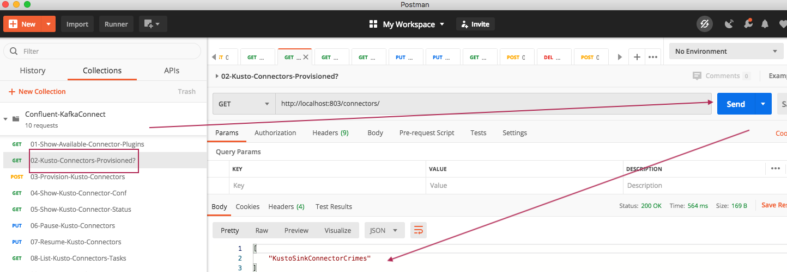
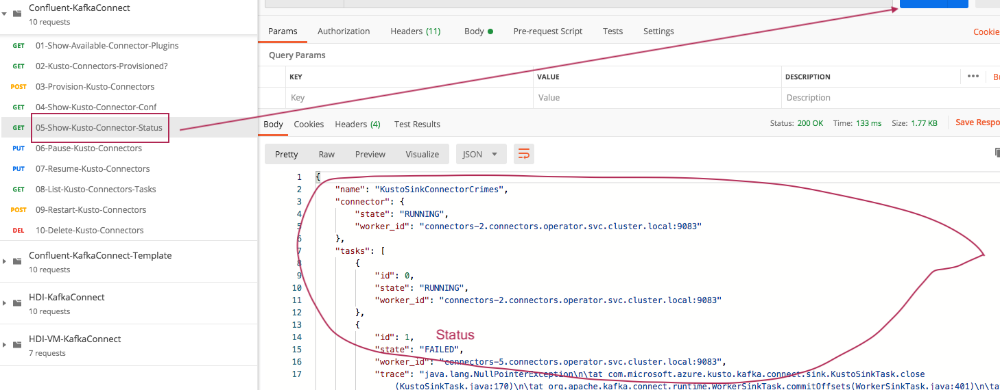
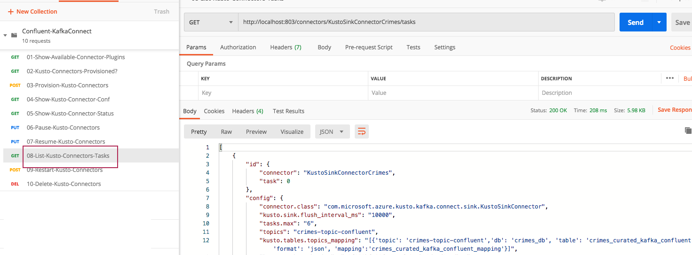

##### KAFKA INTEGRATION LABS

[Distributed Kafka ingestion with Confluent Platform](README.md)
<hr>

# 1. FOCUS: INSTALL KAFKACONNECT SERVICE
This document details installation of KafkaConnect service on AKS.<br>

This will merely create KafkaConnect pods with default Confluent shipped connectors, and the Kusto connector that is part of the docker image we build earlier and referenced in our Azure YAML.

# 2. Install KafkaConnect service


```
cd ~/opt/kafka/confluent-operator/helm
```

```
helm install connectors ./confluent-operator --values $VALUES_FILE --namespace operator --set connect.enabled=true
```

Output:
```
NAME: connectors
LAST DEPLOYED: Sat May 16 15:12:41 2020
NAMESPACE: operator
STATUS: deployed
REVISION: 1
TEST SUITE: None
NOTES:
Connect Cluster Deployment

Connect Cluster is deployed through PSC. To configure connnectors use ControlCenter or Use REST API to configure.
The Connect Cluster endpoint does not support authorization and must not be open for Internet Access.

  1. Validate if connect cluster is running

     kubectl get pods -n operator | grep connectors

  2. Access
     Internal REST Endpoint : http://connectors:8083 (Inside Kubernetes)

     OR

     http://localhost:8083 (Inside Pod)

     More information can be found here: https://docs.confluent.io/current/connect/references/restapi.html
```

Validate creation of the pods..
```
kubectl get pods -n operator
```

Output...
```
NAME                           READY   STATUS    RESTARTS   AGE
cc-operator-67b8f68f6f-s7s4v   1/1     Running   0          2d
connectors-0                   1/1     Running   0          2m34s
connectors-1                   1/1     Running   0          2m34s
connectors-2                   1/1     Running   0          2m34s
connectors-3                   1/1     Running   0          2m34s
connectors-4                   1/1     Running   0          2m34s
connectors-5                   1/1     Running   0          2m34s
controlcenter-0                1/1     Running   0          2d
kafka-0                        1/1     Running   0          2d
kafka-1                        1/1     Running   0          2d
kafka-2                        1/1     Running   0          2d
zookeeper-0                    1/1     Running   0          2d
zookeeper-1                    1/1     Running   0          2d
zookeeper-2                    1/1     Running   0          2d
```

Validate creation of the service..
```
kubectl get svc -n operator
```

Output...
```
NAME                         TYPE           CLUSTER-IP     EXTERNAL-IP    PORT(S)                                        AGE
connectors                   ClusterIP      None           <none>         8083/TCP,9083/TCP,7203/TCP,7777/TCP            44s
connectors-0-internal        ClusterIP      10.0.77.136    <none>         8083/TCP,9083/TCP,7203/TCP,7777/TCP            45s
connectors-1-internal        ClusterIP      10.0.179.98    <none>         8083/TCP,9083/TCP,7203/TCP,7777/TCP            45s
connectors-2-internal        ClusterIP      10.0.26.153    <none>         8083/TCP,9083/TCP,7203/TCP,7777/TCP            45s
connectors-3-internal        ClusterIP      10.0.193.25    <none>         8083/TCP,9083/TCP,7203/TCP,7777/TCP            45s
connectors-4-internal        ClusterIP      10.0.28.64     <none>         8083/TCP,9083/TCP,7203/TCP,7777/TCP            45s
connectors-5-internal        ClusterIP      10.0.216.96    <none>         8083/TCP,9083/TCP,7203/TCP,7777/TCP            45s
controlcenter                ClusterIP      None           <none>         9021/TCP,7203/TCP,7777/TCP                     2d2h
controlcenter-0-internal     ClusterIP      10.0.234.118   <none>         9021/TCP,7203/TCP,7777/TCP                     2d2h
controlcenter-bootstrap-lb   LoadBalancer   10.0.215.178   20.50.23.91    80:30307/TCP                                   2d2h
kafka                        ClusterIP      None           <none>         9071/TCP,9072/TCP,9092/TCP,7203/TCP,7777/TCP   2d3h
kafka-0-internal             ClusterIP      10.0.152.22    <none>         9071/TCP,9072/TCP,9092/TCP,7203/TCP,7777/TCP   2d3h
kafka-0-lb                   LoadBalancer   10.0.155.115   172.16.17.27   9092:31785/TCP                                 2d3h
kafka-1-internal             ClusterIP      10.0.124.73    <none>         9071/TCP,9072/TCP,9092/TCP,7203/TCP,7777/TCP   2d3h
kafka-1-lb                   LoadBalancer   10.0.197.200   172.16.17.28   9092:32275/TCP                                 2d3h
kafka-2-internal             ClusterIP      10.0.212.190   <none>         9071/TCP,9072/TCP,9092/TCP,7203/TCP,7777/TCP   2d3h
kafka-2-lb                   LoadBalancer   10.0.154.139   172.16.17.29   9092:31509/TCP                                 2d3h
kafka-bootstrap-lb           LoadBalancer   10.0.244.41    172.16.17.30   9092:32644/TCP                                 2d3h
zookeeper                    ClusterIP      None           <none>         3888/TCP,2888/TCP,2181/TCP,7203/TCP,7777/TCP   2d3h
zookeeper-0-internal         ClusterIP      10.0.119.198   <none>         3888/TCP,2888/TCP,2181/TCP,7203/TCP,7777/TCP   2d3h
zookeeper-1-internal         ClusterIP      10.0.207.55    <none>         3888/TCP,2888/TCP,2181/TCP,7203/TCP,7777/TCP   2d3h
zookeeper-2-internal         ClusterIP      10.0.88.250    <none>         3888/TCP,2888/TCP,2181/TCP,7203/TCP,7777/TCP   2d3h
```

# 3. Check if the Kusto connector is available on a connector pod
Get the list of pods to determine which one to connect to..
```
kubectl get pods -n operator
```

Lets connect to connector-0 via SSH-
```
kubectl exec -it connectors-0 -n operator  -- bash
```

Navigate to /usr/share/java
```
kubectl exec -it connectors-0 -n operator  -- bash

cd /usr/share/java

ls -al
```

Output...
```
total 14092
drwxr-xr-x 1 root root     4096 May 16 22:28 .
drwxr-xr-x 1 root root     4096 Apr 18 17:28 ..
drwxr-xr-x 2 root root     4096 Apr 18 17:26 acl
drwxr-xr-x 2 root root     4096 Apr 20 17:18 cc-base
drwxr-xr-x 2 root root     4096 Apr 18 17:18 confluent-common
drwxr-xr-x 2 root root    16384 Apr 18 17:26 confluent-control-center
drwxr-xr-x 2 root root     4096 Apr 18 17:26 confluent-hub-client
drwxr-xr-x 2 root root     4096 Apr 18 17:18 confluent-metadata-service
drwxr-xr-x 2 root root    12288 Apr 18 17:19 confluent-rebalancer
drwxr-xr-x 8 root root     4096 Apr 18 17:19 confluent-security
-rw-r--r-- 1 root root      957 May  6  2014 java_defaults.mk
drwxr-xr-x 2 root root    12288 Apr 18 17:19 kafka
drwxr-xr-x 2 root root     4096 Apr 18 17:27 kafka-connect-activemq
drwxr-xr-x 2 root root     4096 Apr 18 17:27 kafka-connect-elasticsearch
drwxr-xr-x 2 root root     4096 Apr 18 17:27 kafka-connect-ibmmq
drwxr-xr-x 2 root root     4096 Apr 18 17:27 kafka-connect-jdbc
drwxr-xr-x 2 root root     4096 Apr 18 17:27 kafka-connect-jms
drwxr-xr-x 2 root root     4096 Apr 18 17:27 kafka-connect-s3
drwxr-xr-x 2 root root     4096 Apr 18 17:27 kafka-connect-storage-common
drwxr-xr-x 2 root root     4096 Apr 18 17:25 kafka-serde-tools
-rw-r--r-- 1 root root 14306404 Apr 16 02:30 kafka-sink-azure-kusto-0.3.4-jar-with-dependencies.jar
drwxr-xr-x 2 root root     4096 Apr 18 17:26 monitoring-interceptors
drwxr-xr-x 2 root root     4096 Apr 18 17:18 rest-utils
drwxr-xr-x 2 root root     4096 Apr 18 17:25 schema-registry
```

We are good to go as the jar we need to see exists...<br>
kafka-sink-azure-kusto-0.3.4-jar-with-dependencies.jar

# 4. Properties for the connector

This...but we dont need a file.
We will use Postman instead.
```
name=KustoSinkConnector 
connector.class=com.microsoft.azure.kusto.kafka.connect.sink.KustoSinkConnector
kusto.sink.flush_interval_ms=300000
tasks.max=6
topics=crimes-topic
kusto.tables.topics_mapping=[{'topic': 'crimes_topic','db': 'crimes_db', 'table': 'crimes_curated_kafka_confluent','format': 'json', 'mapping':'crimes_curated_kafka_confluent_mapping'}]
kusto.auth.authority=<yourTenantID>
kusto.url=<yourADXIngestURL>
kusto.auth.appid=<yourAADServicePrincipalAppID>
kusto.auth.appkey=<yourAADServicePrincipalSecret>
kusto.sink.tempdir=/var/tmp/
kusto.sink.flush_size=1000
value.converter=org.apache.kafka.connect.storage.StringConverter
key.converter=org.apache.kafka.connect.storage.StringConverter
```

# 5.  Configure Postman collection JSON for the KafkaConnect REST calls

## 5.1. Launch Postman and import the collecton JSON
1.  The collection JSON for the KafkaConnect REST APIs with the Kusto Connector conf is [here](../../distributed-mode/conf/confluent-connect-rest-json/Confluent-KafkaConnect-Template.postman_collection.json).<br>
2.  Download it to your machine and import it.


<br>
<hr>


# 6. Port forward so you can manage connectors via Postman through REST calls
Find the entry for the connectors service with -
```
kubectl get svc -n operator
```
Then port-forward..this port is listed in the KafkaConnect YAML of the confluent-operator.
```
sudo kubectl port-forward svc/connectors -n operator 803:8083
```

# 7. Manage the connectors

## 7.1. List available connectors for running
Confluent has a bunch of connectors available out of the box, and we have added to it, our Kusto connector.


<br>
<hr>

## 7.2. Check if any "Kusto" connectors are running


<br>
<hr>

## 7.3. Update your Kusto connector conf, in Postman, and send
Modify the conf under - 03-Provision-Kusto-Connector-Service.


<br>
<hr>

## 7.4. View the configuration of your Kusto connectors
Execute the REST call under - "04-Show-Kusto-Connector-Conf"


<br>
<hr>

## 7.5. Check connector status
Execute the REST call under - "05-Show-Kusto-Connector-Status"


<br>
<hr>

## 7.6. Should you need to pause Kusto connectors
Execute the REST call under - "06-Pause-Kusto-Connectors"


<br>
<hr>

## 7.7. Should you need to resume Kusto connectors
Execute the REST call under - "07-Resume-Kusto-Connectors"


<br>
<hr>


## 7.8. Should you need to list Kusto connector tasks
Execute the REST call under - "08-List-Kusto-Connectors-Tasks"


<br>
<hr>

## 7.9. Should you need to restart Kusto connector tasks
Execute the REST call under - "09-Restart-Kusto-Connectors"


<br>
<hr>

## 7.10. Should you need to delete Kusto connector tasks
Execute the REST call under - "10-Delete-Kusto-Connectors"


<br>
<hr>

# 8. Should you need to look at connector logs
On CLI, execute the below...

```
kubectl get pods -n operator | grep connectors*
```

You should see this...
```
connectors-0                   1/1     Running   0          15d
connectors-1                   1/1     Running   0          15d
connectors-2                   1/1     Running   0          15d
connectors-3                   1/1     Running   0          15d
connectors-4                   1/1     Running   0          15d
connectors-5                   1/1     Running   0          15d
```

Lets look at logs on connectors-3...
```
kubectl logs connectors-3 -n operator
```

Sample output...
```
[INFO] 2020-06-03 13:46:44,729 [pool-20-thread-1] com.microsoft.aad.adal4j.AuthenticationAuthority doInstanceDiscovery - [Correlation ID: 316880bf-8f01-4002-8697-ed4a2e01e9dc] Instance discovery was successful
[INFO] 2020-06-03 13:46:54,731 [Timer-0] com.microsoft.azure.kusto.ingest.ResourceManager refreshIngestionResources - Refreshing Ingestion Resources
[INFO] 2020-06-03 14:46:44,728 [Timer-0] com.microsoft.azure.kusto.ingest.ResourceManager refreshIngestionAuthToken - Refreshing Ingestion Auth Token
[INFO] 2020-06-03 14:46:54,731 [Timer-0] com.microsoft.azure.kusto.ingest.ResourceManager refreshIngestionResources - Refreshing Ingestion Resources
[INFO] 2020-06-03 15:46:44,728 [Timer-0] com.microsoft.azure.kusto.ingest.ResourceManager refreshIngestionAuthToken - Refreshing Ingestion Auth Token
[INFO] 2020-06-03 15:46:54,731 [Timer-0] com.microsoft.azure.kusto.ingest.ResourceManager refreshIngestionResources - Refreshing Ingestion Resources
[INFO] 2020-06-03 16:46:44,728 [Timer-0] com.microsoft.azure.kusto.ingest.ResourceManager refreshIngestionAuthToken - Refreshing Ingestion Auth Token
[INFO] 2020-06-03 16:46:54,731 [Timer-0] com.microsoft.azure.kusto.ingest.ResourceManager refreshIngestionResources - Refreshing Ingestion Resources
[INFO] 2020-06-03 17:46:44,728 [Timer-0] com.microsoft.azure.kusto.ingest.ResourceManager refreshIngestionAuthToken - Refreshing Ingestion Auth Token
[INFO] 2020-06-03 17:46:54,731 [Timer-0] com.microsoft.azure.kusto.ingest.ResourceManager refreshIngestionResources - Refreshing Ingestion Resources
```

# 9. Should you need to uninstall KafkaConnect service from the Confluent cluster..
1) Stop the connectors as shown above<br>

2) Use helm to uninstall th service<br>
```
helm uninstall connectors --namespace operator
```
<hr>
This concludes the module.  The next one covers testing the integration.

 [Distributed Kafka ingestion with Confluent Platform](README.md)

