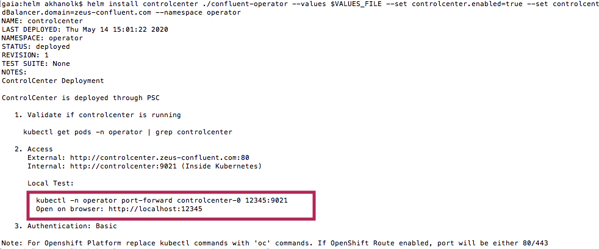

##### KAFKA INTEGRATION LABS

[Distributed Kafka ingestion with Confluent Platform](README.md)
<hr>

# 1. FOCUS: INSTALL CONFLUENT CONTROL CENTER
This document details setup of control center web UI.<br>

# 2. Install
```
cd opt/kafka/confluent-operator/helm
```
The command...
```
helm install controlcenter ./confluent-operator --values $VALUES_FILE --set controlcenter.enabled=true --set controlcenter.loadBalancer.enabled=true --set controlcenter.loadBalancer.domain=zeus-confluent.com --namespace operator
```

The output..
```
NAME: controlcenter
LAST DEPLOYED: Thu May 14 15:01:22 2020
NAMESPACE: operator
STATUS: deployed
REVISION: 1
TEST SUITE: None
NOTES:
ControlCenter Deployment

ControlCenter is deployed through PSC

   1. Validate if controlcenter is running

     kubectl get pods -n operator | grep controlcenter

   2. Access
      External: http://controlcenter.zeus-confluent.com:80
      Internal: http://controlcenter:9021 (Inside Kubernetes)
      
      Local Test:

        kubectl -n operator port-forward controlcenter-0 12345:9021
        Open on browser: http://localhost:12345

   3. Authentication: Basic

```

# 3. Validate

The command...
```
kubectl get pods -n operator | grep controlcenter
```

The output..
```
controlcenter-0                0/1     Running   0          96s
```

# 4.  Public IP of control center
This takes several minutes to get generated..you will see <pending>, then finally a PIP.

```
kubectl get svc -n operator | grep controlcenter
```

Output...
```
NAME                           READY   STATUS    RESTARTS   AGE
cc-operator-67b8f68f6f-s7s4v   1/1     Running   0          37m
controlcenter-0                0/1     Running   0          99s
kafka-0                        1/1     Running   0          30m
kafka-1                        1/1     Running   0          27m
kafka-2                        1/1     Running   0          25m
zookeeper-0                    1/1     Running   0          35m
zookeeper-1                    1/1     Running   0          35m
zookeeper-2                    1/1     Running   0          35m
```

# 6. Launch control center

1.  Port-forward..


<br><hr>

<br><hr>

```
kubectl -n operator port-forward controlcenter-0 12345:9021
```

2. In your browser, go to http://localhost:12345<br>

2. UID = admin | Password = Developer1<br>

3. Browse...


<br><hr>

<br><hr>


This concludes this module.

<hr>


[Distributed Kafka ingestion with Confluent Platform](README.md)
