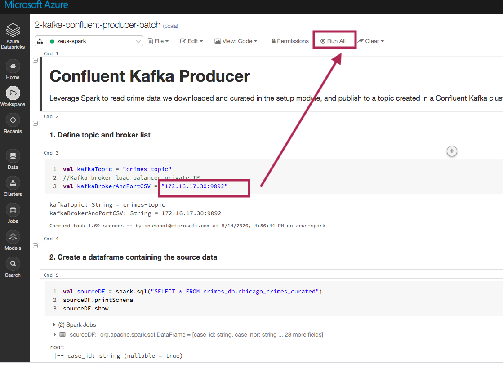
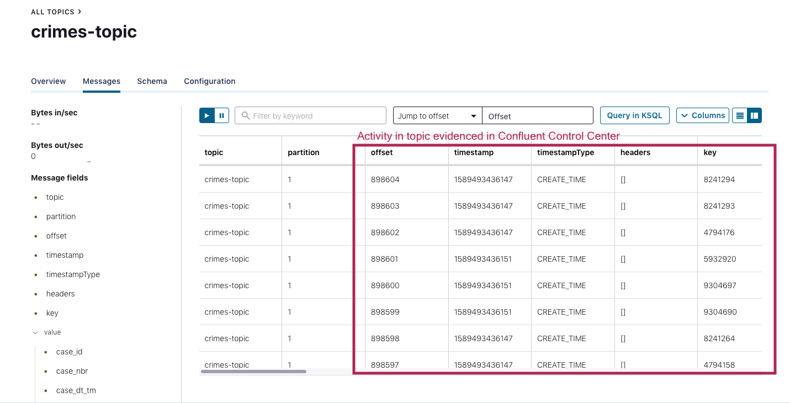
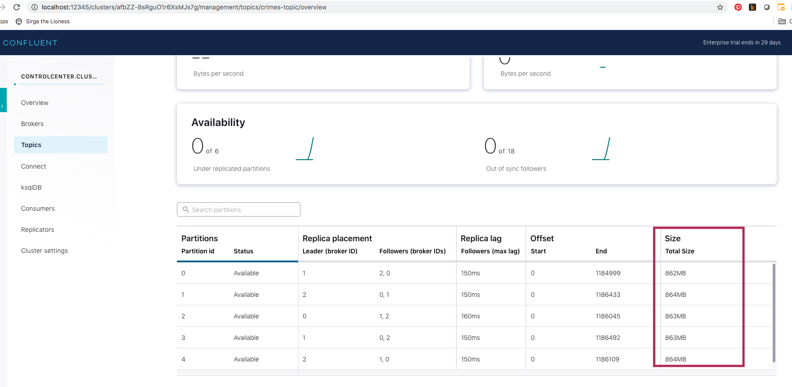

##### KAFKA INTEGRATION LABS

[Distributed Kafka ingestion with Confluent Platform](README.md)

# 1. FOCUS: UPDATE BROKER DETAILS IN SPARK NOTEBOOK and produce events to Kafka
This document details broker conf update in the Databricks Spark notebook, and producing to Kafka from Spark. 

# 2. Update the broker load balancer private IP in your Spark notebook and run the notebook

1.  Navigate to your resource group, launch the Databricks workspace and start your Databricks cluster.
2.  Open the notebok called "2-kafka-confluent-producer-batch" and update the broker conf from this step, to reflect your loadbalancer private IP and click on "Run all"

 

# 3. Go to Confluent Control Center web UI and check if the messages published made  it

 

 

This concludes our producer smoke testing.  In the next step, we will consume from Kafka and sink to ADX.

 
This concludes this module.

[Distributed Kafka ingestion with Confluent Platform](README.md)
