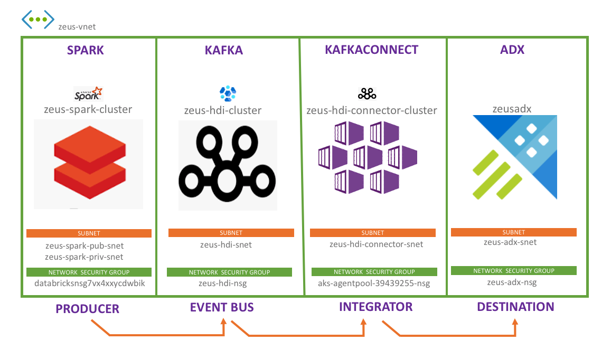
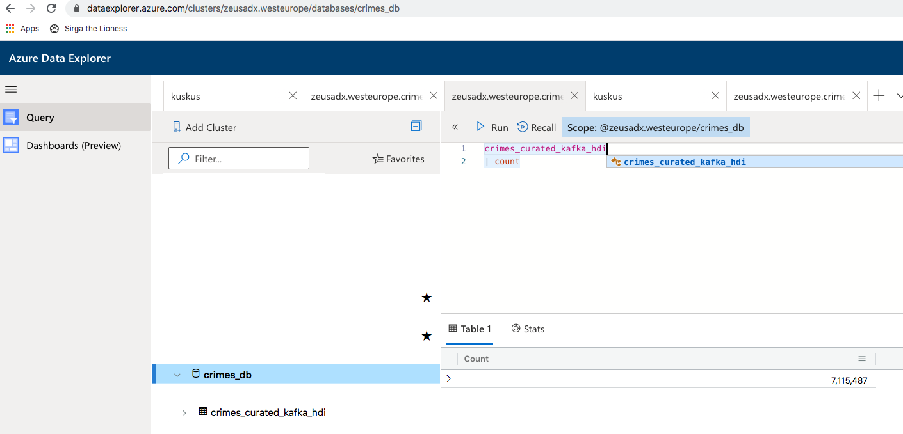

#### KAFKA INTEGRATION LAB SERIES

[Menu for distributed Kafka ingestion](../README.md)

# 1. About

This is the home page of the ADX Kafka ingestion lab in distributed mode with HDInsight Kafka.
It covers:
1.  Provisioning HDInsight Kafka
2.  Publishing events to Kafka from Spark on Azure Databricks
3.  Consuming from Kafka and sinking to ADX with KafkaConnect ADX connector plugin running on AKS

This is a lengthy lab, dedicate 8 hours for this hands on lab if you are ne to Azure and all the distributed systems featured in this lab.

# 2. Pre-requisites

This lab required the foundational resources provisioned, as detailed [here.](../common/README.md)

# 3. Provision HDInsight Kafka
Details are [here](create-hdi.md)

# 4. Create a topic
Details are [here](create-topic.md)

# 5. Consume from Kafka (test)
Details are [here](smoke-test-kafka.md)

# 6. Provision an Azure Kubernetes Service cluster
The Azure Kubernetes Cluster (AKS) will serve as the underlying infrastructure for KafkaConnect.
Details for provisioning are [here.](create-connect-cluster.md)

# 7. Download helm chart, edit it
Details are [here.](download-helm-edit.md)

# 8. Build and publish docker image
Details are [here](build-image.md)

# 7.  Create table in ADX
Details are [here](create-adx-table.md)

# 8. Update ADX NSG for the AKS Public IP
Details are [here](update-adx-nsg.md)

# 9. Produce to the Kafka topic from Spark
Details are [here](produce-to-kafka.md)

# 10. Install KafkaConnect on AKS and start ADX sink tasks 
Details are [here](connectors-crud.md)

# 11. Verify data delivery to ADX

Go to the Data Explorer web UI and run a query and you should see the record count steadily increasing.

 

This concludes the lab.

[Menu for distributed Kafka ingestion](../README.md)

