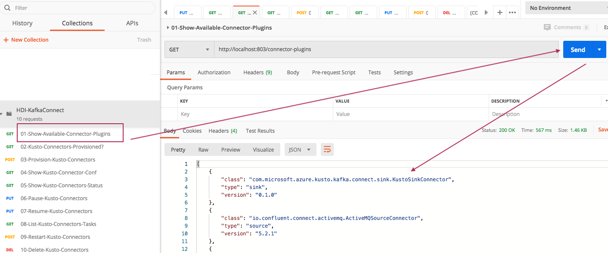
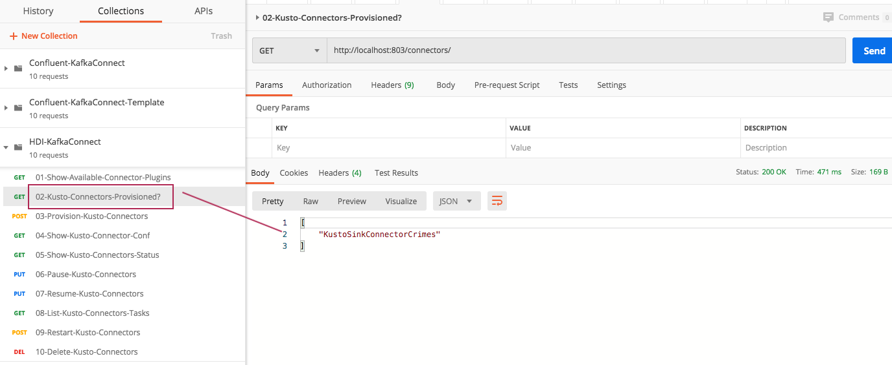
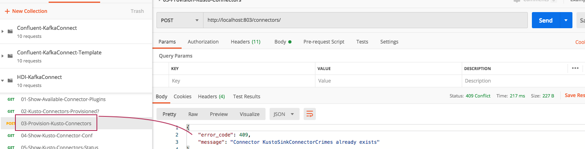
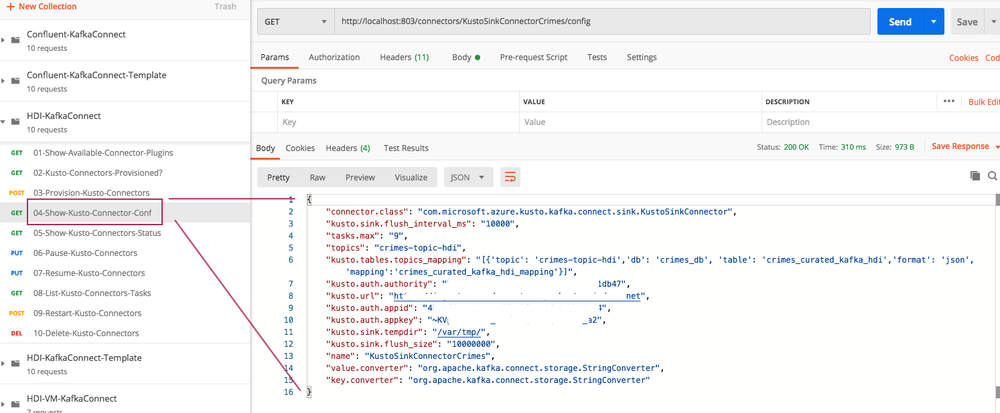
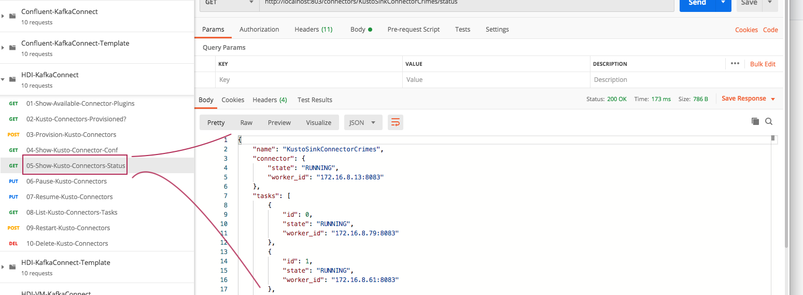
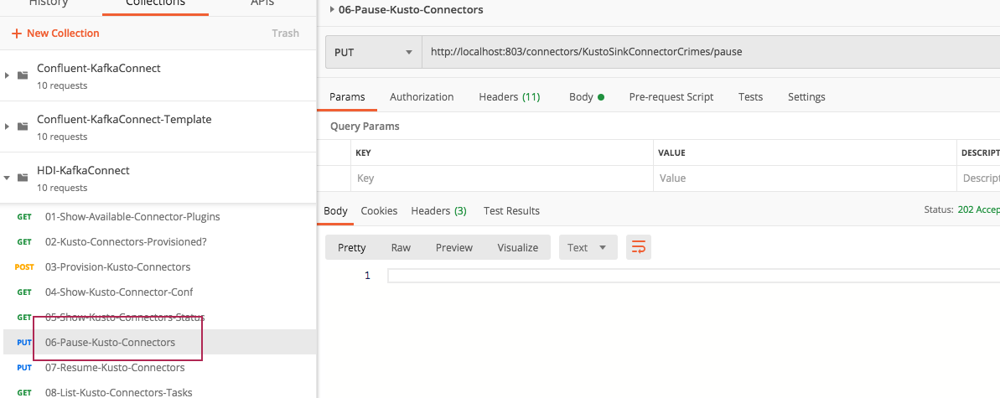
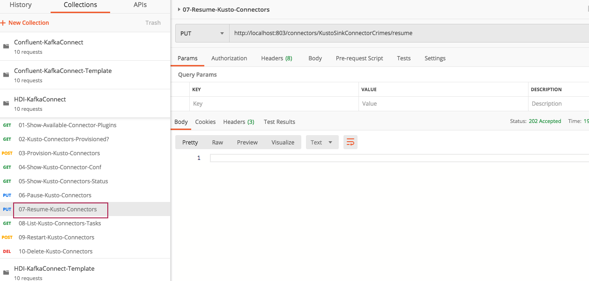
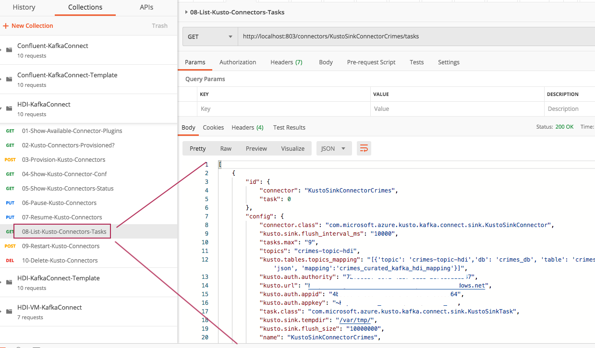
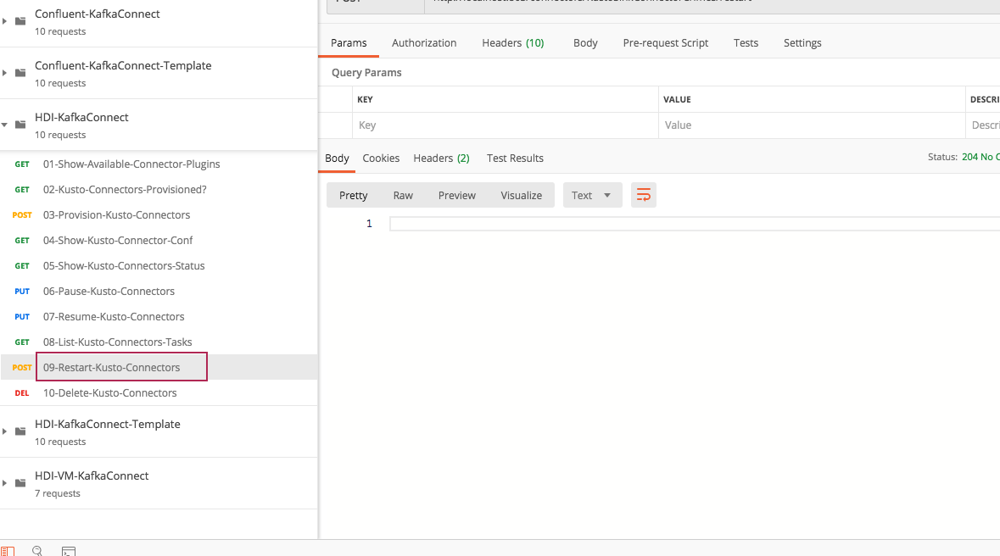
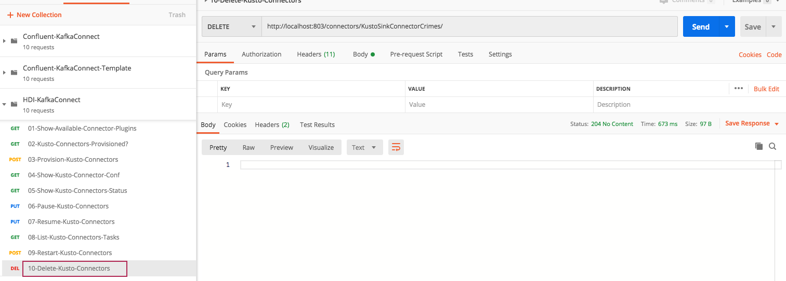

##### KAFKA INTEGRATION LABS

[Distributed Kafka ingestion with HDInsight](README.md)
<hr>


# 1. FOCUS: Provision connector cluster & start sink tasks

This module details (1) provisioning of KafkaConnect pods on AKS, and then (2) starting/managing the Kusto connectors on the pods.


# 2. Provision KafkaConnect pods

1) Switch directories
```
cd opt/kafka/connect-sink-deploy-hdi
```

2) Login to az CLI
```
az login
```

3) Set subscription
```
az account set --subscription <yourSubscriptionGUID>
```

4) Get cluster admin credentials
```
az aks get-credentials --resource-group zeus-rg --name zeus-hdi-connector-cluster --admin
```

5) Install connector on pods
```
helm install ./cp-kafka-connect --generate-name
```

Output..
```
NAME: cp-kafka-connect-1589524889
LAST DEPLOYED: Fri May 15 01:41:31 2020
NAMESPACE: default
STATUS: deployed
REVISION: 1
TEST SUITE: None
NOTES:
This chart installs a Confluent Kafka Connect

https://docs.confluent.io/current/connect/index.html
```

6) Check pods
```
kubectl get pods
```

Output...
```
NAME                                           READY   STATUS              RESTARTS   AGE
cp-kafka-connect-1589524889-59cc8b78db-5hrbx   0/1     ContainerCreating   0          36s
cp-kafka-connect-1589524889-59cc8b78db-7xxsx   0/1     ContainerCreating   0          36s
cp-kafka-connect-1589524889-59cc8b78db-f59xd   0/1     ContainerCreating   0          36s
cp-kafka-connect-1589524889-59cc8b78db-g58gm   0/1     ContainerCreating   0          36s
cp-kafka-connect-1589524889-59cc8b78db-s6wqc   0/1     ContainerCreating   0          36s
cp-kafka-connect-1589524889-59cc8b78db-tzhjt   0/1     ContainerCreating   0          36s
```

7) Check service

```
kubectl get svc
```

Output..
```
NAME                          TYPE        CLUSTER-IP    EXTERNAL-IP   PORT(S)    AGE
cp-kafka-connect-1589524889   ClusterIP   10.0.130.97   <none>        8083/TCP   107s
kubernetes                    ClusterIP   10.0.0.1      <none>        443/TCP    129m
```

8) Should you need to uninstall ..

```
helm uninstall cp-kafka-connect-1589524889
```

9) SSH into a pod
```
kubectl exec -it cp-kafka-connect-1589524889-59cc8b78db-5hrbx -- bash
```

Check processes...
```
ps -ef
```

Output...
```
UID         PID   PPID  C STIME TTY          TIME CMD
root          1      0 38 06:42 ?        00:01:03 java -Xms512M -Xmx512M -server -XX:+UseG1GC -XX:MaxGCPauseMillis=20 -XX:InitiatingHeapOccupancyPercent=35 -XX:+ExplicitGCInvokesConcurrent -XX
root        209      0  0 06:45 pts/0    00:00:00 bash
root        214    209  0 06:45 pts/0    00:00:00 ps -ef
```

Check volumes and mount points
```
root@cp-kafka-connect-1589524889-59cc8b78db-5hrbx:/# lsblk
```

Output...
```
NAME    MAJ:MIN RM  SIZE RO TYPE MOUNTPOINT
sdb       8:16   0   32G  0 disk 
└─sdb1    8:17   0   32G  0 part 
sr0      11:0    1  690K  0 rom  
sda       8:0    0  100G  0 disk 
├─sda14   8:14   0    4M  0 part 
├─sda15   8:15   0  106M  0 part 
└─sda1    8:1    0 99.9G  0 part /var/lib/kafka/data
```

10) Check logs on a pod

```
kubectl logs cp-kafka-connect-1589524889-59cc8b78db-5hrbx
```

11) Describe pod

```
kubectl describe pod cp-kafka-connect-1589524889-59cc8b78db-5hrbx
```

# 3. Start port forwarding to provision Kusto connectors on the KafkaConnect pods via REST calls

```
sudo kubectl port-forward svc/cp-kafka-connect-1589524889 803:8083
```
Here, the cp* is the output of the "kubectl get svc" command.


# 4. Study this json file - it includes REST calls to manage Kusto connectors

[REST calls to manage connectors - postman_collection.json](../conf/hdi-manage-connectors/HDI-KafkaConnect-Template.postman_collection.json)


# 5. Install Postman and import the JSON

Install Postman, import JSON


<br>
<hr>

# 6. Manage the connectors

## 6.1. List available connectors for running
Confluent has a bunch of connectors available out of the box, and we have added to it, our Kusto connector.


<br>
<hr>

## 6.2. Check if any "Kusto" connectors are running


<br>
<hr>

## 6.3. Update your Kusto connector conf, in Postman, and send
Modify the conf under - 03-Provision-Kusto-Connector-Service.


<br>
<hr>

## 6.4. View the configuration of your Kusto connectors
Execute the REST call under - "04-Show-Kusto-Connector-Conf"


<br>
<hr>

## 6.5. Check connector status
Execute the REST call under - "05-Show-Kusto-Connector-Status"


<br>
<hr>

## 6.6. Should you need to pause Kusto connectors
Execute the REST call under - "06-Pause-Kusto-Connectors"


<br>
<hr>

## 6.7. Should you need to resume Kusto connectors
Execute the REST call under - "07-Resume-Kusto-Connectors"


<br>
<hr>


## 6.8. Should you need to list Kusto connector tasks
Execute the REST call under - "08-List-Kusto-Connectors-Tasks"


<br>
<hr>

## 6.9. Should you need to restart Kusto connector tasks
Execute the REST call under - "09-Restart-Kusto-Connectors"


<br>
<hr>

## 6.10. Should you need to delete Kusto connector tasks
Execute the REST call under - "10-Delete-Kusto-Connectors"


<br>
<hr>

# 7. If you need to uninstall KafkaConnect pods from the Kubernetes nodes 
Should ou ever need to...
```
kubectl get svc
```
Get the service name..
```
NAME                          TYPE        CLUSTER-IP   EXTERNAL-IP   PORT(S)    AGE
cp-kafka-connect-1589528487   ClusterIP   10.0.73.13   <none>        8083/TCP   8h
kubernetes                    ClusterIP   10.0.0.1     <none>        443/TCP    11h
```

Run the uninstall command with the service name from prior command output...
```
helm uninstall cp-kafka-connect-1589528487
```
Output..
```
release "cp-kafka-connect-1589528487" uninstalled
```

Will take a few to clean up..
```
kubectl get pods
```
Output..
```
NAME                                           READY   STATUS        RESTARTS   AGE
cp-kafka-connect-1589528487-759896fd76-gsml9   0/1     Terminating   0          8h
cp-kafka-connect-1589528487-759896fd76-xzv6w   0/1     Terminating   0          8h
```
Finally - done...
```
kubectl get pods
No resources found in default namespace.
```


This concludes the module.
<hr>

[Distributed Kafka ingestion with HDInsight](README.md)

