##### KAFKA INTEGRATION LABS

[Distributed Kafka ingestion with HDInsight](README.md)

# 1. FOCUS: CREATE CONNECT CLUSTER

This module details creation of AKS cluster to host KafkaConnect Kusto sink workers.

# Provisioning

## 1. Subnet

Create a subnet with enough IP addresses..

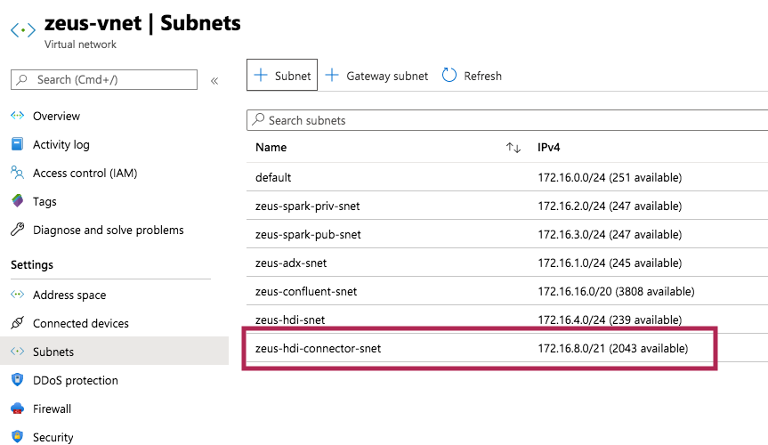
 

## 2. Provision AKS cluster

Go to the resource group in the portal, and create an AKS cluster..

Create a subnet with enough IP addresses..

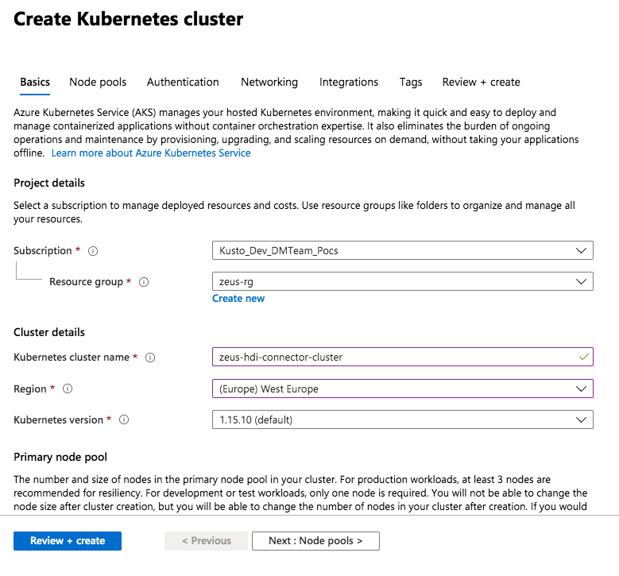
 

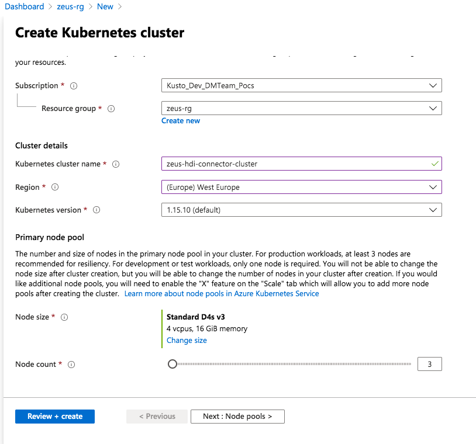
 

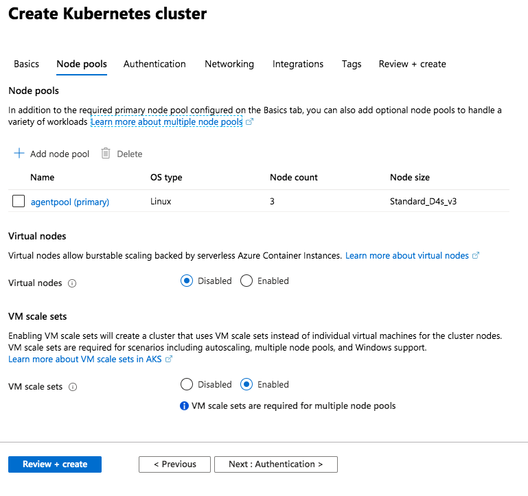
 

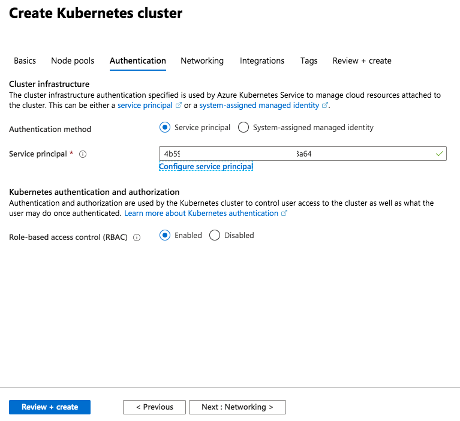
 

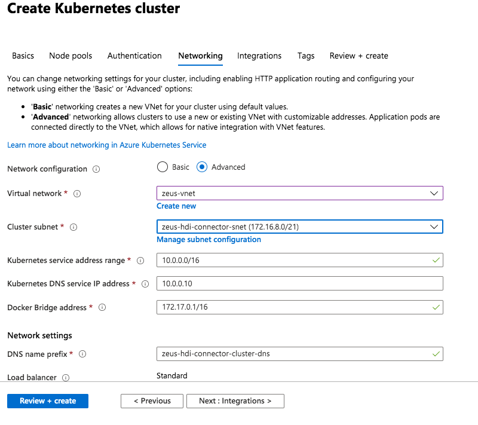
 

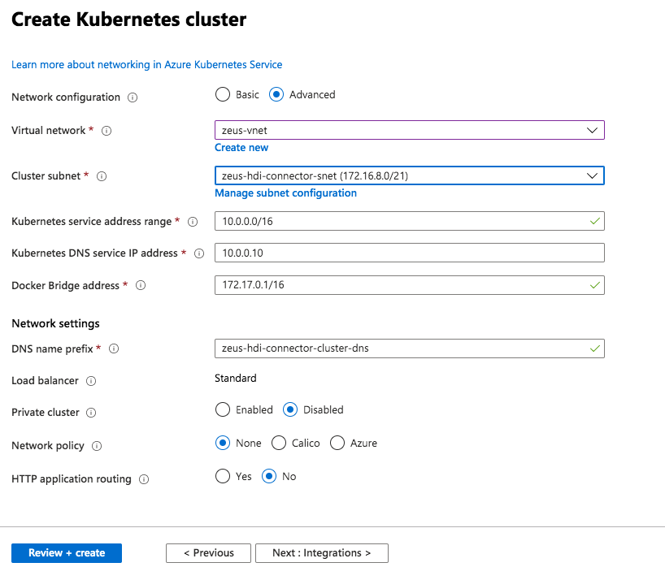
 

 

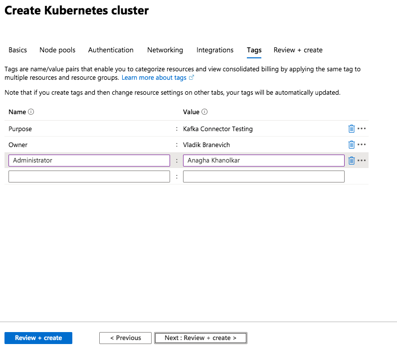
 

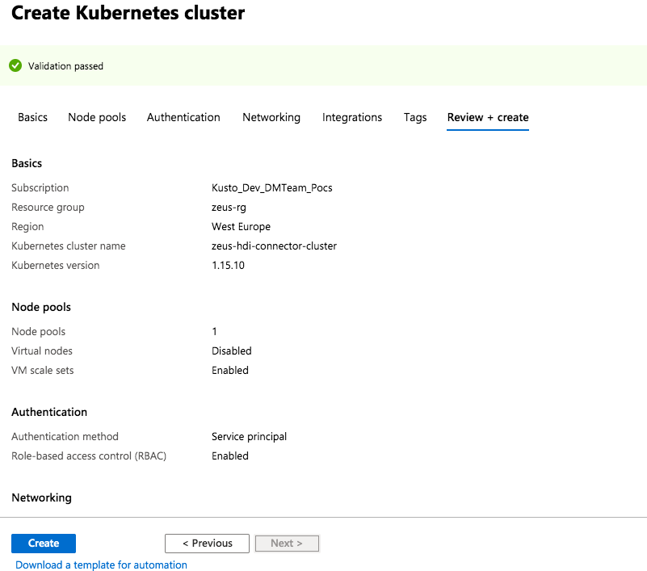
 

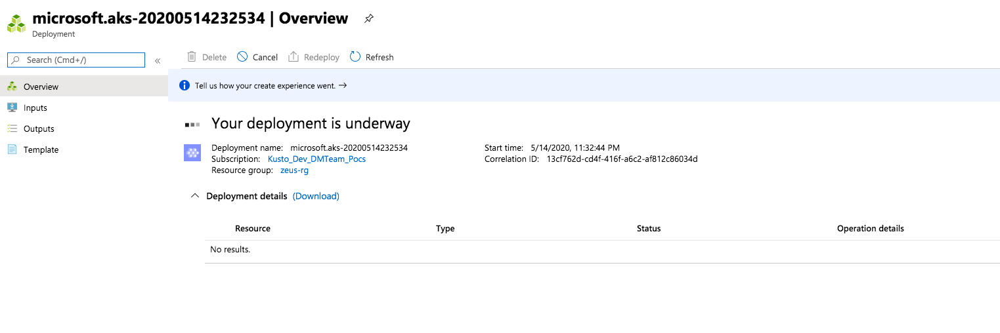
 

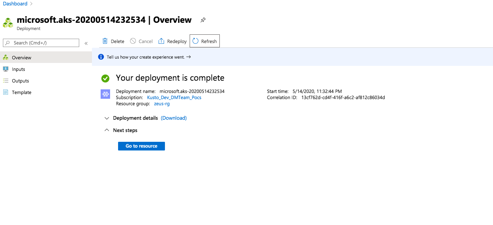
 

 

This concludes this module.

[Distributed Kafka ingestion with HDInsight](README.md)

