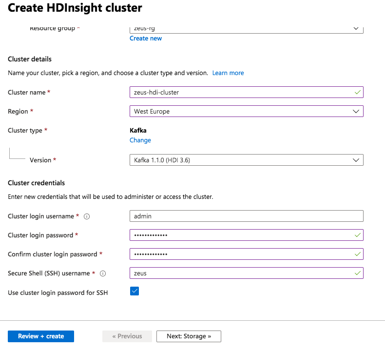
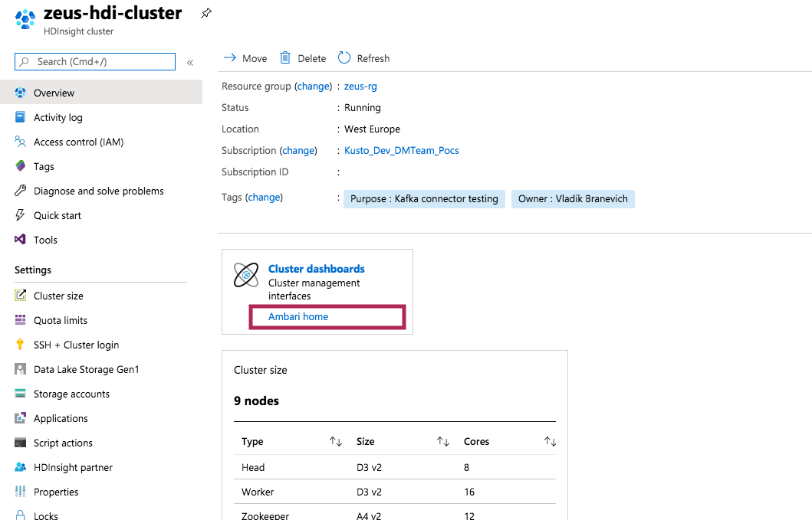

##### KAFKA INTEGRATION LABS

[Distributed Kafka ingestion with HDInsight](README.md)
<hr>


# 1. FOCUS: PROVISION HDINSIGHT KAFKA CLUSTER
This module covers creation of a HDInsight Kafka cluster and some configuration of the same.

# 2. Networking

## 2.1. Create a subnet for HDI in your Vnet


<br><hr>

## 2.2. Create an NSG called zeus-hdi-nsg, with the following inbound rules

Include your IP address so you can connect to HDI.


<br><hr>

## 2.3. Attach the NSG to the subnet


<br><hr>


<br><hr>


<br><hr>

## 2.4. Provision HDInsight Kafka 4.0 (Kafka 2.1)
The diagram shows HDInsight 3.6, but provision HDInsight 4.0 instead.


<br><hr>


<br><hr>


<br><hr>


<br><hr>


<br><hr>


<br><hr>


<br><hr>


<br><hr>


<br><hr>


<br><hr>


<br><hr>

## 2.5. Connect to Ambari to configure the cluster for use


<br><hr>


<br><hr>


<br><hr>

## 2.5. Configure IP advertising in Ambari

Search for kafka-env in the Kafka configuration

<br><hr>

Paste this at the end of the entry for kafka-env
```
# Configure Kafka to advertise IP addresses instead of FQDN
IP_ADDRESS=$(hostname -i)
echo advertised.listeners=$IP_ADDRESS
sed -i.bak -e '/advertised/{/advertised@/!d;}' /usr/hdp/current/kafka-broker/conf/server.properties
echo "advertised.listeners=PLAINTEXT://$IP_ADDRESS:9092" >> /usr/hdp/current/kafka-broker/conf/server.properties
```

Save the changes.


<br><hr>


<br><hr>

## 2.6. Configure listener & save  in Ambari

Search for listener in the Kafka configs and replace with -
```
PLAINTEXT://0.0.0.0:9092
```


<br><hr>


<br><hr>


<br><hr>


<br><hr>

## 2.7. Restart disks service in Ambari

Click on Kafka disks on the left navigation menu of Ambari and complete the steps below-


<br><hr>


<br><hr>


<br><hr>

## 2.8. Restart Kafka brokers in Ambari


<br><hr>


<br><hr>


<br><hr>


<br><hr>


<br><hr>

## 2.9. Capture Kafka broker IPs and Kafka zookeeper IPs from Ambari - Hosts page


<br><hr>

Brokers with port CSV:
```
172.16.4.7:9092,172.16.4.5.98:9092,172.16.4.6:9092,172.16.4.4:9092
```

Zookeepers with port CSV:
```
172.16.4.10:2181,172.16.4.12:2181,172.16.4.14:2181
```


This concludes this module.<br>


<hr>

[Distributed Kafka ingestion with HDInsight](README.md)
