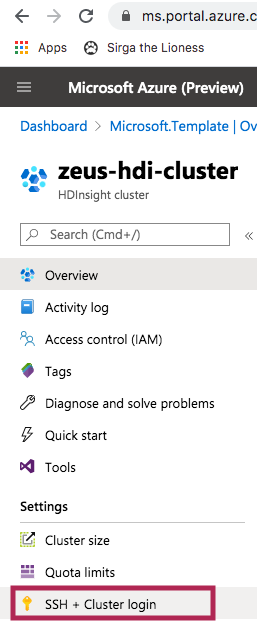
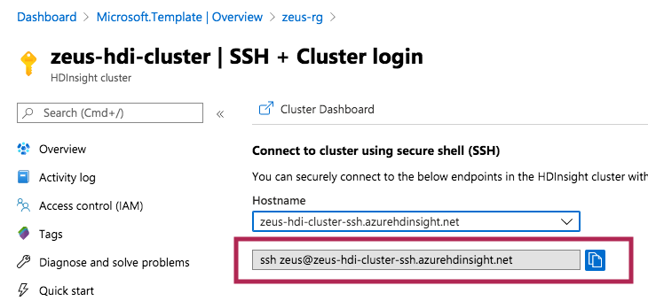
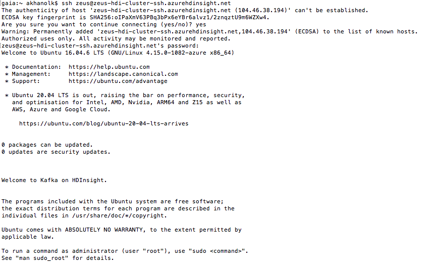

##### KAFKA INTEGRATION LABS

[Distributed Kafka ingestion with HDInsight](README.md)
<hr>


# 1. FOCUS: CREATE A KAFKA TOPIC

This module describes topic creation in HDInsight.

## 1. Get the SSH login from the Azure portal and SSH into the cluster head node


<br><hr>


<br><hr>


<br><hr>


## 2. Create the topic
Type the following sequentially in the SSH terminal as root

1.  Switch to root
```
sudo su -
```
Password is your SSH password

2.  Zookeeper list variable
```
export ZOOKEEPERS=172.16.4.10:2181,172.16.4.12:2181,172.16.4.14:2181
```

3. Broker list variable
```
export BROKERS=172.16.4.7:9092,172.16.4.5.98:9092,172.16.4.6:9092,172.16.4.4:9092
```

4. Create topic
```
/usr/hdp/current/kafka-broker/bin/kafka-topics.sh --create --replication-factor 3 --partitions 6 --topic crimes-topic-hdi --zookeeper $ZOOKEEPERS 
```

5. List topic
```
/usr/hdp/current/kafka-broker/bin/kafka-topics.sh --list --zookeeper $ZOOKEEPERS
```

6. Set retention on topic

```
/usr/hdp/current/kafka-broker/bin/kafka-configs.sh --zookeeper $ZOOKEEPERS --alter --entity-type topics --entity-name crimes-topic-hdi --add-config retention.ms=600000
```

7. Describe topic
```
/usr/hdp/current/kafka-broker/bin/kafka-topics.sh --zookeeper $ZOOKEEPERS --describe --topic crimes-topic-hdi
```

8. Check consumers
```
/usr/hdp/current/kafka-broker/bin/kafka-consumer-groups.sh  --list --bootstrap-server $BROKERS
```

```
/usr/hdp/current/kafka-broker/bin/kafka-consumer-groups.sh --describe --group connect-KustoSinkConnectorCrimes --zookeeper $ZOOKEEPERS 
```

## 3. Delete the topic
Should you ever need to analyze...
```
/usr/hdp/current/kafka-broker/bin/kafka-topics.sh --delete --topic crimes-topic-hdi --zookeeper $ZOOKEEPERS
```

## 4. Analyze consumers and such (AFTER creating connector cluster and starting connector tasks)
Describe..
```
/usr/hdp/current/kafka-broker/bin/kafka-topics.sh --zookeeper $ZOOKEEPERS --describe --topic crimes-topic-hdi

```
Consumer groups...

```
/usr/hdp/current/kafka-broker/bin/kafka-consumer-groups.sh  --list --bootstrap-server $BROKERS
```
Output...
```
[2020-05-15 17:58:08,172] WARN Removing server 172.16.4.5.98:9092 from bootstrap.servers as DNS resolution failed for 172.16.4.5.98 (org.apache.kafka.clients.ClientUtils)

connect-KustoSinkConnectorCrimes
```

Look specifically at KafkaConnect Kusto consumers - this will be listed only after the connector tasks are started.  It is posted in this page for comprehensiveness related to topic management.
```
/usr/hdp/current/kafka-broker/bin/kafka-consumer-groups.sh --describe --group connect-KustoSinkConnectorCrimes --bootstrap-server $BROKERS
```

Output...
```
TOPIC           PARTITION  CURRENT-OFFSET  LOG-END-OFFSET  LAG             CONSUMER-ID                                                                        HOST            CLIENT-ID
crimes-topic    2          8766581         28837488        20070907        connector-consumer-KustoSinkConnectorCrimes-2-6ebbf0e7-9347-4305-846c-efb70a318303 /172.16.8.8     connector-consumer-KustoSinkConnectorCrimes-2
crimes-topic    4          10152314        28840010        18687696        connector-consumer-KustoSinkConnectorCrimes-4-7b2ca530-31ab-4438-ab80-9d0fd5978db5 /172.16.8.44    connector-consumer-KustoSinkConnectorCrimes-4
crimes-topic    5          5831364         28757273        22925909        connector-consumer-KustoSinkConnectorCrimes-5-a6ab1862-73ea-46b7-8c1f-840ebe38f640 /172.16.8.24    connector-consumer-KustoSinkConnectorCrimes-5
crimes-topic    0          10250692        28813461        18562769        connector-consumer-KustoSinkConnectorCrimes-0-0e0e797b-c9d3-4cbf-9dd0-b6c51913dbdb /172.16.8.61    connector-consumer-KustoSinkConnectorCrimes-0
crimes-topic    3          8315671         28849821        20534150        connector-consumer-KustoSinkConnectorCrimes-3-66b7eda0-8f43-460d-815a-ad6962dda130 /172.16.8.77    connector-consumer-KustoSinkConnectorCrimes-3
crimes-topic    1          8512795         28780481        20267686        connector-consumer-KustoSinkConnectorCrimes-1-daddcb24-c319-4392-a400-eb145d4fc65f /172.16.8.68    connector-consumer-KustoSinkConnectorCrimes-1

```

This concludes this module.<br><br>
<hr>
[Distributed Kafka ingestion with HDInsight](README.md)

