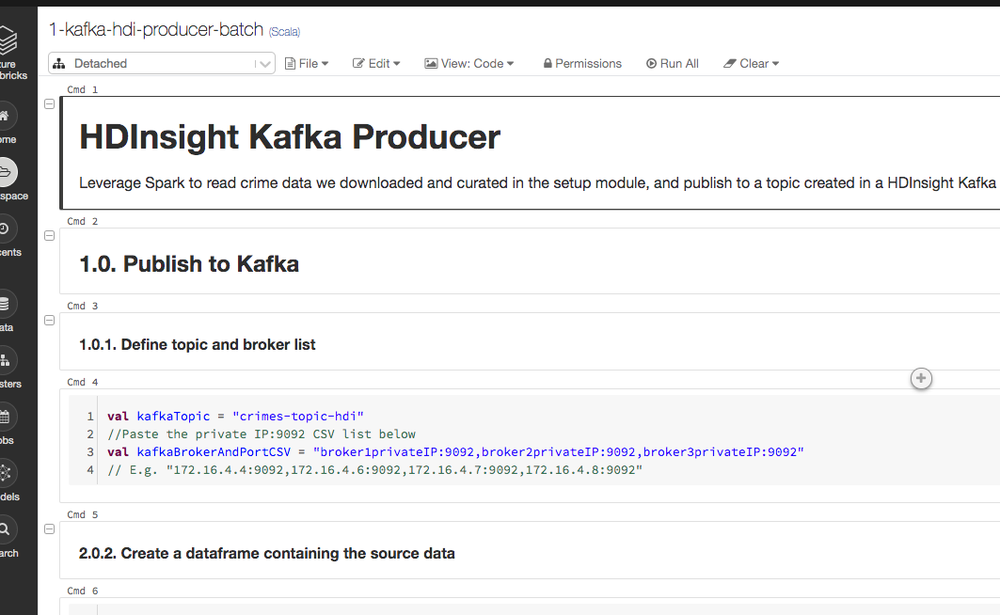

##### KAFKA INTEGRATION LABS

[Distributed Kafka ingestion with HDInsight Kafka](README.md)

# 1. FOCUS: UPDATE BROKER DETAILS IN SPARK NOTEBOOK, and push events to Kafka
This document details broker conf update in the Databricks Spark notebook, and producing to Kafka from Spark. 

# 2. Update the broker IP list in your Spark notebook and run the notebook

1.  Navigate to your resource group, launch the Databricks workspace and start your Databricks cluster.
2.  Open the notebok called "1-kafka-hdi-producer-batch" and update the broker conf to the CSV you created [here](create-hdi.md#29-capture-kafka-broker-ips-and-kafka-zookeeper-ips-from-ambari---hosts-page).

 

 
This concludes this module.

[Distributed Kafka ingestion with HDInsight Kafka](README.md)
