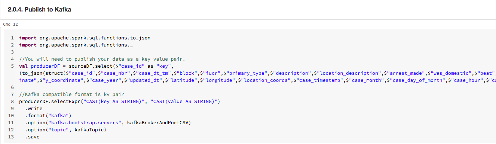

##### KAFKA INTEGRATION LABS

[Distributed Kafka ingestion with HDInsight](README.md)
<hr>


# 1. FOCUS: TEST KAFKA 

This module demonstrates how to produce to the Kafka topic from Azure Databricks.  We will consume via Kafka console consumer to smoke test.<br>

# 2. Publish to the topic from Azure Databricks

Go to the portal and launch Databricks and navigate to the notebook where we will publish to Kafka as shown below.<br>

Update broker list & run the notebook

Broker list for the author's cluster is -
```
172.16.4.7:9092,172.16.4.5.98:9092,172.16.4.6:9092,172.16.4.4:9092
```


<br><hr>


<br><hr>


<br><hr>


# 3. Consume via Kafka console consumer utility in HDInsight, SSH terminal

Switch back to the SSH terminal to consume from the topic as part of smoke test

Run the console consumer with the command below-
```
/usr/hdp/current/kafka-broker/bin/kafka-console-consumer.sh --bootstrap-server $BROKERS --topic crimes-topic --from-beginning
```

You should see the events published in step 2 earlier

<br><hr>

This concludes this module.<br><br>

<hr>

[Distributed Kafka ingestion with HDInsight](README.md)

