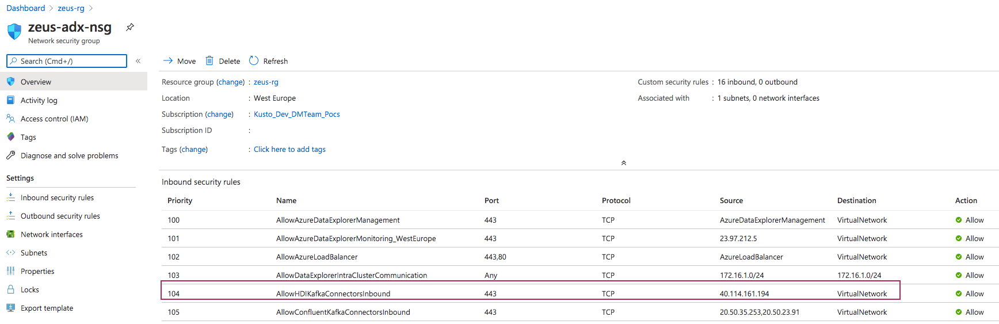

##### KAFKA INTEGRATION LABS

[Distributed Kafka ingestion with HDInsight Kafka](README.md)

# 1. FOCUS: UPDATE ADX NSG
This document details updating ADX NSG to allow inbound from KafkaConnect cluster. 

# 2. Get the public IP of the AKS cluster hosting KafkaConnect

Locate the special resource group auto-created by AKS. 
Capture the public IPs. 

 

# 3. Add the IP address to the ADX NSG 

Create a bew inbound rule as shown below for your specific IPs.

 

This concludes the module.  The next one covers testing the integration.

 [Distributed Kafka ingestion with HDInsight Kafka](README.md)
