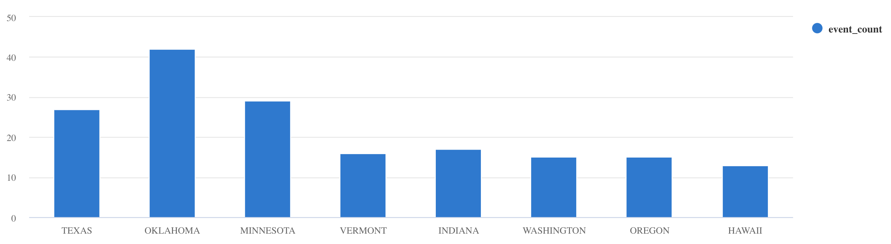

# Quickstart: Ingestion from Kafka into Azure Data Explorer (Kusto) in Kafka Connect standalone mode

This is a quickstart for getting up and running with a data ingestion setup from [Apache Kafka](https://kafka.apache.org/) to [Azure Data Explorer](https://docs.microsoft.com/en-us/azure/data-explorer/data-explorer-overview) using the [Kusto Sink Connector](https://github.com/Azure/kafka-sink-azure-kusto) without having to deal with the complexities of Kafka cluster setup, creating a Kafka producer app, Kusto sink connector cluster setup.  <br>

The goal is to get started *quickly*, so all the requisite components for a Kafka ingestion pipeline into Kusto are self-contained and run in Docker containers - this includes a pseudo-distributed setup of Kafka, Zookeeper, Kafka Connect worker and the Kafka event generator/producer application. Follow through the lab and get a feel of the connector in isolation.  You can then move to the more involved labs that cover distributed Kafka Connect, and Azure PaaS and ISV IaaS Kafka offerings.<br> 

This lab is a contribution from the Cloud advocacy team (specifically, abhirockzz) - a team that strives to improve developer experience on Azure, with our products and integration.  


Here is the `docker-compose.yaml` in its entirety:

```yaml
version: "2"
services:
  zookeeper:
    image: debezium/zookeeper:1.2
    ports:
      - 2181:2181
  kafka:
    image: debezium/kafka:1.2
    ports:
      - 9092:9092
    links:
      - zookeeper
    depends_on:
      - zookeeper
    environment:
      - ZOOKEEPER_CONNECT=zookeeper:2181
      - KAFKA_ADVERTISED_LISTENERS=PLAINTEXT://localhost:9092
  kusto-connect:
    build:
      context: ./connector
      args:
        KUSTO_KAFKA_SINK_VERSION: 1.0.1
    ports:
      - 8083:8083
    links:
      - kafka
    depends_on:
      - kafka
    environment:
      - BOOTSTRAP_SERVERS=kafka:9092
      - GROUP_ID=adx
      - CONFIG_STORAGE_TOPIC=my_connect_configs
      - OFFSET_STORAGE_TOPIC=my_connect_offsets
      - STATUS_STORAGE_TOPIC=my_connect_statuses
  events-producer:
    build:
      context: ./storm-events-producer
    links:
      - kafka
    depends_on:
      - kafka
    environment:
      - KAFKA_BOOTSTRAP_SERVER=kafka:9092
      - KAFKA_TOPIC=storm-events
      - SOURCE_FILE=StormEvents.csv
```

## Pre-requisites

- You will need a [Microsoft Azure account](https://docs.microsoft.com/azure/). Maybe try a [free one?](https://azure.microsoft.com/free/)
- Install [Azure CLI](https://docs.microsoft.com/cli/azure/install-azure-cli?view=azure-cli-latest) if you don't have it already (should be quick!) or just use the [Azure Cloud Shell](https://azure.microsoft.com/features/cloud-shell/) from your browser.
- [Docker](https://docs.docker.com/get-docker/) and [Docker Compose](https://docs.docker.com/compose/install) installed
- Clone this repo

```shell
git clone https://github.com/abhirockzz/kafka-kusto-ingestion-tutorial
cd kafka-kusto-ingestion-tutorial
```

## Step 1: Setup and configure Azure Data Explorer

1. Create an Azure Data Explorer cluster and a database
2. Create a table (`Storms`) and the mapping (`Storms_CSV_Mapping`):

```kusto
.create table Storms (StartTime: datetime, EndTime: datetime, EventId: int, State: string, EventType: string, Source: string)

.create table Storms ingestion csv mapping 'Storms_CSV_Mapping' '[{"Name":"StartTime","datatype":"datetime","Ordinal":0}, {"Name":"EndTime","datatype":"datetime","Ordinal":1},{"Name":"EventId","datatype":"int","Ordinal":2},{"Name":"State","datatype":"string","Ordinal":3},{"Name":"EventType","datatype":"string","Ordinal":4},{"Name":"Source","datatype":"string","Ordinal":5}]'
```

3. Create a Service Principal in order for the connector to authenticate and connect to Azure Data Explorer service.

Use `az ad sp create-for-rbac` command:

```
az ad sp create-for-rbac -n "kusto-sp"
```

You will get a JSON response as such - please note down the `appId`, `password` and `tenant` as you will be using them in subsequent steps

```json
{
  "appId": "fe7280c7-5705-4789-b17f-71a472340429",
  "displayName": "kusto-sp",
  "name": "http://kusto-sp",
  "password": "29c719dd-f2b3-46de-b71c-4004fb6116ee",
  "tenant": "42f988bf-86f1-42af-91ab-2d7cd011db42"
}
```

## Step 2: Kusto Sink connector setup

1. Start the containers:

```shell
docker-compose up
```

The producer application will start sending events to the `storm-events` topic. You should see logs similar to:

```shell
....
events-producer_1  | sent message to partition 0 offset 0
events-producer_1  | event  2007-01-01 00:00:00.0000000,2007-01-01 00:00:00.0000000,13208,NORTH CAROLINA,Thunderstorm Wind,Public
events-producer_1  | 
events-producer_1  | sent message to partition 0 offset 1
events-producer_1  | event  2007-01-01 00:00:00.0000000,2007-01-01 05:00:00.0000000,23358,WISCONSIN,Winter Storm,COOP Observer
....
```

2. Install the connector

Copy the JSON contents below to a file (you can name it `adx-sink-config.json`). Replace the values for the following attributes as per your Azure Data Explorer setup - `aad.auth.authority`, `aad.auth.appid`, `aad.auth.appkey`, `kusto.tables.topics.mapping` (the database name) and `kusto.url`

```json
{
    "name": "storm",
    "config": {
        "connector.class": "com.microsoft.azure.kusto.kafka.connect.sink.KustoSinkConnector",
        "flush.size.bytes": 10000,
        "flush.interval.ms": 50000,
        "tasks.max": 1,
        "topics": "storm-events",
        "kusto.tables.topics.mapping": "[{'topic': 'storm-events','db': '<enter database name>', 'table': 'Storms','format': 'csv', 'mapping':'Storms_CSV_Mapping'}]",
        "aad.auth.authority": "<enter tenant ID>",
        "aad.auth.appid": "<enter application ID>",
        "aad.auth.appkey": "<enter client secret>",
        "kusto.url": "https://ingest-<name of cluster>.<region>.kusto.windows.net",
        "key.converter": "org.apache.kafka.connect.storage.StringConverter",
        "value.converter": "org.apache.kafka.connect.storage.StringConverter"
    }
}
```

Install the connector:

```shell
curl -X POST -H "Content-Type: application/json" --data @adx-sink-config.json http://localhost:8083/connectors

//check status
curl http://localhost:8083/connectors/storm/status
```

The connector should start queueing ingestion processes to Azure Data Explorer.

## Check Azure Data Explorer

Wait for sometime before data ends up in the `Storms` table. To confirm, check the row count and confirm that there are no failures in the ingestion process:

```kusto
Storms | count

. show ingestion failures
```

Once there is some data, try out a few queries. To see all the records:

```kusto
Storms
```

Use `where` and `project` to filter specific data

```kusto
Storms
| where EventType == 'Drought' and State == 'TEXAS'
| project StartTime, EndTime, Source, EventId
```

Use the [`summarize`](https://docs.microsoft.com/azure/data-explorer/write-queries#summarize) operator

```kusto
Storms
| summarize event_count=count() by State
| where event_count > 10
| project State, event_count
| render columnchart
```



These are just few examples. Dig into the [Kusto Query Language documentation](https://docs.microsoft.com/azure/data-explorer/kusto/query/) or explore tutorials about [how to ingest JSON formatted sample data into Azure Data Explorer](https://docs.microsoft.com/azure/data-explorer/ingest-json-formats?tabs=kusto-query-language), using [scalar operators](https://docs.microsoft.com/azure/data-explorer/write-queries#scalar-operators), [timecharts](https://docs.microsoft.com/azure/data-explorer/kusto/query/tutorial?pivots=azuredataexplorer#timecharts) etc.


## Reset and Clean up

If you want to re-start from scratch, simply stop the containers (`docker-compose down -v`), delete (`drop table Storms`) and re-create the `Storms` table (along with the mapping) and re-start containers (`docker-compose up`)

To delete the Azure Data Explorer cluster/database, use [az cluster delete](https://docs.microsoft.com/cli/azure/kusto/cluster?view=azure-cli-latest#az-kusto-cluster-delete) or [az kusto database delete](https://docs.microsoft.com/cli/azure/kusto/database?view=azure-cli-latest#az-kusto-database-delete)

```azurecli
az kusto cluster delete -n <cluster name> -g <resource group name>
az kusto database delete -n <database name> --cluster-name <cluster name> -g <resource group name>
```
