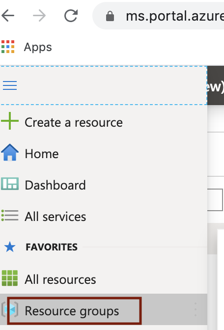

# About

This module covers provisioning of an Azure resource group.   
Go to portal.azure.com, login and follow the steps below to create a resource group.
 

### 1.1. Click on resource group

 

 

### 1.2. Click on "Add"

 

 

### 1.3. Enter details

 

 

### 1.4. Click on "Create"

 

 

## 1.5. The resource group should get created

 

 

This concludes the module. 
[Return to the menu](https://github.com/anagha-microsoft/adx-kafkaConnect-hol/tree/master/hdi-standalone-nonesp#lets-get-started)
