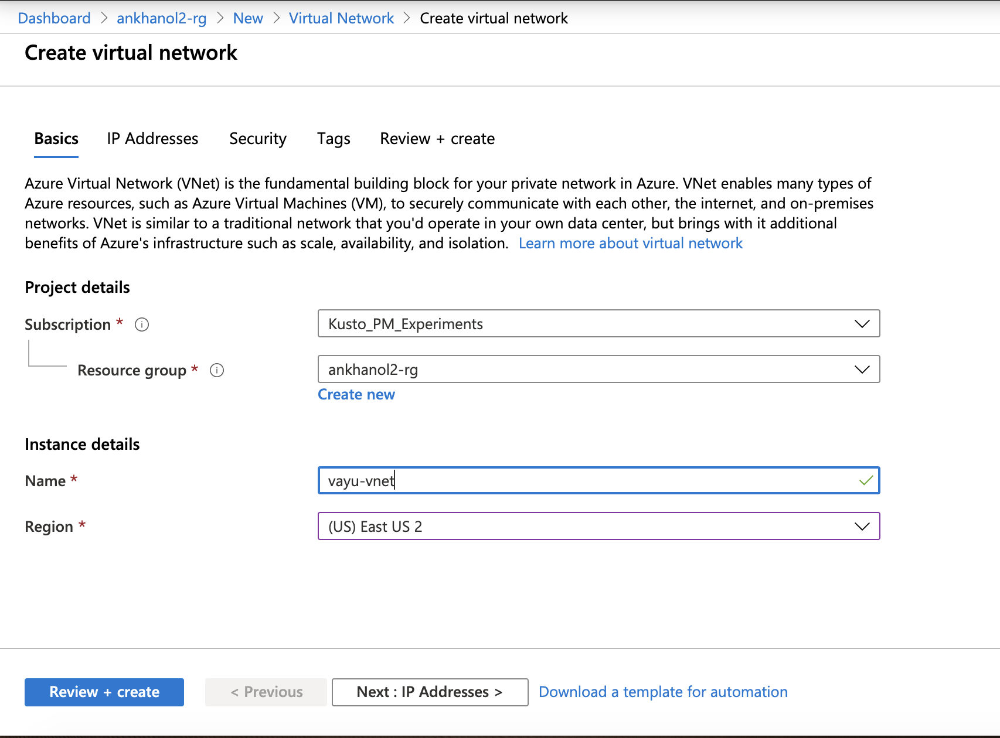
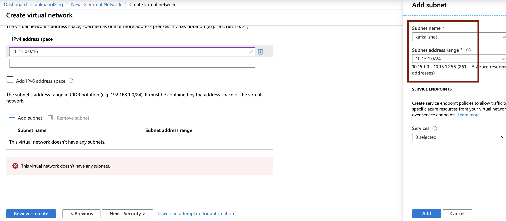

# About

This module covers provisioning of a virtual network with subnets.   
Navigate to your resource group, and click on "Add" and follow the steps below. 

### 1. Search for "Virtual Network", and click "create"

 

 

### 2. Enter details, be sure to pick your resource group and the right region

 

 

### 3. Leave your Ipv4 address space as is, or modify

 

 

### 4. Create a subnet called kafka-snet, and click on "Add"

 

 

### 5. Navigate back to your resource group.

 

 

This concludes the module. 
[Return to the menu](https://github.com/anagha-microsoft/adx-kafkaConnect-hol/tree/master/hdi-standalone-nonesp#lets-get-started)
