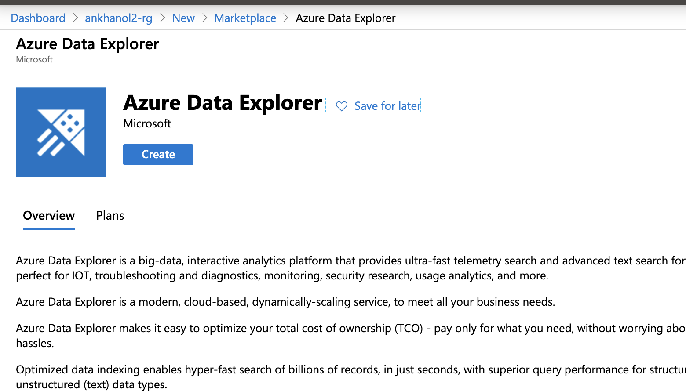
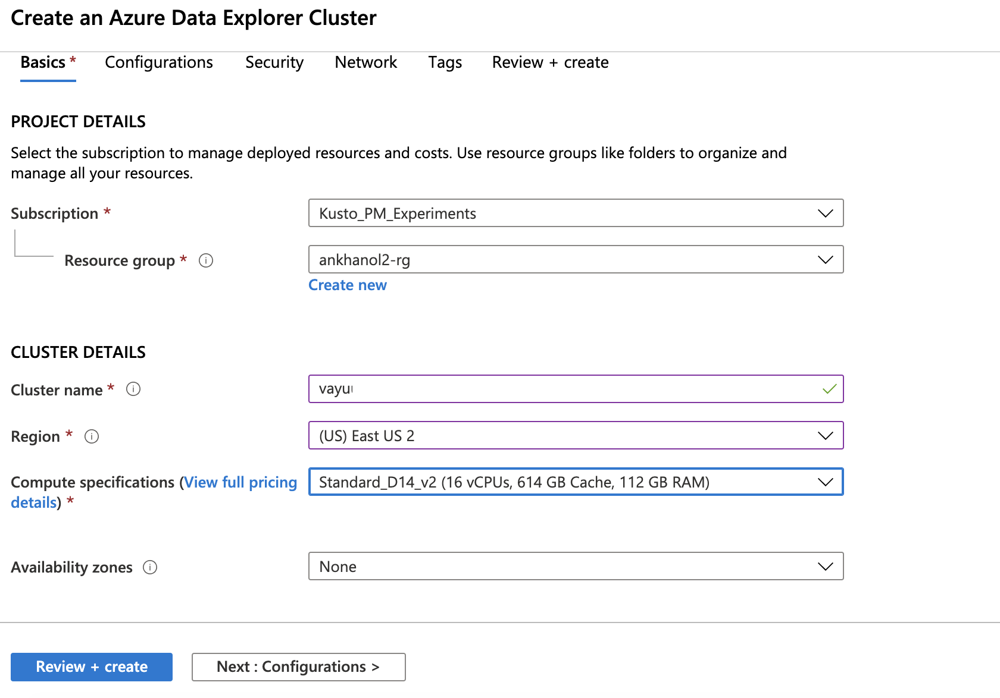
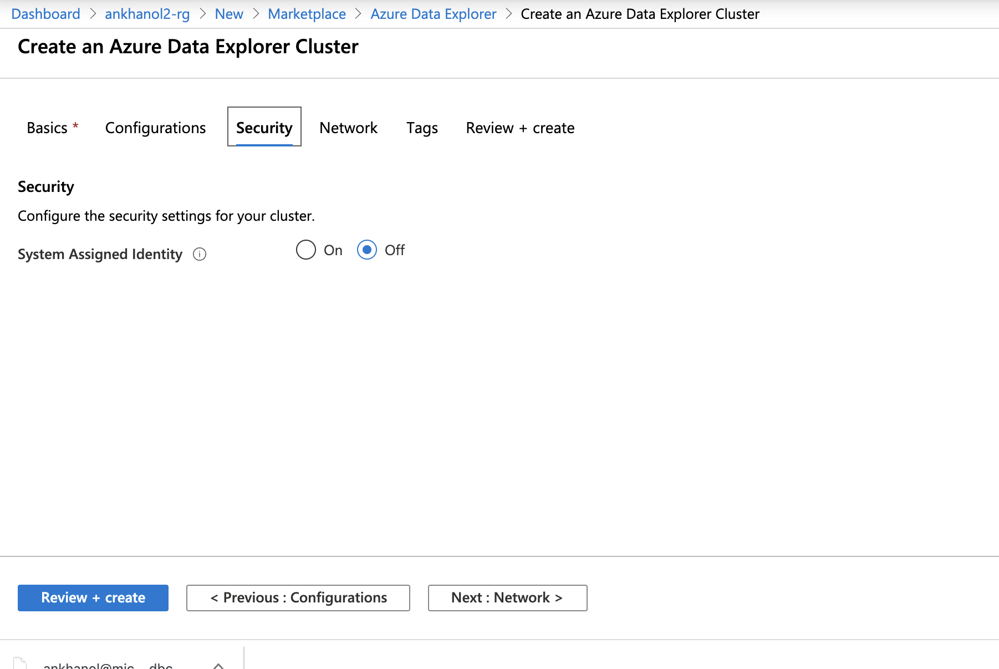
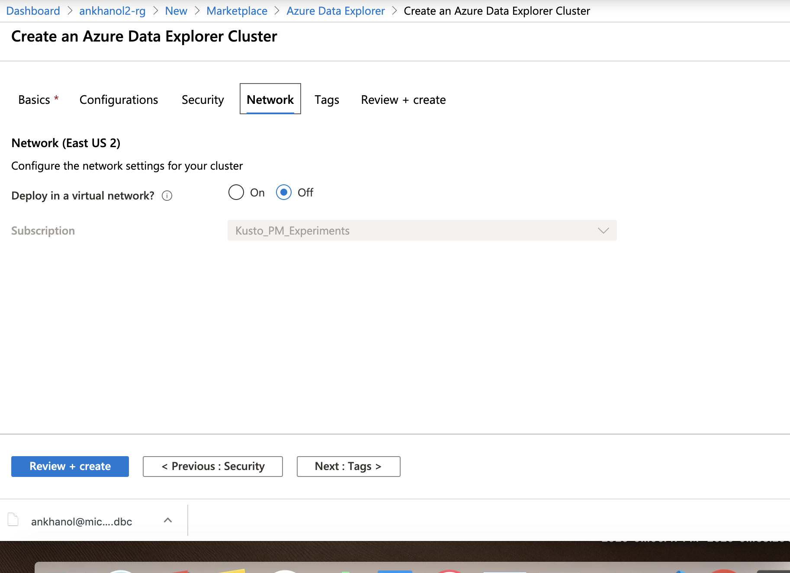
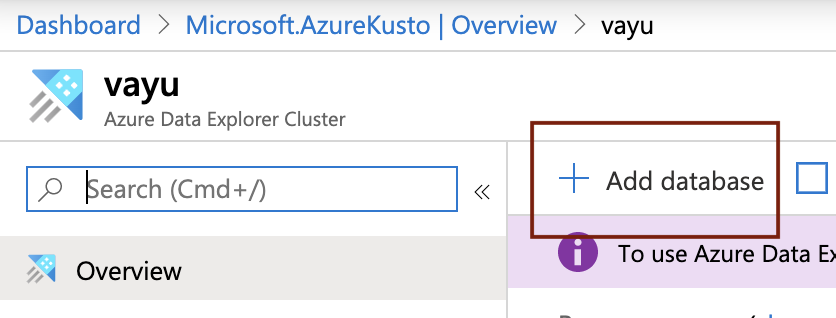
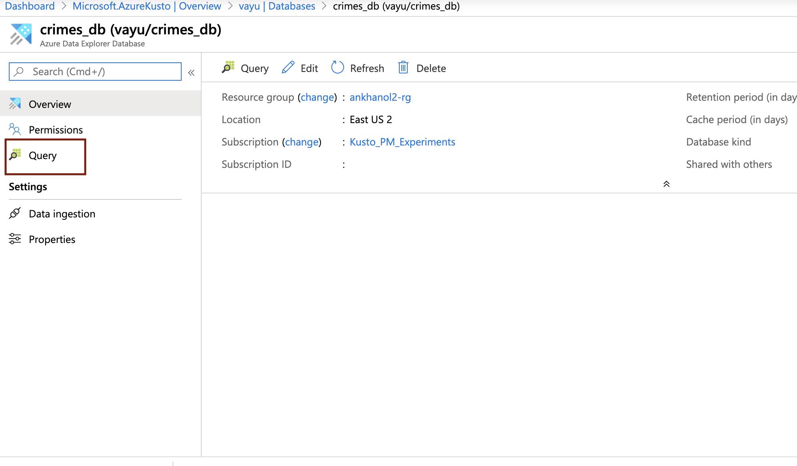
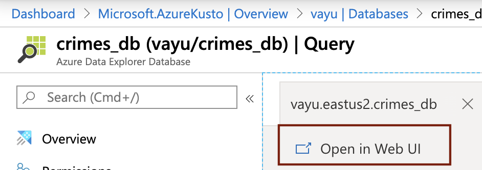
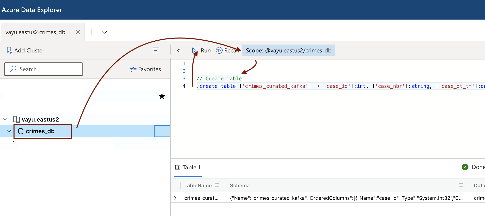

# About

This module covers provisioning an Azure Data Explorer, creating database objects required for the lab and granting permissions.  Navigate to your resource group, and click on "Add" and follow the steps below.<br>

### 1. Search for "Azure Data Explorer"

<br>
<hr>
<br>

### 2. Click create

<br>
<hr>
<br>

### 3. Enter details

<br>
<hr>
<br>

### 4. Click on the "On" radio button for streaming ingestion

<br>
<hr>
<br>

### 5. Leave defaults

<br>
<hr>
<br>

### 6. Leave defaults

<br>
<hr>
<br>

### 7. Leave defaults

<br>
<hr>
<br>

### 8. Validate and click on "Create"

<br>
<hr>
<br>

### 9. Once the cluster is created in your resource group, click on it, and then on "database" - the link is on the left vertical navigation bar.  

<br>
<hr>
<br>

### 10. Click on "add database".

<br>
<hr>
<br>

### 11. Create a database called "crimes_db"

<br>
<hr>
<br>


### 12. You should see the database created.  Click on it.

<br>
<hr>
<br>


### 13. Click on query

<br>
<hr>
<br>


### 14. Click on "Open in Web UI"

<br>
<hr>
<br>


### 15. Click on the database "crimes_db"; Then paste the table DDL below in the Web UI, and click on the run button.

```
// Create table
.create table ['crimes_curated_kafka']  (['case_id']:int, ['case_nbr']:string, ['case_dt_tm']:datetime, ['block']:string, ['iucr']:string, ['primary_type']:string, ['description']:string, ['location_description']:string, ['arrest_made']:bool, ['was_domestic']:bool, ['beat']:string, ['district']:string, ['ward']:int, ['community_area']:int, ['fbi_code']:string, ['x_coordinate']:int, ['y_coordinate']:int, ['case_year']:int, ['updated_dt']:datetime, ['latitude']:real, ['longitude']:real, ['location_coords']:string, ['case_timestamp']:datetime, ['case_month']:int, ['case_day_of_month']:int, ['case_hour']:int, ['case_day_of_week_nbr']:int, ['case_day_of_week_name']:string)
```


<br>
<hr>
<br>


### 16. Now lets create a table mapping; Paste the table mapping below in the Web UI on a separate line, and click on the run button.

```

// Create mapping
.create table ['crimes_curated_kafka'] ingestion json mapping 'crimes_curated_kafka_mapping' '[{"column":"case_id","path":"$.case_id","datatype":"int"}, {"column":"case_nbr","path":"$.case_nbr","datatype":"string"}, {"column":"case_dt_tm","path":"$.case_dt_tm","datatype":"datetime"}, {"column":"block","path":"$.block","datatype":"string"}, {"column":"iucr","path":"$.iucr","datatype":"string"}, {"column":"primary_type","path":"$.primary_type","datatype":"string"}, {"column":"description","path":"$.description","datatype":"string"}, {"column":"location_description","path":"$.location_description","datatype":"string"}, {"column":"arrest_made","path":"$.arrest_made","datatype":"bool"}, {"column":"was_domestic","path":"$.was_domestic","datatype":"bool"}, {"column":"beat","path":"$.beat","datatype":"string"}, {"column":"district","path":"$.district","datatype":"string"}, {"column":"ward","path":"$.ward","datatype":"int"}, {"column":"community_area","path":"$.community_area","datatype":"int"}, {"column":"fbi_code","path":"$.fbi_code","datatype":"string"}, {"column":"x_coordinate","path":"$.x_coordinate","datatype":"int"}, {"column":"y_coordinate","path":"$.y_coordinate","datatype":"int"}, {"column":"case_year","path":"$.case_year","datatype":"int"}, {"column":"updated_dt","path":"$.updated_dt","datatype":"datetime"}, {"column":"latitude","path":"$.latitude","datatype":"real"}, {"column":"longitude","path":"$.longitude","datatype":"real"}, {"column":"location_coords","path":"$.location_coords","datatype":"string"}, {"column":"case_timestamp","path":"$.case_timestamp","datatype":"datetime"}, {"column":"case_month","path":"$.case_month","datatype":"int"}, {"column":"case_day_of_month","path":"$.case_day_of_month","datatype":"int"}, {"column":"case_hour","path":"$.case_hour","datatype":"int"}, {"column":"case_day_of_week_nbr","path":"$.case_day_of_week_nbr","datatype":"int"}, {"column":"case_day_of_week_name","path":"$.case_day_of_week_name","datatype":"string"}]'
```


<br>
<hr>
<br>


### 17. Finally, we will grant the SPN from module 4, the ingestor role.  For this, we will need the Application ID captured in [module 4](https://github.com/anagha-microsoft/adx-kafkaConnect-hol/blob/master/hdi-standalone-nonesp/Module-04.md#5-a-service-principal-namespn-gets-created--make-a-note-of-the-applicationclient-id-and-tenant-id-we-will-need-this-in-the-kafkaconnect-module)

Enter the command below, replacing my AAD SPN with yours..

```
// Grant the SPN, "ingestor" role at a database level
.add database crimes_db ingestors ('aadapp=<yourSPNAppIDFromModule4>') 'AAD App'

```


<br>
<hr>
<br>


This concludes the module.<br>
[Return to the menu](README.md)
