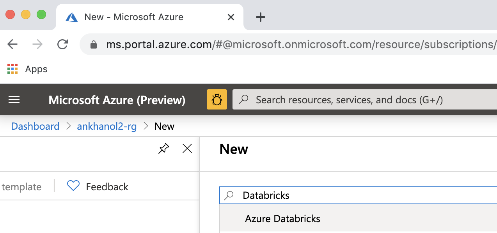
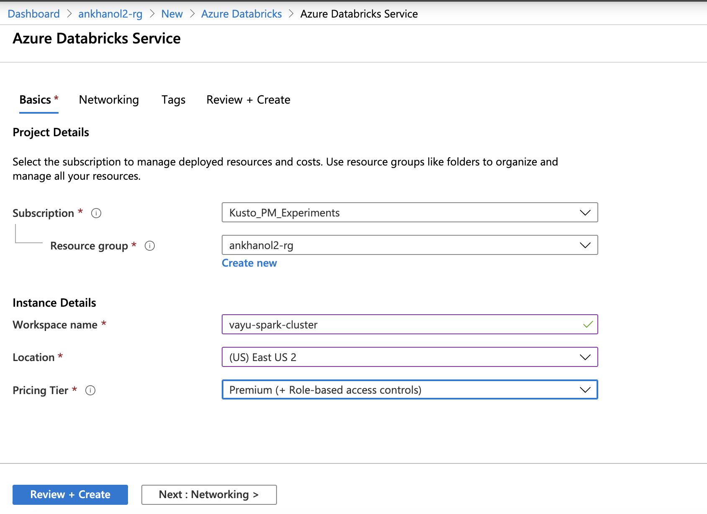
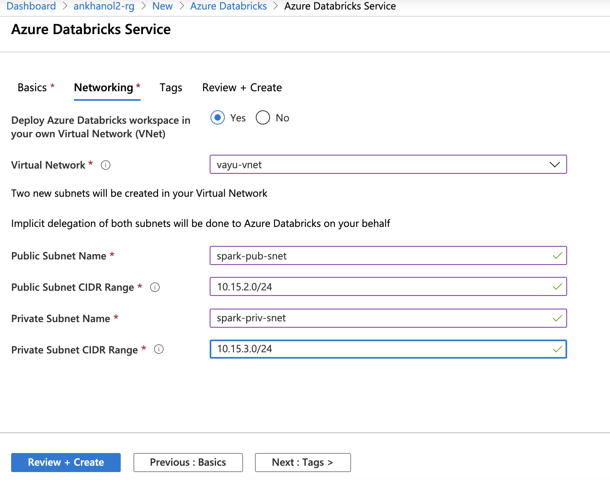
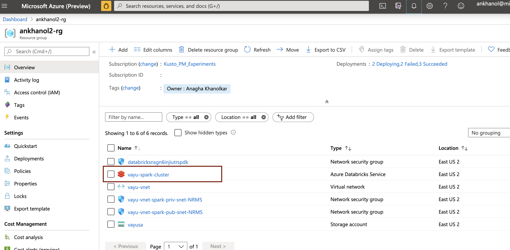
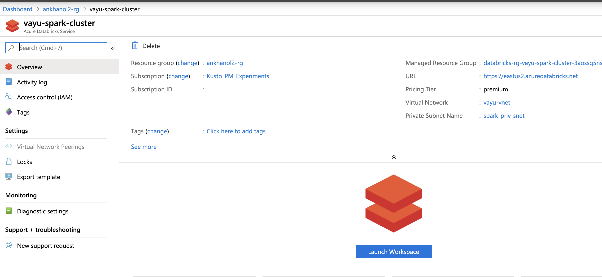

# About

This module covers provisioning an Azure Databricks cluster 

Navigate to portal.azure.com on your browser, to the resource group and follow the steps below: 

### 1. Type Azure Databricks and select

 

 

### 2. Enter details as described below

 

 

### 3. Enter networking details as described below, click review and create

 

 

### 4. You should see a Databricks workspace created

 

 

### 5. Click on the Databricks workspace icon

 

 

This concludes the module. 
[Return to the menu](https://github.com/anagha-microsoft/adx-kafkaConnect-hol/tree/master/hdi-standalone-nonesp#lets-get-started)
